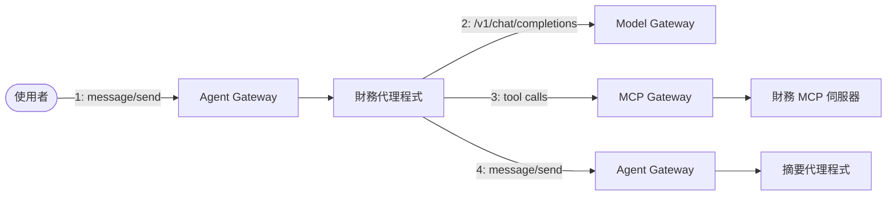
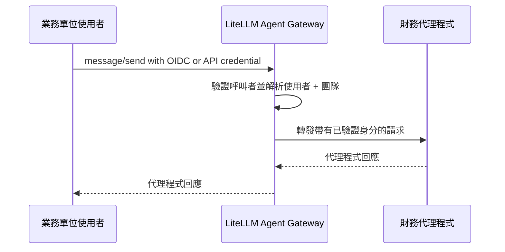
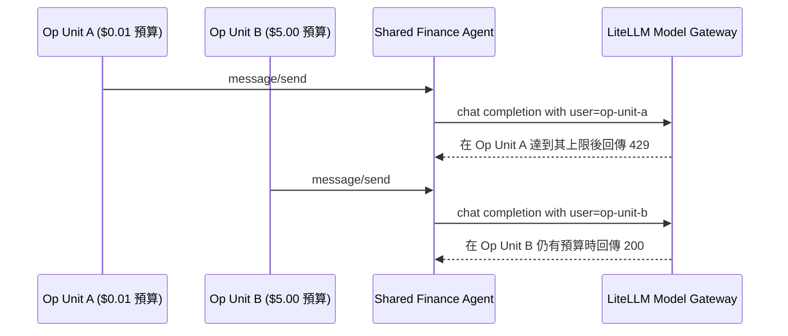

共享代理程式可以保留個別身分、存取與支出控制。

當財務代理程式服務多個業務單位時，平台團隊需要一致的方法來識別每個請求的發起者、套用正確的模型與工具權限，並歸屬支出。LiteLLM 讓這些脈絡在共享代理程式工作流程中保持可用，因此每個業務單位都能在各自的存取與預算政策下運作。

LiteLLM 為此工作流程提供一個統一的控制平面，涵蓋 Agent Gateway、Model Gateway 與 MCP Gateway。團隊可以共享相同的代理程式基礎架構，同時讓存取權、憑證、支出與稽核資料都繫結到正確的呼叫者。

{/* truncate */}

## 一個閘道，涵蓋完整的代理程式工作流程 {#one-gateway-for-the-complete-agent-workflow}

典型的代理程式請求會跨越四個邊界：

1. 使用者呼叫代理程式。
2. 代理程式呼叫模型。
3. 代理程式呼叫 MCP 工具。
4. 代理程式呼叫另一個代理程式。

LiteLLM 透過單一 proxy 管理每個邊界：



[Agent Gateway](/docs/a2a) 會驗證呼叫者身分、控管哪些使用者與團隊可以呼叫每個代理程式，並記錄請求、回應、延遲與成本資料。Model Gateway 會對 LLM 流量進行路由，並套用預算與速率限制。MCP Gateway 會集中管理工具存取與上游驗證。

合在一起，它們讓平台團隊能將代理程式作為共享服務來營運，並在每次請求中對每位使用者施行治理。

## 驗證對共享代理程式的每次呼叫 {#authenticate-every-call-to-a-shared-agent}

先在 Agent Gateway 中註冊每個代理程式。代理程式會以其狀態與支出資料顯示在管理 UI 中：


使用者可以透過 OIDC 或其他受支援的 LiteLLM 憑證進行驗證，同時共享相同的團隊政策。在此範例中，兩個業務單位屬於 `shared-agents-team`：


團隊的物件權限定義其成員可以存取哪些代理程式與 MCP 伺服器。兩個業務單位都使用單一的財務代理程式註冊，並由中央管理的上游憑證提供支援。


當請求抵達 Agent Gateway 時，LiteLLM 會驗證呼叫者的身分驗證，並解析關聯的使用者與團隊。閘道會將該已驗證脈絡以 `X-LiteLLM-User-Id` 與 `X-LiteLLM-Team-Id` 的形式轉發給代理程式。



代理程式可以使用這個已驗證的脈絡來進行下游授權、歸屬與預算強制執行。

用戶端透過標準 A2A JSON-RPC 介面呼叫共享代理程式：

```bash
curl -X POST "$LITELLM_BASE_URL/a2a/$AGENT_ID" \
  -H "Authorization: Bearer $ACCESS_TOKEN" \
  -H "Content-Type: application/json" \
  -d '{
    "jsonrpc": "2.0",
    "id": "request-1",
    "method": "message/send",
    "params": {
      "message": {
        "kind": "message",
        "messageId": "message-1",
        "role": "user",
        "parts": [
          {"kind": "text", "text": "Give me a one-sentence finance status update."}
        ]
      }
    }
  }'
```

## 在模型呼叫中保留使用者歸屬 {#keep-user-attribution-on-model-calls}

財務代理程式以自身的工作負載身分呼叫 Model Gateway。這使得服務驗證與終端使用者的驗證彼此分離。

為了進行每位使用者的歸屬，代理程式會從傳入請求中讀取已驗證的 `X-LiteLLM-User-Id` 值，並將其作為其外送模型請求中的 `user` 欄位。它也會轉發 LiteLLM trace 與代理程式脈絡標頭，讓請求維持在同一個執行流程之下，並將支出歸屬給正確的代理程式。

這讓 LiteLLM 同時具備兩個有用的維度：

- 工作負載身分可識別發起模型呼叫的代理程式。
- `user` 欄位可識別適用其預算的客戶或業務單位。

因此，多個團隊可以共享一個代理程式與一條模型路由，同時 LiteLLM 仍能為每個呼叫者維持獨立的使用量與預算記錄。

## 將每位使用者的權限套用至 MCP 工具 {#apply-each-users-permissions-to-mcp-tools}

同一個財務代理程式會透過 MCP Gateway 存取工具，並為上游系統使用中央管理的憑證。

在此範例中，財務 MCP 伺服器公開兩個工具：

- `get_revenue_summary`，任何獲授權的呼叫者皆可使用
- `get_payroll_details`，限制為具有 `finance-payroll-access` 群組的使用者


若要針對每位使用者進行互動式 OAuth，請將 MCP 伺服器設定為 `auth_type: oauth2` 與 `oauth2_flow: authorization_code`。使用者會透過組織的身分提供者完成 PKCE 登入。LiteLLM 會為該使用者與 MCP 伺服器儲存產生的憑證，然後在同一位使用者後續的工具呼叫中附加該憑證。

上游 MCP 伺服器仍是授權權威。它會評估權杖的聲明，並決定使用者可否存取薪資明細，或僅能存取更廣泛的營收摘要。LiteLLM 集中管理 OAuth 流程與憑證處理，同時保留每位使用者的上游身分。

請參閱 [MCP OAuth](/docs/mcp_oauth) 以了解設定選項，包括 machine-to-machine 與 on-behalf-of 流程。

## 在多代理程式呼叫中保留使用者與代理程式歸屬 {#keep-user-and-agent-attribution-across-multi-agent-calls}

代理程式對代理程式的工作流程包含兩個有用的歸屬維度：

- 直接的工作負載身分，例如財務代理程式
- 啟動工作流程的原始使用者

LiteLLM 會在每一個閘道路徑記錄直接的工作負載身分。當下游代理程式也需要原始使用者時，呼叫端代理程式會將該已驗證的使用者脈絡作為應用程式中繼資料或受支援的轉送標頭傳遞。

結合這兩個維度，平台團隊就能完整檢視工作流程：閘道記錄會顯示哪個代理程式發出了每個請求，而傳遞下去的使用者脈絡則會將工作流程連結到發起它的業務單位。

## 在共享團隊之下強制執行獨立預算 {#enforce-independent-budgets-below-the-shared-team}

共享基礎架構可以支援每個業務單位各自獨立的支出上限。

LiteLLM 支援多層級預算，包括金鑰、團隊、代理程式與客戶。對於共享代理程式部署，請為每個業務單位建立一筆客戶記錄，並在模型請求的 `user` 欄位中傳入該客戶 ID。

例如：

- `op-unit-a`：$0.01 預算
- `op-unit-b`：$5.00 預算
- 兩個單位：相同的財務代理程式與 `shared-agents-team`



當某個單位達到其上限時，LiteLLM 會獨立套用該單位的預算政策。其他單位會繼續使用自己的預算，而共享團隊預算則為它們提供總體上限。

這讓 FinOps 團隊同時擁有所需的兩種視圖：共享服務的整體支出，以及使用它的每個業務單位的獨立控制。

## 在 LiteLLM Logs 中監控身分與預算 {#monitor-identity-and-budgets-in-litellm-logs}

LiteLLM Logs 為平台、安全與 FinOps 團隊提供共享代理程式活動的單一操作檢視。當代理程式將已驗證的終端使用者脈絡帶入其下游請求時，操作人員可以依 **End User** 進行篩選，以追蹤某個業務單位在 A2A 代理程式呼叫、模型請求與 MCP 工具操作中的活動。

每一筆記錄列都包含團隊、模型或工具、token 使用量、成本、持續時間，以及終端使用者 ID。這使得從客戶或業務單位開始，並追蹤其工作流程中所使用的資源變得容易。


請求詳細資訊可讓客戶預算執行情況一目了然。該項目會記錄 `429` 狀態、終端使用者 ID、目前支出，以及設定的預算上限。預算評估會在模型提供者呼叫之前進行，因此該項目顯示的模型 token 與成本皆為零。


對於共用代理程式環境，這些檢視可回答三個常見的營運問題：

- 是哪個業務單位啟動了此工作流程？
- 哪些代理程式、模型與工具處理了其請求？
- 適用的客戶預算如何約束該請求？

團隊與工作負載歸屬支援基礎架構層級的報表，而終端使用者欄位則提供業務單位層級所需的詳細資訊，可用於存取審查、事件調查與支出管理。

## 實用的部署模式 {#a-practical-deployment-pattern}

若要套用此架構：

1. 在 Agent Gateway 中註冊共用代理程式。
2. 透過物件權限授予團隊存取所需代理程式與 MCP 伺服器的權限。
3. 設定 OIDC 或其他受支援的驗證方法，以解析終端使用者身分與團隊成員資格。
4. 讀取已驗證的傳入使用者情境，並在模型呼叫時將其作為 `user` 傳遞。
5. 設定針對使用者的 MCP 伺服器 OAuth，以強制執行使用者特定權限。
6. 為每個業務單位建立客戶預算，並可選擇加上一個彙總的團隊預算。
7. 使用 LiteLLM Logs 稽核每一個請求的使用者、金鑰、團隊、代理程式、延遲與成本。

其結果是一個具有清楚安全與財務邊界的共用代理程式平台：使用者可存取其已核准的工具與資料，支出會歸屬至正確的業務單位，而每個單位則透過單一共用代理程式部署獨立治理。

請探索 [Agent Gateway](/docs/a2a)、[MCP Gateway](/docs/mcp) 與 [預算及速率限制控制](/docs/proxy/users)，以在您的 LiteLLM 部署中建構此模式。
