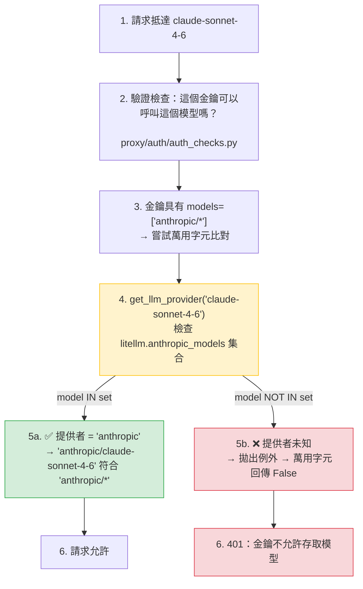

**日期：** 2026 年 2 月 23 日  
**期間：** 約 3 小時  
**嚴重性：** 高（適用於具有提供者萬用字元存取規則的使用者）  
**狀態：** 已解決

## 摘要 {#summary}

當將一個新的 Anthropic 模型（例如 `claude-sonnet-4-6`）加入 LiteLLM 模型成本對照表，並觸發成本對照表重新載入時，對新模型的請求會被拒絕，並顯示：

```
key not allowed to access model. This key can only access models=['anthropic/*']. Tried to access claude-sonnet-4-6.
```

重新載入正確更新了 `litellm.model_cost`，但從未重新執行 `add_known_models()`，因此 `litellm.anthropic_models`（供萬用字元解析器使用的記憶體內集合）仍然是舊資料。即使成本對照表已知曉該新模型，對 `anthropic/*` 萬用字元而言，它仍然是不可見的。

- **LLM 呼叫：** 所有對新加入 Anthropic 模型的請求都被 401 封鎖。
- **既有模型：** 不受影響——只有在舊的提供者集合中缺失的模型受到影響。
- **其他提供者：** 任何提供者萬用字元（例如 `openai/*`、`gemini/*`）都存在相同的錯誤類型。

{/* truncate */}

---

## 背景 {#background}

LiteLLM 支援提供者層級的萬用字元存取規則。當管理員為金鑰或團隊設定 `models=['anthropic/*']` 時，任何其提供者解析為 `anthropic` 的模型都應該被允許。解析發生於 `_model_custom_llm_provider_matches_wildcard_pattern`：



`litellm.anthropic_models` 是一個在匯入時由 `add_known_models()` 填入的 Python `set`。它是 `get_llm_provider()` 查詢的來源，用來將像 `claude-sonnet-4-6` 這樣的裸模型名稱對應到提供者字串 `"anthropic"`。

---

## 根本原因 {#root-cause}

`add_known_models()` 只在模組匯入時呼叫 **一次**。`proxy_server.py` 中的兩條重新載入路徑都以最新的對照表更新了 `litellm.model_cost`，但從未再次呼叫 `add_known_models()`：

```python
# Before the fix — both reload paths looked like this:
new_model_cost_map = get_model_cost_map(url=model_cost_map_url)
litellm.model_cost = new_model_cost_map          # ✅ cost map updated
_invalidate_model_cost_lowercase_map()           # ✅ cache cleared
# ❌ add_known_models() never called
#    → litellm.anthropic_models still has the old set
#    → new model not in the set
#    → get_llm_provider() raises for the new model
#    → wildcard match returns False
#    → 401 for every request to the new model
```

這個缺口存在於兩個地方：
1. `_check_and_reload_model_cost_map` —— 週期性自動重新載入（每 10 秒）
2. `/reload/model_cost_map` 管理端點 —— 手動重新載入

**時間軸：**

1. 新模型（`claude-sonnet-4-6`）加入 `model_prices_and_context_window.json`
2. 管理員透過 UI 觸發成本對照表重新載入 → `litellm.model_cost` 已更新
3. 具有 `anthropic/*` 萬用字元金鑰的使用者嘗試對 `claude-sonnet-4-6` 發出請求
4. `get_llm_provider('claude-sonnet-4-6')` 拋出例外 → 萬用字元回傳 False → 401
5. 管理員再次重新載入成本對照表——結果相同（根本原因未處理）
6. 經過約 3 小時調查 → 找到根本原因 → 部署修正

---

## 修正 {#the-fix}

每次重新載入後，都會以明確傳入最新抓取的對照表呼叫 `add_known_models()`。直接傳入該對照表（而不是依賴模組層級參照）可消除對於迭代的是哪個 dict 的歧義：

```python
# After the fix — both reload paths now do:
new_model_cost_map = get_model_cost_map(url=model_cost_map_url)
litellm.model_cost = new_model_cost_map
_invalidate_model_cost_lowercase_map()
litellm.add_known_models(model_cost_map=new_model_cost_map)  # ✅ sets repopulated
```

`add_known_models()` 也已更新為接受可選的明確對照表，如此呼叫端就不會意外迭代到舊的模組層級參照：

```python
# Before
def add_known_models():
    for key, value in model_cost.items():   # reads module global — ambiguous after reload
        ...

# After
def add_known_models(model_cost_map: Optional[Dict] = None):
    _map = model_cost_map if model_cost_map is not None else model_cost
    for key, value in _map.items():         # always iterates the map you just fetched
        ...
```

修正之後，提供者集合（`anthropic_models`、`open_ai_chat_completion_models` 等）會在每次重新載入後立即與 `litellm.model_cost` 保持一致。新模型可透過萬用字元規則存取，不需要重新啟動 proxy。

---

## 補救措施 {#remediation}

| # | 動作 | 狀態 | 程式碼 |
|---|---|---|---|
| 1 | 在週期性重新載入路徑中呼叫 `add_known_models(model_cost_map=...)` | ✅ 完成 | [`proxy_server.py#L4393`](https://github.com/BerriAI/litellm/blob/main/litellm/proxy/proxy_server.py#L4393) |
| 2 | 在 `/reload/model_cost_map` 端點中呼叫 `add_known_models(model_cost_map=...)` | ✅ 完成 | [`proxy_server.py#L11904`](https://github.com/BerriAI/litellm/blob/main/litellm/proxy/proxy_server.py#L11904) |
| 3 | 更新 `add_known_models()`，使其接受明確的 map 參數 | ✅ 完成 | [`__init__.py#L617`](https://github.com/BerriAI/litellm/blob/main/litellm/__init__.py#L617) |
| 4 | 回歸測試：`add_known_models(model_cost_map=...)` 會填入提供者集合 | ✅ 完成 | [`test_auth_checks.py`](https://github.com/BerriAI/litellm/blob/main/tests/proxy_unit_tests/test_auth_checks.py) |
| 5 | 回歸測試：`anthropic/*` 萬用字元在重新載入後可正確授予/拒絕存取 | ✅ 完成 | [`test_auth_checks.py`](https://github.com/BerriAI/litellm/blob/main/tests/proxy_unit_tests/test_auth_checks.py) |

---
