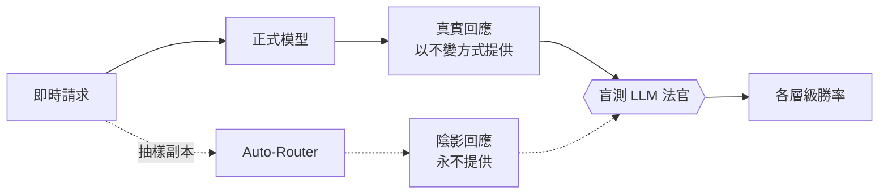

我們已展示 Auto-Router [在正式環境節省 51%](/blog/auto-router-production-savings) 以及 [疊加 prompt caching 節省 69%](/blog/auto-router-prompt-caching-benchmark)。接下來我們最常聽到的問題總是相同：**「它在我的流量上也能維持品質嗎？」**


{/* truncate */}

:::info[🚀 協助塑造 Auto-Router]

搶先體驗、直接與 LiteLLM 團隊合作，並以您的正式流量影響產品藍圖。

<a className="button button--primary button--lg" href="https://calendly.com/tin-berri/litellm-auto-router-design-partner">申請成為設計夥伴</a>

:::

陰影評估會在您自己的正式流量上回答這個問題，並將其濃縮成一個數字。以下是我們自己的流量：**路由器在 88.1% 的受評回應中與目前模型表現相同或更好**。執行期間，您的使用者所看到的內容完全不變。

## 陰影評估的作用 {#what-a-shadow-eval-does}

- **從一個 key 的即時流量中抽樣一部分**；由您決定比例
- **將每個抽樣請求透過 auto-router 複製一份。** 呼叫方仍會收到真實回應；陰影回應永遠不會提供給任何人
- **一個盲測 LLM 法官比較兩個答案。** 它只會看到答案 A 與答案 B，不會知道哪一個分支產生了它們
- **您會得到勝率**：真實 vs. 路由器，整體以及依複雜度層級區分



## 它回答的兩個問題 {#two-questions-it-answers}

| 方向 | 問題 | 真實分支 | 陰影分支 |
| --- | --- | --- | --- |
| `forward` | 這個 key 應該採用路由器嗎？ | 該 key 目前呼叫的模型 | 路由器的選擇 |
| `reverse` | 路由器還值得嗎？ | 路由器的選擇，已在為該 key 提供服務 | 一個固定基準模型，例如旗艦模型 |

在正向模式中，陰影分支大致持平表示路由器以一小部分成本達到與您目前模型相同的品質。在反向模式中，真實分支能站穩腳步表示路由器仍然值得保留。

## 天然適合正式流量的安全設計 {#safe-on-production-traffic-by-construction}

- 使用者可見的回應不會被碰觸；陰影分支只是沒有人會收到的複本
- 只會對您選取的那一個 key 進行抽樣，且依您設定的百分比
- `max_turns` 是硬性抽樣預算（預設 200，上限 2,000）；工作最多只會評估 այդ麼多回合，之後即完成。法官成本會被限制在大約每回合一次法官呼叫
- `duration_days` 會自動停止工作（預設 7，上限 30）；您也可以隨時提早停止
- 已開啟記錄遮罩的請求絕不會被抽樣
- 可跨 `/chat/completions`、`/v1/messages` 與 `/v1/responses` 流量運作

## 解讀結果 {#reading-the-results}

一眼就能回答問題。以下是一個在我們自己流量上的已完成工作，143 個受評回合，法官成本為 $1.55：


平手才是重點。路由器大多會選擇較便宜的模型，所以每一次平手都代表以更低價格得到相同品質；在這裡只有 11.9% 的回合偏好目前模型，而各層級切片則精確顯示差異出現在哪裡。

工作也會回報：

- **勝率**：真實勝出、陰影勝出與平手，作為受評回合的占比
- **依複雜度層級**：讓您能清楚看出品質差距出現在哪個層級，並只修正那一層的模型，而不是放棄路由器
- **各切片的平均法官信心**
- **目前法官支出**，在工作中持續追蹤

在 88.1% 持平或更好的情況下，剩下的問題不是品質；而是您為何仍要為每個請求支付旗艦價格。

## 在您自己的正式流量上開始陰影評估 {#start-a-shadow-evaluation-on-your-own-production-traffic}

在 UI 中：**Cost Optimization → Auto Router → Shadow Evals**，選取一個 key 與一個 router，然後開始。或者透過 API：

```bash
curl -X POST 'http://localhost:4000/auto_router/shadow_eval/start' \
  -H 'Authorization: Bearer sk-admin' \
  -H 'Content-Type: application/json' \
  -d '{
    "api_key_id": "88dc28..",
    "router_name": "claude-auto-latest",
    "shadow_percentage": 10
  }'
```

法官預設為 `anthropic/claude-sonnet-5`；中階法官是最佳選擇，因為它只需要比較兩個答案。工作執行期間，請輪詢 `GET /auto_router/shadow_eval/{job_id}` 以取得即時結果。

## 試試看 {#try-it}

:::info

以您已在正式環境執行的 key 開始一次陰影評估，讓它判定一整週的真實流量。在 [discussion #32168](https://github.com/BerriAI/litellm/discussions/32168) 分享數字或問題。若要與我們直接合作，[申請成為設計夥伴](https://calendly.com/tin-berri/litellm-auto-router-design-partner)。

:::

```yaml title="config.yaml"
model_list:
  - model_name: claude-haiku-4-5
    litellm_params:
      model: anthropic/claude-haiku-4-5
      api_key: os.environ/ANTHROPIC_API_KEY
  - model_name: claude-sonnet-5
    litellm_params:
      model: anthropic/claude-sonnet-5
      api_key: os.environ/ANTHROPIC_API_KEY
  - model_name: claude-opus-5
    litellm_params:
      model: anthropic/claude-opus-5
      api_key: os.environ/ANTHROPIC_API_KEY

  - model_name: claude-auto-latest
    litellm_params:
      model: auto_router/complexity_router
      complexity_router_config:
        tiers:
          SIMPLE:    claude-haiku-4-5
          MEDIUM:    claude-haiku-4-5
          COMPLEX:   claude-sonnet-5
          REASONING: claude-opus-5
      complexity_router_default_model: claude-haiku-4-5
```

完整參考文件，包括每一個陰影評估的設定選項，請見 [Auto Routing 文件頁面](/docs/proxy/auto_routing)。
