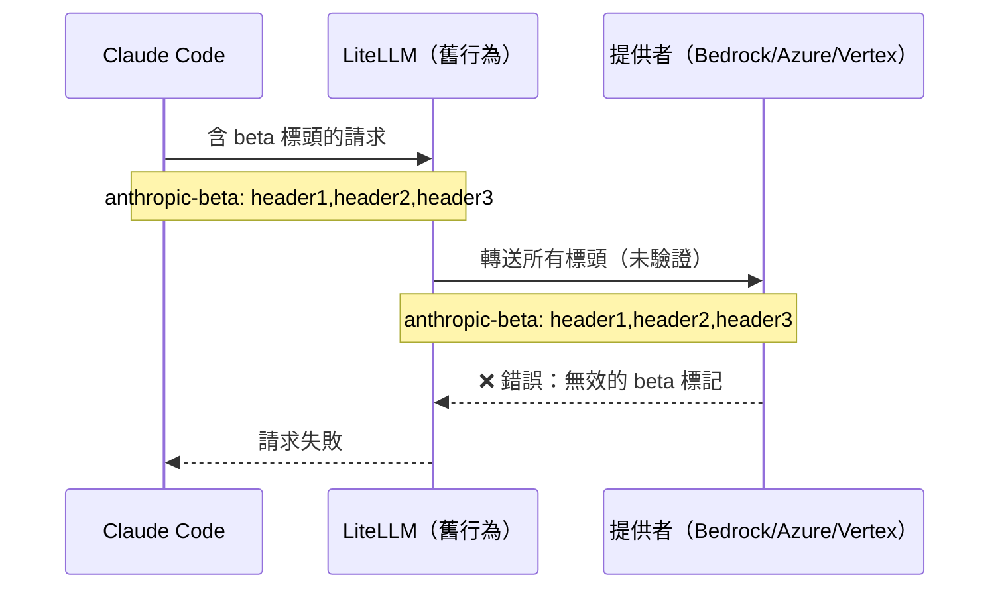
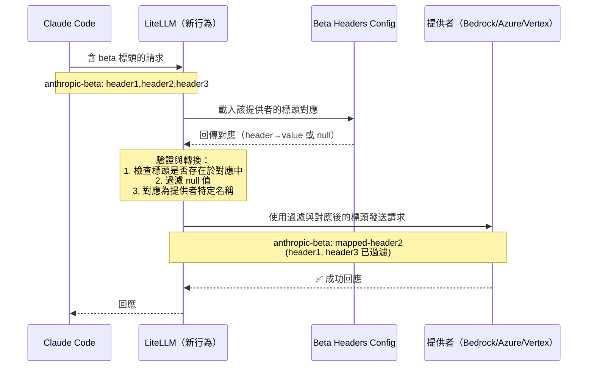

**日期：** 2026 年 2 月 13 日
**持續時間：** 約 3 小時
**嚴重性：** 高
**狀態：** 已解決

> **注意：** 此修正將自 LiteLLM 的 `v1.81.13-nightly` 或更高版本開始提供。

## 摘要 {#summary}

Claude Code 開始將不受支援的 Anthropic beta 標頭傳送給非 Anthropic 提供者（Bedrock、Azure AI、Vertex AI），造成 `invalid beta flag` 錯誤。LiteLLM 在未進行提供者特定驗證的情況下轉送了所有 beta 標頭。當透過 LiteLLM 將 Claude Code 請求路由至這些提供者時，使用者會遇到請求失敗。

- **對 Anthropic 的 LLM 請求：** 無影響。
- **對 Bedrock/Azure/Vertex 的 LLM 請求：** 在出現不受支援的標頭時，會以 `invalid beta flag` 錯誤失敗。
- **成本追蹤與路由：** 無影響。

{/* truncate */}

---

## 背景 {#background}

Anthropic 使用 beta 標頭來啟用 Claude 的實驗性功能。當 Claude Code 發出 API 請求時，會包含例如 `anthropic-beta: prompt-caching-scope-2026-01-05,advanced-tool-use-2025-11-20` 之類的標頭。然而，並非所有提供者都支援所有 Anthropic beta 功能。

在這次事件之前，LiteLLM 會在未驗證的情況下，將所有 beta 標頭轉送給所有提供者：



當 Claude Code 傳送這些提供者不支援的標頭時，對 Anthropic（原生支援）的請求會成功，但對其他提供者會失敗。

---

## 根本原因 {#root-cause}

LiteLLM 缺少提供者特定的 beta 標頭驗證。當 Claude Code 引入新的 beta 功能，或傳送特定提供者不支援的標頭時，這些標頭會被直接轉送，導致提供者 API 錯誤。

---

## 修正措施 {#remediation}

| # | 動作 | 狀態 | 程式碼 |
|---|---|---|---|
| 1 | 建立具備提供者特定對應的 `anthropic_beta_headers_config.json` | ✅ 完成 | [`anthropic_beta_headers_config.json`](https://github.com/BerriAI/litellm/blob/main/litellm/anthropic_beta_headers_config.json) |
| 2 | 實作嚴格驗證：標頭必須明確對應後才能轉送 | ✅ 完成 | [`litellm_logging.py`](https://github.com/BerriAI/litellm/blob/main/litellm/litellm_core_utils/litellm_logging.py) |
| 3 | 新增 `/reload/anthropic_beta_headers` 端點以動態更新設定 | ✅ 完成 | Proxy 管理端點 |
| 4 | 新增 `/schedule/anthropic_beta_headers_reload` 以自動週期性更新 | ✅ 完成 | Proxy 管理端點 |
| 5 | 支援 `LITELLM_ANTHROPIC_BETA_HEADERS_URL` 作為自訂設定來源 | ✅ 完成 | 環境設定 |
| 6 | 支援 `LITELLM_LOCAL_ANTHROPIC_BETA_HEADERS` 以供隔離網路部署使用 | ✅ 完成 | 環境設定 |

現在 LiteLLM 會依提供者驗證並轉換標頭：



---

## 動態設定更新 {#dynamic-configuration-updates}

一項關鍵改進是零停機設定更新。當 Anthropic 發布新的 beta 功能時，使用者可以在不重新啟動的情況下更新設定：

```bash
# Manually trigger reload (no restart needed)
curl -X POST "https://your-proxy-url/reload/anthropic_beta_headers" \
  -H "Authorization: Bearer YOUR_ADMIN_TOKEN"

# Or schedule automatic reloads every 24 hours
curl -X POST "https://your-proxy-url/schedule/anthropic_beta_headers_reload?hours=24" \
  -H "Authorization: Bearer YOUR_ADMIN_TOKEN"
```

這可防止未來 Claude Code 在 LiteLLM 設定尚未更新前先引入新標頭而發生類似事件。

---

## 設定格式 {#configuration-format}

`anthropic_beta_headers_config.json` 檔案會將輸入標頭對應到提供者特定的輸出標頭：

```json
{
  "description": "Mapping of Anthropic beta headers for each provider.",
  "anthropic": {
    "advanced-tool-use-2025-11-20": "advanced-tool-use-2025-11-20",
    "computer-use-2025-01-24": "computer-use-2025-01-24"
  },
  "bedrock_converse": {
    "advanced-tool-use-2025-11-20": null,
    "computer-use-2025-01-24": "computer-use-2025-01-24"
  },
  "azure_ai": {
    "advanced-tool-use-2025-11-20": "advanced-tool-use-2025-11-20",
    "computer-use-2025-01-24": "computer-use-2025-01-24"
  }
}
```

**驗證規則：**
1. 標頭必須存在於目標提供者的對應中
2. 具有 `null` 值的標頭會被過濾掉（不支援）
3. 標頭名稱可依提供者轉換（例如，Bedrock 對某些功能使用不同名稱）

---

## 使用者的解決步驟 {#resolution-steps-for-users}

若您仍遇到問題，請更新至最新的 LiteLLM 版本（若 < v1.81.11-nightly）：

```bash
pip install --upgrade litellm
```

或者，在不重新啟動的情況下手動重新載入設定：

```bash
curl -X POST "https://your-proxy-url/reload/anthropic_beta_headers" \
  -H "Authorization: Bearer YOUR_ADMIN_TOKEN"
```

---

## 相關文件 {#related-documentation}

- [管理 Anthropic Beta 標頭](../../docs/proxy/sync_anthropic_beta_headers) - 完整設定指南
- [`anthropic_beta_headers_config.json`](https://github.com/BerriAI/litellm/blob/main/litellm/anthropic_beta_headers_config.json) - 目前的設定檔
