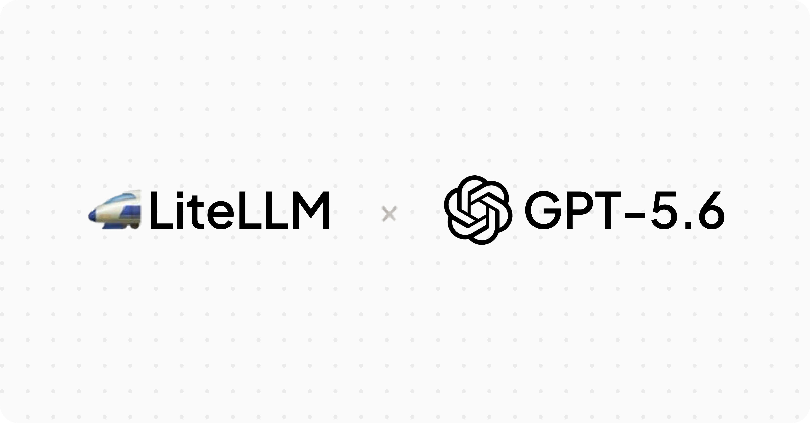

import Tabs from '@theme/Tabs';
import TabItem from '@theme/TabItem';



LiteLLM 現在支援 [GPT-5.6 系列](https://openai.com/index/previewing-gpt-5-6-sol/)。透過 LiteLLM AI Gateway 將流量路由至 OpenAI 最新的前沿模型，無需變更程式碼。

{/* truncate */}

GPT-5.6 引入了一套新的命名系統，其中數字代表世代，等級名稱則代表持久的能力層級。`gpt-5.6-sol` 是用於複雜推理與 agentic 工作負載的旗艦模型，`gpt-5.6-terra` 是兼顧效能與日常工作的平衡模型，效能可與 GPT-5.5 相抗衡，成本約為一半，而 `gpt-5.6-luna` 則是最快且最經濟實惠的等級。根據 OpenAI，這個系列在 agentic coding（Terminal-Bench 2.1）上樹立了新的最佳水準，並在長期規劃的生物學與資安工作流程中帶來廣泛提升。GPT-5.6 也新增了供最深度單一代理程式思考使用的 `max` reasoning effort，以及可在最複雜任務上協調子代理程式的 `ultra` 模式。

:::info 持續更新的文章
**隨著 GPT-5.6 支援擴充，本篇文章會持續更新。** 除了 OpenAI 直接服務外，GPT-5.6 現在也可在 Azure OpenAI 上使用。全域 Azure 部署與 OpenAI 列表價格一致，而區域部署（`azure/us/*` 和 `azure/eu/*`）則依標準 10% 區域加成計價。
:::

:::note
**不需要升級 Docker 映像檔。** GPT-5.6 會透過 LiteLLM 中既有的 `OpenAIGPT5Config` 路由（版本分類器已可匹配 `gpt-5.4` 及更新版本），因此任何近期版本都能直接使用。從 `v1.93.0-dev.2` 起，GPT-5.6 的定價與中繼資料也會隨附提供給使用 `LITELLM_LOCAL_MODEL_COST_MAP=true` 的任何人。

若要進行成本追蹤，請在 Admin UI 中點選 **Reload Model Cost Map** 按鈕（或 `POST /reload/model_cost_map`），以從 GitHub 取得最新定價。此功能適用於 `v1.76.0` 及以上版本。
:::

## 使用方式 {#usage}

<Tabs>
<TabItem value="proxy" label="LiteLLM Proxy">

**1. 設定 config.yaml**

```yaml
model_list:
  - model_name: gpt-5.6-sol
    litellm_params:
      model: openai/gpt-5.6-sol
      api_key: os.environ/OPENAI_API_KEY
  - model_name: gpt-5.6-terra
    litellm_params:
      model: openai/gpt-5.6-terra
      api_key: os.environ/OPENAI_API_KEY
  - model_name: gpt-5.6-luna
    litellm_params:
      model: openai/gpt-5.6-luna
      api_key: os.environ/OPENAI_API_KEY
```

**2. 啟動 proxy**

```bash
docker run -d \
  -p 4000:4000 \
  -e OPENAI_API_KEY=$OPENAI_API_KEY \
  -v $(pwd)/config.yaml:/app/config.yaml \
  ghcr.io/berriai/litellm:v1.93.0-dev.2 \
  --config /app/config.yaml
```

**3. 測試它**

```bash
curl -X POST "http://0.0.0.0:4000/chat/completions" \
  -H "Content-Type: application/json" \
  -H "Authorization: Bearer $LITELLM_KEY" \
  -d '{
    "model": "gpt-5.6-sol",
    "messages": [
      {"role": "user", "content": "Write a Python function to check if a number is prime."}
    ]
  }'
```

</TabItem>
<TabItem value="sdk" label="LiteLLM Python SDK">

```python
from litellm import completion

response = completion(
    model="openai/gpt-5.6-sol",
    messages=[
        {"role": "user", "content": "Write a Python function to check if a number is prime."}
    ],
)

print(response.choices[0].message.content)
```

```python
# gpt-5.6-terra for balanced, cost-efficient everyday work
response = completion(
    model="openai/gpt-5.6-terra",
    messages=[
        {"role": "user", "content": "Summarize the key ideas in this design doc."}
    ],
)

print(response.choices[0].message.content)
```

```python
# gpt-5.6-luna for the fastest, lowest-cost tier
response = completion(
    model="openai/gpt-5.6-luna",
    messages=[
        {"role": "user", "content": "Classify this ticket as bug, feature, or question."}
    ],
)

print(response.choices[0].message.content)
```

</TabItem>
<TabItem value="azure" label="Azure OpenAI">

將 `model` 指向 Azure 部署名稱。全域部署使用 `azure/gpt-5.6-*` 名稱；區域部署則使用 `azure/us/gpt-5.6-*` 或 `azure/eu/gpt-5.6-*`，讓成本追蹤自動套用區域加成。

```yaml
model_list:
  - model_name: gpt-5.6-sol
    litellm_params:
      model: azure/gpt-5.6-sol
      api_base: os.environ/AZURE_API_BASE
      api_key: os.environ/AZURE_API_KEY
      api_version: os.environ/AZURE_API_VERSION
  - model_name: gpt-5.6-terra
    litellm_params:
      model: azure/gpt-5.6-terra
      api_base: os.environ/AZURE_API_BASE
      api_key: os.environ/AZURE_API_KEY
      api_version: os.environ/AZURE_API_VERSION
```

```python
from litellm import completion

response = completion(
    model="azure/gpt-5.6-sol",
    messages=[
        {"role": "user", "content": "Write a Python function to check if a number is prime."}
    ],
)

print(response.choices[0].message.content)
```

</TabItem>
</Tabs>

## 回應 API {#responses-api}

對於 agentic 與多輪工作流程，請使用 `/v1/responses`，以在各輪之間保留 reasoning 狀態與輸出項目中繼資料。

```bash
curl -X POST "http://0.0.0.0:4000/v1/responses" \
  -H "Content-Type: application/json" \
  -H "Authorization: Bearer $LITELLM_KEY" \
  -d '{
    "model": "gpt-5.6-sol",
    "input": "Plan and write a Python script that scrapes a webpage and summarizes it."
  }'
```

## 定價 {#pricing}

價格以每 100 萬 token（USD）計算，並以短上下文（≤272K tokens）/長上下文（>272K tokens）顯示。

| 模型 | 輸入 | 快取輸入 | 快取寫入 | 輸出 |
|-------|-------|--------------|-------------|--------|
| `gpt-5.6-sol` | $5.00 / $10.00 | $0.50 / $1.00 | $6.25 / $12.50 | $30.00 / $45.00 |
| `gpt-5.6-terra` | $2.50 / $5.00 | $0.25 / $0.50 | $3.125 / $6.25 | $15.00 / $22.50 |
| `gpt-5.6-luna` | $1.00 / $2.00 | $0.10 / $0.20 | $1.25 / $2.50 | $6.00 / $9.00 |

全域 Azure OpenAI 部署（`azure/gpt-5.6-*`）符合這些 OpenAI 列表價格。區域部署（`azure/us/gpt-5.6-*` 和 `azure/eu/gpt-5.6-*`）會在基礎費率上加上標準 10% 溢價；一旦您透過區域模型名稱進行路由，LiteLLM 便會自動追蹤差額。

## 附註 {#notes}

- 若要對 GPT-5.6 模型進行成本追蹤，請在 Admin UI 中點選 **Reload Model Cost Map** 按鈕（或 `POST /reload/model_cost_map`）。適用於任何 `v1.76.0` 或更新版本的 LiteLLM，無需重新啟動容器或升級映像檔。
- GPT-5.6 支援 reasoning、function calling、parallel tool calls、vision（image input）、prompt caching、web search 與 structured output；進階用法請參閱 [OpenAI provider docs](../../docs/providers/openai)。
- GPT-5.6 系列已在 limited preview 中推出，而 OpenAI 正透過 API 與 Codex 擴大可用性；請在您的 OpenAI 帳戶中查看模型存取權限。
