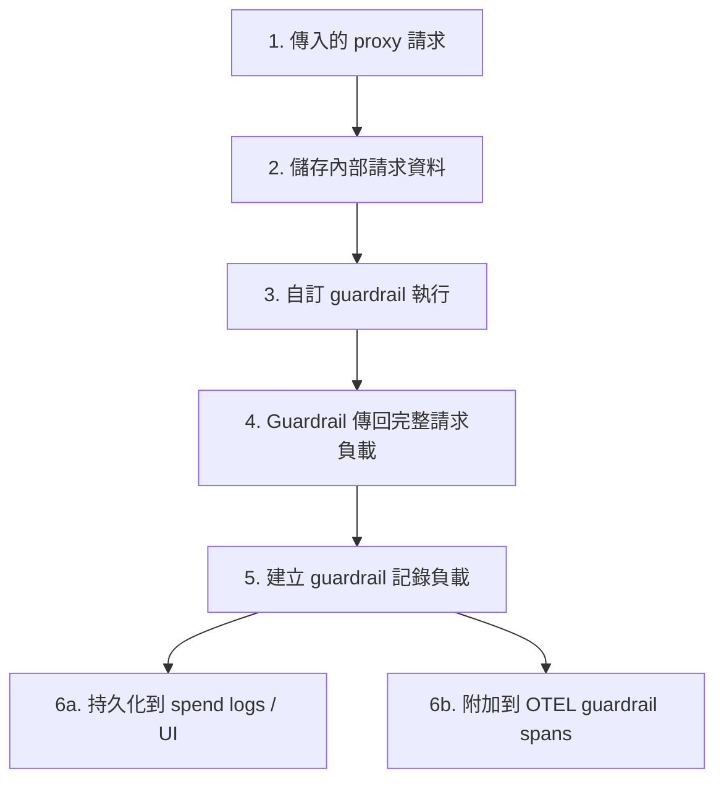

**日期：** 2026 年 3 月 18 日
**持續時間：** 不明
**嚴重性：** 高
**狀態：** 已修復

## 摘要 {#summary}

當自訂 guardrail 傳回完整的 LiteLLM request/data dictionary 時，LiteLLM 記錄的 guardrail 回應可能包含 `secret_fields.raw_headers`，其中包括含有 API 金鑰或其他憑證的明文 `Authorization` 標頭。

這些資訊接著可能傳播到會消耗 guardrail 中繼資料的記錄與可觀測性表面，包括：

- **LiteLLM UI 中的 spend logs：** 對可存取 spend-log 資料的管理員可見
- **OpenTelemetry traces：** 對任何可存取相關 telemetry 後端的人可見

LLM 呼叫、proxy 路由，以及提供者執行都不會因這個 bug 而被阻擋。影響是敏感請求標頭在可觀測性與記錄路徑中被暴露。

{/* truncate */}

---

## 背景 {#background}

LiteLLM 會保留內部請求資料（包括請求標頭）以供呼叫期間使用。這些資料不應寫入記錄或 telemetry。

當自訂 guardrail 執行時，其結果會被記錄，以便出現在 spend logs、OpenTelemetry traces，以及其他可觀測性後端中。如果 guardrail 傳回完整的請求負載，而不是最小化結果，該內部請求資料就可能被包含在記錄內容中。在修正之前，guardrail 記錄路徑在把資料送往那些系統前，並未先移除這些資料。

---

## 根本原因 {#root-cause}

根本原因是 guardrail 記錄路徑中的清理不完整。當建立要送往 spend logs 與 traces 的負載時，LiteLLM 會為記錄準備 guardrail 回應，但沒有從中移除內部請求資料（例如標頭）。如果 guardrail 傳回的回應包含該資料，它就會在未變更的情況下被傳遞到記錄與可觀測性系統。

---

## 影響 {#impact}

此問題需要同時滿足以下所有條件：

1. 自訂 guardrail 傳回完整的 LiteLLM request/data dictionary，或其他包含 `secret_fields` 的回應物件。
2. LiteLLM 透過標準 guardrail 記錄路徑記錄了該 guardrail 回應。
3. 操作人員、管理員，或 telemetry 消費者可存取產生的記錄或 traces。

當符合這些條件時，敏感值可能會透過以下方式被看見：

- **Spend logs / UI 回應：** guardrail 中繼資料可能會包含在管理 UI 中呈現的 spend-log 負載內。
- **OpenTelemetry traces：** `guardrail_response` 可能會作為 guardrail spans 的 span 屬性被寫入。
- **其他下游可觀測性後端：** 消費相同 guardrail 中繼資料的任何整合都可能收到外洩的值。

這是一個記錄與 telemetry 暴露 bug。它不會讓呼叫者繞過驗證、直接存取其他租戶，或變更模型行為，但可能會將明文憑證暴露給可存取那些可觀測性系統的人。

---

## 使用者指引 {#guidance-for-users}

- 升級至 LiteLLM 1.82.3+。
- 如果您操作過會傳回完整 request/data dict 的自訂 guardrail，請檢查受影響期間是否保留了 spend logs 或 telemetry traces。
- 請輪替任何可能出現在 `Authorization` 或那些系統中其他轉送的請求標頭裡的憑證。
- 對可能包含源自請求中繼資料的 spend-log 檢視與 telemetry 後端套用最小權限存取控制。
