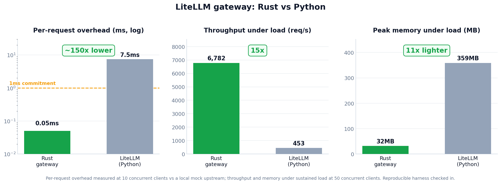

import { RustMigrationStages, RouteCadence, Stage1Architecture, RustServerSteps } from './diagrams';
import Head from '@docusaurus/Head';

*Last Updated: June 2026*

Over the past year, we have heard the same thing from our users and our community: they want the fastest, most lightweight AI gateway they can run. We have heard you. We are addressing it by moving LiteLLM to Rust, and committing to sub-`1ms` overhead with a sub-`100MB` memory binary you can deploy. By the end of this migration, you will get a pure Rust server that can serve 100% of your AI traffic, with every hot path operation, including auth and rate limiting, running in Rust.

The reason it matters: under real load, CPU and memory climb with concurrency, and pods get OOM-killed at the worst time. Today the LiteLLM Python proxy peaks around `359MB` of memory under load, and that cost multiplies across every pod, region, and retry you run.

We are already seeing the payoff in benchmarks. The Rust gateway serves about `15x` the throughput (`453` to `6,782` requests per second) on about `11x` less memory (`359MB` to `32MB`), and cuts per-request overhead from about `7.5ms` on the Python path to about `0.05ms`, well under the `1ms` we commit to.

## What you get

You deploy a single Rust binary. It uses about `65MB` of memory, gateway overhead stays under `1ms`, and nothing in your setup changes: same `config.yaml`, same database, same client API, same providers. You keep LiteLLM's coverage of 100+ LLM providers behind one OpenAI-compatible API, with `/chat/completions`, `/messages`, `/responses`, and every other LLM endpoint LiteLLM supports today, now as the fastest and most lightweight LLM gateway you can self-host.

This is not a v2 and not a rewrite. There is no new major version to migrate to and nothing for you to change. The runtime under the hot path gets faster and lighter while your config stays exactly where it is.

We ship this the careful way. Each route moves to Rust only after it passes our full parity and end-to-end test suite, and it runs in production before the next route starts. Stability is the priority, and we target zero regressions on every release.

{/* truncate */}

## How fast is the LiteLLM gateway? A throughput, overhead, and memory benchmark

**Per-request overhead.** We built a small harness: a mock upstream, a thin Rust forwarding gateway (axum), the same forwarding path running through LiteLLM today (`litellm.acompletion` over uvicorn), and a load client that times each request in microseconds. At `10` concurrent clients against the same mock, the Rust gateway adds about `0.05ms` of overhead per request; the LiteLLM Python path adds about `7.5ms`. That is roughly `150x` lower, and well under the `1ms` we commit to.

**Sustained load.** Against the current LiteLLM Python proxy on the same `/v1/responses` workload at `50` concurrent clients, the Rust path served about `15x` the throughput on about `11x` less memory.

| | Per-request overhead | Throughput under load | Peak memory under load |
|---|---|---|---|
| **Rust gateway** | `~0.05ms` | `6,782` req/s | `31.7MB` |
| **LiteLLM (Python)** | `~7.5ms` | `453` req/s | `358.9MB` |

The overhead harness (mock, gateway, load client) is checked in next to this post under [`benchmark/`](https://github.com/BerriAI/litellm-docs/tree/main/blog/litellm_rust_launch/benchmark), and the summarized numbers are in [`rust_proxy_benchmark_results.csv`](./rust_proxy_benchmark_results.csv), so you can reproduce the sub-`1ms` result. This measures the gateway forwarding path (request transform, forwarding, response handling), not a full production workload.

## What stays the same

Nothing you depend on changes. The migration is invisible from the outside:

- Your Python SDK keeps the exact same interface; the same calls now run on Rust bindings underneath.
- Your `config.yaml` is unchanged.
- Your database and schema are unchanged.
- Your client API and request/response shapes are unchanged.
- Your providers, routing, and keys are unchanged.

You get lower memory and lower overhead, and you do nothing to get it.

---

## How the migration works

If you just want the outcome, you have it above. The rest of this post is for engineers who want to see how we move the gateway to Rust without breaking anything.

The core idea is a clean split. We build one Rust core that only transforms data: it turns your request into a provider request, turns the provider response back, transforms stream chunks, counts tokens, and normalizes errors. It never opens a socket, reads a secret, or writes to your database. The host process does all of that. That separation is what lets us put Rust into production without rewriting the server, because Python keeps doing the I/O while Rust takes over the translation.

<RustMigrationStages />

### One route at a time, proven in production

We never flip a whole endpoint at once. For each route we prove one provider first, roll it out to every provider on that route, and only then start the next route. The smallest, lowest-risk route goes first.

<RouteCadence />

In Stage 1 the server does not change shape. Python still serves traffic and does the I/O, but hands translation to the Rust core through a flag-gated binding, per provider. A parity check enforces identical output before any provider turns on, and if the flag is off the existing Python path runs unchanged.

<Stage1Architecture />

The routes move in order of risk:

- **OCR first.** Start with Mistral OCR, the smallest surface: no streaming, tiny schema, few params. Once it matches the Python output byte for byte in production, roll out to all OCR providers, then move the route into the Rust core. Integration risk is retired here before any larger endpoint moves.
- **`/v1/messages` next.** This adds streaming: SSE parsing, chunk emission, usage accounting, token cost. One provider first, then all, then the route into Rust.
- **`/chat/completions` after that.** The largest surface, taken on only once streaming is proven: tools, function calling, multimodal, and the full optional-param matrix.
- **Major providers.** Azure, then Bedrock, then Vertex, by traffic volume. Auth-coupled providers get signed headers from the host (boto3 / google-auth first, native Rust later). Long-tail providers keep running on Python.

### Onto a Rust server

Once the routes run on Rust, the router moves too: routing, fallbacks, retries, and cooldowns, with state in Redis. Then the server itself moves in two steps.

<RustServerSteps />

- **FastAPI as a thin shell.** FastAPI still terminates HTTP and runs auth, rate-limit, and callbacks, but the entire forwarding path is a single call into Rust.
- **Pure Rust server.** A native server (axum / hyper) runs the forwarding path with no Python on the hot path. Your custom Python plugins (auth, guardrails, callbacks, SSO) keep working in an optional sidecar, so nothing breaks. We roll it out with shadow traffic and a percentage cutover.

The end state is a pure Rust data plane. Customer Python plugins keep running in the sidecar, so it is non-breaking. Removing Python entirely would require porting plugins to a Rust or WASM interface, which is a breaking change we are deferring.

### Why this order

- The OCR route retires integration risk on the smallest surface.
- `/v1/messages` retires streaming risk before the largest parameter set.
- `/chat/completions` is taken on only after streaming is proven.
- By the time the server moves, the core, providers, and router are already running in production through the SDK, so the server work is mostly plumbing.

Every step ships to real users before the next begins, with the parity check as the gate.

## Timeline

We move one function at a time, smallest first, and only after each step passes our test suite.

| Target | What moves to Rust |
|---|---|
| Aug 15, 2026 | `litellm.ocr()` for Mistral, then all of `litellm.ocr()`, then the `/ocr` route |
| Sep 1, 2026 | Same pattern for `/messages`, then `/chat/completions` |
| Sep 15, 2026 | The router: load balancing, fallbacks, retries, cooldowns |
| Dec 1, 2026 | The full server: FastAPI thin shell, then pure Rust (axum) |

## Frequently asked questions

<Head>
  
</Head>

### Is LiteLLM the fastest LLM gateway?

That is the goal of this work. With the Rust hot path, LiteLLM targets sub-`1ms` gateway overhead and a sub-`100MB` binary, matching compiled-language gateways while keeping coverage of 100+ providers behind one OpenAI-compatible API. In our benchmark the Rust gateway adds about `0.05ms` of overhead per request, versus about `7.5ms` for the LiteLLM Python path today, and serves `6,782` requests per second under load at `31.7MB` peak memory. Gateway overhead is usually a small fraction of total model latency, so it matters most for high-throughput, low-latency workloads like classification and embeddings at scale.

### Is LiteLLM slow?

Gateway latency and throughput depend on how you deploy the proxy: worker count, concurrency settings, and whether logging callbacks run on the hot path. Tuned, the Python proxy serves production traffic across hundreds of providers today. Moving the hot path to Rust pushes the floor lower still: in our reproducible benchmark the Rust gateway adds about `0.05ms` of overhead per request, versus about `7.5ms` for the LiteLLM Python path, and serves `6,782` requests per second at `31.7MB` peak memory.

### Is LiteLLM limited by the Python GIL?

The GIL only matters for CPU-bound work on the request path, and the gateway is mostly I/O. LiteLLM scales today by running multiple workers. The Rust migration removes the question for the hot path: request transforms, streaming, and routing run in the Rust core and router, outside the GIL, with no first-party Python on the forwarding path in the end state.

### How much memory does the LiteLLM gateway use?

The Python proxy peaked at `358.9MB` under our load test. The Rust end state targets roughly `65MB`. Lower, bounded memory is the main reason for this work: it reduces the high-CPU and OOM failures that show up under concurrent load.

### Are these benchmarks reproducible?

Yes. The overhead harness (a mock upstream, a thin Rust gateway, and a load client that times each request in microseconds) is checked in under [`benchmark/`](https://github.com/BerriAI/litellm-docs/tree/main/blog/litellm_rust_launch/benchmark), alongside the summarized CSV. Same upstream and payload for both runtimes; the only variable is Python versus Rust.

### Will the Rust gateway be a breaking change?

No. Config, database schema, and the client API contract stay the same. The runtime under the hot path changes gradually, route by route, behind passing parity and end-to-end tests.

## References

- [How Datadog migrated their static analyzer from Java to Rust](https://www.datadoghq.com/blog/engineering/how-we-migrated-our-static-analyzer-from-java-to-rust/)
- [How GitGuardian migrated the heart of their platform to Rust](https://blog.gitguardian.com/how-we-migrated-the-heart-of-our-platform-to-rust/)
- [LiteLLM AI Gateway, full feature overview](https://docs.litellm.ai/docs/simple_proxy)
- [Load balancing and routing across 100+ LLM providers](https://docs.litellm.ai/docs/routing)
