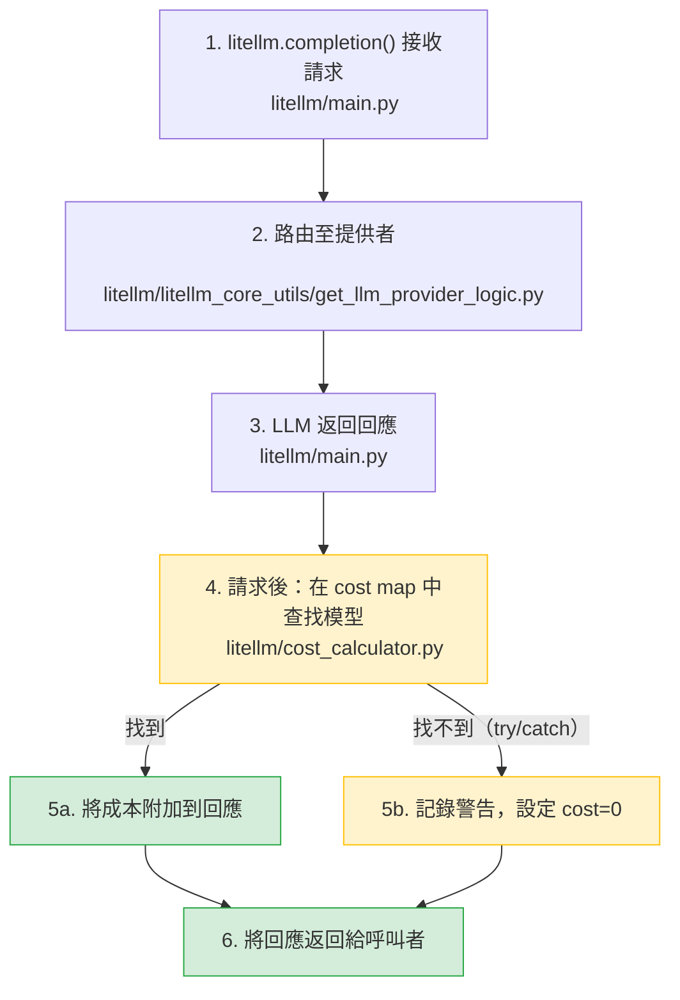

**日期：** 2026 年 1 月 27 日
**持續時間：** ~20 分鐘
**嚴重程度：** 低
**狀態：** 已修正

## 摘要 {#summary}

`model_prices_and_context_window.json` 中一筆格式錯誤的 JSON 項目被合併到 `main`（[`562f0a0`](https://github.com/BerriAI/litellm/commit/562f0a028251750e3d75386bee0e630d9796d0df)）。這導致 LiteLLM 悄悄回退到已過時的本機 model cost map 副本。使用較舊套件版本的使用者僅對較新的模型（例如 `azure/gpt-5.2`）失去成本追蹤。沒有任何 LLM 請求被阻擋。

- **LLM 請求與 proxy 路由：** 無影響。
- **成本追蹤：** 受影響的僅是本機備份中未包含的較新模型。較舊模型不受影響。此事件持續約 20 分鐘，直到提交被還原。

{/* truncate */}

---

## 背景 {#background}

model cost map 不在請求路徑中。它是在 LLM 回應返回後、位於 try/catch 之內，用來計算支出。缺少條目絕不會阻擋請求。

兩條路徑都會將回應返回給呼叫者。當 cost map 查找失敗時，差異只在於該請求的 `cost=0`。

---

## 根本原因 {#root-cause}

LiteLLM 在匯入時會從 GitHub `main` 取得 model cost map。如果抓取失敗，就會回退到套件內隨附的本機備份。在此事件之前，這個回退是完全靜默的——不會記錄任何警告。

一個貢獻者 PR 引入了多餘的 `{` 括號，產生無效的 JSON。遠端抓取以 `JSONDecodeError` 失敗，觸發靜默回退。使用較舊套件版本的使用者，其備份檔案缺少較新的模型。

**時間線：**

1. 格式錯誤的 JSON 合併到 `main`
2. LiteLLM 安裝在下一次匯入時回退到本機備份
3. 使用者回報較新模型的 `"This model isn't mapped yet"`
4. 找到並還原有問題的提交（約 20 分鐘）

---

## 修正措施 {#remediation}

| # | 動作 | 狀態 | 程式碼 |
|---|---|---|---|
| 1 | 對 `model_prices_and_context_window.json` 進行 CI 驗證 | ✅ 完成 | [`test-model-map.yaml`](https://github.com/BerriAI/litellm/blob/main/.github/workflows/test-model-map.yaml) |
| 2 | 回退到本機備份時記錄警告 | ✅ 完成 | [`get_model_cost_map.py#L57-L68`](https://github.com/BerriAI/litellm/blob/main/litellm/litellm_core_utils/get_model_cost_map.py#L57-L68) |
| 3 | 具備完整性驗證輔助工具的 `GetModelCostMap` 類別 | ✅ 完成 | [`get_model_cost_map.py#L24-L149`](https://github.com/BerriAI/litellm/blob/main/litellm/litellm_core_utils/get_model_cost_map.py#L24-L149) |
| 4 | 韌性測試套件（有問題的託管 map、回退、completion） | ✅ 完成 | [`test_model_cost_map_resilience.py#L150-L291`](https://github.com/BerriAI/litellm/blob/main/tests/llm_translation/test_model_cost_map_resilience.py#L150-L291) |
| 5 | 測試備份 model cost map 永遠存在且包含常見模型 | ✅ 完成 | [`test_model_cost_map_resilience.py#L213-L228`](https://github.com/BerriAI/litellm/blob/main/tests/llm_translation/test_model_cost_map_resilience.py#L213-L228) |

需要在匯入時完全不依賴外部資源的企業可以設定 `LITELLM_LOCAL_MODEL_COST_MAP=True`，以完全略過 GitHub 抓取。

---

## 其他對外部資源的依賴 {#other-dependencies-on-external-resources}

| 依賴項目 | 若不可用的影響 | 回退 |
|---|---|---|
| Model cost map（GitHub） | 較新模型的成本追蹤 | 本機備份（現在會發出警告） |
| JWT 公開金鑰（IDP/SSO） | 驗證失敗 | 無 |
| OIDC UserInfo（IDP/SSO） | 驗證失敗 | 無 |
| HuggingFace model API | HF 提供者請求失敗 | 無 |
| Ollama tags（localhost） | Ollama 模型清單過時 | 靜態清單 |
