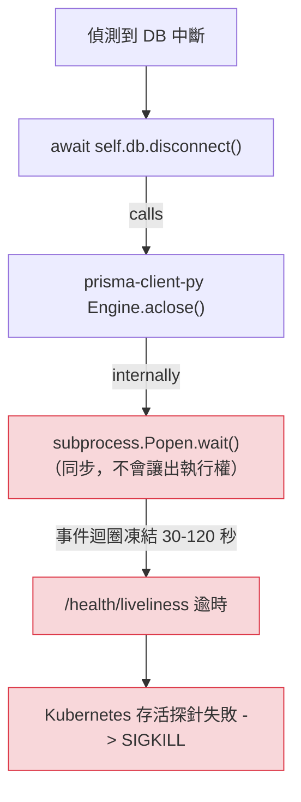

**日期：** 2026 年 4 月
**持續時間：** 在修正推出前，客戶部署中發生多起事件
**嚴重性：** 高 — 在 Kubernetes 中表現為完整的 proxy 當機
**狀態：** 已解決

> **注意：** 此修正自包含 [PR #26225](https://github.com/BerriAI/litellm/pull/26225) 的版本開始可用（於 2026 年 4 月 29 日合併）。

## 摘要 {#summary}

當上游 Postgres 資料庫無法連線時，LiteLLM proxy 的 Prisma 重連路徑會呼叫 `await self.db.disconnect()`。在 prisma-client-py 下，該呼叫會對 Rust query-engine 子程序執行一個**同步**的 `subprocess.Popen.wait()`。由於 `wait()` 不會讓出執行權，asyncio 事件迴圈會凍結，直到引擎關閉所需的時間為止——在生產環境中通常是 30–120 秒，因為引擎在對失去回應的資料庫進行 TCP close 操作時卡住。

在迴圈凍結期間，**沒有任何 coroutine 會執行**，包括 `/health/liveliness`。Kubernetes 的存活探針逾時，kubelet 便以 SIGKILL 終止該 pod。從操作人員的角度來看，proxy 彷彿已經死亡，儘管根本問題其實只是 reconnect 邏輯本應撐過去的*暫時性* DB 中斷。

**影響：** 任何 Postgres 短暫變得無回應的客戶，都會看到 proxy pod 被終止並重新啟動，而不是在 DB 恢復後優雅降級並重新連線。此問題由 FLock 對外回報，並在內部重現。

{/* truncate */}

---

## 背景 {#background}

LiteLLM 的 proxy 會維持一個長生命週期的 Prisma client，用來連線到其 Postgres 中繼資料儲存（keys、teams、spend logs）。當該連線中斷時，就必須重新連線，否則每個已驗證的請求都會失敗。reconnect 路徑位於 `litellm/proxy/db/prisma_client.py` 的 `recreate_prisma_client()`（以及一個現已移除的 `litellm/proxy/utils.py` 中的「直接 reconnect」分支）。

預期流程如下：

1. 健康監控偵測到 DB 查詢失敗。
2. 呼叫 `await self.db.disconnect()`，以乾淨地釋放舊的 engine process。
3. 建立新的 `Prisma()` client。
4. `await new_client.connect()`。
5. 將 proxy 的 `prisma_client.db` 參考切換到新的 client；恢復提供服務。

`/health/liveliness` 路由刻意保持輕量——它不會碰觸資料庫。原本預期即使在 DB 異常期間，存活狀態也會保持綠燈，Kubernetes 會讓該 pod 繼續運作。



---

## 根本原因 {#root-cause}

`prisma-client-py` 的 engine 清理在內部是同步的。此函式庫的 `Engine.aclose()` 從 Python 的角度看起來 `async`，但最終關閉 Rust query-engine 子程序的實作會呼叫：

```python
self.process.send_signal(signal.SIGTERM)
self.process.wait()   # <-- BLOCKING. Does not yield to the loop.
```

當資料庫健康時，engine 會在毫秒內退出，而這個阻塞呼叫幾乎看不見。當資料庫*不健康*時，engine 自己對外的 TCP `close()` 呼叫會卡住，等待沒有回應的 Postgres 主機傳回 FIN/ACK，而 `wait()` 會在整段期間阻塞整個事件迴圈。

reconnect 路徑曾以 `asyncio.wait_for()` 包裝為「安全逾時」，但 **`wait_for` 只能在 `await` 點取消**。在 `subprocess.wait()` 內沒有 `await`，所以逾時根本不可能觸發。迴圈只是沒有執行任何 coroutine——包括取消 coroutine——直到 `wait()` 自行返回。

因此，每次在 DB 異常期間進行 Prisma reconnect，都會讓整個 proxy 凍結，而 Kubernetes 一貫把這種凍結誤判為存活失敗。

---

## 修正 {#the-fix}

[PR #26225](https://github.com/BerriAI/litellm/pull/26225) 在兩條 reconnect 路徑中都將 `disconnect()` 替換為直接、非阻塞地終止 engine 子程序。新的流程如下：

1. 透過 `_get_engine_pid()` 查出 engine PID（已強化為只回傳真正的整數，因此單元測試 mock 不會讓呼叫端崩潰）。
2. 直接向子程序送出 `SIGTERM`。
3. `await asyncio.sleep(0.5)` —— 這是真正的 `await`，因此事件迴圈會持續運作，而 `/health/liveliness` 也能繼續回應。
4. 如果該程序仍然存活，送出 `SIGKILL`。
5. 建立新的 `Prisma()` client 並 `await new_client.connect()`。
6. 將 proxy 的參考切換到新的 client。

兩個 reconnect 呼叫點——`recreate_prisma_client` 以及原本獨立的 `litellm/proxy/utils.py` 中的「直接 reconnect」分支——現在都會經過 `recreate_prisma_client`。engine 存活與 engine 已死這兩條路徑都匯流到同一個先終止再重建的流程，移除了「如果檢查之間 engine 死掉怎麼辦」這類 bug。

相關變更（簡化後）：

```diff
- # Old: blocks event loop for as long as the engine takes to shut down
- await self.db.disconnect()
+ # New: signal the engine subprocess directly, yield via real await,
+ # then SIGKILL if it has not exited.
+ pid = self._get_engine_pid()
+ if pid is not None:
+     try:
+         os.kill(pid, signal.SIGTERM)
+     except ProcessLookupError:
+         pass
+ await asyncio.sleep(0.5)
+ if pid is not None:
+     try:
+         os.kill(pid, signal.SIGKILL)
+     except ProcessLookupError:
+         pass
```

新的 `Prisma()` client 及其 `connect()` 維持原樣——唯一改變的是*舊* engine 的拆除方式。

### 驗證 {#verification}

已在 Docker 中針對本機 proxy + Postgres 進行端到端重現，並在 Postgres container 上使用 `docker pause` 以模擬無回應的資料庫：

| 條件                                         | max `/health/liveliness` latency | 2xx |
|---------------------------------------------------|----------------------------------|-----|
| 修正前，類 production 的緩慢關閉（注入 5 秒）       | **10006 ms**（probe 逾時）     | 99.7% |
| 套用此修正後，相同的緩慢關閉注入           | **52.7 ms**                      | 100% |
| 套用此修正後，自然執行（未注入）         | 78.8 ms                          | 100% |

在模擬的 DB 中斷結束後，`/health/readiness` 會回傳 `db: "connected"`，而從 `/key/list` 的即時資料列讀取也能成功——reconnect 可端到端正常運作。

針對 `tests/test_litellm/proxy/db/test_prisma_self_heal.py` 與 `tests/litellm/proxy/test_prisma_engine_watchdog.py` 的 40 個單元測試已更新，以反映新的程式碼路徑。先前有一個會通過的測試 `test_lightweight_reconnect_skips_kill_on_successful_disconnect`，其編碼的是舊的「在成功 disconnect 時保留 engine」不變量；而這本身就是 bug 的一部分（prisma-client-py 的 `aclose()` 不論如何都會殺掉 engine），因此已被移除。

---

## 經驗教訓 {#lessons-learned}

1. **不要在第三方函式庫的關閉路徑上信任 `async def`。** async 簽章只代表該函式庫提供 coroutine 形狀的 API；它不保證真的會讓出執行權。當「不讓出執行權」的代價是「pod 會被終止」時，請在部分失敗情境下（網路分割、暫停的 DB）驗證行為——而不只是「DB 健康」或「DB 完全故障」。
2. **`asyncio.wait_for()` 不是同步工作的安全網。** 它只能在 `await` 點取消，因此用 `wait_for` 包住阻塞呼叫並不會得到逾時——它只是把 bug 藏起來，直到其他東西（Kubernetes、load balancer、客戶）真的察覺為止。
3. **健康檢查應與其描述的工作位於同一個事件迴圈。** `/health/liveliness` 原本刻意保持極簡，以便在 DB 異常時仍能存活，但它與其他所有請求共享 asyncio 迴圈，所以迴圈中任何其他地方的同步阻塞呼叫，都會拖垮它，無論該路由本身多麼輕量。
4. **對於無法復原的子程序，優先使用程序層級的訊號，而非函式庫層級的清理。** 當 engine 在 socket close 上卡死時，不可能存在一條不需等待它的優雅路徑。`SIGTERM` + 有界的 `asyncio.sleep` + `SIGKILL` 可提供可預測、且適合 async 的關閉方式。

---

## 操作指引 {#operator-guidance}

如果您在此修正之前的 LiteLLM 版本上看到了下列任何症狀，最可能的原因就是上述 bug：

- Kubernetes pod 在暫時性 Postgres 事件期間反覆重啟（RDS failover、網路分割、DB 上短暫 CPU 飢餓）。
- `/health/liveliness` 大多數時候回傳 200，但在 DB 問題期間會逾時數十秒。
- Pod 透過自身復原（re-roll、re-mount），而不是透過 proxy 內的 reconnect，且 `litellm` 的記錄顯示在「reconnect started」與下一次 pod 啟動之間沒有任何內容。

修復方式：

1. 升級至包含 [PR #26225](https://github.com/BerriAI/litellm/pull/26225) 的 LiteLLM 版本。
2. 驗證修正已啟用：`recreate_prisma_client` 不應呼叫 `self.db.disconnect()` —— 它應直接向引擎子程序發出訊號。
3. 如果無法立即升級，將 liveness probe timeout 增加到大於您最糟情況 `engine.wait()` 持續時間的值（例如 180s）會減少 pod 被終止，但底層 event-loop 凍結仍會存在。這只是權宜之計，不是修正。

---

## 參考資料 {#references}

- [LIT-2613 — FLock Prisma Connection Issue Fix](https://linear.app/litellm-ai/issue/LIT-2613/flock-prisma-connection-issue-fix)
- [LIT-2614 — Prisma Connection Issue RCA](https://linear.app/litellm-ai/issue/LIT-2614/prisma-connection-issue-rca)（本文）
- [PR #26225 — Proxy: reconnect Prisma DB without blocking the event loop](https://github.com/BerriAI/litellm/pull/26225)
- 程式碼：`litellm/proxy/db/prisma_client.py` (`recreate_prisma_client`, `_kill_engine_process`)
