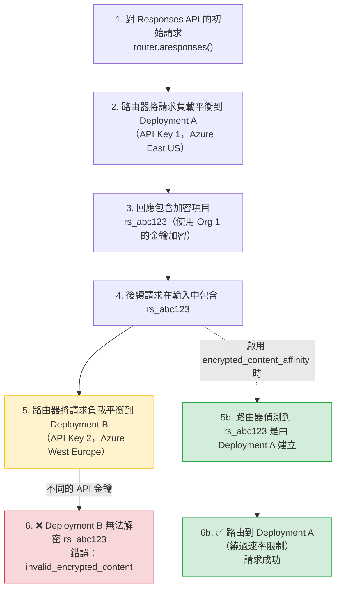

**日期：** 2026 年 2 月 24 日  
**期間：** 持續進行中（直到修正部署）  
**嚴重性：** 高（適用於在不同 API 金鑰之間對 Responses API 進行負載平衡的使用者）  
**狀態：** 已解決

## 摘要 {#summary}

當在具有**不同 API 金鑰**的部署之間對 OpenAI 的 Responses API 進行負載平衡時（例如，不同的 Azure 區域或 OpenAI 組織），包含加密內容項目（例如 `rs_...` reasoning items）的後續請求會失敗，錯誤如下：

```json
{
  "error": {
    "message": "The encrypted content for item rs_0d09d6e56879e76500699d6feee41c8197bd268aae76141f87 could not be verified. Reason: Encrypted content organization_id did not match the target organization.",
    "type": "invalid_request_error",
    "code": "invalid_encrypted_content"
  }
}
```

加密內容項目在密碼學上與建立它們的 API 金鑰所屬組織綁定。當路由器將後續請求負載平衡到使用不同 API 金鑰的部署時，解密就會失敗。

- **含加密內容的 Responses API 請求：** 路由到錯誤部署時完全失敗
- **初始請求：** 不受影響 — 只有包含加密項目的後續請求會失敗
- **其他 API 端點：** 無影響 — chat completions、embeddings 等功能正常

{/* truncate */}

---

## 背景 {#background}

OpenAI 的 Responses API 可回傳加密的「reasoning items」（ID 例如 `rs_...`），其中包含中間推理步驟。這些項目使用該組織的金鑰加密，只有同一組織的 API 金鑰才能解密。

在不同 API 金鑰的部署之間進行負載平衡時，現有的 affinity 機制不足：

- **`responses_api_deployment_check`**：需要 `previous_response_id`，但某些用戶端（如 Codex）未提供
- **`deployment_affinity`**：範圍太大 — 會將使用者的*所有*請求固定到單一部署，依使用者數量降低有效配額
- **`session_affinity`**：需要明確的 session IDs，且仍會降低配額



---

## 根本原因 {#root-cause}

LiteLLM 的路由器沒有機制追蹤哪些部署建立了特定的加密內容項目，並據此路由後續請求。路由器將所有部署視為可互換，導致當加密內容跨越組織邊界時發生解密失敗。

**問題流程：**

1. 使用者以模型 `router.aresponses()` 呼叫 `gpt-5.1-codex`
2. 路由器將請求負載平衡到 Deployment A（Azure East US，API Key 1）
3. 回應包含加密的 reasoning item `rs_abc123`（使用 Org 1 的金鑰加密）
4. 使用者在輸入中加入 `rs_abc123` 發出後續請求
5. 路由器將請求負載平衡到 Deployment B（Azure West Europe，API Key 2）
6. Deployment B 嘗試使用 Org 2 的金鑰解密 `rs_abc123` → **失敗**

**既有解決方案為何無效：**

- **`previous_response_id`**：並非所有用戶端都提供（例如 Codex）
- **`deployment_affinity`**：會將*所有*使用者請求固定到單一部署 → 配額降低為 1/N，其中 N = 部署數量
- **`session_affinity`**：需要明確的 session 管理，且仍會降低配額

**時間線：**

1. 使用者設定了使用不同 API 金鑰的多區域 Responses API 負載平衡
2. 初始請求成功，但含加密內容的後續請求間歇性失敗
3. 錯誤率與部署數量相關（部署越多 = 路由到錯誤部署的機率越高）
4. 調查發現加密內容與組織綁定
5. 現有 affinity 機制被認定不適用（配額降低、缺少 `previous_response_id`）
6. 設計並實作了新解法：`encrypted_content_affinity`

---

## 修正 {#the-fix}

實作了一個新的 `encrypted_content_affinity` pre-call 檢查，可智慧追蹤加密內容，並且**僅在必要時**將後續請求路由到特定部署。

### 實作 {#implementation}

**1. 將 `model_id` 編碼到輸出項目中**（[`responses/utils.py`](https://github.com/BerriAI/litellm/blob/main/litellm/litellm/responses/utils.py)）

與 `previous_response_id` affinity 相同的方法 — 不需要快取。當回應包含帶有 `encrypted_content` 的輸出項目時，LiteLLM 會將來源部署的 `model_id` 以**兩個位置**編碼以提高冗餘：

1. **編碼到 item ID 中**（若存在）：`rs_abc123` → `encitem_{base64("litellm:model_id:{model_id};item_id:rs_abc123")}`
2. **編碼到 encrypted_content 本身**：使用 `litellm_enc:{base64("model_id:{model_id}")};{original_encrypted_content}` 包裹內容

```python
# Encoding item IDs (when present)
def _build_encrypted_item_id(model_id: str, item_id: str) -> str:
    assembled = f"litellm:model_id:{model_id};item_id:{item_id}"
    encoded = base64.b64encode(assembled.encode("utf-8")).decode("utf-8")
    return f"encitem_{encoded}"

# Wrapping encrypted_content (always, for redundancy)
def _wrap_encrypted_content_with_model_id(encrypted_content: str, model_id: str) -> str:
    metadata = f"model_id:{model_id}"
    encoded_metadata = base64.b64encode(metadata.encode("utf-8")).decode("utf-8")
    return f"litellm_enc:{encoded_metadata};{encrypted_content}"
```

**為什麼直接包裹 encrypted_content？** 某些用戶端（如 Codex）在後續請求中不會穩定傳送 item ID，但它們一定會傳送 `encrypted_content` 本身。透過將 `model_id` 嵌入內容，即使缺少 ID，affinity 也能運作。

**串流回應：** 包裹邏輯會套用於兩者：
- 最終回應物件（非串流）
- 個別串流事件（`response.output_item.added`、`response.output_item.done`）

這可確保接收串流回應的用戶端取得包裹後的內容，並可將其送回。

在轉送至上游提供者之前，LiteLLM 會還原原始 item ID 並解開 encrypted_content，因此提供者永遠看不到編碼後的形式：

```python
# In responses/main.py — before calling the handler
input = ResponsesAPIRequestUtils._restore_encrypted_content_item_ids_in_input(input)
```

**2. `EncryptedContentAffinityCheck` — 僅用於路由**（[`encrypted_content_affinity_check.py`](https://github.com/BerriAI/litellm/blob/main/litellm/litellm/router_utils/pre_call_checks/encrypted_content_affinity_check.py))

沒有 `async_log_success_event` 或快取查詢 — `model_id` 會直接從 item ID 或 encrypted_content 解碼：

```python
class EncryptedContentAffinityCheck(CustomLogger):
    async def async_filter_deployments(self, model, healthy_deployments, ...):
        """Extract model_id from input items (ID or encrypted_content) and pin to that deployment."""
        for item in request_kwargs.get("input", []):
            # Try to extract model_id from two sources:
            model_id = self._extract_model_id_from_input(item)
            
            if model_id:
                deployment = self._find_deployment_by_model_id(
                    healthy_deployments, model_id
                )
                if deployment:
                    request_kwargs["_encrypted_content_affinity_pinned"] = True
                    return [deployment]
        return healthy_deployments
    
    def _extract_model_id_from_input(self, item: dict) -> Optional[str]:
        """Extract model_id from either encoded ID or wrapped encrypted_content."""
        # 1. Try decoding from item ID (if present)
        item_id = item.get("id", "")
        if item_id:
            decoded = ResponsesAPIRequestUtils._decode_encrypted_item_id(item_id)
            if decoded:
                return decoded["model_id"]
        
        # 2. Try unwrapping from encrypted_content (fallback for clients that omit IDs)
        encrypted_content = item.get("encrypted_content", "")
        if encrypted_content and encrypted_content.startswith("litellm_enc:"):
            model_id, _ = ResponsesAPIRequestUtils._unwrap_encrypted_content_with_model_id(
                encrypted_content
            )
            return model_id
        
        return None
```

**3. 速率限制繞過**（[`router.py`](https://github.com/BerriAI/litellm/blob/main/litellm/litellm/router.py)）

當加密內容需要特定部署時，會繞過 RPM/TPM 限制（反正請求在其他任何部署上都會失敗）：

```python
# In async_get_available_deployment, after filtering healthy deployments:
if (
    request_kwargs.get("_encrypted_content_affinity_pinned")
    and len(healthy_deployments) == 1
):
    return healthy_deployments[0]  # Bypass routing strategy (RPM/TPM checks)
```

**3. 設定**

```yaml
router_settings:
  routing_strategy: usage-based-routing-v2
  enable_pre_call_checks: true
  optional_pre_call_checks:
    - encrypted_content_affinity
  deployment_affinity_ttl_seconds: 86400  # 24 hours
```

### 主要優點 {#key-benefits}

✅ **不降低配額**：只會固定包含加密項目的請求  
✅ **繞過速率限制**：當加密內容需要特定部署時，RPM/TPM 限制不會阻擋它  
✅ **不需要 `previous_response_id`**：直接將 `model_id` 編碼進 item ID 即可運作  
✅ **不需要快取**：`model_id` 會即時從 item ID 解碼 — 不需要 Redis，不需要 TTL  
✅ **全域安全**：可對所有模型啟用；非 Responses API 呼叫不受影響  
✅ **精準處理**：一般請求仍可自由進行負載平衡

---

## 修復措施 {#remediation}

| # | 動作 | 狀態 | 程式碼 |
|---|---|---|---|
| 1 | 在回應時將 `model_id` 編碼到加密內容 item ID 中 | ✅ 完成 | [`responses/utils.py`](https://github.com/BerriAI/litellm/blob/main/litellm/litellm/responses/utils.py) |
| 2 | 在轉送至上游提供者前還原原始 item ID | ✅ 完成 | [`responses/main.py`](https://github.com/BerriAI/litellm/blob/main/litellm/litellm/responses/main.py) |
| 3 | `EncryptedContentAffinityCheck`：解碼 item ID 以進行路由（不使用快取） | ✅ 完成 | [`encrypted_content_affinity_check.py`](https://github.com/BerriAI/litellm/blob/main/litellm/litellm/router_utils/pre_call_checks/encrypted_content_affinity_check.py) |
| 4 | 將 `encrypted_content_affinity` 新增至 `OptionalPreCallChecks` 型別 | ✅ 完成 | [`types/router.py`](https://github.com/BerriAI/litellm/blob/main/litellm/litellm/types/router.py) |
| 5 | 為固定到 affinity 的請求實作速率限制繞過 | ✅ 完成 | [`router.py`](https://github.com/BerriAI/litellm/blob/main/litellm/litellm/router.py) |
| 6 | 單元測試：編碼/解碼工具、路由、RPM 繞過 | ✅ 完成 | [`test_encrypted_content_affinity_check.py`](https://github.com/BerriAI/litellm/blob/main/litellm/tests/test_litellm/router_utils/pre_call_checks/test_encrypted_content_affinity_check.py) |
| 7 | 文件：Responses API 指南、負載平衡指南、設定參考 | ✅ 完成 | [Docs](https://docs.litellm.ai/docs/response_api#encrypted-content-affinity-multi-region-load-balancing) |
| 8 | **[3 月 3 日]** 修正串流事件以包裹 encrypted_content | ✅ 完成 | [`responses/streaming_iterator.py`](https://github.com/BerriAI/litellm/blob/main/litellm/litellm/responses/streaming_iterator.py) |

---

## 後續修正：串流回應（2026 年 3 月 3 日） {#follow-up-fix-streaming-responses-mar-3-2026}

### 問題 {#the-issue}

在初始修正部署後，使用者回報，當使用 Codex 這類用戶端進行串流回應時，`invalid_encrypted_content` 錯誤**仍然會發生**。調查顯示：

- ✅ 非串流回應：`encrypted_content` 已正確包裝上 `litellm_enc:` 前綴
- ❌ 串流回應：個別 `response.output_item.added` 與 `response.output_item.done` 事件包含**原始、未包裝**的 `encrypted_content`

由於 Codex 與其他用戶端是以串流方式接收回應，因此它們在這些事件中收到了未包裝的內容，並在後續請求中將其傳回，導致親和性檢查失敗。

### 根本原因 {#the-root-cause}

`_update_encrypted_content_item_ids_in_response` 函式只修改了**最終**回應物件，而該物件僅用於非串流回應。對於串流回應，個別區塊會由 `ResponsesAPIStreamingIterator._process_chunk` 處理，而它**沒有**將包裝邏輯套用到串流事件。

### 修正 {#the-fix-1}

已修改 `litellm/litellm/responses/streaming_iterator.py`，以在串流事件中包裝 `encrypted_content`：

```python
# In ResponsesAPIStreamingIterator._process_chunk
if (
    self.litellm_metadata
    and self.litellm_metadata.get("encrypted_content_affinity_enabled")
):
    event_type = getattr(openai_responses_api_chunk, "type", None)
    if event_type in (
        ResponsesAPIStreamEvents.OUTPUT_ITEM_ADDED,
        ResponsesAPIStreamEvents.OUTPUT_ITEM_DONE,
    ):
        item = getattr(openai_responses_api_chunk, "item", None)
        if item:
            encrypted_content = getattr(item, "encrypted_content", None)
            if encrypted_content and isinstance(encrypted_content, str):
                model_id = (
                    self.litellm_metadata.get("model_info", {}).get("id")
                    if self.litellm_metadata
                    else None
                )
                if model_id:
                    wrapped_content = ResponsesAPIRequestUtils._wrap_encrypted_content_with_model_id(
                        encrypted_content, model_id
                    )
                    setattr(item, "encrypted_content", wrapped_content)
```

這可確保傳送給用戶端的**所有** `encrypted_content`（串流或非串流）都會以 `model_id` 中繼資料包裝，從而啟用一致的親和性路由。

---

## 遷移指南 {#migration-guide}

### 之前（使用 `deployment_affinity`） {#before-using-deployment_affinity}

```yaml
router_settings:
  optional_pre_call_checks:
    - deployment_affinity  # ❌ Reduces quota by number of users
```

**問題：** 來自同一使用者的所有請求都會固定到單一部署，使有效配額降為 1/N。

### 之後（使用 `encrypted_content_affinity`） {#after-using-encrypted_content_affinity}

```yaml
router_settings:
  optional_pre_call_checks:
    - encrypted_content_affinity  # ✅ Only pins requests with encrypted content
```

**好處：** 一般請求可自由進行負載平衡，只有在必要時，已加密內容請求才會固定。
