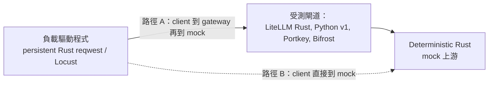

*最後更新：2026 年 7 月*

我們正在推出 LiteLLM AI Gateway 的 Rust 早期 beta 版，並建立了 [AIGatewayBench](https://github.com/BerriAI/ai-gateway-bench) 來將其與 Portkey、Bifrost 以及目前的 LiteLLM Python proxy 進行比較。四者之中，LiteLLM Rust 閘道具有**最低的 p99 額外延遲與明顯最小的記憶體占用**：相較於下一個最接近的閘道（Bifrost），額外負擔大約低 `7x`、記憶體少 `9x`，且具有最低的成本占用，以及對 coding agents 而言最快的整體工作階段時間。它在原始持續吞吐量上表現不遜色，並在額外負擔、記憶體與成本方面明顯領先。

{/* truncate */}

## 結果 {#the-results}

**閘道額外負擔與記憶體。** p99 額外延遲（對數刻度）與峰值記憶體。Rust 在 p99 方面約增加 `0.7ms`，相較於 `2.3ms`（Portkey）、`4.5ms`（Bifrost）與 `257.7ms`（Python v1）；峰值記憶體則為 `21.8MB`，相較於 `90.4MB`、`199.1MB` 與 `329.5MB`。


**成本占用。** 依據在 4 vCPU / 16 GB 執行個體上量測到的 CPU、峰值 RSS 與持續吞吐量，估算每一百萬次請求的美元成本。Rust 約落在 `$0.000175`，比 Bifrost（`$0.001008`）與 Portkey（`$0.001042`）低約 `6x`，也遠低於 Python（`$0.015354`）。這是占用估算，未包含 token 成本；在任何真實帳單中，token 成本都占主導。


**吞吐效率。** 每美元每小時的持續每秒請求數。Rust 達到約 `283,833`，相較於 `63,246`（Bifrost），因為它以一小部分的 CPU 與記憶體維持了相近的請求速率。在原始持續 RPS 方面，Rust（`~2,814` req/s）略高於 Bifrost（`~2,744`）；此圖表顯示的是每美元效率，而不是峰值吞吐量。


**Agentic coding 工作階段。** 在 30 輪 Claude Code 與 Codex 風格迴圈中的額外總耗時。Rust 約增加 `0.03s` 與 `0.016s`，相較於 `0.13s` / `0.047s`（Bifrost）、`0.12s` / `0.09s`（Portkey）以及 `0.97s` / `0.24s`（Python）。


## 如何使用 AIGatewayBench 重現此結果 {#how-to-reproduce-this-with-aigatewaybench}

每個閘道都指向同一個本機 deterministic Rust mock，因此提供者延遲與網路抖動都被排除，剩下的是閘道自身的成本：

```
overhead = latency(client -> gateway -> mock) - latency(client -> mock directly)
```



閘道的額外負擔是路徑 A 減去路徑 B。除受測閘道、mock、負載驅動程式與主機之外，其餘條件都保持一致，因此差異就是閘道自身的成本。完整的測試框架、各閘道設定與原始執行資料都在 [AIGatewayBench](https://github.com/BerriAI/ai-gateway-bench) 中。先啟動 mock，再啟動一個指向它的閘道，執行一個情境，然後重新產生圖表：

```bash
python -m venv .venv && . .venv/bin/activate && pip install -r requirements.txt
cargo run --release -p mock-upstream                 # deterministic upstream
# start a gateway from gateways/<name>/README.md, pointed at the mock
python analyze/make_chart.py                          # charts from results/
```

閱讀這些數值時，請留意幾件事：

- 由於上游是本機 mock，絕對延遲是閘道的隔離片段，而不是實際世界中的請求延遲。請將其視為在相同條件下的比較。
- 版本：LiteLLM Rust beta、LiteLLM Python v1（`litellm[proxy]`）、Bifrost `v1.6.4`、目前的 Portkey OSS。相同的 mock 與負載驅動程式都在同一台主機上。
- 每個閘道都在沒有啟用記錄回呼、費用追蹤或持久化的情況下轉發 Anthropic Messages body。這是為了隔離轉發額外負擔；它不是完整功能比較，而啟用這些功能會增加每個閘道的成本，包括我們的閘道。
- 單一主機、每個情境各自執行（例如額外負擔面板中的 n=5000），沒有重複試驗誤差棒，因此請將其視為數量級差異。
- 這是由供應商執行的基準測試，因此防護欄是可重現性：每個繪圖值都是 [`results/`](https://github.com/BerriAI/ai-gateway-bench/tree/main/results) 中已提交的 CSV，且 mock 與驅動程式在四個閘道之間完全相同。

## 結論 {#conclusions}

對於單次聊天回合而言，閘道額外負擔相較於模型延遲幾乎可以忽略，這些數據不應影響您的決策。真正重要的情況是對快速回應的高請求率（embeddings、分類、防護欄）以及每個任務會發出多輪的 agentic 迴圈，還有決定您要執行多少 pods、以及每個 pod 距離 out-of-memory kill 有多近的記憶體與 CPU 占用。

在這些面向上，我們測試的四者中 LiteLLM Rust 閘道表現最強：額外負擔最低、占用最小、每單位吞吐量成本最低，而且原始持續 RPS 也略勝下一個最佳閘道。它仍處於早期 beta，串流與完整功能面仍在陸續到位，而在此驗證任何主張的最快方式，就是針對您自己的建置執行 AIGatewayBench。如果您想在自己的堆疊中執行 LiteLLM Rust 閘道，請[註冊早期 beta](https://docs.google.com/forms/d/e/1FAIpQLSecWdOjkzjEson2UiZpDftOoZPs8RQbtlAM40KSvDXZqEgYaA/viewform?usp=dialog)；有關遷移背後的架構，請參閱[將 LiteLLM 遷移至 Rust](/blog/litellm-rust-launch)。
