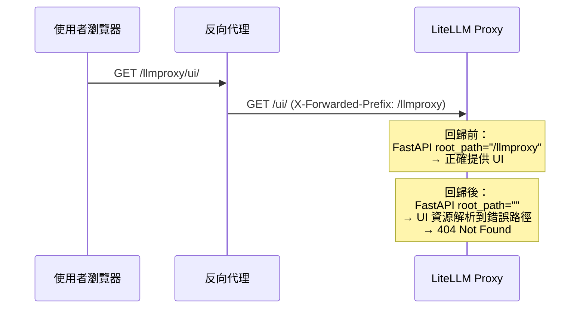
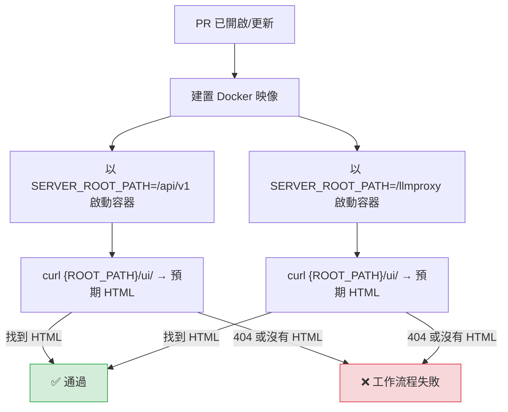

**日期：** 2026 年 1 月 22 日
**持續時間：** 約 4 天（直到修正於 2026 年 1 月 26 日合併）
**嚴重性：** 高
**狀態：** 已修復

> **注意：** 此修正自 LiteLLM `v1.81.3.rc.6` 或更高版本開始可用。

## 摘要 {#summary}

一個 PR（[`#19467`](https://github.com/BerriAI/litellm/pull/19467)）意外地從 `proxy_server.py` 中的 FastAPI 應用程式初始化移除了 `root_path=server_root_path` 參數。這導致代理程式在提供 UI 時忽略 `SERVER_ROOT_PATH` 環境變數。當 LiteLLM 部署在具有路徑前綴的反向代理之後（例如 `/api/v1` 或 `/llmproxy`）時，使用者發現所有 UI 頁面都回傳 404 Not Found。

- **LLM API 請求：** 無影響。API 路由未受影響。
- **UI 頁面：** 使用 `SERVER_ROOT_PATH` 的部署中，所有 UI 頁面都回傳 404。
- **Swagger/OpenAPI 文件：** 透過設定的根路徑存取時無法運作。

{/* truncate */}

---

## 背景 {#background}

許多 LiteLLM 部署都位於反向代理（例如 Nginx、Traefik、AWS ALB）之後，該反向代理會在路徑前綴下將流量路由到 LiteLLM。FastAPI 的 `root_path` 參數會告知應用程式這個前綴，讓它能正確提供靜態檔案、產生 URL，並處理路由。



`root_path` 參數自 LiteLLM 早期版本以來一直存在於 `proxy_server.py` 中。它是 PR [#19467](https://github.com/BerriAI/litellm/pull/19467) 的副作用而被移除，而該 PR 原本是為了修正另一個 UI 404 問題。

---

## 根本原因 {#root-cause}

PR [#19467](https://github.com/BerriAI/litellm/pull/19467)（`73d49f8`）從 `proxy_server.py` 中 `FastAPI()` 建構函式移除了 `root_path=server_root_path` 這一行：

```diff
 app = FastAPI(
     docs_url=_get_docs_url(),
     redoc_url=_get_redoc_url(),
     title=_title,
     description=_description,
     version=version,
-    root_path=server_root_path,
     lifespan=proxy_startup_event,
 )
```

如果沒有 `root_path`，FastAPI 會將所有請求視為應用程式掛載在 `/`，導致任何使用 `SERVER_ROOT_PATH` 的部署都出現路徑不匹配。

這個回歸未被偵測到是因為：

1. **沒有自動化測試** 驗證 FastAPI 應用程式上是否設定了 `root_path`。
2. **沒有人工測試流程** 可用於 `SERVER_ROOT_PATH` 功能。
3. **預設部署**（沒有 `SERVER_ROOT_PATH`）不受影響，因此大多數 CI 測試都通過了。

---

## 修復措施 {#remediation}

| #   | 動作                                                                                             | 狀態    | 程式碼                                                                                                                      |
| --- | ------------------------------------------------------------------------------------------------- | ------- | -------------------------------------------------------------------------------------------------------------------------- |
| 1   | 在 FastAPI 應用程式初始化中恢復 `root_path=server_root_path`                                | ✅ 完成 | [`#19790`](https://github.com/BerriAI/litellm/pull/19790)（`5426b3c`）                                                      |
| 2   | 為 `get_server_root_path()` 和 FastAPI 應用程式初始化新增單元測試                        | ✅ 完成 | [`test_server_root_path.py`](https://github.com/BerriAI/litellm/blob/main/tests/proxy_unit_tests/test_server_root_path.py) |
| 3   | 新增 CI 工作流程，在每個 PR 上建置 Docker 映像並以 `SERVER_ROOT_PATH` 測試 UI 路由 | ✅ 完成 | [`test_server_root_path.yml`](https://github.com/BerriAI/litellm/blob/main/.github/workflows/test_server_root_path.yml)    |
| 4   | 文件化 `SERVER_ROOT_PATH` 的手動測試流程                                            | ✅ 完成 | [Discussion #8495](https://github.com/BerriAI/litellm/discussions/8495)                                                    |

---

## CI 工作流程詳細資訊 {#ci-workflow-details}

新的 [`test_server_root_path.yml`](https://github.com/BerriAI/litellm/blob/main/.github/workflows/test_server_root_path.yml) 工作流程會在每個針對 `main` 的 PR 上執行。它會：

1. 建置 LiteLLM Docker 映像
2. 啟動一個設置了 `SERVER_ROOT_PATH` 的容器（同時測試 `/api/v1` 與 `/llmproxy`）
3. 驗證 UI 在 `{ROOT_PATH}/ui/` 可回傳有效的 HTML
4. 若 UI 無法連線，則使工作流程失敗



這可防止未來在變更 `proxy_server.py` 時意外破壞 `SERVER_ROOT_PATH` 支援的回歸。

---

## 時間軸 {#timeline}

| 時間（UTC）         | 事件                                                                                                                                                        |
| ------------------ | ------------------------------------------------------------------------------------------------------------------------------------------------------------ |
| 2026 年 1 月 22 日 04:20 | PR [#19467](https://github.com/BerriAI/litellm/pull/19467) 合併，移除 `root_path=server_root_path`                                                     |
| 1 月 22 日至 26 日          | 使用 nightly builds 的使用者回報在使用 `SERVER_ROOT_PATH` 時出現 UI 404 錯誤                                                                                   |
| 2026 年 1 月 26 日 17:48 | 修正 PR [#19790](https://github.com/BerriAI/litellm/pull/19790) 合併，恢復 `root_path=server_root_path`                                                |
| 2026 年 2 月 18 日       | 新增 CI 工作流程 [`test_server_root_path.yml`](https://github.com/BerriAI/litellm/blob/main/.github/workflows/test_server_root_path.yml)，在每個 PR 上執行 |

---

## 使用者的修復步驟 {#resolution-steps-for-users}

對於仍然遇到問題的使用者，請更新至最新的 LiteLLM 版本：

```bash
pip install --upgrade litellm
```

確認您的 `SERVER_ROOT_PATH` 已正確設定：

```bash
# In your environment or docker-compose.yml
SERVER_ROOT_PATH="/your-prefix"
```

然後確認 UI 可透過 `http://your-host:4000/your-prefix/ui/` 存取。
