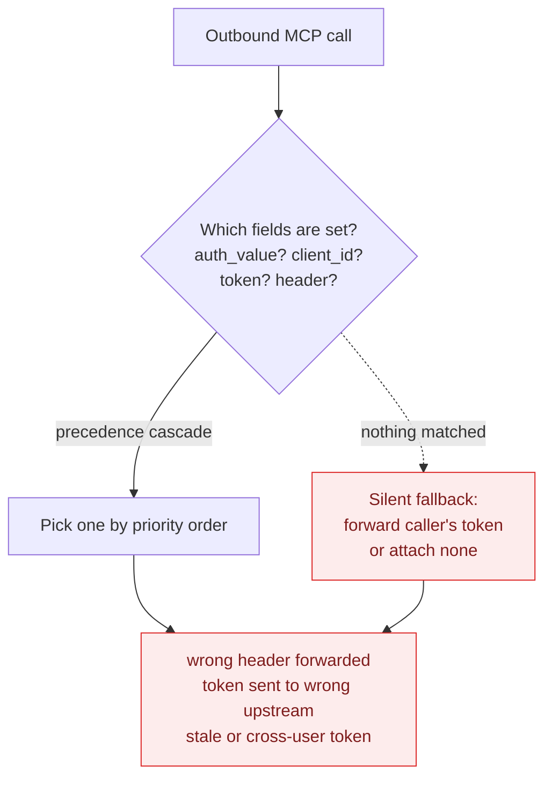
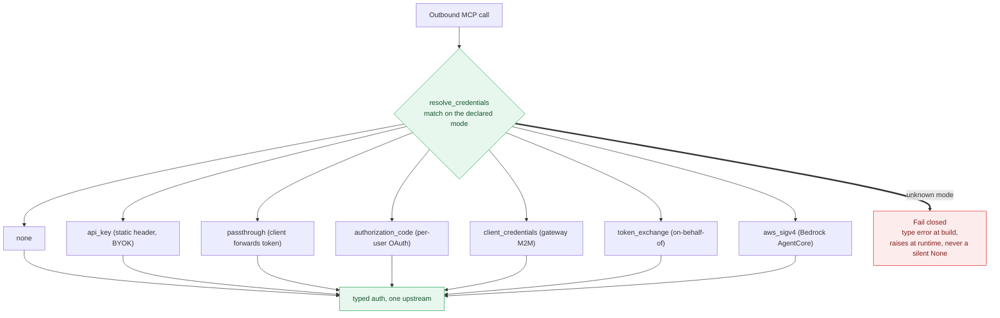
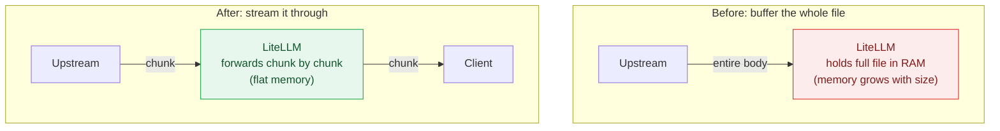

Over the last two weeks we addressed two major product quality issues:

1. The MCP Gateway did not have a single class for credential resolution.
2. Pass-through APIs had high memory consumption.

Across the same window we shipped 134 bug fixes in total. This post covers the two big changes first, then the rest of the AI Eng and reliability work, the full breakdown, and what we are doing next.

{/* truncate */}

## MCP Gateway: a single credential resolver

The MCP Gateway connects a user's AI app (Claude Desktop, Cursor, an agent) to the upstream MCP servers it wants to use, and it has to attach the right credential for each upstream.

Before, the MCP Gateway would infer the authentication method a user was trying to use based on the credentials they set. We have now built a credential resolver class that lets a user explicitly specify which auth method they are using. We believe this will significantly drive down a class of bugs users were reporting on MCPs.

### Before: infer the auth method from whatever credentials are set

Why this was bad: there was no single place that decided which credential to attach, and no error when the decision was ambiguous. Inferring from set fields meant two code paths could read the same server and disagree. The precedence order meant adding a field could silently change which credential won. And the silent fallback meant an unhandled case still sent something upstream instead of refusing. Ambiguity resolved to "attach a credential anyway" instead of "stop."

The types of bugs we saw from this:

- Tokens sent to the wrong upstream server.
- Duplicate or stale `Authorization` headers slipping through.
- MCP requests skipping the normal team, route, and key checks.
- Cached OAuth tokens going stale or crossing between users.
- Upstream URLs and secrets showing up in logs.

### After: the user declares the auth method, and it fails closed

Each mode has its own fully typed config, so there is no guessing from which fields are set and no precedence order. The match is exhaustive, so adding a mode without handling it fails the type checker, and an unhandled case raises instead of quietly attaching no auth.

## AI Eng: LLM providers (27 fixes)

The theme here was making new models correct on day one, especially the billing math. Most of this work made sure new Claude 4.8 / Opus 4.8 and Bedrock Invoke requests bill correctly and do not silently drop capabilities.

- Billing accuracy: tier-only deployments were billing $0 and are now billed correctly, regional inference profiles resolve to regional pricing, and tiered-pricing costs are coerced safely.
- Capability correctness: mid-conversation system messages are honored for Claude 4.8+ on Bedrock, adaptive thinking/effort is translated for pre-4.6 models, and `@version` suffixes are stripped in model lookup.
- Translation fidelity: `cache_control` TTL is preserved on Bedrock cache points, reasoning tokens are preserved through chat to responses, and in-stream error events now raise real API errors instead of vanishing.

## Performance: pass-through memory

Pass-through APIs had high memory consumption. Large non-JSON pass-through downloads (batch-result files, binary and octet-stream downloads) were buffered whole in memory before being sent on. We changed this to stream the response chunk by chunk, so memory stays flat regardless of file size. This covers the provider pass-through routes (`/vertex_ai/*`, `/bedrock/*`, `/openai/*`, `/anthropic/*`, and others) and custom pass-through endpoints.

JSON responses still buffer by design, so spend logging and guardrails can inspect the body.

Two more fixes in the same spirit, don't pay for work nobody needs:

- Prometheus skips budget-metric DB lookups entirely when the gauges are no-ops (nothing is scraping them).
- The complexity router builds its semantic route index once under concurrent cold-start, instead of rebuilding it per request.

## By the numbers

Every fix, bucketed by the area it landed in.

| Area | Fixes |
|---|---|
| MCP Gateway | 50 |
| LLM Providers (AI Eng) | 27 |
| Proxy Core / Reliability | 23 |
| UI / Dashboard | 20 |
| Logging / Observability | 9 |
| Guardrails | 5 |
| Total | 134 |

A note on the count: these 134 are every merged `fix:` PR in the two-week window. One reported ticket usually becomes several fix PRs (the MCP work alone was around 50 commits behind a handful of tickets), so the PR count runs higher than the reported-ticket count.

## Next goal: 95% end-to-end test coverage

Most of the 134 fixes above were caught late, in staging or by a report. The next lever is catching them before they merge. We are pushing end-to-end test coverage to 95% across the product, and we believe this will significantly improve release quality: fewer regressions reaching a release, and less time spent hot-fixing after one ships.
