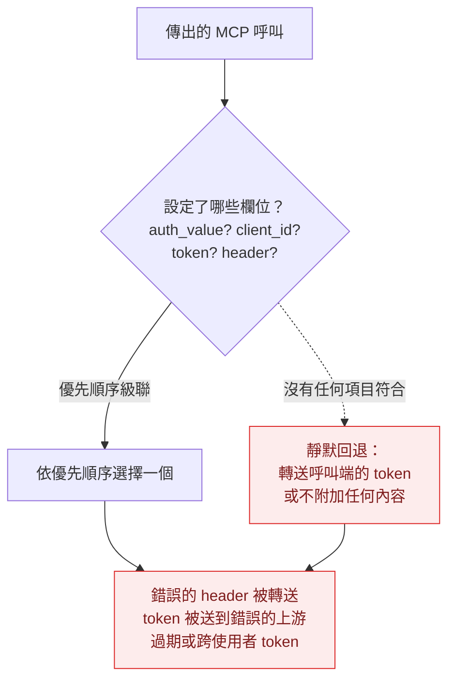
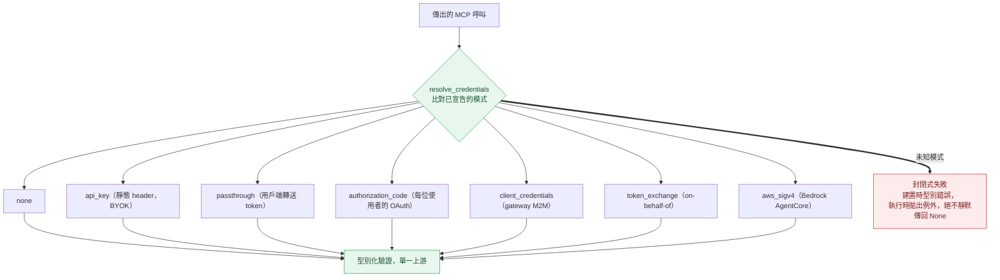
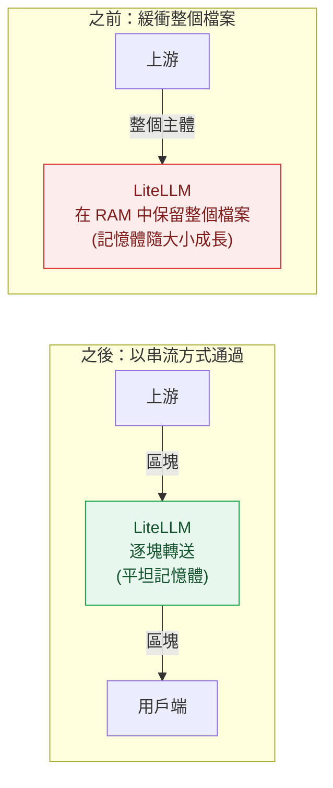

在過去兩週，我們處理了兩個重大的產品品質問題：

1. MCP Gateway 沒有單一的憑證解析類別。
2. 透傳 API 的記憶體消耗過高。

在同一期間，我們總共推出了 134 個錯誤修正。這篇文章先介紹這兩個重大變更，接著說明其餘的 AI 工程與可靠性工作、完整細目，以及我們接下來要做什麼。

{/* truncate */}

## MCP Gateway：單一憑證解析器 {#mcp-gateway-a-single-credential-resolver}

MCP Gateway 會把使用者的 AI 應用程式（Claude Desktop、Cursor、代理程式）連接到它想使用的上游 MCP 伺服器，而且必須為每個上游附加正確的憑證。

過去，MCP Gateway 會根據使用者設定的憑證，推斷他們想使用的驗證方式。我們現在已建立一個憑證解析器類別，讓使用者可以明確指定自己使用的是哪種驗證方式。我們相信，這將大幅降低使用者在 MCP 上回報的一類錯誤。

### 之前：從已設定的任何憑證推斷驗證方式 {#before-infer-the-auth-method-from-whatever-credentials-are-set}

這之所以不好，是因為沒有單一位置決定要附加哪個憑證，而且在決策模稜兩可時也不會報錯。從已設定欄位推斷，表示兩段程式碼可能讀取同一個伺服器卻得出不同結論。優先順序代表新增欄位可能在不知不覺中改變哪個憑證勝出。而靜默回退表示即使有未處理情況，系統仍會把某些內容送往上游，而不是拒絕。模稜兩可的情況會變成「還是附加一個憑證」，而不是「停止」。

我們看到的這類錯誤包括：

- Token 被送到錯誤的上游伺服器。
- 重複或過期的 `Authorization` header 滲漏出去。
- MCP 請求跳過了正常的 team、route 和 key 檢查。
- 快取的 OAuth token 變得過期，或在使用者之間互相穿越。
- 上游 URL 和密鑰出現在記錄中。

### 之後：使用者宣告驗證方式，且系統會在封閉狀態下失敗 {#after-the-user-declares-the-auth-method-and-it-fails-closed}

每種模式都有自己完整型別化的設定，因此不再需要根據哪些欄位已設定來猜，也沒有優先順序。這個比對是窮盡式的，所以新增模式卻沒有處理時，型別檢查器會失敗；而未處理的情況會直接拋出，而不是悄悄地不附加任何驗證。

## AI 工程：LLM 提供者（27 項修正） {#ai-eng-llm-providers-27-fixes}

AI 工程專注於降低回報的錯誤。大多數都出現在新模型上（Claude 4.8、Opus 4.8、Bedrock Invoke）。以下是我們修正的錯誤類型：

| 錯誤類型 | 數量 |
|---|---|
| 新模型能力被漏掉 | 10 |
| 費用或計費錯誤 | 6 |
| 路由或備援選到錯的模型 | 6 |
| 回應或串流輸出損壞 | 5 |
| 總計 | 27 |

其中大多數發生在 Bedrock 和路由層。

## 效能：透傳記憶體 {#performance-pass-through-memory}

透傳 API 的記憶體消耗過高。大型非 JSON 的透傳下載（batch-result 檔案、binary 與 octet-stream 下載）在送出之前會整個緩衝到記憶體中。我們已將其改為逐塊串流回應，因此不論檔案大小，記憶體都能維持平坦（[#32386](https://github.com/BerriAI/litellm/pull/32386)）。這涵蓋提供者透傳路由（`/vertex_ai/*`、`/bedrock/*`、`/openai/*`、`/anthropic/*` 等）以及自訂透傳端點。

JSON 回應仍會依設計進行緩衝，因此花費記錄和防護欄可以檢查主體內容。

另外兩項同樣精神的修正：不為沒人需要的工作付費：

- 當 gauge 是 no-op（沒有人在抓取它們）時，Prometheus 會完全跳過 budget-metric 資料庫查詢。
- 複雜度路由器會在並行冷啟動下只建構一次其語義路由索引，而不是每個請求都重新建構。

## 數據一覽 {#by-the-numbers}

這 134 項修正，按領域如下：

| 領域 | 修正數 |
|---|---|
| MCP Gateway | 50 |
| LLM 提供者（AI 工程） | 27 |
| Proxy Core / 可靠性 | 23 |
| UI / 儀表板 | 20 |
| 記錄 / 可觀測性 | 9 |
| 防護欄 | 5 |
| 總計 | 134 |

這 134 項是這兩週內每一個已合併的 `fix:` PR。一個回報的 ticket 往往會變成多個修正 PR，所以這個數字比 Linear 中的 ticket 數量更高。

## 下一個目標：95% 端到端測試涵蓋率 {#next-goal-95-end-to-end-test-coverage}

這 134 個 bug 大多是在後期才被抓到，發生在 staging 或來自使用者回報。我們希望在它們合併之前就抓到。我們相信，透過投入改善 e2e 測試涵蓋率，就能大幅減少使用者在升級時回報的迴歸問題數量。

我們正在向 [Meta 快速修正 bug 的做法](https://engineering.fb.com/2021/02/17/developer-tools/fix-fast/) 學習，並提高我們的測試標準。

## 附錄 {#appendix}

這段期間的 PR。

**MCP 閘道**

憑證解析器：

- [#32815](https://github.com/BerriAI/litellm/pull/32815) 憑證類別合併（單一型別化解析器）
- [#32652](https://github.com/BerriAI/litellm/pull/32652) 過期 token 失效
- [#32715](https://github.com/BerriAI/litellm/pull/32715) 語意過濾器封閉式失敗

透傳與委派憑證模式：

- [#31989](https://github.com/BerriAI/litellm/pull/31989) 透傳 / 委派模式
- [#32414](https://github.com/BerriAI/litellm/pull/32414) 透傳 UI 列舉
- [#32556](https://github.com/BerriAI/litellm/pull/32556) 透傳呼叫轉發
- [#32752](https://github.com/BerriAI/litellm/pull/32752) 透傳已設定用戶端
- [#32735](https://github.com/BerriAI/litellm/pull/32735) 透傳不保留 DCR
- [#32507](https://github.com/BerriAI/litellm/pull/32507) token exchange 密鑰配對

DCR 橋接（LIT-4337）：

- [#32745](https://github.com/BerriAI/litellm/pull/32745) 接線
- [#32747](https://github.com/BerriAI/litellm/pull/32747) 授權轉發
- [#32753](https://github.com/BerriAI/litellm/pull/32753) facade
- [#32804](https://github.com/BerriAI/litellm/pull/32804) UI
- [#32527](https://github.com/BerriAI/litellm/pull/32527) DCR redirect_uri

密封信封與委派接納（LIT-4338）：

- [#32748](https://github.com/BerriAI/litellm/pull/32748) 信封模組
- [#32794](https://github.com/BerriAI/litellm/pull/32794) 信封邊緣消費者
- [#32824](https://github.com/BerriAI/litellm/pull/32824) 委派接納

**AI 工程（LLM 提供者）**

Bedrock：

- [#32882](https://github.com/BerriAI/litellm/pull/32882) 將支援 mid_conversation_system 的 Claude 4.8+ 條目加上標記
- [#32831](https://github.com/BerriAI/litellm/pull/32831) 為 Claude Invoke 設下原地 system 角色訊息的閘道
- [#32578](https://github.com/BerriAI/litellm/pull/32578) 保留 Claude Invoke 的中途 system 訊息
- [#32658](https://github.com/BerriAI/litellm/pull/32658) 保留 clear_tool_uses 上下文管理編輯並送出 beta 標頭
- [#32551](https://github.com/BerriAI/litellm/pull/32551) 在訊息層級的 cachePoint 區塊上遵循 cache_control ttl
- [#32538](https://github.com/BerriAI/litellm/pull/32538) 保留訊息層級 cache point 上的 cache_control ttl
- [#32840](https://github.com/BerriAI/litellm/pull/32840) 將 jp.anthropic.claude-opus-4-8 新增到模型成本對照表
- [#32389](https://github.com/BerriAI/litellm/pull/32389) 將區域推論設定檔解析為區域定價

Anthropic：

- [#32874](https://github.com/BerriAI/litellm/pull/32874) 在能力探測中傳遞真實的提供者（原本固定為 anthropic）
- [#32867](https://github.com/BerriAI/litellm/pull/32867) 為 pre-4.6 模型轉換 adaptive thinking/effort
- [#32833](https://github.com/BerriAI/litellm/pull/32833) 在模型查找中移除 @version 後綴

路由與備援：

- [#32859](https://github.com/BerriAI/litellm/pull/32859) complexity router 關鍵字層級（最大值彙總、空白關鍵字強化）
- [#32943](https://github.com/BerriAI/litellm/pull/32943) complexity router 記錄與驗證傳遞，索引只建立一次
- [#32873](https://github.com/BerriAI/litellm/pull/32873) 備援規則路由拆分（bare-Claude 覆蓋、成本對照表優先順序、舊版 schema）

Responses API：

- [#32835](https://github.com/BerriAI/litellm/pull/32835) 在串流中的錯誤事件上拋出 APIError
- [#32837](https://github.com/BerriAI/litellm/pull/32837) 在 chat 到 responses 之間保留 reasoning_tokens
- [#32034](https://github.com/BerriAI/litellm/pull/32034) 冪等的 response-id 編碼（可防止 MCP gateway 雙重編碼）

成本、Vertex、Rerank：

- [#32387](https://github.com/BerriAI/litellm/pull/32387) 新增具有區域上浮的 gpt-realtime-2.1 模型
- 將字串 tiered-pricing 成本強制轉換，並共用 tier helper
- [#32550](https://github.com/BerriAI/litellm/pull/32550) 傳遞 realtime health check 參數（Vertex）
- [#32533](https://github.com/BerriAI/litellm/pull/32533) 在 debug 層級記錄 rerank 參數，以避免洩漏請求內容

**效能**

- [#32386](https://github.com/BerriAI/litellm/pull/32386) 串流非 SSE 的直通回應，而不是在記憶體中緩衝
- [#32404](https://github.com/BerriAI/litellm/pull/32404) 防止 request params 覆寫合併後的 target query params
- [#32834](https://github.com/BerriAI/litellm/pull/32834) 當 gauges 為 no-op 時，Prometheus 跳過 budget-metric 的 DB 查詢
