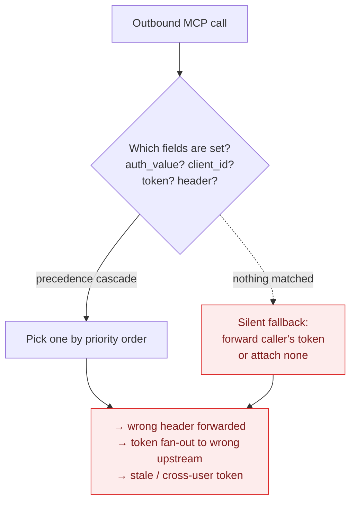
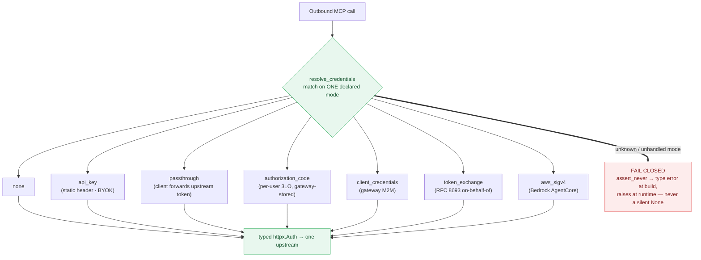
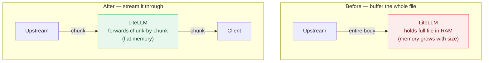

A quick product quality and stability update for the last two weeks (June 27 – July 11, 2026).

We shipped **134 bug fixes**. The headline is the **MCP Gateway** — half of everything we fixed (50 of 134) went into one idea: **credentials should live in exactly one locked place, and only ever reach the one server they belong to.**

Below: the MCP story first, then the AI-Eng and performance work, the full number breakdown, and the next goal.

{/* truncate */}

## MCP Gateway stability — 50 of 134 fixes

**In plain terms:** LiteLLM sits between your AI app (Claude Desktop, Cursor, an agent) and the real tools it wants to use (GitHub, a database, an internal API). Those tools need a credential. The whole question is: **how does the gateway decide which credential to attach — and what happens when it isn't sure?**

The core change is a **single typed credential resolver**. Before, outbound MCP auth was inferred from *whichever fields happened to be present* on a server row, resolved through a precedence cascade — and when nothing matched cleanly it **fell back silently** (forwarding the caller's own token, or attaching none). That silent-fallback path is exactly where the leak and bypass bugs lived. Now there is one `resolve_credentials` that dispatches on **one declared mode**, each with its own fully-typed config, and **fails closed** if a mode isn't handled.

### Before — infer the credential from whatever fields are set

**Why this was bad:** there was no single place that decided which credential to attach, and no error when the decision was ambiguous. Field-presence inference meant two different code paths could read the same server row and disagree; the precedence cascade meant adding a field could silently change which credential won; and the silent fallback meant an unhandled case still sent *something* upstream instead of refusing. Ambiguity resolved to "attach a credential anyway" rather than "stop."

**The types of bugs we saw from this:**

- Tokens leaking to the wrong upstream server (Authorization fan-out).
- Duplicate or stale `Authorization` headers slipping through.
- MCP requests skipping the normal team / route / key checks.
- Cached OAuth tokens going stale or crossing between users.
- Upstream URLs and secrets showing up in logs.

### After — one typed resolver, dispatch on a declared mode, fail closed

Each arm receives its own fully-typed config — **no field-presence guessing, no precedence cascade**. The `match` is exhaustive with an `assert_never` tail, so adding a mode without handling it fails the type checker, and a bypassed gate raises loudly instead of returning no auth.

## AI Eng — LLM providers (27 fixes)

**Central theme: new models are correct on day one — especially the money math.** The bulk of this work made sure new **Claude 4.8 / Opus 4.8** and **Bedrock Invoke** requests bill correctly and do not silently drop capabilities.

- **Billing accuracy:** tier-only deployments were billing **$0** — now billed correctly; regional inference profiles resolve to regional pricing; tiered-pricing costs are coerced safely.
- **Capability correctness:** mid-conversation system messages honored for Claude 4.8+ on Bedrock; adaptive thinking/effort translated for pre-4.6 models; `@version` suffixes stripped in model lookup.
- **Translation fidelity:** `cache_control` TTL preserved on Bedrock cache points; reasoning tokens preserved through chat → responses; in-stream error events now raise real API errors instead of vanishing.

## Performance — streaming pass-through downloads

**The performance story in one line:** on pass-through routes, stop holding a large file download in memory when you can stream it through.

Large **non-JSON** pass-through downloads — batch-result files, binary / octet-stream downloads — now stream chunk-by-chunk instead of being buffered whole in memory. This covers the provider pass-through routes (`/vertex_ai/*`, `/bedrock/*`, `/openai/*`, `/anthropic/*`, and others) and custom pass-through endpoints.

Before, a large batch-result file meant the proxy held the entire body in RAM before sending it on; now memory stays flat regardless of size. **JSON responses still buffer by design** — so spend logging and guardrails can inspect the body.

Two more fixes in the same spirit — don't pay for work nobody needs:

- **Prometheus** skips budget-metric DB lookups entirely when the gauges are no-ops (nothing is scraping them).
- The **complexity router** builds its semantic route index once under concurrent cold-start, instead of rebuilding it per request.

## By the numbers

Every fix, bucketed by the area it landed in.

| Area | Fixes |
|---|---|
| MCP Gateway | **50** |
| LLM Providers (AI Eng) | 27 |
| Proxy Core / Reliability | 23 |
| UI / Dashboard | 20 |
| Logging / Observability | 9 |
| Guardrails | 5 |
| **Total** | **134** |

A note on the count: these **134** are every merged `fix:` PR in the two-week window. One reported ticket usually becomes several fix PRs — the MCP hardening alone was ~50 commits behind a handful of tickets — so the PR count runs higher than the reported-ticket count.

## Next goal: 95% end-to-end test coverage

Most of the 134 fixes above were caught late — in staging or by a report. The next lever is catching them **before they merge**. We are pushing **end-to-end test coverage to 95%** across the product, and we believe this will **significantly improve release quality** — fewer regressions reaching a release, and less time spent hot-fixing after one ships.

Same lens next sprint: root causes, not symptoms.
