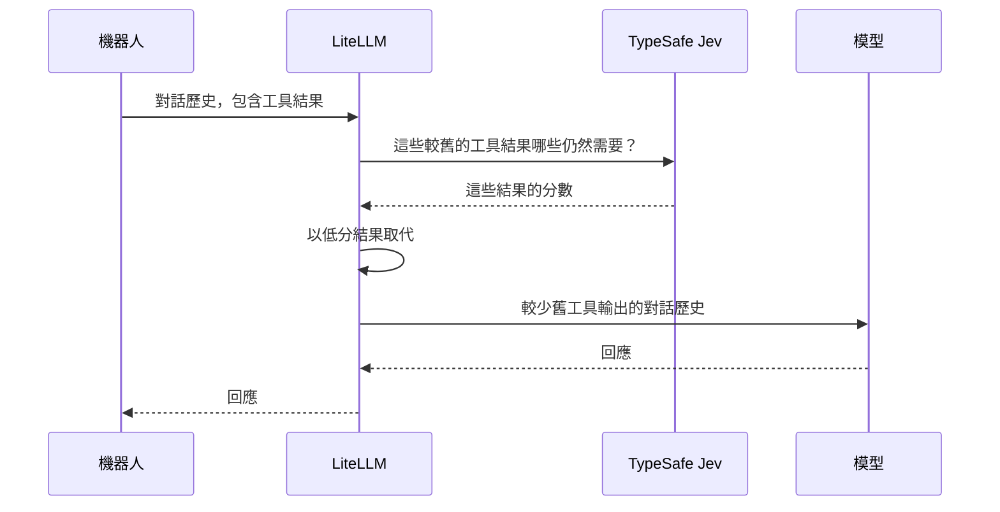

機器人先查詢天氣，接著查看商店的營業時間。使用者問：「商店幾點關門？」機器人仍然把先前的天氣報告送給模型，儘管它已經無助於回答這個問題。

TypeSafe Jev 可協助 LiteLLM 找出不再需要的工具結果。LiteLLM 會在呼叫模型之前，以簡短提示取代這些結果。這稱為壓縮，可減少長對話所使用的輸入 token。

{/* truncate */}

## Jev 的功能 {#what-jev-does}

[TypeSafe 的 Jev](https://docs.typesafe.ai/api) 會以選項、分數或是/否機率來回答問題。範例來說，它可以判斷某個客戶問題是屬於帳務還是支援。

您可以透過 LiteLLM 的 `/typesafe/v1/systemone` endpoint 直接呼叫 Jev。[TypeSafe pass-through 指南](/docs/pass_through/typesafe) 說明了請求格式、記錄與成本追蹤。

在壓縮時，LiteLLM 會向 Jev 針對每個較舊的工具結果提出一個簡單問題：**機器人回答使用者最新問題時，仍然需要這個結果嗎？**

## 壓縮的運作方式 {#how-compaction-works}



LiteLLM 會檢查每個已完成的工具交換：一次工具呼叫及其結果。預設情況下，Jev 分數低於 `0.2` 的結果會被取代為：

```text
[Tool result removed by TypeSafe compaction: judged no longer relevant to the current task]
```

保留下來的結果維持不變。LiteLLM 也會保留工具呼叫及其 ID，因此對話仍具有模型預期的結構。系統訊息與使用者訊息不會改變。最後一則助手訊息，以及其所屬的任何工具交換，都會受到保護。

此防護欄可搭配 Chat Completions、Anthropic Messages 與 Responses API 使用。Jev 會檢查較舊的工具結果；您選擇的模型則負責撰寫回應。

## 在 LiteLLM 中啟用壓縮 {#enable-compaction-in-litellm}

使用已設定模型且包含 `typesafe` 防護欄的建置版本之 LiteLLM proxy。請保留現有的驗證設定，包括您使用 OIDC 時的設定。

在 proxy 上設定您的 TypeSafe API 金鑰：

```bash
export TYPESAFE_API_KEY="your-typesafe-api-key"
```

將此防護欄加入您現有的 `config.yaml`，然後重新啟動 proxy：

```yaml title="config.yaml"
guardrails:
  - guardrail_name: jev-compaction
    litellm_params:
      guardrail: typesafe
      mode: pre_call
      api_key: os.environ/TYPESAFE_API_KEY
      optional_params:
        relevance_threshold: 0.2
```

`pre_call` 表示壓縮會在 LiteLLM 呼叫您的模型之前執行。proxy 會將系統文字、最新的使用者問題，以及選取供評估的較舊工具交換傳送給 TypeSafe。這樣的設定會讓壓縮保持關閉，直到您為某個請求或團隊啟用它。

## 示範：先天氣，再商店營業時間 {#try-it-weather-then-shop-hours}

此範例包含兩個工具結果：天氣報告與商店的營業時間。使用者只想知道商店何時關門。Jev 可以將天氣報告標記為移除。商店營業時間屬於最後一則助手交換，因此 LiteLLM 會保留它們。

將 `LITELLM_PROXY_URL` 設為您的閘道 URL，並將 `ACCESS_TOKEN` 設為 proxy 接受的 bearer token。若使用 OIDC，請使用有效的 OIDC access token。請將下方的 `my-model` 替換為您團隊可用的模型。

<details>
<summary>完整範例請求</summary>

```bash
curl -i "$LITELLM_PROXY_URL/v1/chat/completions" \
  -H "Authorization: Bearer $ACCESS_TOKEN" \
  -H "Content-Type: application/json" \
  -d '{
    "model": "my-model",
    "guardrails": ["jev-compaction"],
    "tool_choice": "none",
    "tools": [{
      "type": "function",
      "function": {
        "name": "lookup",
        "description": "Look up the weather or shop hours.",
        "parameters": {
          "type": "object",
          "properties": {"query": {"type": "string"}},
          "required": ["query"]
        }
      }
    }],
    "messages": [
      {"role": "system", "content": "Answer the latest question using the tool results. Keep it short."},
      {"role": "user", "content": "Check the weather in London, then look up the shop hours."},
      {"role": "assistant", "tool_calls": [{"id": "call_weather", "type": "function", "function": {"name": "lookup", "arguments": "{\"query\":\"London weather\"}"}}]},
      {"role": "tool", "tool_call_id": "call_weather", "content": "Today in London it is cool and cloudy. It may rain in the afternoon, so bring an umbrella. The wind is light and the temperature is 16 C. Tomorrow is expected to be warmer with clear skies. This weather report covers the next two days."},
      {"role": "assistant", "tool_calls": [{"id": "call_shop", "type": "function", "function": {"name": "lookup", "arguments": "{\"query\":\"shop hours\"}"}}]},
      {"role": "tool", "tool_call_id": "call_shop", "content": "Shop hours: Monday to Friday, open at 9 AM and close at 6 PM. On Saturday, open at 10 AM and close at 4 PM. The shop is closed on Sunday. These hours apply to the main shop on High Street. Customers can collect online orders during the same opening hours."},
      {"role": "user", "content": "Forget the weather. What time does the shop close on Monday?"}
    ]
  }'
```

</details>

兩個工具結果都長於預設的 200 字元最低值。若 Jev 將天氣結果的分數評為低於 `0.2`，LiteLLM 會以移除通知取代它。商店營業時間會保留在請求中，而模型應該會回答 **6 PM**。

Jev 也可能判定某個結果仍有用而將其保留。啟用壓縮不代表每個請求都會變得更小。

## 檢查結果 {#check-the-result}

請在 `x-litellm-applied-guardrails` 回應標頭中尋找 `jev-compaction`。若 proxy 啟用了資料庫記錄，請在 **Logs → Guardrails & Policy Compliance** 中開啟該請求。當結果被移除時，此防護欄會記錄：

| 欄位 | 內容 |
| --- | --- |
| `exchanges_evaluated` | Jev 檢查了多少個工具交換。 |
| `exchanges_dropped` | 有多少個工具交換的結果被取代。 |
| `chars_removed` | 大約移除了多少個字元。 |
| `model` | 已設定的 Jev 模型。 |

比較啟用與停用壓縮的同一請求。對於停用版本，請從請求中移除 `guardrails`，並使用未啟用壓縮的團隊。也請保持 `default_on` 停用。比較輸入 token、回應時間，以及答案是否仍然正確。計算總節省時，請將 Jev 本身的成本也納入。

## 為團隊啟用 {#turn-it-on-for-a-team}

在 LiteLLM Enterprise 中，將 `jev-compaction` 附加到某個團隊。如果您的使用者透過 OIDC 驗證，請使用其 token 對應的 LiteLLM 團隊。請參閱 [OIDC 設定指南](/docs/proxy/token_auth#tracking-end-users--internal-users--team--org) 了解該對應。

```bash
curl "$LITELLM_PROXY_URL/team/update" \
  -H "Authorization: Bearer $LITELLM_MASTER_KEY" \
  -H "Content-Type: application/json" \
  -d '{
    "team_id": "my-team-id",
    "guardrails": ["jev-compaction"]
  }'
```

請先從預設的分數門檻 `0.2` 開始。較高的門檻可以移除更多結果，因此在提高門檻前，請確認答案仍然正確。若 Jev 無法使用，LiteLLM 的預設 `fail_open` 設定會將原始請求送到模型，而不進行壓縮。

如需更多設定，請參閱 [TypeSafe 壓縮指南](/docs/proxy/guardrails/typesafe)；若要直接呼叫 Jev，請參閱 [pass-through 指南](/docs/pass_through/typesafe)。
