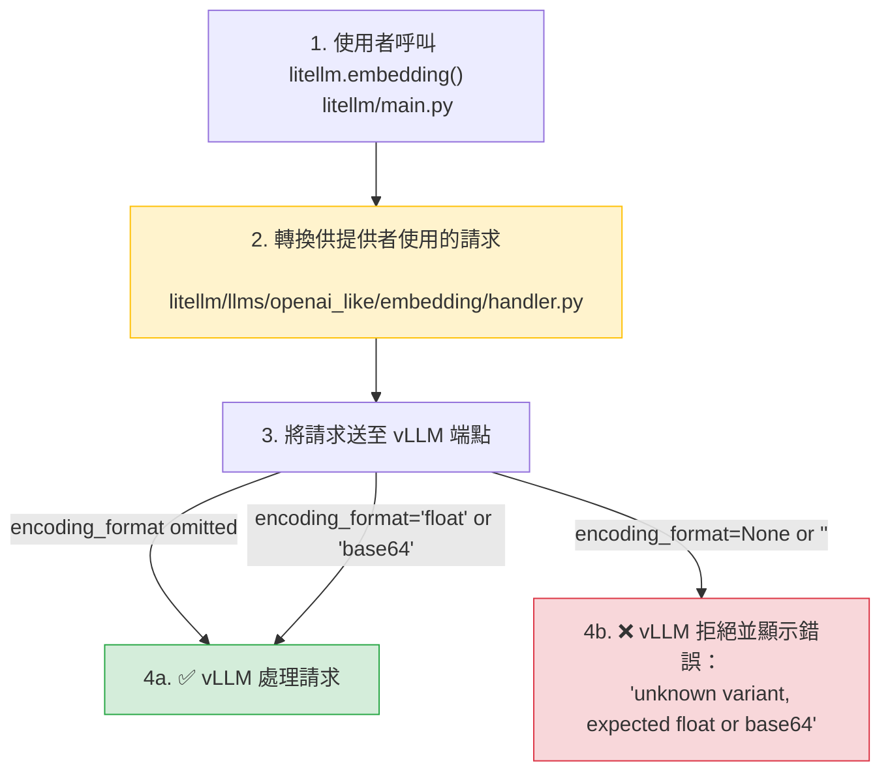

**日期：** 2026 年 2 月 16 日
**持續時間：** 約 3 小時
**嚴重性：** 高（針對 vLLM embeddings 使用者）
**狀態：** 已解決

## 摘要 {#summary}

一個原本用來修正 OpenAI SDK 行為的提交（[`dbcae4a`](https://github.com/BerriAI/litellm/commit/dbcae4aca5836770d0e9cd43abab0333c3d61ab2)）因為在 API 請求中明確傳入 `encoding_format=None`，導致 vLLM embeddings 失效。vLLM 會拒絕此項並顯示錯誤：`"unknown variant \`\`, expected float or base64"`。

- **vLLM embedding 呼叫：** 完全失敗 - 所有請求都被拒絕
- **其他提供者：** 無影響 - OpenAI 與其他提供者皆正常運作
- **其他 vLLM 功能：** 無影響 - 只有 embeddings 受影響

{/* truncate */}

---

## 背景 {#background}

embeddings 的 `encoding_format` 參數會指定向量應以 `float` 陣列或 `base64` 編碼字串回傳。不同提供者的預期不同：

- **OpenAI SDK：** 若省略 `encoding_format`，SDK 會加入預設值 `"float"`
- **vLLM：** 嚴格驗證 `encoding_format` - 只接受 `"float"`、`"base64"`，或完全省略。會拒絕 `None` 或空字串值。



---

## 根本原因 {#root-cause}

一個出於好意、用來修正 OpenAI SDK 行為的修補，無意間破壞了 vLLM embeddings：

**破壞性變更（[`dbcae4a`](https://github.com/BerriAI/litellm/commit/dbcae4aca5836770d0e9cd43abab0333c3d61ab2)）：**

在 `litellm/main.py` 中，程式碼被改為明確設定 `encoding_format=None`，而不是省略它：

```python
# Added in dbcae4a
if encoding_format is not None:
    optional_params["encoding_format"] = encoding_format
else:
    # Omitting causes openai sdk to add default value of "float"
    optional_params["encoding_format"] = None
```

這個修正對 OpenAI 運作正常——明確傳入 `None` 可防止 SDK 加入其預設值。然而，vLLM 嚴格的參數驗證會拒絕 `None` 值，導致所有 embedding 請求失敗。

---

## 修正 {#the-fix}

修正已部署（[`55348dd`](https://github.com/BerriAI/litellm/commit/55348dd9c51b5b028f676d25ad023b8f052fc071)）。此解法會在將請求送往 OpenAI 類提供者（包括 vLLM）之前，從 `optional_params` 中過濾掉 `None` 和空字串值。

**在 `litellm/llms/openai_like/embedding/handler.py` 中：**

```python
# Before (broken)
data = {"model": model, "input": input, **optional_params}

# After (fixed)
filtered_optional_params = {k: v for k, v in optional_params.items() if v not in (None, '')}
data = {"model": model, "input": input, **filtered_optional_params}
```

這可確保：
- 保留並傳送有效值（`"float"`、`"base64"`）
- 過濾掉 `None` 和空字串值（完全省略參數）
- OpenAI SDK 不再加入預設值，因為 liteLLM 已在上游處理此參數

---

## 修復措施 {#remediation}

| # | 動作 | 狀態 | 程式碼 |
|---|---|---|---|
| 1 | 在 OpenAI 類 embedding handler 中過濾 `None` 和空字串值 | ✅ 完成 | [`handler.py#L108`](https://github.com/BerriAI/litellm/blob/main/litellm/llms/openai_like/embedding/handler.py#L108) |
| 2 | 參數過濾的單元測試（None、空字串、有效值） | ✅ 完成 | [`test_openai_like_embedding.py`](https://github.com/BerriAI/litellm/blob/main/tests/test_litellm/llms/openai_like/embedding/test_openai_like_embedding.py) |
| 3 | hosted_vllm embedding 組態的轉換測試 | ✅ 完成 | [`test_hosted_vllm_embedding_transformation.py`](https://github.com/BerriAI/litellm/blob/main/tests/test_litellm/llms/hosted_vllm/embedding/test_hosted_vllm_embedding_transformation.py) |
| 4 | 使用實際 vLLM 端點的 E2E 測試 | ✅ 完成 | [`test_hosted_vllm_embedding_e2e.py`](https://github.com/BerriAI/litellm/blob/main/tests/test_litellm/llms/hosted_vllm/embedding/test_hosted_vllm_embedding_e2e.py) |
| 5 | 驗證 JSON payload 結構符合 vLLM 預期 | ✅ 完成 | 測試會驗證傳送至端點的 JSON 完全一致 |

---
