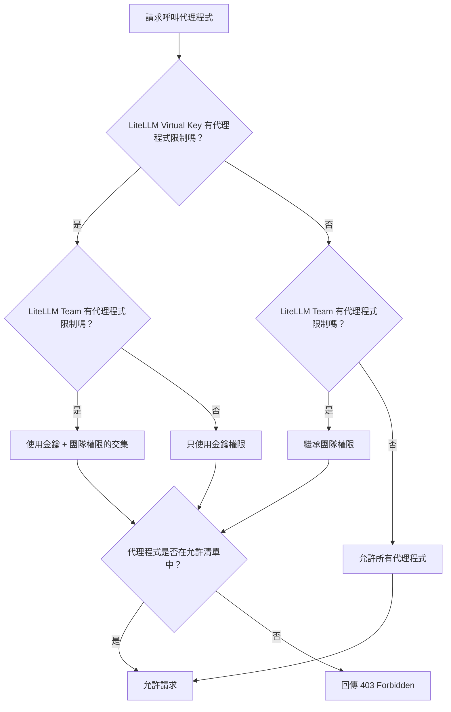

import Tabs from '@theme/Tabs';
import TabItem from '@theme/TabItem';
import Image from '@theme/IdealImage';

# 代理程式權限管理 {#agent-permission-management}

控制在 LiteLLM 中，哪些 A2A 代理程式可由特定金鑰或團隊存取。

## 概觀 {#overview}

代理程式權限管理可讓您限制 LiteLLM Virtual Key 或 Team 可存取哪些代理程式。這對以下情境很有用：

- **多租戶環境**：讓不同團隊存取不同的代理程式
- **安全性**：防止金鑰呼叫其不應有權限存取的代理程式
- **合規性**：對敏感的代理程式工作流程強制執行存取政策

設定權限後：
- `GET /v1/agents` 只會回傳金鑰／團隊可存取的代理程式
- `POST /a2a/{agent_id}`（呼叫代理程式）若遭拒絕存取，會回傳 `403 Forbidden`

## 在金鑰上設定權限 {#setting-permissions-on-a-key}

此範例示範如何建立具有代理程式權限的金鑰並測試存取。

### 1. 取得您的 Agent ID {#1-get-your-agent-id}

<Tabs>
<TabItem value="ui" label="UI">

1. 前往側邊欄的 **Agents**
2. 點進您要的代理程式
3. 複製 **Agent ID**

<Image 
  img={require('../img/agent_id.png')}
  style={{width: '80%', display: 'block', margin: '0', borderRadius: '8px'}}
/>

</TabItem>
<TabItem value="api" label="API">

```bash title="List all agents" showLineNumbers
curl "http://localhost:4000/v1/agents" \
  -H "Authorization: Bearer sk-master-key"
```

回應：
```json title="Response" showLineNumbers
{
  "agents": [
    {"agent_id": "agent-123", "name": "Support Agent"},
    {"agent_id": "agent-456", "name": "Sales Agent"}
  ]
}
```

</TabItem>
</Tabs>

### 2. 建立具有代理程式權限的金鑰 {#2-create-a-key-with-agent-permissions}

<Tabs>
<TabItem value="ui" label="UI">

1. 前往 **Keys** → **Create Key**
2. 展開 **Agent Settings**
3. 選取您要允許的代理程式

<Image 
  img={require('../img/agent_key.png')}
  style={{width: '80%', display: 'block', margin: '0', borderRadius: '8px'}}
/>

</TabItem>
<TabItem value="api" label="API">

```bash title="Create key with agent permissions" showLineNumbers
curl -X POST "http://localhost:4000/key/generate" \
  -H "Authorization: Bearer sk-master-key" \
  -H "Content-Type: application/json" \
  -d '{
    "object_permission": {
      "agents": ["agent-123"]
    }
  }'
```

</TabItem>
</Tabs>

### 3. 測試存取 {#3-test-access}

**允許的代理程式（成功）：**
```bash title="Invoke allowed agent" showLineNumbers
curl -X POST "http://localhost:4000/a2a/agent-123" \
  -H "Authorization: Bearer sk-your-new-key" \
  -H "Content-Type: application/json" \
  -d '{"message": {"role": "user", "parts": [{"type": "text", "text": "Hello"}]}}'
```

**被封鎖的代理程式（403 失敗）：**
```bash title="Invoke blocked agent" showLineNumbers
curl -X POST "http://localhost:4000/a2a/agent-456" \
  -H "Authorization: Bearer sk-your-new-key" \
  -H "Content-Type: application/json" \
  -d '{"message": {"role": "user", "parts": [{"type": "text", "text": "Hello"}]}}'
```

回應：
```json title="403 Forbidden Response" showLineNumbers
{
  "error": {
    "message": "Access denied to agent: agent-456",
    "code": 403
  }
}
```

## 在團隊上設定權限 {#setting-permissions-on-a-team}

限制屬於某個團隊的所有金鑰只能存取特定代理程式。

### 1. 建立具有代理程式權限的團隊 {#1-create-a-team-with-agent-permissions}

<Tabs>
<TabItem value="ui" label="UI">

1. 前往 **Teams** → **Create Team**
2. 展開 **Agent Settings**
3. 選取您要為此團隊允許的代理程式

<Image 
  img={require('../img/agent_key.png')}
  style={{width: '80%', display: 'block', margin: '0', borderRadius: '8px'}}
/>

</TabItem>
<TabItem value="api" label="API">

```bash title="Create team with agent permissions" showLineNumbers
curl -X POST "http://localhost:4000/team/new" \
  -H "Authorization: Bearer sk-master-key" \
  -H "Content-Type: application/json" \
  -d '{
    "team_alias": "support-team",
    "object_permission": {
      "agents": ["agent-123"]
    }
  }'
```

回應：
```json title="Response" showLineNumbers
{
  "team_id": "team-abc-123",
  "team_alias": "support-team"
}
```

</TabItem>
</Tabs>

### 2. 為團隊建立金鑰 {#2-create-a-key-for-the-team}

<Tabs>
<TabItem value="ui" label="UI">

1. 前往 **Keys** → **Create Key**
2. 從下拉選單中選取 **Team**

<Image 
  img={require('../img/agent_team.png')}
  style={{width: '80%', display: 'block', margin: '0', borderRadius: '8px'}}
/>

</TabItem>
<TabItem value="api" label="API">

```bash title="Create key for team" showLineNumbers
curl -X POST "http://localhost:4000/key/generate" \
  -H "Authorization: Bearer sk-master-key" \
  -H "Content-Type: application/json" \
  -d '{
    "team_id": "team-abc-123"
  }'
```

</TabItem>
</Tabs>

### 3. 測試存取 {#3-test-access-1}

該金鑰會繼承團隊的代理程式權限。

**允許的代理程式（成功）：**
```bash title="Invoke allowed agent" showLineNumbers
curl -X POST "http://localhost:4000/a2a/agent-123" \
  -H "Authorization: Bearer sk-team-key" \
  -H "Content-Type: application/json" \
  -d '{"message": {"role": "user", "parts": [{"type": "text", "text": "Hello"}]}}'
```

**被封鎖的代理程式（403 失敗）：**
```bash title="Invoke blocked agent" showLineNumbers
curl -X POST "http://localhost:4000/a2a/agent-456" \
  -H "Authorization: Bearer sk-team-key" \
  -H "Content-Type: application/json" \
  -d '{"message": {"role": "user", "parts": [{"type": "text", "text": "Hello"}]}}'
```

## 代理程式存取群組 {#agent-access-groups}

隨著代理程式目錄愈來愈大，將個別代理程式授予每個金鑰或團隊會變得難以管理。**代理程式存取群組**可讓您在儀表板中以邏輯標籤標記代理程式，然後將**群組**授予金鑰或團隊——只要把新代理程式加入群組，所有持有該群組的金鑰／團隊就會自動取得存取權。

### 1. 將代理程式標記為一或多個群組 {#1-tag-the-agent-with-one-or-more-groups}

在 LiteLLM 儀表板中：

1. 前往 **Agents**。
2. 建立或編輯代理程式。
3. 在 **Access Groups** 下方，輸入群組名稱（例如 `clinical-tools`）並按 Enter。

:::note
目前將代理程式標記為存取群組只能透過儀表板操作。`POST /v1/agents` body schema 不會將 `agent_access_groups` 暴露為頂層欄位；群組標籤會透過底層 DB 欄位保留，並在權限解析期間被使用。
:::

### 2. 將群組授予金鑰或團隊 {#2-grant-a-key-or-team-the-group}

```bash title="Key with access to two agent groups" showLineNumbers
curl -X POST "http://localhost:4000/key/generate" \
  -H "Authorization: Bearer sk-master-key" \
  -H "Content-Type: application/json" \
  -d '{
    "object_permission": {
      "agent_access_groups": ["clinical-tools", "research-tools"]
    }
  }'
```

該金鑰現在可存取任何標記了這兩個群組之一的代理程式——不需要逐一列出每個代理程式。團隊的 `object_permission` 中同樣也可使用 `agent_access_groups` 欄位。

當金鑰同時具有直接的 `agents` 清單與 `agent_access_groups` 時，會先計算聯集（透過任一路徑可到達的任何代理程式都被允許），然後再套用如下所述的團隊層級交集。

## 運作方式 {#how-it-works}



A2A 權限解析會在兩個層級上運作：金鑰與團隊。（MCP 的 [權限階層](./mcp_control#permission-hierarchy) 另外還延伸到終端使用者／代理程式／組織——目前代理程式權限的模型較為狹窄。）

| 金鑰權限 | 團隊權限 | 結果 | 備註 |
|-----------------|------------------|--------|-------|
| 無 | 無 | 金鑰可存取**所有**代理程式 | 未設定限制時，預設為開放存取 |
| `["agent-1", "agent-2"]` | 無 | 金鑰可存取 `agent-1` 與 `agent-2` | 金鑰使用自己的權限 |
| 無 | `["agent-1", "agent-3"]` | 金鑰可存取 `agent-1` 與 `agent-3` | 金鑰繼承團隊的權限 |
| `["agent-1", "agent-2"]` | `["agent-1", "agent-3"]` | 金鑰只能存取 `agent-1` | 兩個清單的交集（以限制最嚴格者為準） |
| `agent_access_groups: ["clinical"]` | 無 | 金鑰可存取每個標記為 `clinical` 的代理程式 | 存取群組會解析為具體的代理程式 ID |
| `agent_access_groups: ["clinical"]` | `agents: ["agent-1"]` | （每個標記為 `clinical` 的代理程式）與 `["agent-1"]` 的交集 | 支援同時混用直接授權與群組授權 |

## 檢視權限 {#viewing-permissions}

<Tabs>
<TabItem value="ui" label="UI">

1. 前往 **Keys** 或 **Teams**
2. 點進您要檢視的金鑰／團隊
3. 代理程式權限會顯示在資訊檢視中

</TabItem>
<TabItem value="api" label="API">

```bash title="Get key info" showLineNumbers
curl "http://localhost:4000/key/info?key=sk-your-key" \
  -H "Authorization: Bearer sk-master-key"
```

</TabItem>
</Tabs>
