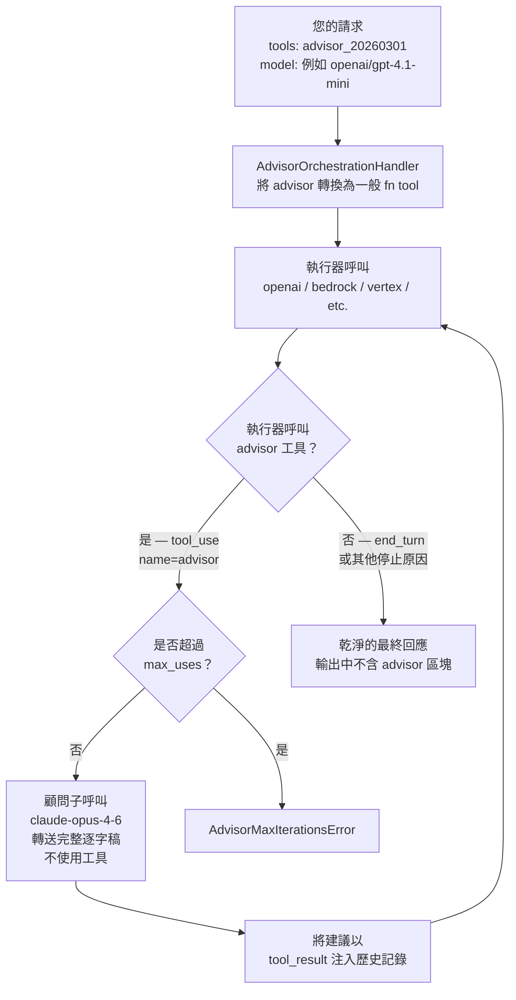

# 顧問工具 {#advisor-tool}

將較快的執行器模型與較高智慧的顧問模型搭配使用，以便在生成過程中提供策略性指引。

顧問工具可讓快速、成本較低的執行器模型（Sonnet 或 Haiku）在生成過程中向高智慧的顧問模型（Opus 4.6）請教。顧問會讀取完整對話並產生計畫或修正方向——通常為 400–700 個文字 token——然後由執行器繼續完成任務。

這種模式很適合長程的代理式工作負載（程式撰寫代理程式、電腦操作、多步驟研究），其中大多數回合是機械性的，但擁有優秀的計畫至關重要。您可以獲得接近單獨使用顧問模型的品質，而大部分 token 生成則以執行器模型的速率完成。

:::info Beta

顧問工具目前處於 beta 版。請在請求中包含 `anthropic-beta: advisor-tool-2026-03-01` —— LiteLLM 偵測到您的 `tools` 陣列中有顧問工具時，會自動加入這項設定。

:::

## 支援的提供者 {#supported-providers}

| 提供者 | Chat Completions API | Messages API | 備註 |
|----------|---------------------|--------------|-------|
| **Anthropic API** | ✅ | ✅ | 原生 — 在伺服器端執行 |
| **OpenAI / Azure OpenAI** | ✅ | ✅ | LiteLLM 協調迴圈 |
| **Amazon Bedrock** | ✅ | ✅ | LiteLLM 協調迴圈 |
| **Google Vertex AI** | ✅ | ✅ | LiteLLM 協調迴圈 |
| **Groq / Mistral / others** | ✅ | ✅ | LiteLLM 協調迴圈 |

## 運作方式（LiteLLM 原生協調） {#how-it-works-litellm-native-orchestration}

對於非 Anthropic 提供者，LiteLLM 會自行實作顧問迴圈。您呼叫的 API 完全相同——LiteLLM 會透明地處理所有事項。

當請求帶有 `advisor_20260301` 工具且使用非 Anthropic 提供者時，`AdvisorOrchestrationHandler` 會攔截該請求。它會將顧問工具轉換為提供者可理解的一般函式工具，然後執行一個協調迴圈：



**LiteLLM 會為您執行的事項：**

- 從送出的請求中移除 `advisor_20260301` —— 提供者只會看到名為 `advisor` 的標準函式工具
- 當執行器呼叫它時，會在結果送達您之前攔截，執行顧問子呼叫，並注入建議
- 在重新送出時，從訊息歷史記錄中移除任何 `advisor_tool_result` / `server_tool_use` 區塊，因此非 Anthropic 提供者永遠看不到 Anthropic 特定型別
- 如果您要求 `stream=True`，會將最終回應包裝為 SSE 串流
- 將 `max_uses` 強制為硬性上限——若超過則會引發 `AdvisorMaxIterationsError`；`max_uses=0` 會完全停用顧問

## 模型相容性 {#model-compatibility}

執行器與顧問模型必須組成有效配對。目前唯一支援的顧問模型是 `claude-opus-4-6`。

| 執行器 | 顧問 |
|----------|---------|
| `claude-haiku-4-5-20251001` | `claude-opus-4-6` |
| `claude-sonnet-4-6` | `claude-opus-4-6` |
| `claude-opus-4-6` | `claude-opus-4-6` |

---

## Chat Completions API {#chat-completions-api}

### SDK 使用方式 {#sdk-usage}

#### 基本範例 {#basic-example}

```python showLineNumbers title="Advisor Tool — litellm.completion()"
import litellm

response = litellm.completion(
    model="anthropic/claude-sonnet-4-6",
    messages=[
        {"role": "user", "content": "Build a concurrent worker pool in Go with graceful shutdown."}
    ],
    tools=[
        {
            "type": "advisor_20260301",
            "name": "advisor",
            "model": "claude-opus-4-6",
        }
    ],
    max_tokens=4096,
)

print(response.choices[0].message.content)
```

#### 使用選用參數 {#with-optional-parameters}

```python showLineNumbers title="Advisor Tool with max_uses and caching"
import litellm

response = litellm.completion(
    model="anthropic/claude-sonnet-4-6",
    messages=[
        {"role": "user", "content": "Build a REST API with authentication in Python."}
    ],
    tools=[
        {
            "type": "advisor_20260301",
            "name": "advisor",
            "model": "claude-opus-4-6",
            "max_uses": 3,                             # cap advisor calls per request
            "caching": {"type": "ephemeral", "ttl": "5m"},  # enable for 3+ calls per conversation
        }
    ],
    max_tokens=4096,
)
```

#### 串流 {#streaming}

```python showLineNumbers title="Streaming with Advisor Tool"
import litellm

response = litellm.completion(
    model="anthropic/claude-sonnet-4-6",
    messages=[
        {"role": "user", "content": "Implement a distributed rate limiter."}
    ],
    tools=[
        {
            "type": "advisor_20260301",
            "name": "advisor",
            "model": "claude-opus-4-6",
        }
    ],
    max_tokens=4096,
    stream=True,
)

for chunk in response:
    if chunk.choices[0].delta.content:
        print(chunk.choices[0].delta.content, end="")
```

:::note 串流行為

顧問子推論不會串流。執行器的串流會在顧問執行時暫停，接著完整的顧問結果會以單一事件到達。之後執行器輸出會恢復串流。

:::

#### 多輪對話 {#multi-turn-conversation}

```python showLineNumbers title="Multi-Turn with Advisor Tool"
import litellm

tools = [
    {
        "type": "advisor_20260301",
        "name": "advisor",
        "model": "claude-opus-4-6",
    }
]

messages = [
    {"role": "user", "content": "Build a concurrent worker pool in Go with graceful shutdown."}
]

response = litellm.completion(
    model="anthropic/claude-sonnet-4-6",
    messages=messages,
    tools=tools,
    max_tokens=4096,
)

# Append the full response (includes server_tool_use + advisor_tool_result blocks)
messages.append({"role": "assistant", "content": response.choices[0].message.content})

# Continue the conversation — keep the same tools array
messages.append({"role": "user", "content": "Now add a max-in-flight limit of 10."})

response2 = litellm.completion(
    model="anthropic/claude-sonnet-4-6",
    messages=messages,
    tools=tools,
    max_tokens=4096,
)
```

:::tip 後續回合自動移除

當目前請求中未包含顧問工具時，LiteLLM 會自動從訊息歷史記錄中移除 `advisor_tool_result` 區塊。這可避免原本會發生的 Anthropic 400 錯誤。

:::

### AI Gateway 使用方式 {#ai-gateway-usage}

#### 代理設定 {#proxy-configuration}

```yaml showLineNumbers title="config.yaml"
model_list:
  - model_name: claude-sonnet
    litellm_params:
      model: anthropic/claude-sonnet-4-6
      api_key: os.environ/ANTHROPIC_API_KEY
```

#### 透過代理的用戶端請求 {#client-request-via-proxy}

```python showLineNumbers title="Advisor Tool via AI Gateway"
from openai import OpenAI

client = OpenAI(
    api_key="your-litellm-proxy-key",
    base_url="http://0.0.0.0:4000/v1"
)

response = client.chat.completions.create(
    model="claude-sonnet",
    messages=[
        {"role": "user", "content": "Implement a distributed rate limiter in Python."}
    ],
    tools=[
        {
            "type": "advisor_20260301",
            "name": "advisor",
            "model": "claude-opus-4-6",
        }
    ],
    max_tokens=4096,
)
```

---

## Messages API {#messages-api}

### SDK 使用方式 {#sdk-usage-1}

#### 基本範例 {#basic-example-1}

```python showLineNumbers title="Advisor Tool — litellm.anthropic.messages"
import asyncio
import litellm

async def main():
    response = await litellm.anthropic.messages.acreate(
        model="anthropic/claude-sonnet-4-6",
        messages=[
            {"role": "user", "content": "Build a concurrent worker pool in Go with graceful shutdown."}
        ],
        tools=[
            {
                "type": "advisor_20260301",
                "name": "advisor",
                "model": "claude-opus-4-6",
            }
        ],
        max_tokens=4096,
    )
    print(response)

asyncio.run(main())
```

#### 串流 {#streaming-1}

```python showLineNumbers title="Messages API Streaming with Advisor Tool"
import asyncio
import json
import litellm

async def main():
    response = await litellm.anthropic.messages.acreate(
        model="anthropic/claude-sonnet-4-6",
        messages=[
            {"role": "user", "content": "Implement a distributed rate limiter."}
        ],
        tools=[
            {
                "type": "advisor_20260301",
                "name": "advisor",
                "model": "claude-opus-4-6",
            }
        ],
        max_tokens=4096,
        stream=True,
    )

    async for chunk in response:
        if isinstance(chunk, bytes):
            for line in chunk.decode("utf-8").split("\n"):
                if line.startswith("data: "):
                    try:
                        print(json.loads(line[6:]))
                    except json.JSONDecodeError:
                        pass

asyncio.run(main())
```

### AI Gateway 使用方式 {#ai-gateway-usage-1}

#### 代理設定 {#proxy-configuration-1}

```yaml showLineNumbers title="config.yaml"
model_list:
  - model_name: claude-sonnet
    litellm_params:
      model: anthropic/claude-sonnet-4-6
      api_key: os.environ/ANTHROPIC_API_KEY
```

#### 透過代理的用戶端請求（Anthropic SDK） {#client-request-via-proxy-anthropic-sdk}

```python showLineNumbers title="Advisor Tool via AI Gateway (Anthropic SDK)"
import anthropic

client = anthropic.Anthropic(
    api_key="your-litellm-proxy-key",
    base_url="http://0.0.0.0:4000"
)

response = client.beta.messages.create(
    model="claude-sonnet",
    max_tokens=4096,
    betas=["advisor-tool-2026-03-01"],
    messages=[
        {"role": "user", "content": "Build a concurrent worker pool in Go with graceful shutdown."}
    ],
    tools=[
        {
            "type": "advisor_20260301",
            "name": "advisor",
            "model": "claude-opus-4-6",
        }
    ],
)
print(response)
```

#### 非 Anthropic 提供者（LiteLLM 協調迴圈） {#non-anthropic-provider-litellm-orchestration-loop}

```python showLineNumbers title="Advisor Tool with OpenAI executor"
import asyncio
import litellm

async def main():
    # executor: openai/gpt-4.1-mini  |  advisor: claude-opus-4-6
    # LiteLLM runs the orchestration loop automatically
    response = await litellm.anthropic.messages.acreate(
        model="openai/gpt-4.1-mini",
        messages=[
            {"role": "user", "content": "Implement a Python LRU cache with O(1) get and put."}
        ],
        tools=[
            {
                "type": "advisor_20260301",
                "name": "advisor",
                "model": "claude-opus-4-6",
                "max_uses": 3,
            }
        ],
        max_tokens=1024,
        custom_llm_provider="openai",
    )
    # Final response is clean — no advisor tool_use blocks
    print(response["content"][0]["text"])

asyncio.run(main())
```

---

## 回應結構 {#response-structure}

成功的顧問呼叫會在 assistant 內容中回傳 `server_tool_use` 和 `advisor_tool_result` 區塊：

```json title="Response with advisor blocks"
{
  "role": "assistant",
  "content": [
    {
      "type": "text",
      "text": "Let me consult the advisor on this."
    },
    {
      "type": "server_tool_use",
      "id": "srvtoolu_abc123",
      "name": "advisor",
      "input": {}
    },
    {
      "type": "advisor_tool_result",
      "tool_use_id": "srvtoolu_abc123",
      "content": {
        "type": "advisor_result",
        "text": "Use a channel-based coordination pattern. The tricky part is draining in-flight work during shutdown: close the input channel first, then wait on a WaitGroup..."
      }
    },
    {
      "type": "text",
      "text": "Here's the implementation using a channel-based coordination pattern..."
    }
  ]
}
```

請將完整的 assistant 內容（包含顧問區塊）在後續回合中回傳。LiteLLM 會透過 `provider_specific_fields` 自動處理。

---

## 成本控制 {#cost-control}

顧問呼叫會以獨立的子推論執行，並按顧問模型的費率計費。用量會在 `usage.iterations[]` 中回報：

```json title="Usage with advisor sub-inference"
{
  "usage": {
    "input_tokens": 412,
    "output_tokens": 531,
    "iterations": [
      {
        "type": "message",
        "input_tokens": 412,
        "output_tokens": 89
      },
      {
        "type": "advisor_message",
        "model": "claude-opus-4-6",
        "input_tokens": 823,
        "output_tokens": 1612
      },
      {
        "type": "message",
        "input_tokens": 1348,
        "output_tokens": 442
      }
    ]
  }
}
```

最上層的 `usage` 只反映執行器 token。顧問 token 會出現在 `iterations` 項目中，並帶有 `type: "advisor_message"`，且按 Opus 費率計費。

**提示：**
- 僅在您預期每次對話會有 3 次以上顧問呼叫時，才在工具定義上啟用 `caching`；低於該門檻時，這項功能的成本高於節省。
- 使用 `max_uses` 來限制每次請求的顧問呼叫次數。一旦達到上限，執行器會在沒有進一步建議的情況下繼續。
- 若要設定對話層級的上限，請在用戶端計算顧問呼叫次數。當達到限制時，請從 `tools` 中移除顧問工具。

---

## 建議的系統提示詞 {#recommended-system-prompt}

對於程式撰寫與代理任務，Anthropic 建議在系統提示詞前加入以下區塊，以確保顧問時機一致並達到最佳成本／品質：

```text title="Timing guidance (prepend to system prompt)"
You have access to an `advisor` tool backed by a stronger reviewer model. It takes NO parameters — when you call advisor(), your entire conversation history is automatically forwarded. They see the task, every tool call you've made, every result you've seen.

Call advisor BEFORE substantive work — before writing, before committing to an interpretation, before building on an assumption. If the task requires orientation first (finding files, fetching a source, seeing what's there), do that, then call advisor. Orientation is not substantive work. Writing, editing, and declaring an answer are.

Also call advisor:
- When you believe the task is complete. BEFORE this call, make your deliverable durable: write the file, save the result, commit the change.
- When stuck — errors recurring, approach not converging, results that don't fit.
- When considering a change of approach.

On tasks longer than a few steps, call advisor at least once before committing to an approach and once before declaring done. On short reactive tasks where the next action is dictated by tool output you just read, you don't need to keep calling.
```

```text title="Advice weight guidance (add after timing block)"
Give the advice serious weight. If you follow a step and it fails empirically, or you have primary-source evidence that contradicts a specific claim, adapt. A passing self-test is not evidence the advice is wrong.

If you've already retrieved data pointing one way and the advisor points another: don't silently switch. Surface the conflict in one more advisor call — "I found X, you suggest Y, which constraint breaks the tie?"
```

若要在不降低品質的前提下將顧問輸出長度減少 35–45%，請加入：

```text title="Cost reduction (optional, add before timing block)"
The advisor should respond in under 100 words and use enumerated steps, not explanations.
```

---

## 其他資源 {#additional-resources}

- [Anthropic Advisor Tool Documentation](https://platform.claude.com/docs/en/agents-and-tools/tool-use/advisor-tool)
- [LiteLLM Tool Calling Guide](https://docs.litellm.ai/docs/completion/function_call)
