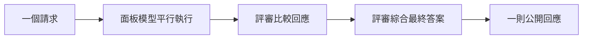

import Tabs from '@theme/Tabs';
import TabItem from '@theme/TabItem';

# Fusion 模型 {#fusion-model}

:::caution 尚未發布

Fusion 尚未出現在任何已發布的 litellm 版本或 litellm `main` 中。它目前位於 `litellm_fusion_router` 分支，並會在 [litellm PR #39224](https://github.com/BerriAI/litellm/pull/39224) 合併後發布。在此之前，本頁上的範例都會因 `BadRequestError: LLM Provider NOT provided ... You passed model=litellm/fusion-1` 而失敗。

:::

`litellm/fusion-1` 是 LiteLLM 提供的虛擬模型，適用於受益於獨立模型觀點的請求。它會將請求平行送往可設定的面板，要求評審比較成功的回應，接著由評審綜合成一則公開回應。

請求與回應會保留您所呼叫的 SDK 方法的原生形狀。Fusion 可與 Chat Completions、Anthropic Messages 和 Responses 搭配使用。



評審會先產生結構化比較，涵蓋共識、矛盾、涵蓋缺口、獨特洞見與盲點。LiteLLM 會將該私密分析回傳給評審，由其撰寫最終答案。公開 `response.model` 會識別產生它的具體評審模型。

## 快速開始 {#quick-start}

為面板與評審所使用的每個提供者設定憑證。同一份 `fusion` 設定可跨三種 SDK 介面使用。

<Tabs>
<TabItem value="chat" label="Chat Completions" default>

```python showLineNumbers
import litellm

fusion = {
    "models": [
        "openai/gpt-4o-mini",
        "anthropic/claude-haiku-4-5",
    ],
    "judge": {
        "model": "openai/gpt-4o-mini",
        "criteria": "Prioritize correctness and verifiable evidence.",
    },
}

response = litellm.completion(
    model="litellm/fusion-1",
    messages=[
        {
            "role": "user",
            "content": "Review this database migration plan for operational risks.",
        }
    ],
    fusion=fusion,
)

print(response.model)
print(response.choices[0].message.content)
```

</TabItem>
<TabItem value="messages" label="Anthropic Messages">

```python showLineNumbers
import litellm

fusion = {
    "models": [
        "openai/gpt-4o-mini",
        "anthropic/claude-haiku-4-5",
    ],
    "judge": {
        "model": "openai/gpt-4o-mini",
        "criteria": "Prioritize correctness and verifiable evidence.",
    },
}

response = litellm.anthropic.messages.create(
    model="litellm/fusion-1",
    max_tokens=2048,
    messages=[
        {
            "role": "user",
            "content": "Review this database migration plan for operational risks.",
        }
    ],
    fusion=fusion,
)

print(response["model"])
print(response["content"][0]["text"])
```

</TabItem>
<TabItem value="responses" label="Responses">

```python showLineNumbers
import litellm

fusion = {
    "models": [
        "openai/gpt-4o-mini",
        "anthropic/claude-haiku-4-5",
    ],
    "judge": {
        "model": "openai/gpt-4o-mini",
        "criteria": "Prioritize correctness and verifiable evidence.",
    },
}

response = litellm.responses(
    model="litellm/fusion-1",
    input="Review this database migration plan for operational risks.",
    fusion=fusion,
)

print(response.model)
print(response.output_text)
```

</TabItem>
</Tabs>

呼叫 `litellm/fusion-1` 一律會執行 deliberation。沒有獨立的旗標可啟用它。您可以省略 `fusion` 以使用預設面板與評審。

## 回應行為 {#response-behavior}

Fusion 會以您呼叫的 SDK 方法格式回傳一則一般回應。它不會回傳獨立的面板回應或私密的評審比較。回應中隱藏的 Fusion 中繼資料會回報是否執行 deliberation，以及有多少面板呼叫成功或失敗，而不包含其內容。其隱藏的 `router` 欄位會識別 `litellm/fusion-1`。

## 設定 {#configuration}

與 `model="litellm/fusion-1"` 一起傳入一個 `fusion` 字典。每個欄位皆為選用。

| 欄位 | 預設值 | 說明 |
|---|---|---|
| `models` | LiteLLM 預設面板 | 一到八個會在平行中獨立作答的模型。 |
| `judge.model` | LiteLLM 預設評審 | 比較成功的面板回應並撰寫最終答案的模型。 |
| `judge.criteria` | `None` | 用於比較面板回應的指示。 |
| `max_completion_tokens` | `16000` | 每次內部呼叫的最大輸出 token，包含推理。 |
| `reasoning` | 提供者預設值 | 傳遞給面板與評審呼叫的 reasoning effort。 |
| `temperature` | 提供者預設值 | 傳遞給面板呼叫的 temperature。評審使用 temperature `0`。 |

## 工具與串流 {#tools-and-streaming}

標準工具仍可在公開請求上使用。用戶端工具 schema 會對面板與比較呼叫保密。評審在撰寫最終回應時會接收它們。

串流使用非同步 SDK 方法：`litellm.acompletion()`、`litellm.anthropic.messages.acreate()` 或 `litellm.aresponses()`。同步串流會被拒絕，並提供對應非同步方法的指引。

## 成本與遞迴 {#cost-and-recursion}

Fusion 會為一則公開請求進行多次提供者呼叫。成本與延遲會隨面板大小與所設定的模型而增加。面板與評審模型不能遞迴呼叫 `litellm/fusion-1`；deliberation 會限制在單一層級。
