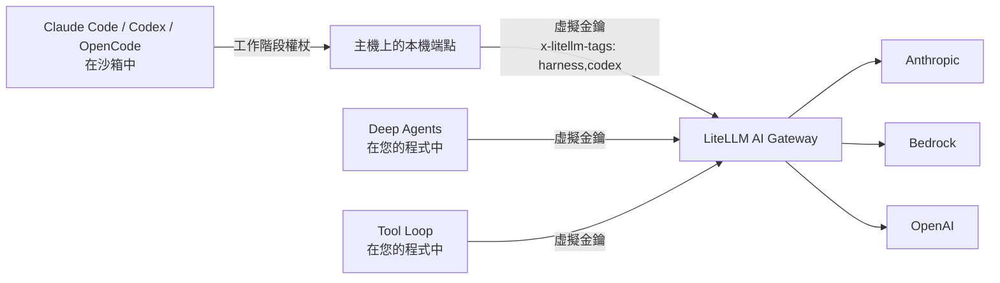

# 使用 LiteLLM AI Gateway {#using-with-litellm-ai-gateway}

建議以 `litellm.agent()` 搭配 [LiteLLM AI Gateway](/docs/proxy/docker_quick_start) 來執行代理程式。Claude Code、Codex、OpenCode、Deep Agents 與 Tool Loop 使用不同的模型 API 以及傳遞憑證的方式。透過 gateway，它們共用一把虛擬金鑰、相同的模型群組與備援，而且每次請求都會進入 gateway 的支出記錄，並標記發出請求的 harness

CLI 執行環境只會看到主機上本機端點的每個工作階段權杖，而該端點在轉送至 gateway 時會加入您的虛擬金鑰。Deep Agents 與 Tool Loop 會在您的 Python 程式中，使用虛擬金鑰呼叫 gateway。提供者金鑰保留在 gateway 上，絕不會到達您的機器

## 請求如何流動 {#how-requests-flow}



每個轉送的請求都會帶有 `x-litellm-tags: harness,<name>`（請參閱 [request tags](/docs/proxy/request_tags)），其中 `<name>` 是 `claude_code`、`codex`、`opencode`、`deepagents` 或 `tool_loop`，而您的 `metadata=` 會以 `x-litellm-spend-logs-metadata` 傳送。每個請求中的 `model` 會被重寫為您傳入的模型群組，因此執行環境自己的預設模型名稱永遠不會送到 gateway

## 1. 設定 gateway {#1-configure-the-gateway}

為每一種 harness 指派適合的模型群組。Claude Code 最適合 Claude，Codex 最適合 OpenAI 推理模型，而 OpenCode、Deep Agents 與 Tool Loop 可搭配任何支援其 API 的群組

```yaml title="config.yaml"
model_list:
  # Claude, load-balanced across Anthropic and Bedrock
  - model_name: claude
    litellm_params:
      model: anthropic/claude-sonnet-4-5
      api_key: os.environ/ANTHROPIC_API_KEY
  - model_name: claude
    litellm_params:
      model: bedrock/us.anthropic.claude-sonnet-4-5-20250929-v1:0
      aws_region_name: us-west-2
  - model_name: claude-haiku
    litellm_params:
      model: anthropic/claude-haiku-4-5
      api_key: os.environ/ANTHROPIC_API_KEY
  # OpenAI reasoning model with native Responses API support
  - model_name: gpt
    litellm_params:
      model: openai/gpt-5
      api_key: os.environ/OPENAI_API_KEY
  # a cheaper general model for OpenCode, Deep Agents and Tool Loop
  - model_name: gemini
    litellm_params:
      model: gemini/gemini-2.5-pro
      api_key: os.environ/GEMINI_API_KEY

router_settings:
  fallbacks: [{"claude": ["gpt"]}, {"gpt": ["claude"]}]

general_settings:
  master_key: os.environ/LITELLM_MASTER_KEY
  database_url: os.environ/DATABASE_URL
```

```bash
litellm --config config.yaml --port 4000
```

gateway 會在 `/v1/messages`、`/v1/responses` 和 `/v1/chat/completions` 上公開每個群組，且當某個 harness 呼叫來自其他提供者的群組時，會在格式之間進行轉換。虛擬金鑰與支出記錄需要資料庫。

## 2. 建立虛擬金鑰 {#2-create-a-virtual-key}

```bash
curl -X POST http://localhost:4000/key/generate \
  -H "Authorization: Bearer $LITELLM_MASTER_KEY" \
  -H "Content-Type: application/json" \
  -d '{"models": ["claude", "claude-haiku", "gpt", "gemini"], "key_alias": "agents", "max_budget": 50}'
```

回應中會包含一個以 `sk-` 開頭的 `key`。該金鑰只能呼叫 `models` 中的群組，並且在花費達到 `max_budget` 美元後就會停止運作。請參閱 [虛擬金鑰](/docs/proxy/virtual_keys) 以了解速率限制與團隊金鑰。

## 3. 將 litellm.agent() 指向它 {#3-point-litellmagent-at-it}

gateway 呼叫遵循與 `litellm.completion` 相同的慣例：在模型群組前加上 `litellm_proxy/`，並設定 gateway 的位址與金鑰。

```bash
export LITELLM_PROXY_API_BASE=http://localhost:4000
export LITELLM_PROXY_API_KEY=sk-...
```

```python
import litellm
from litellm import Harness, sandbox

result = litellm.agent(
    Harness.CLAUDE_CODE,
    "Find why tests/test_router.py is flaky and fix it.",
    sandbox=sandbox.local("./repo"),
    model="litellm_proxy/claude",
)
```

您可以在呼叫時傳入 `api_base=` 與 `api_key=`，而不必使用環境變數。`api_base` 是 gateway 根位址，不含 `/v1`。設定 `litellm.use_litellm_proxy = True` 會讓每次呼叫都經由 gateway，即使沒有前綴也一樣。沒有前綴的模型否則會直接透過 LiteLLM SDK 呼叫（請參閱 [Without a gateway](#without-a-gateway)）。

## 4. 選擇一個 harness {#4-choosing-a-harness}

五種 harness 都使用相同的呼叫，但它們擅長不同工作，並使用適合各自執行環境的 gateway 路由

| Harness | Gateway 路由 | 最適合的模型群組 | 適用情境 |
|---|---|---|---|
| Claude Code | `/v1/messages` | Claude（Anthropic、Bedrock 或 Vertex） | 真實儲存庫中長篇、多檔案變更 |
| Codex | `/v1/responses` | OpenAI 推理模型 | 困難、規格明確且值得投入推理深度的任務 |
| OpenCode | `/v1/chat/completions` | 任何 | 在非 Claude 或自架模型上執行 coding agent |
| Deep Agents | 透過 `litellm_proxy/` 的 `/v1/chat/completions` | 任何 | 會呼叫您自己的 Python 函式的代理程式 |
| Tool Loop | 透過 `litellm_proxy/` 的 `/v1/chat/completions` | 任何支援工具呼叫的模型 | 圍繞您自己的 Python 函式的極簡迴圈 |

### Claude Code {#claude-code}

Claude Code 是 CLI harness 中最強大的通用 coding agent。它會先規劃、廣泛閱讀再編輯、執行測試，並從自己的錯誤中恢復，因此成為重構、除錯與跨多個檔案變更的預設選擇。它也是每個任務成本最高的

其提示詞是為 Claude 撰寫的，因此請將它指向 Claude 群組。Bedrock 與 Vertex Claude 的行為與 Anthropic 直接呼叫相同；其他模型則透過 gateway 轉換運作，但會降低品質。請在您的筆電上使用 `permissions="edit"`，或在 `sandbox.docker` 中使用 `"full"`，當它需要安裝套件並執行測試套件時。

```python
litellm.agent(
    Harness.CLAUDE_CODE,
    "Fix the flaky test in tests/test_router.py without editing the test.",
    sandbox=sandbox.local("./repo"),
    model="litellm_proxy/claude",
    permissions="edit",
)
```

### Codex {#codex}

Codex 在自成一體、規格明確的問題上最強：推理模型可以先深思再行動，例如遷移、棘手的演算法、讓失敗的測試套件通過。它在開放式探索上較弱，而且無法關閉個別內建工具。

它使用 Responses API，因此最合適的是像 `gpt` 這樣的 OpenAI 群組。其他提供者也可以運作，因為 gateway 會將 Responses 轉換為其原生格式，雖然 Codex 專屬功能（例如推理摘要）可能無法保留。Codex 只支援 `"read-only"` 與 `"full"`，因此請在 `sandbox.docker` 中執行變更。

```python
litellm.agent(
    Harness.CODEX,
    "Upgrade pydantic to v2 and make the test suite pass.",
    sandbox=sandbox.docker("my-agents:latest", mounts={"./repo": "/workspace"}),
    model="litellm_proxy/gpt",
    options=CodexOptions(reasoning_effort="high"),
)
```

### OpenCode {#opencode}

OpenCode 是一個強大的 coding agent，可與任何模型搭配。當您想在 Gemini、Qwen、DeepSeek、fine-tune 或自架 vLLM 群組上使用代理程式迴圈時，它是正確的選擇。它在長時間任務上的工具使用不如 Claude Code 精緻。

它使用純粹的 Chat Completions，因此任何群組都能在不轉換的情況下運作。`"edit"` 是不錯的預設值，而 OpenCode 透過自己的權限設定強制執行它。

```python
litellm.agent(
    Harness.OPENCODE,
    "Add a /health endpoint with a test.",
    sandbox=sandbox.local("./api"),
    model="litellm_proxy/gemini",
    permissions="edit",
)
```

### Deep Agents {#deep-agents}

Deep Agents 與 Tool Loop 都在您的程式中執行、呼叫您的 Python 函式，並支援 `s.history()`。Deep Agents 也內建檔案與 shell 工具，當任務結合您的內部 API 與沙箱存取時很有用。它在純 coding 上不如 CLI 代理程式精緻

它會以 `litellm_proxy/<group>` 直接呼叫 gateway，且永遠不使用本機端點，並可與任何支援工具呼叫的群組搭配。其檔案與 shell 工具作用於沙箱；除非它需要 shell，否則請使用 `"edit"`。

```python
litellm.agent(
    Harness.DEEPAGENTS,
    "File a ticket with the right owner for each flaky test.",
    sandbox=sandbox.local("./repo"),
    model="litellm_proxy/claude",
    tools=[lookup_owner, open_ticket],
    permissions="edit",
)
```

### Tool Loop {#tool-loop}

Tool Loop 是圍繞 `litellm.acompletion()` 的極簡進程內迴圈。當您的任務可以由您自己的 Python 函式處理，且不需要內建檔案或 shell 工具時，請使用它

```python
litellm.agent(
    Harness.TOOL_LOOP,
    "Search the repository and summarize the relevant changes.",
    sandbox=sandbox.local("./repo"),
    model="litellm_proxy/coder",
    tools=[search_code, read_file],
)
```

gateway 會看到標記為 `harness,tool_loop` 的 Chat Completions 請求。請參閱 [Tool Loop](./tool_loop.md) 以了解其 SDK、選項與權限行為

## 5. 比較 harness {#5-comparing-harnesses}

每個 harness 的請求都帶有自己的標記，因此如果您在同一類任務上嘗試多於一個，gateway 已經擁有可比較各 harness 支出、請求數量與失敗率的數據。請傳入共用的 `metadata={"experiment": "..."}` 以將這些執行分組。

## 6. 依 harness 查看支出 {#6-see-spend-by-harness}

在 gateway 儀表板中，開啟 **Usage** 並切換到標籤檢視。每個 harness 都會以自己的標籤顯示（`claude_code`、`codex`、`opencode`、`deepagents`、`tool_loop`），旁邊則是共用的 `harness` 標籤。相同的資料也可透過 API 取得

```bash
# daily spend and tokens for each harness tag
curl "http://localhost:4000/tag/daily/activity?tags=claude_code,codex,opencode,deepagents,tool_loop&start_date=2026-09-01&end_date=2026-09-30" \
  -H "Authorization: Bearer $LITELLM_MASTER_KEY"

# individual requests made with the agents key
curl "http://localhost:4000/spend/logs?api_key=sk-...&start_date=2026-09-30&end_date=2026-10-01&summarize=false" \
  -H "Authorization: Bearer $LITELLM_MASTER_KEY"
```

每一列支出記錄都將 `request_tags` 設為 `["harness", "codex"]`（或相對應的 harness），並在 `metadata.spend_logs_metadata` 下方記錄您的 `metadata=`，因此您可以依您傳入的執行 ID 或使用者 ID 進行篩選。`result.cost` 來自 gateway 的 `x-litellm-response-cost` 標頭，因此它會與 gateway 記錄的內容一致。

## 沒有 gateway 的情況 {#without-a-gateway}

沒有 `litellm_proxy/` 前綴時，模型會直接透過 LiteLLM SDK 呼叫。請在主機上設定一般的提供者變數，並傳入完整的 LiteLLM 模型字串。

```python
result = litellm.agent(
    Harness.CODEX,
    "Add type hints to utils.py",
    sandbox=sandbox.local("./repo"),
    model="anthropic/claude-sonnet-4-5",  # reads ANTHROPIC_API_KEY on the host
)
```

CLI harness 仍會使用每個工作階段的端點，以將提供者金鑰保留在主機上。in-process harness 會從您的 Python 程式呼叫 LiteLLM SDK。成本會根據 LiteLLM 的模型成本對照表在本機計算。您將失去集中式支出記錄、共享金鑰，以及閘道端的備援。詳情請參閱 [模型與路由](./models.md#sdk-mode)
