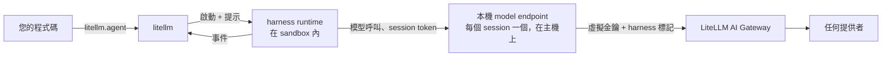

# Agents (`litellm.agent`) {#agents-litellmagent}

:::info Beta
`litellm.agent()` 處於 beta 階段。API 可能會在不同版本之間變更。
:::

使用 `litellm.agent()` 執行代理程式，透過單一 API 從 Python 驅動 Claude Code、Codex、OpenCode、Deep Agents 或 Tool Loop。將模型請求經由 LiteLLM AI Gateway 路由，讓這五種 harness 都能共用一把虛擬金鑰、一組模型群組與備援，以及一個查看支出的位置

```python title="fix_flaky.py"
import litellm
from litellm import Harness, sandbox

# LITELLM_PROXY_API_BASE and LITELLM_PROXY_API_KEY point at your gateway
result = litellm.agent(
    Harness.CLAUDE_CODE,
    "Find why tests/test_router.py is flaky and fix it.",
    sandbox=sandbox.local("./repo"),
    model="litellm_proxy/claude",  # a model group on the gateway
)

print(result.text)
print(result.cost)         # 0.4137
for f in result.files:
    print(f.kind, f.path)  # modified tests/test_router.py
```

`litellm_proxy/` 前綴的運作方式與 `litellm.completion` 相同：請求會連到 `LITELLM_PROXY_API_BASE` 的 gateway，並在 `LITELLM_PROXY_API_KEY` 中使用虛擬金鑰，或連到您傳入的 `api_base=` 和 `api_key=`。若要在 Codex 上執行相同工作，將 `Harness.CLAUDE_CODE` 改為 `Harness.CODEX`。串流是 `litellm.agent(..., stream=True)`，非同步是 `await litellm.aagent(...)`，而多輪作業使用 `litellm.agent_session()`。

請參閱 [與 LiteLLM AI Gateway 搭配使用](./gateway.md) 了解 proxy 設定、虛擬金鑰、該選哪個 harness，以及各 harness 的支出。沒有前綴時，模型會直接透過 LiteLLM SDK 呼叫；請參閱 [模型與路由](./models.md#sdk-mode)。

## 支援的 harness {#supported-harnesses}

| Harness | Runtime | 執行位置 |
|---|---|---|
| [`Harness.CLAUDE_CODE`](./claude_code.md) | Anthropic 的 Claude Code CLI | 您的 sandbox |
| [`Harness.CODEX`](./codex.md) | OpenAI 的 Codex CLI | 您的 sandbox |
| [`Harness.OPENCODE`](./opencode.md) | OpenCode CLI | 您的 sandbox |
| [`Harness.DEEPAGENTS`](./deepagents.md) | LangChain Deep Agents | 您的 Python 程序，工具會在您的 sandbox 上執行 |
| [`Harness.TOOL_LOOP`](./tool_loop.md) | LiteLLM tool-calling loop | 您的 Python 程序，呼叫您的工具 |

[支援的 harness](./supported.md) 提供完整功能表。

## 什麼是 harness {#what-a-harness-is}

harness 會提供一種明確的方式來執行代理程式回合，且各 harness 的功能有所不同。`litellm.agent()` 會啟動 runtime、傳送提示，並將其行為轉換成有型別的 Python 事件。Tool Loop 會為您的 Python 函式處理模型工具呼叫，而不會新增內建的檔案或 shell 工具

使用 `litellm.completion` 時，您只會得到一次模型呼叫，並自行撰寫迴圈。使用 harness 時，您會得到一個由他人維護的完整迴圈。當您需要在 repo 或 container 上運作的程式碼代理程式時，請使用 harness；當您需要對每次模型呼叫進行精確控制時，請使用 `completion`。

## 運作方式 {#how-it-works}



對於每個 session，`litellm.agent()` 會在主機上啟動一個小型 model endpoint，並使用 runtime 自己的 base URL 設定將 runtime 指向它，例如 Claude Code 的 `ANTHROPIC_BASE_URL`。runtime 會取得一個只對該 session 有效的隨機 token。該 endpoint 會使用您的虛擬金鑰，將每個 request 轉送到 gateway，並以 `harness,<name>` 為其加上標記。您的虛擬金鑰與任何 provider key 都不會進入 sandbox。

Deep Agents 和 Tool Loop 在您的程序內執行，不需要本機 endpoint。Deep Agents 使用 `ChatLiteLLM` model，而 Tool Loop 會呼叫 `litellm.acompletion()`

## 核心概念 {#core-concepts}

`Harness` 是受支援 runtime 的 enum。它是一般的 `Enum`，傳入像 `"codex"` 這樣的字串會引發 `TypeError`，並附帶指向 `Harness.CODEX` 的提示。

每次呼叫都需要 `Sandbox`。CLI harness 會在那裡執行，但用於 in-process harness 的 Python 工具會在您的程序中執行，且不會自動受 sandbox 限制。在此版本中，CLI runtime binary 必須已經安裝在 sandbox 中

`Session` 是包含其 sandbox、工作目錄與歷史記錄的即時 runtime。`litellm.agent()` 會為單一回合開啟一個，並在之後關閉它。`litellm.agent_session()` 會在多個回合之間保持開啟。

`Event` 是八個 frozen dataclass 之一：`Text`、`Reasoning`、`ToolCall`、`ToolResult`、`FileChange`、`Compaction`、`Approval` 和 `Done`。這個集合是封閉的，因此對其使用 `match` statement 可以做到 exhaustive。

## 安裝 {#install}

`litellm.agent()` 隨正常的 `litellm` 套件提供，且不會為其新增任何相依套件。您只需安裝所使用的 harness 所需要的項目；[快速入門](./quickstart.md#1-install) 中有該表格。
