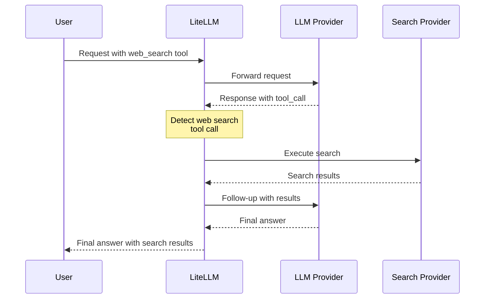

# 網頁搜尋整合 {#web-search-integration}

為任何 LLM 提供者啟用透明的伺服器端網頁搜尋執行。LiteLLM 會自動攔截網頁搜尋工具請求，並使用您設定的搜尋提供者（Parallel、Perplexity、Tavily 等）來執行。

## 快速開始 {#quick-start}

### 1. 設定網路搜尋攔截 {#1-configure-web-search-interception}

加入到您的 `config.yaml`：

```yaml
model_list:
  - model_name: {{openai_large}}
    litellm_params:
      model: openai/{{openai_large}}
      api_key: os.environ/OPENAI_API_KEY

litellm_settings:
  callbacks: ["websearch_interception"]
  websearch_interception_params:
    enabled_providers:
      - openai
      - minimax
      - anthropic
    search_tool_name: perplexity-search  # Optional

search_tools:
  - search_tool_name: perplexity-search
    litellm_params:
      search_provider: perplexity
      api_key: os.environ/PERPLEXITY_API_KEY
```

### 2. 搭配任何提供者使用 {#2-use-with-any-provider}

```python
import litellm

response = await litellm.acompletion(
    model="{{openai_large}}",
    messages=[
        {"role": "user", "content": "What's the weather in San Francisco today?"}
    ],
    tools=[
        {
            "type": "function",
            "function": {
                "name": "litellm_web_search",
                "description": "Search the web for information",
                "parameters": {
                    "type": "object",
                    "properties": {
                        "query": {"type": "string", "description": "Search query"}
                    },
                    "required": ["query"]
                }
            }
        }
    ]
)

# Response includes search results automatically!
print(response.choices[0].message.content)
```

## 運作方式 {#how-it-works}

當模型發出網路搜尋工具呼叫時，LiteLLM 會：

1. **偵測**回應中的 `litellm_web_search` 工具呼叫
2. **使用**您設定的搜尋提供者執行搜尋
3. **發出後續請求**並帶上搜尋結果
4. **將**最終答案回傳給使用者


```mermaid
sequenceDiagram
    participant User
    participant LiteLLM
    participant LLM as LLM Provider
    participant Search as Search Provider

    User->>LiteLLM: Request with web_search tool
    LiteLLM->>LLM: Forward request
    LLM-->>LiteLLM: Response with tool_call
    Note over LiteLLM: Detect web search<br/>tool call
    LiteLLM->>Search: Execute search
    Search-->>LiteLLM: Search results
    LiteLLM->>LLM: Follow-up with results
    LLM-->>LiteLLM: Final answer
    LiteLLM-->>User: Final answer with search results
```

**結果**：使用者一次 API 呼叫 → 含搜尋結果的完整答案

## 模型所見的搜尋工具 {#the-search-tool-the-model-sees}

不論請求攜帶哪種網頁搜尋工具，LiteLLM 都會在模型看到之前，將其替換為自己的 `litellm_web_search` 定義。Anthropic 的 `web_search_20250305`、Responses API 的 `web_search_preview`、Claude Code 的 `web_search`，以及您自行定義、只帶有一個 `litellm_web_search` 參數的 `query` function tool，送到模型時都會以如下 schema 呈現，並採用您所呼叫 API 的工具格式（Anthropic `input_schema`、Chat Completions `function.parameters`，或扁平化的 Responses function tool）。

```json title="litellm_web_search input schema"
{
  "type": "object",
  "properties": {
    "query": {
      "type": "string",
      "description": "The search query to execute"
    },
    "objective": {
      "type": "string",
      "description": "Natural-language description of the goal behind the search, including any source or freshness requirements."
    },
    "search_queries": {
      "type": "array",
      "items": {"type": "string"},
      "description": "Two to five short keyword queries (3-6 words each) covering different angles of the objective, e.g. varying names, synonyms, or phrasings. Provide together with objective for the best results."
    }
  },
  "required": ["query"]
}
```

`query` 是必要的，也是多數搜尋提供者接收的內容。`objective` 和 `search_queries` 是選用欄位：它們讓模型能說明其搜尋內容，並在一次工具呼叫中展開多個關鍵字搜尋。LiteLLM 只會將它們轉送給原生接受這種 API 形狀的搜尋提供者；目前這表示 [Parallel AI](../search/parallel_ai.md)。在那裡，`search_queries` 清單會成為提供者的查詢，而 `objective` 會一併帶上，除非搜尋工具的 `litellm_params` 已經設定了 `objective`，則會保留工具設定而覆蓋模型設定。其他所有搜尋提供者（Perplexity、Tavily、Exa 以及其他）仍只接收單一的 `query` 字串，而只填入 `query` 的模型在所有提供者上的行為都與先前完全相同。

在轉送前，會先驗證選用欄位：空白的 `objective` 會被忽略，`search_queries` 必須是陣列（裸字串不會被拆成字元，而是被忽略），不是非空字串的項目會被移除，並且只保留前五個查詢，以符合 Parallel 自身的上限。

在設定了 Parallel AI 搜尋工具時，模型發出的工具呼叫與 LiteLLM 依此建立的請求如下所示。傳出的 body 就是 `--detailed_debug` 列印為傳送至 `https://api.parallel.ai/v1/search` 的請求內容。

```json title="Tool call emitted by the model"
{
  "name": "litellm_web_search",
  "input": {
    "query": "latest stable Node.js release",
    "objective": "Find the most current stable Node.js release version and what changes were included in that release",
    "search_queries": ["latest stable Node.js release", "Node.js newest version changelog", "current Node.js LTS release"]
  }
}
```

```json title="Request LiteLLM sends to Parallel AI"
{
  "objective": "Find the most current stable Node.js release version and what changes were included in that release",
  "search_queries": ["latest stable Node.js release", "Node.js newest version changelog", "current Node.js LTS release"],
  "mode": "basic",
  "advanced_settings": {"max_results": 5}
}
```

使用 Tavily 搜尋工具時，相同的工具呼叫只會將 Tavily `"query": "latest stable Node.js release"`，而不會帶入其他兩個欄位中的任何內容。對於傳送 Anthropic 原生 `web_search_*` 工具的用戶端，最終回應中的 `server_tool_use` 區塊仍只會顯示 `query`。

## 支援的提供者 {#supported-providers}

網路搜尋整合適用於使用以下方式的**所有提供者**：
- ✅ **Base HTTP Handler** (`BaseLLMHTTPHandler`)
- ✅ **OpenAI Completion Handler** (`OpenAIChatCompletion`)

### 使用 Base HTTP Handler 的提供者 {#providers-using-base-http-handler}

| 提供者 | 狀態 | 備註 |
|----------|--------|-------|
| **OpenAI** | ✅ 支援 | GPT-4、GPT-3.5 等 |
| **Anthropic** | ✅ 支援 | 透過 HTTP handler 的 Claude 模型 |
| **MiniMax** | ✅ 支援 | 所有 MiniMax 模型 |
| **Mistral** | ✅ 支援 | Mistral AI 模型 |
| **Cohere** | ✅ 支援 | Command 模型 |
| **Fireworks AI** | ✅ 支援 | 所有 Fireworks 模型 |
| **Together AI** | ✅ 支援 | 所有 Together AI 模型 |
| **Groq** | ✅ 支援 | 所有 Groq 模型 |
| **Perplexity** | ✅ 支援 | Perplexity 模型 |
| **DeepSeek** | ✅ 支援 | DeepSeek 模型 |
| **xAI** | ✅ 支援 | Grok 模型 |
| **Hugging Face** | ✅ 支援 | 推論 API 模型 |
| **OCI** | ✅ 支援 | Oracle Cloud 模型 |
| **Vertex AI** | ✅ 支援 | Google Vertex AI 模型 |
| **Bedrock** | ✅ 支援 | AWS Bedrock 模型（converse_like 路由） |
| **Azure OpenAI** | ✅ 支援 | Azure 託管的 OpenAI 模型 |
| **Sagemaker** | ✅ 支援 | AWS Sagemaker 模型 |
| **Databricks** | ✅ 支援 | Databricks 模型 |
| **DataRobot** | ✅ 支援 | DataRobot 模型 |
| **Hosted VLLM** | ✅ 支援 | 自架 VLLM |
| **Heroku** | ✅ 支援 | Heroku 託管的模型 |
| **RAGFlow** | ✅ 支援 | RAGFlow 模型 |
| **Compactif** | ✅ 支援 | Compactif 模型 |
| **Cometapi** | ✅ 支援 | Comet API 模型 |
| **A2A** | ✅ 支援 | Agent-to-Agent 模型 |
| **Bytez** | ✅ 支援 | Bytez 模型 |

### 使用 OpenAI Handler 的提供者 {#providers-using-openai-handler}

| 提供者 | 狀態 | 備註 |
|----------|--------|-------|
| **OpenAI** | ✅ 支援 | 原生 OpenAI API |
| **Azure OpenAI** | ✅ 支援 | Azure 託管的 OpenAI |
| **OpenAI-Compatible** | ✅ 支援 | 任何相容 OpenAI 的 API |

## 設定 {#configuration}

### WebSearch 攔截參數 {#websearch-interception-parameters}

| 參數 | 類型 | 必填 | 說明 | 範例 |
|-----------|------|----------|-------------|---------|
| `enabled_providers` | List[String] | 是 | 要啟用網路搜尋的提供者清單 | `[openai, minimax, anthropic]` |
| `search_tool_name` | String | 否 | 來自 `search_tools` 設定的特定搜尋工具。若未設定，則使用第一個可用項目。 | `perplexity-search` |

### 提供者值 {#provider-values}

在 `enabled_providers` 中使用這些值：

| 提供者 | 值 | 提供者 | 值 |
|----------|-------|-------|------|
| OpenAI | `openai` | Anthropic | `anthropic` |
| MiniMax | `minimax` | Mistral | `mistral` |
| Cohere | `cohere` | Fireworks AI | `fireworks_ai` |
| Together AI | `together_ai` | Groq | `groq` |
| Perplexity | `perplexity` | DeepSeek | `deepseek` |
| xAI | `xai` | Hugging Face | `huggingface` |
| OCI | `oci` | Vertex AI | `vertex_ai` |
| Bedrock | `bedrock` | Azure | `azure` |
| Sagemaker | `sagemaker_chat` | Databricks | `databricks` |
| DataRobot | `datarobot` | VLLM | `hosted_vllm` |
| Heroku | `heroku` | RAGFlow | `ragflow` |
| Compactif | `compactif` | Cometapi | `cometapi` |
| A2A | `a2a` | Bytez | `bytez` |

## 搜尋提供者 {#search-providers}

設定要使用的搜尋提供者。LiteLLM 支援多個搜尋提供者：

| 提供者 | `search_provider` 值 | 環境變數 |
|----------|------------------------|----------------------|
| **Perplexity AI** | `perplexity` | `PERPLEXITYAI_API_KEY` |
| **Tavily** | `tavily` | `TAVILY_API_KEY` |
| **Exa AI** | `exa_ai` | `EXA_API_KEY` |
| **Brave Search** | `brave` | `BRAVE_API_KEY` |
| **Parallel AI** | `parallel_ai` | `PARALLEL_AI_API_KEY` |
| **Google PSE** | `google_pse` | `GOOGLE_PSE_API_KEY`, `GOOGLE_PSE_ENGINE_ID` |
| **DataForSEO** | `dataforseo` | `DATAFORSEO_LOGIN`, `DATAFORSEO_PASSWORD` |
| **Firecrawl** | `firecrawl` | `FIRECRAWL_API_KEY` |
| **SearXNG** | `searxng` | `SEARXNG_API_BASE`（必填） |
| **Linkup** | `linkup` | `LINKUP_API_KEY` |
| **Serper** | `serper` | `SERPER_API_KEY` |
| **SearchAPI.io** | `searchapi` | `SEARCHAPI_API_KEY` |

請參閱 [搜尋提供者文件](../search/index.md) 以取得詳細設定說明。

## 完整設定範例 {#complete-configuration-example}

```yaml
model_list:
  # OpenAI
  - model_name: {{openai_large}}
    litellm_params:
      model: openai/{{openai_large}}
      api_key: os.environ/OPENAI_API_KEY

  # MiniMax
  - model_name: minimax
    litellm_params:
      model: minimax/MiniMax-M2.1
      api_key: os.environ/MINIMAX_API_KEY

  # Anthropic
  - model_name: claude
    litellm_params:
      model: anthropic/{{anthropic}}
      api_key: os.environ/ANTHROPIC_API_KEY

  # Azure OpenAI
  - model_name: azure-gpt
    litellm_params:
      model: azure/{{openai_large}}
      api_base: https://my-azure.openai.azure.com
      api_key: os.environ/AZURE_API_KEY

litellm_settings:
  callbacks: ["websearch_interception"]
  websearch_interception_params:
    enabled_providers:
      - openai
      - minimax
      - anthropic
      - azure
    search_tool_name: perplexity-search

search_tools:
  - search_tool_name: perplexity-search
    litellm_params:
      search_provider: perplexity
      api_key: os.environ/PERPLEXITY_API_KEY

  - search_tool_name: tavily-search
    litellm_params:
      search_provider: tavily
      api_key: os.environ/TAVILY_API_KEY

  - search_tool_name: parallel-search
    litellm_params:
      search_provider: parallel_ai
      api_key: os.environ/PARALLEL_API_KEY
```

若要使用 Parallel Search，請在 `websearch_interception_params` 中設定 `search_tool_name: parallel-search`。

## 使用範例 {#usage-examples}

### Python SDK {#python-sdk}

```python
import litellm

# Configure callbacks
litellm.callbacks = ["websearch_interception"]

# Make completion with web search tool
response = await litellm.acompletion(
    model="{{openai_large}}",
    messages=[
        {"role": "user", "content": "What are the latest AI news?"}
    ],
    tools=[
        {
            "type": "function",
            "function": {
                "name": "litellm_web_search",
                "description": "Search the web for current information",
                "parameters": {
                    "type": "object",
                    "properties": {
                        "query": {
                            "type": "string",
                            "description": "Search query"
                        }
                    },
                    "required": ["query"]
                }
            }
        }
    ]
)

print(response.choices[0].message.content)
```

### Proxy 伺服器 {#proxy-server}

```bash
# Start proxy with config
litellm --config config.yaml

# Make request
curl http://localhost:4000/v1/chat/completions \
  -H "Content-Type: application/json" \
  -H "Authorization: Bearer $LITELLM_API_KEY" \
  -d '{
    "model": "{{openai_large}}",
    "messages": [
      {"role": "user", "content": "What is the weather in San Francisco?"}
    ],
    "tools": [
      {
        "type": "function",
        "function": {
          "name": "litellm_web_search",
          "description": "Search the web",
          "parameters": {
            "type": "object",
            "properties": {
              "query": {"type": "string"}
            },
            "required": ["query"]
          }
        }
      }
    ]
  }'
```

## 搜尋工具選擇的運作方式 {#how-search-tool-selection-works}

1. **如果指定了 `search_tool_name`** → 使用該特定搜尋工具
2. **如果未指定 `search_tool_name`** → 使用 `search_tools` 清單中的第一個搜尋工具

```yaml
search_tools:
  - search_tool_name: perplexity-search  # ← This will be used if no search_tool_name specified
    litellm_params:
      search_provider: perplexity
      api_key: os.environ/PERPLEXITY_API_KEY

  - search_tool_name: tavily-search
    litellm_params:
      search_provider: tavily
      api_key: os.environ/TAVILY_API_KEY
```

## 疑難排解 {#troubleshooting}

### 網路搜尋無法運作 {#web-search-not-working}

1. **檢查已啟用提供者**：
   ```yaml
   enabled_providers:
     - openai  # Make sure your provider is in this list
   ```

2. **確認已設定搜尋工具**：
   ```yaml
   search_tools:
     - search_tool_name: perplexity-search
       litellm_params:
         search_provider: perplexity
         api_key: os.environ/PERPLEXITY_API_KEY
   ```

3. **檢查 API 金鑰是否已設定**：
   ```bash
   export PERPLEXITY_API_KEY=your-key
   ```

4. **啟用除錯記錄**：
   ```python
   litellm.set_verbose = True
   ```

### 常見問題 {#common-issues}

**問題**：模型回傳 tool_calls 而不是最終答案
- **原因**：提供者不在 `enabled_providers` 清單中
- **解決方案**：將提供者加入 `enabled_providers`

**問題**："No search tool configured" 錯誤
- **原因**：`search_tools` 設定中沒有搜尋工具
- **解決方案**：至少新增一個搜尋工具設定

**問題**："Invalid function arguments json string" 錯誤（MiniMax）
- **原因**：已在最新版修正－arguments 未正確序列化為 JSON
- **解決方案**：更新至最新 LiteLLM 版本

## 相關文件 {#related-documentation}

- [搜尋提供者](../search/index.md) - 詳細的搜尋提供者設定
- [Claude Code WebSearch](../tutorials/claude_code_websearch.md) - 搭配 Claude Code 使用
- [工具呼叫](../completion/function_call.md) - 一般工具呼叫文件
- [回呼](../observability/custom_callback.md) - 自訂回呼文件

## 技術細節 {#technical-details}

### 架構 {#architecture}

網路搜尋整合是以自訂回呼（`WebSearchInterceptionLogger`）實作，該回呼會：

1. **請求前 Hook**：將原生網路搜尋工具轉換為 LiteLLM 標準格式
2. **回應後 Hook**：偵測回應中的網路搜尋工具呼叫
3. **代理式迴圈**：自動執行搜尋並發出後續請求

### 支援的 API {#supported-apis}

- ✅ **Chat Completions API**（OpenAI 格式）
- ✅ **Anthropic Messages API**（Anthropic 格式）
- ✅ **串流**（自動轉換）
- ✅ **非串流**

### 回應格式偵測 {#response-format-detection}

處理器會自動偵測回應格式：
- **OpenAI 格式**：assistant 訊息中的 `tool_calls`
- **Anthropic 格式**：content 中的 `tool_use` 區塊

### 效能 {#performance}

- **延遲**：增加一次額外的 LLM 呼叫（帶有搜尋結果的後續請求）
- **快取**：搜尋結果可被快取（取決於搜尋提供者）
- **平行搜尋**：多個搜尋查詢可平行執行

## 貢獻 {#contributing}

發現錯誤或想要新增對新提供者的支援？請參閱我們的 [貢獻指南](https://github.com/BerriAI/litellm/blob/main/CONTRIBUTING.md)。
