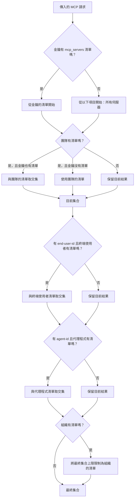

import Tabs from '@theme/Tabs';
import TabItem from '@theme/TabItem';
import Image from '@theme/IdealImage';

# MCP 權限管理 {#mcp-permission-management}

在 LiteLLM 中控制哪些 MCP 伺服器和工具可供特定金鑰、團隊或組織存取。當用戶端嘗試列出或呼叫工具時，LiteLLM 會根據已設定的權限強制執行存取控制。

## 概覽 {#overview}

LiteLLM 為 MCP 伺服器提供細緻的權限管理，讓您可以：

- **依實體限制 MCP 存取**：控制哪些金鑰、團隊或組織可以存取特定的 MCP 伺服器
- **工具層級篩選**：根據實體權限自動篩選可用工具
- **集中式控制**：從 LiteLLM 管理員介面或 API 管理所有 MCP 權限
- **一鍵公開 MCP**：在不需要逐金鑰限制時，將特定伺服器標記為所有 LiteLLM API 金鑰皆可使用

這可確保只有獲授權的實體才能探索並使用 MCP 工具，為您的 MCP 基礎架構提供額外的安全層。

:::info 相關文件
- [MCP 概覽](./mcp.md) - 了解 LiteLLM 中的 MCP
- [MCP 成本追蹤](./mcp_cost.md) - 追蹤 MCP 工具呼叫的成本
- [MCP 防護欄](./mcp_guardrail.md) - 對 MCP 呼叫套用安全防護欄
- [使用 MCP](./mcp_usage.md) - 如何在 LiteLLM 中使用 MCP
:::

## 運作方式 {#how-it-works}

LiteLLM 支援在 LiteLLM 上以金鑰、團隊、組織（實體）來管理 MCP 伺服器的權限。當 MCP 用戶端嘗試列出工具時，LiteLLM 只會回傳該實體有權存取的工具。

建立金鑰、團隊或組織時，您可以選擇該實體可存取的允許 MCP 伺服器。

<Image 
  img={require('../img/mcp_key.png')}
  style={{width: '80%', display: 'block', margin: '0'}}
/>

## 權限階層 {#permission-hierarchy}

權限可設定於五個不同層級。當多個層級同時適用於某個請求時，LiteLLM 會將清單做**交集**（最嚴格者優先）——組織層級除外，它會作為**上限**。

| 層級 | 來源 | 組合方式 |
|---|---|---|
| **金鑰** | 虛擬金鑰上的 `object_permission.mcp_servers` / `object_permission.mcp_access_groups` | 如果金鑰有明確清單，就會使用該清單。 |
| **團隊** | 團隊上的相同欄位 | 如果金鑰與團隊都各有清單，結果會是**交集**（只保留同時存在於兩者中的伺服器）。如果只有團隊有清單，金鑰會繼承該清單。 |
| **終端使用者** | 與 `x-litellm-end-user-id` 相符的 `LiteLLM_EndUserTable` 列上的相同欄位 | 與目前累積的結果做交集。如果請求中沒有 end-user-id，則會略過。 |
| **代理程式** | 由 `x-litellm-agent-id` 指定的代理程式上的相同欄位 | 與目前累積的結果做交集。如果沒有 agent-id，則會略過。 |
| **組織** | 擁有該金鑰／團隊的組織上的相同欄位 | 作為**上限**——最終允許的伺服器集合會與組織的清單做交集。如果組織沒有清單，則不會額外限制。 |

如果沒有任何層級有清單，請求可以存取**所有** MCP 伺服器（預設為開放）。



相同的交集模型也適用於每個伺服器的工具層級字典 `mcp_tool_permissions`（請參閱下方的 [每個實體的工具層級權限](#per-entity-tool-level-permissions)）。

## 允許/禁止 MCP 工具 {#allowdisallow-mcp-tools}
  
控制哪些工具可從您的 MCP 伺服器使用。您可以只允許特定工具，或封鎖危險工具。

<Tabs>
<TabItem value="allowed" label="只允許特定工具">

使用 `allowed_tools` 精確指定使用者可存取哪些工具。其他所有工具都會被封鎖。

```yaml title="config.yaml" showLineNumbers
mcp_servers:
  github_mcp:
    url: "https://api.githubcopilot.com/mcp"
    auth_type: oauth2
    oauth2_flow: authorization_code
    authorization_url: https://github.com/login/oauth/authorize
    token_url: https://github.com/login/oauth/access_token
    client_id: os.environ/GITHUB_OAUTH_CLIENT_ID
    client_secret: os.environ/GITHUB_OAUTH_CLIENT_SECRET
    scopes: ["public_repo", "user:email"]
    allowed_tools: ["list_tools"]
    # only list_tools will be available
```

**適用於：**
- 您想嚴格控制哪些工具可用
- 您處於高安全性環境
- 您正在以有限工具測試新的 MCP 伺服器

</TabItem>
<TabItem value="blocked" label="封鎖特定工具">

使用 `disallowed_tools` 來封鎖特定工具。其他所有工具都會可用。

```yaml title="config.yaml" showLineNumbers
mcp_servers:
  github_mcp:
    url: "https://api.githubcopilot.com/mcp"
    auth_type: oauth2
    oauth2_flow: authorization_code
    authorization_url: https://github.com/login/oauth/authorize
    token_url: https://github.com/login/oauth/access_token
    client_id: os.environ/GITHUB_OAUTH_CLIENT_ID
    client_secret: os.environ/GITHUB_OAUTH_CLIENT_SECRET
    scopes: ["public_repo", "user:email"]
    disallowed_tools: ["repo_delete"]
    # only repo_delete will be blocked
```

**適用於：**
- 大多數工具都安全，但您想封鎖少數危險工具
- 您想避免昂貴的 API 呼叫
- 您正逐步為現有伺服器新增限制

</TabItem>
</Tabs>

### 重要注意事項 {#important-notes}

- 如果您同時指定 `allowed_tools` 和 `disallowed_tools`，允許清單會優先
- 工具名稱區分大小寫

## 公開 MCP 伺服器（allow_all_keys） {#public-mcp-servers-allow_all_keys}

有些 MCP 伺服器是設計來廣泛共享的——例如內部知識庫、行事曆整合，或其他低風險工具，讓每個團隊都能在不需申請存取權的情況下連線。與其把這些伺服器加到每個金鑰、團隊或組織，不如啟用新的 `allow_all_keys` 切換開關。

<Tabs>
<TabItem value="ui" label="UI">

1. 在管理員 UI 中開啟 **MCP Servers → Add / Edit**。
2. 展開 **Permission Management / Access Control**。
3. 將 **Allow All LiteLLM Keys** 切換為開啟。

<Image 
  img={require('../img/mcp_allow_all_ui.png')}
  style={{width: '80%', display: 'block', margin: '1rem auto'}}
  alt="管理員 UI 中的 MCP 伺服器組態"
/> 

這個切換開關會讓伺服器變成「公開」，而不會影響既有的存取群組。

</TabItem>
<TabItem value="config" label="config.yaml">

設定 `allow_all_keys: true`，將伺服器標記為公開：

```yaml title="Make an MCP server public" showLineNumbers
mcp_servers:
  deepwiki:
    url: https://mcp.deepwiki.com/mcp
    allow_all_keys: true
```

</TabItem>
</Tabs>

### 何時使用 {#when-to-use-it}

- 您有共享的 MCP 工具，而細緻的 ACL 只會增加瑣碎工作。
- 您希望內部使用者有「預設啟用」的體驗，同時仍能疊加工具層級的限制。
- 您正在讓新團隊上線，希望開箱即用就能使用最安全的 MCP。

啟用後，LiteLLM 會在工具探索／呼叫期間，自動為每個金鑰包含該伺服器——不需要額外的虛擬金鑰或團隊組態。

---

## 允許/禁止 MCP 工具參數 {#allowdisallow-mcp-tool-parameters}

使用 `allowed_params` 組態控制特定 MCP 工具允許使用哪些參數。這可透過限制可傳遞給每個工具的參數，對工具使用提供細緻控制。

### 組態 {#configuration}

`allowed_params` 是一個將工具名稱對應到允許參數名稱清單的字典。設定後，只有指定的參數會被該工具接受——任何其他參數都會被拒絕並回傳 403 錯誤。

```yaml title="config.yaml with allowed_params" showLineNumbers
mcp_servers:
  deepwiki_mcp:
    url: https://mcp.deepwiki.com/mcp
    transport: "http"
    auth_type: "none"
    allowed_params:
      # Tool name: list of allowed parameters
      read_wiki_contents: ["status"]
  
  my_api_mcp:
    url: "https://my-api-server.com"
    auth_type: "api_key"
    auth_value: "my-key"
    allowed_params:
      # Using unprefixed tool name
      getpetbyid: ["status"]
      # Using prefixed tool name (both formats work)
      my_api_mcp-findpetsbystatus: ["status", "limit"]
      # Another tool with multiple allowed params
      create_issue: ["title", "body", "labels"]
```

### 運作方式 {#how-it-works-1}

1. **工具專屬篩選**：每個工具都可以有自己的允許參數清單
2. **命名彈性**：工具名稱可在有或沒有伺服器前綴的情況下指定（例如，`"getpetbyid"` 和 `"my_api_mcp-getpetbyid"` 都可用）
3. **白名單方式**：只允許允許清單中的參數
4. **未列出工具**：如果未設定 `allowed_params`，則允許所有參數
5. **錯誤處理**：帶有不允許參數的請求會收到 403 錯誤，並附上哪些參數允許的詳細資訊

### 範例請求行為 {#example-request-behavior}

使用上方組態時，請求會如何處理如下：

**✅ 允許的請求：**
```json
{
  "tool": "read_wiki_contents",
  "arguments": {
    "status": "active"
  }
}
```

**❌ 拒絕的請求：**
```json
{
  "tool": "read_wiki_contents",
  "arguments": {
    "status": "active",
    "limit": 10  // This parameter is not allowed
  }
}
```

**錯誤回應：**
```json
{
  "error": "Parameters ['limit'] are not allowed for tool read_wiki_contents. Allowed parameters: ['status']. Contact proxy admin to allow these parameters."
}
```

### 使用案例 {#use-cases}

- **安全性**：防止使用者存取敏感參數或危險操作
- **成本控管**：限制昂貴參數（例如，限制結果數量）
- **合規性**：為法規需求強制執行參數使用政策
- **階段性推出**：在工具經測試後逐步啟用參數
- **多租戶隔離**：不同使用者群組有不同的參數存取權限

### 與工具過濾結合 {#combining-with-tool-filtering}

`allowed_params` 可與 `allowed_tools` 和 `disallowed_tools` 搭配使用，以達到完整控制：

```yaml title="Combined filtering example" showLineNumbers
mcp_servers:
  github_mcp:
    url: "https://api.githubcopilot.com/mcp"
    auth_type: oauth2
    oauth2_flow: authorization_code
    authorization_url: https://github.com/login/oauth/authorize
    token_url: https://github.com/login/oauth/access_token
    client_id: os.environ/GITHUB_OAUTH_CLIENT_ID
    client_secret: os.environ/GITHUB_OAUTH_CLIENT_SECRET
    scopes: ["public_repo", "user:email"]
    # Only allow specific tools
    allowed_tools: ["create_issue", "list_issues", "search_issues"]
    # Block dangerous operations
    disallowed_tools: ["delete_repo"]
    # Restrict parameters per tool
    allowed_params:
      create_issue: ["title", "body", "labels"]
      list_issues: ["state", "sort", "perPage"]
      search_issues: ["query", "sort", "order", "perPage"]
```

此設定可確保：
1. 僅有列出的三個工具可用
2. `delete_repo` 工具被明確封鎖
3. 每個工具只能使用其指定的參數

---

## MCP 伺服器存取控制 {#mcp-server-access-control}

LiteLLM Proxy 提供兩種存取特定 MCP 伺服器的控制方式：

1. **以 URL 為基礎的命名空間** - 使用 URL 路徑直接存取特定伺服器或存取群組
2. **以標頭為基礎的命名空間** - 使用 `x-mcp-servers` 標頭指定要存取哪些伺服器

---

### 方法 1：基於 URL 的命名空間 {#method-1-url-based-namespacing}

LiteLLM Proxy 支援對 MCP 伺服器使用以 URL 為基礎的命名空間，格式為 `/<servers or access groups>/mcp`。這可讓您：

- **直接透過 URL 存取**：透過 URL 將 MCP 用戶端直接指向特定伺服器或存取群組
- **簡化設定**：使用 URL 而非標頭來選擇伺服器
- **支援存取群組**：在 URL 中使用存取群組名稱，以便群組化存取伺服器

#### URL 格式 {#url-format}

```
<your-litellm-proxy-base-url>/<server_alias_or_access_group>/mcp
```

**範例：**
- `/github_mcp/mcp` - 從「github_mcp」MCP 伺服器存取工具
- `/zapier/mcp` - 從「zapier」MCP 伺服器存取工具  
- `/dev_group/mcp` - 存取「dev_group」存取群組中所有伺服器的工具
- `/github_mcp,zapier/mcp` - 存取多個特定伺服器中的工具

#### 使用範例 {#usage-examples}

<Tabs>
<TabItem value="openai" label="OpenAI API">

```bash title="cURL Example with URL Namespacing" showLineNumbers
curl --location 'https://api.openai.com/v1/responses' \
--header 'Content-Type: application/json' \
--header "Authorization: Bearer $OPENAI_API_KEY" \
--data '{
    "model": "gpt-4o",
    "tools": [
        {
            "type": "mcp",
            "server_label": "litellm",
            "server_url": "<your-litellm-proxy-base-url>/github_mcp/mcp",
            "require_approval": "never",
            "headers": {
                "x-litellm-api-key": "Bearer YOUR_LITELLM_API_KEY"
            }
        }
    ],
    "input": "Run available tools",
    "tool_choice": "required"
}'
```

此範例使用 URL 命名空間，僅存取「github」MCP 伺服器。

</TabItem>

<TabItem value="litellm" label="LiteLLM Proxy">

```bash title="cURL Example with URL Namespacing" showLineNumbers
curl --location '<your-litellm-proxy-base-url>/v1/responses' \
--header 'Content-Type: application/json' \
--header "Authorization: Bearer $LITELLM_API_KEY" \
--data '{
    "model": "gpt-4o",
    "tools": [
        {
            "type": "mcp",
            "server_label": "litellm",
            "server_url": "litellm_proxy",
            "require_approval": "never",
            "headers": {
                "x-litellm-api-key": "Bearer YOUR_LITELLM_API_KEY"
            }
        }
    ],
    "input": "Run available tools",
    "tool_choice": "required"
}'
```

此範例使用 `x-mcp-servers` 標頭存取「dev_group」存取群組中的所有伺服器。呼叫 Proxy 的 `/v1/responses` 端點時，請使用 `server_url: "litellm_proxy"`——不要使用完整的 Proxy URL。

</TabItem>

<TabItem value="cursor" label="Cursor IDE">

```json title="Cursor MCP Configuration with URL Namespacing" showLineNumbers
{
  "mcpServers": {
    "LiteLLM": {
      "url": "<your-litellm-proxy-base-url>/github_mcp,zapier/mcp",
      "headers": {
        "x-litellm-api-key": "Bearer $LITELLM_API_KEY"
      }
    }
  }
}
```

此設定使用 URL 命名空間，存取來自「github」與「zapier」MCP 伺服器的工具。

</TabItem>
</Tabs>

#### URL 命名空間的優點 {#benefits-of-url-namespacing}

- **直接存取**：無需額外標頭來指定伺服器
- **簡潔 URL**：具備自我說明性的 URL，可清楚指出哪些伺服器可供存取
- **存取群組支援**：使用存取群組名稱來進行分組伺服器存取
- **多個伺服器**：在單一 URL 中以逗號分隔指定多個伺服器
- **簡化設定**：對偏好以 URL 為基礎設定的 MCP 用戶端而言，更容易完成設定

---

### 方法 2：基於標頭的命名空間 {#method-2-header-based-namespacing}

您可以使用 `x-mcp-servers` 標頭來存取特定 MCP 伺服器，並且只列出它們的工具。此標頭可讓您：
- 將工具存取限制為一個或多個特定的 MCP 伺服器
- 控制在不同環境或使用情境中可用的工具

此標頭接受以逗號分隔的伺服器別名清單：`"alias_1,Server2,Server3"`

**注意：**
- 如果未提供此標頭，所有可用 MCP 伺服器的工具都將可存取
- 此方法可搭配標準 LiteLLM MCP 端點運作

<Tabs>
<TabItem value="openai" label="OpenAI API">

```bash title="cURL Example with Header Namespacing" showLineNumbers
curl --location 'https://api.openai.com/v1/responses' \
--header 'Content-Type: application/json' \
--header "Authorization: Bearer $OPENAI_API_KEY" \
--data '{
    "model": "gpt-4o",
    "tools": [
        {
            "type": "mcp",
            "server_label": "litellm",
            "server_url": "<your-litellm-proxy-base-url>/mcp/",
            "require_approval": "never",
            "headers": {
                "x-litellm-api-key": "Bearer YOUR_LITELLM_API_KEY",
                "x-mcp-servers": "alias_1"
            }
        }
    ],
    "input": "Run available tools",
    "tool_choice": "required"
}'
```

在此範例中，請求只會存取來自「alias_1」MCP 伺服器的工具。

</TabItem>

<TabItem value="litellm" label="LiteLLM Proxy">

```bash title="cURL Example with Header Namespacing" showLineNumbers
curl --location '<your-litellm-proxy-base-url>/v1/responses' \
--header 'Content-Type: application/json' \
--header "Authorization: Bearer $LITELLM_API_KEY" \
--data '{
    "model": "gpt-4o",
    "tools": [
        {
            "type": "mcp",
            "server_label": "litellm",
            "server_url": "litellm_proxy",
            "require_approval": "never",
            "headers": {
                "x-litellm-api-key": "Bearer YOUR_LITELLM_API_KEY",
                "x-mcp-servers": "alias_1,Server2"
            }
        }
    ],
    "input": "Run available tools",
    "tool_choice": "required"
}'
```

此設定會將請求限制為僅使用來自指定 MCP 伺服器的工具。呼叫 Proxy 的 `/v1/responses` 端點時，請使用 `server_url: "litellm_proxy"`。

</TabItem>

<TabItem value="cursor" label="Cursor IDE">

```json title="Cursor MCP Configuration with Header Namespacing" showLineNumbers
{
  "mcpServers": {
    "LiteLLM": {
      "url": "<your-litellm-proxy-base-url>/mcp/",
      "headers": {
        "x-litellm-api-key": "Bearer $LITELLM_API_KEY",
        "x-mcp-servers": "alias_1,Server2"
      }
    }
  }
}
```

Cursor IDE 設定中的此設定會將工具存取限制為僅指定的 MCP 伺服器。

</TabItem>
</Tabs>

---

### 比較：標頭與 URL 命名空間 {#comparison-header-vs-url-namespacing}

| 功能 | 標頭命名空間 | URL 命名空間 |
|---------|-------------------|-----------------|
| **方法** | 使用 `x-mcp-servers` 標頭 | 使用 URL 路徑 `/<servers>/mcp` |
| **端點** | 標準 `litellm_proxy` 端點 | 自訂 `/<servers>/mcp` 端點 |
| **設定** | 需要額外標頭 | URL 內建自包含 |
| **多個伺服器** | 在標頭中以逗號分隔 | 在 URL 路徑中以逗號分隔 |
| **存取群組** | 透過標頭支援 | 透過 URL 路徑支援 |
| **用戶端支援** | 適用於所有 MCP 用戶端 | 適用於可識別 URL 的 MCP 用戶端 |
| **使用情境** | 動態伺服器選擇 | 固定伺服器設定 |

<Tabs>
<TabItem value="openai" label="OpenAI API">

```bash title="cURL Example with Server Segregation" showLineNumbers
curl --location 'https://api.openai.com/v1/responses' \
--header 'Content-Type: application/json' \
--header "Authorization: Bearer $OPENAI_API_KEY" \
--data '{
    "model": "gpt-4o",
    "tools": [
        {
            "type": "mcp",
            "server_label": "litellm",
            "server_url": "<your-litellm-proxy-base-url>/mcp/",
            "require_approval": "never",
            "headers": {
                "x-litellm-api-key": "Bearer YOUR_LITELLM_API_KEY",
                "x-mcp-servers": "alias_1"
            }
        }
    ],
    "input": "Run available tools",
    "tool_choice": "required"
}'
```

在此範例中，請求只會存取來自「alias_1」MCP 伺服器的工具。

</TabItem>

<TabItem value="litellm" label="LiteLLM Proxy">

```bash title="cURL Example with Server Segregation" showLineNumbers
curl --location '<your-litellm-proxy-base-url>/v1/responses' \
--header 'Content-Type: application/json' \
--header "Authorization: Bearer $LITELLM_API_KEY" \
--data '{
    "model": "gpt-4o",
    "tools": [
        {
            "type": "mcp",
            "server_label": "litellm",
            "server_url": "litellm_proxy",
            "require_approval": "never",
            "headers": {
                "x-litellm-api-key": "Bearer YOUR_LITELLM_API_KEY",
                "x-mcp-servers": "alias_1,Server2"
            }
        }
    ],
    "input": "Run available tools",
    "tool_choice": "required"
}'
```

此設定會將請求限制為僅使用來自指定 MCP 伺服器的工具。

</TabItem>

<TabItem value="cursor" label="Cursor IDE">

```json title="Cursor MCP Configuration with Server Segregation" showLineNumbers
{
  "mcpServers": {
    "LiteLLM": {
      "url": "litellm_proxy",
      "headers": {
        "x-litellm-api-key": "Bearer $LITELLM_API_KEY",
        "x-mcp-servers": "alias_1,Server2"
      }
    }
  }
}
```

Cursor IDE 設定中的此設定會將工具存取限制為僅指定的 MCP 伺服器。

</TabItem>
</Tabs>

### 分組 MCP（存取群組） {#grouping-mcps-access-groups}

MCP 存取群組可讓您將多個 MCP 伺服器分組，以便更容易管理。

#### 1. 建立存取群組 {#1-create-an-access-group}

##### A. 使用設定建立存取群組： {#a-creating-access-groups-using-config}

```yaml title="Creating access groups for MCP using the config" showLineNumbers
mcp_servers:
  "deepwiki_mcp":
    url: https://mcp.deepwiki.com/mcp
    transport: "http"
    auth_type: "none"
    access_groups: ["dev_group"]
```

在使用設定加入 `mcp_servers` 時：
- 在 `access_groups` 中傳入字串清單
- 接著可使用這些群組，透過金鑰、團隊與使用標頭的 MCP 用戶端來分隔存取權限

##### B. 使用 UI 建立存取群組 {#b-creating-access-groups-using-ui}

若要建立存取群組：
- 前往 LiteLLM UI 中的 MCP Servers
- 點選 "Add a New MCP Server" 
- 在 "MCP Access Groups" 下，透過輸入建立新群組（例如 "dev_group"）
- 將相同的群組名稱加入其他伺服器，將它們分組在一起

<Image 
  img={require('../img/mcp_create_access_group.png')}
  style={{width: '80%', display: 'block', margin: '0'}}
/>

#### 2. 在 Cursor 中使用存取群組 {#2-use-access-group-in-cursor}

在 `x-mcp-servers` 標頭中包含存取群組名稱：

```json title="Cursor Configuration with Access Groups" showLineNumbers
{
  "mcpServers": {
    "LiteLLM": {
      "url": "litellm_proxy",
      "headers": {
        "x-litellm-api-key": "Bearer $LITELLM_API_KEY",
        "x-mcp-servers": "dev_group"
      }
    }
  }
}
```

這樣您就能存取 "dev_group" 存取群組中的所有伺服器。
- 這表示 deepwiki 伺服器（以及任何其他已指派存取群組 `dev_group` 的伺服器）都可用於工具呼叫

#### 進階：將存取群組連接到 API 金鑰 {#advanced-connecting-access-groups-to-api-keys}

建立 API 金鑰時，您可以將它們指派給特定的存取群組以進行權限管理：

- 前往 LiteLLM UI 中的 "Keys" 並點選 "Create Key"
- 從下拉選單選取所需的 MCP 存取群組
- 這個金鑰將可存取這些群組中的所有 MCP 伺服器
- 這會反映在 Test Key 頁面中

<Image 
  img={require('../img/mcp_key_access_group.png')}
  style={{width: '80%', display: 'block', margin: '0'}}
/>

## 每個實體的工具層級權限 {#per-entity-tool-level-permissions}

控制不同團隊可從同一個 MCP 伺服器存取哪些工具。例如，讓您的工程團隊可存取 `list_repositories`、`create_issue` 與 `search_code`，而銷售團隊則只可存取 `search_code` 與 `close_issue`。

這段影片示範如何為 Key、Team 或 Organization 設定允許的工具。

<iframe width="840" height="500" src="https://www.loom.com/embed/7464d444c3324078892367272fe50745" frameborder="0" webkitallowfullscreen mozallowfullscreen allowfullscreen></iframe>

### `mcp_tool_permissions` API {#mcp_tool_permissions-api}

`object_permission.mcp_tool_permissions` 是套用在 key、team、end-user、agent 或 organization 上的 `Dict[server_id, List[tool_name]]`。它會在**伺服器層級存取**已解析後評估（請參閱上方的 [權限階層](#permission-hierarchy)），並套用相同的五層交集規則——限制最嚴者勝出，organization 作為上限。

這與伺服器註冊層級的 `allowed_tools` / `disallowed_tools` 不同（後者適用於伺服器的**每一位**呼叫者）。`mcp_tool_permissions` 可讓您在不變更伺服器設定的情況下，切出每個團隊的子集合。

<Tabs>
<TabItem value="key" label="在 Key 上">

```bash title="Engineering key — full GitHub access" showLineNumbers
curl -X POST "http://localhost:4000/key/generate" \
  -H "Authorization: Bearer sk-master-key" \
  -H "Content-Type: application/json" \
  -d '{
    "object_permission": {
      "mcp_servers": ["github_mcp"],
      "mcp_tool_permissions": {
        "github_mcp": ["list_repositories", "create_issue", "search_code"]
      }
    }
  }'
```

```bash title="Sales key — read-only on the same server" showLineNumbers
curl -X POST "http://localhost:4000/key/generate" \
  -H "Authorization: Bearer sk-master-key" \
  -H "Content-Type: application/json" \
  -d '{
    "object_permission": {
      "mcp_servers": ["github_mcp"],
      "mcp_tool_permissions": {
        "github_mcp": ["search_code", "close_issue"]
      }
    }
  }'
```

</TabItem>
<TabItem value="team" label="在 Team 上">

```bash title="Team-wide tool subset (all keys inherit)" showLineNumbers
curl -X POST "http://localhost:4000/team/new" \
  -H "Authorization: Bearer sk-master-key" \
  -H "Content-Type: application/json" \
  -d '{
    "team_alias": "engineering",
    "object_permission": {
      "mcp_servers": ["github_mcp", "deepwiki_mcp"],
      "mcp_tool_permissions": {
        "github_mcp": ["list_repositories", "create_issue", "search_code"]
      }
    }
  }'
```

當該金鑰也為 `github_mcp` 設定 `mcp_tool_permissions` 時，產生的工具清單是兩者的**交集**。

</TabItem>
<TabItem value="agent" label="在代理程式上">

當代理程式（由 `x-litellm-agent-id` 識別）呼叫 MCP 工具時，代理程式本身的 `mcp_tool_permissions` 會參與交集計算。這對於限制自主代理程式可執行的操作很有用，不論其最初是由哪個金鑰呼叫。

```bash showLineNumbers
curl -X PATCH "http://localhost:4000/v1/agents/{agent_id}" \
  -H "Authorization: Bearer sk-master-key" \
  -H "Content-Type: application/json" \
  -d '{
    "object_permission": {
      "mcp_servers": ["github_mcp"],
      "mcp_tool_permissions": {
        "github_mcp": ["search_code"]
      }
    }
  }'
```

</TabItem>
</Tabs>

## 每個 MCP 伺服器的速率限制 {#rate-limiting-per-mcp-server}

使用 `mcp_rpm_limit` 將金鑰或團隊每分鐘可對特定 MCP 伺服器發出的工具呼叫數量設上限。這是一個以 MCP 伺服器名稱為鍵的 `Dict[str, int]`；名稱若有設定別名，則使用伺服器別名，否則使用設定的伺服器名稱。每個項目都為該伺服器設定每分鐘請求數上限，因此對 `github` 的限制不會影響對 `slack` 的呼叫。未設定項目的伺服器不受上限限制。

一旦在該時間窗內超過上限，之後對該伺服器的工具呼叫會回傳 `429 Too Many Requests`，直到時間窗重新開始。此上限僅套用於實際的 MCP 工具呼叫；對一般 LLM 請求沒有影響。

<Tabs>
<TabItem value="key" label="在金鑰上">

```bash title="Cap a key at 100 github + 200 slack calls per minute" showLineNumbers
curl -X POST "http://localhost:4000/key/generate" \
  -H "Authorization: Bearer sk-master-key" \
  -H "Content-Type: application/json" \
  -d '{
    "mcp_rpm_limit": {"github": 100, "slack": 200},
    "object_permission": {"mcp_servers": ["github", "slack"]}
  }'
```

</TabItem>
<TabItem value="team" label="在團隊上">

```bash title="Cap a team at 500 github calls per minute (all keys share the counter)" showLineNumbers
curl -X POST "http://localhost:4000/team/new" \
  -H "Authorization: Bearer sk-master-key" \
  -H "Content-Type: application/json" \
  -d '{
    "team_alias": "engineering",
    "mcp_rpm_limit": {"github": 500},
    "object_permission": {"mcp_servers": ["github"]}
  }'
```

</TabItem>
</Tabs>

`mcp_rpm_limit` 也可用於 `/key/update`、`/team/update`、`/user/new` 與 `/user/update`。對同一伺服器而言，金鑰層級的限制優先於團隊層級的限制；否則團隊限制會作為共享計數器套用到該團隊中的每個金鑰。

## 儀表板檢視模式 {#dashboard-view-modes}

代理閘道管理員也可以透過 `general_settings.user_mcp_management_mode` 控制非管理員在 MCP 儀表板中看到的內容：

- `restricted` *(預設)* – 使用者只會看到其團隊明確擁有存取權的伺服器。
- `view_all` – 每位儀表板使用者都能看到完整的 MCP 伺服器清單。 

```yaml title="Config example"
general_settings:
  user_mcp_management_mode: view_all
```

當您希望 MCP 供應項目具備可發現性，但又不授予額外的執行權限時，這很有用。

## 發布 MCP 登錄檔 {#publish-mcp-registry}

如果您希望其他系統——例如在您網路外執行、具備 MCP 功能的 IDE 等外部代理程式框架——能自動探索 LiteLLM 上託管的 MCP 伺服器，您可以公開一個 Model Context Protocol Registry 端點。此註冊表會依據 [官方 MCP Registry 規格](https://github.com/modelcontextprotocol/registry) 列出內建的 LiteLLM MCP 伺服器以及您已設定的每一台伺服器。

1. 在您的 proxy 設定（或 DB 設定）中的 `general_settings` 下設定 `enable_mcp_registry: true`，然後重新啟動 proxy。
2. LiteLLM 會在 `GET /v1/mcp/registry.json` 提供 registry。
3. 每個項目都會指向 `/mcp`（內建伺服器）或您的自訂伺服器的 `/{mcp_server_name}/mcp`，因此用戶端可以使用公布的 Streamable HTTP URL 直接連線。

:::note 權限仍然適用
registry 只會公布伺服器 URL。實際的存取控制仍會在用戶端連線到 `/mcp` 或 `/{server}/mcp` 時由 LiteLLM 強制執行，因此發布 registry 不會繞過每個金鑰的權限。
:::
