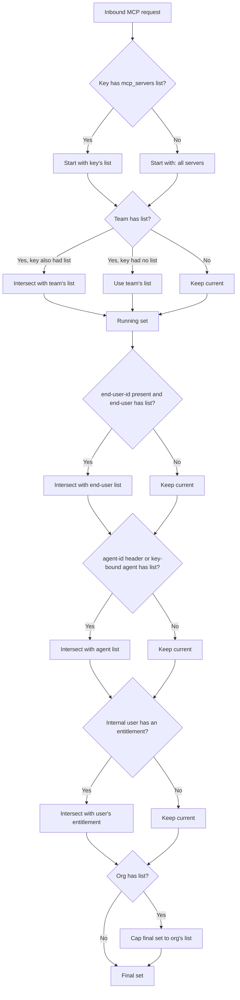

import Tabs from '@theme/Tabs';
import TabItem from '@theme/TabItem';
import Image from '@theme/IdealImage';

# MCP 權限管理 {#mcp-permission-management}

在 LiteLLM 中控制哪些 MCP 伺服器和工具可供特定金鑰、團隊或組織存取。當用戶端嘗試列出或呼叫工具時，LiteLLM 會根據已設定的權限強制執行存取控制。

## 概覽 {#overview}

LiteLLM 為 MCP 伺服器提供細緻的權限管理，讓您可以：

- **依實體限制 MCP 存取**：控制哪些金鑰、團隊或組織可以存取特定的 MCP 伺服器
- **工具層級篩選**：根據實體權限自動篩選可用工具
- **集中式控制**：從 LiteLLM 管理員介面或 API 管理所有 MCP 權限
- **一鍵公開 MCP**：在不需要逐金鑰限制時，將特定伺服器標記為所有 LiteLLM API 金鑰皆可使用

這可確保只有獲授權的實體才能探索並使用 MCP 工具，為您的 MCP 基礎架構提供額外的安全層。

:::info[相關文件]
- [MCP 總覽](./mcp.md) - 了解 LiteLLM 中的 MCP
- [將 MCP Server 存取權授予 Keys 和 Teams](./mcp_grant_access.md) - 逐步說明的 Admin UI 與 API 授權 key 和 team 的流程
- [MCP 成本追蹤](./mcp_cost.md) - 追蹤 MCP 工具呼叫的成本
- [MCP 防護欄](./mcp_guardrail.md) - 對 MCP 呼叫套用安全防護欄
- [使用 MCP](./mcp_usage.md) - 如何在 LiteLLM 中使用 MCP
:::

## 運作方式 {#how-it-works}

LiteLLM 支援在 LiteLLM 上以金鑰、團隊、組織（實體）來管理 MCP 伺服器的權限。當 MCP 用戶端嘗試列出工具時，LiteLLM 只會回傳該實體有權存取的工具。

建立金鑰、團隊或組織時，您可以選擇該實體可存取的允許 MCP 伺服器。

<Image 
  img={require('../img/mcp_key.png')}
  style={{width: '80%', display: 'block', margin: '0'}}
/>

## 權限階層 {#permission-hierarchy}

權限可設定於六個不同層級。當多個層級同時適用於某個請求時，LiteLLM 會**取交集**（最嚴格者勝出），組織層級除外，其作用為**上限**。

| 層級 | 來源 | 組合方式 |
|---|---|---|
| **Key** | 虛擬 key 上的 `object_permission.mcp_servers` / `object_permission.mcp_access_groups` | 如果 key 有明確清單，就使用該清單。 |
| **Team** | team 上相同的欄位 | 如果 key 和 team 都有清單，結果為**交集**（只保留同時屬於兩者的 servers）。如果只有 team 有清單，key 會繼承該清單。 |
| **End user** | 與 `x-litellm-end-user-id` 相符的 `LiteLLM_EndUserTable` 資料列上的相同欄位 | 與目前結果取交集。若請求中沒有 end-user-id，則略過。 |
| **Agent** | 由 `x-litellm-agent-id` 所識別的 agent 上的相同欄位，或 key 綁定的 agent（在 key 生成時設定 `agent_id`） | 與目前結果取交集。若不適用任何 agent，則略過。 |
| **Internal user** | 請求驗證為其身分的 internal user（真人）上的相同欄位 | 與目前結果取交集，因此只能縮小範圍。若該使用者沒有任何權益，則略過。 |
| **Organization** | 擁有該 key/team 的 org 上相同的欄位 | 充當**上限**；最終允許的 servers 集合會與 org 的清單取交集。若 org 沒有清單，則不會增加額外限制。 |

如果沒有任何層級有清單，請求可以存取**所有** MCP 伺服器（預設為開放）。

綁定到 agent 的 key（將 `agent_id` 傳給 `/key/generate`）會獲得與帶有 `x-litellm-agent-id` 的請求相同的處理方式：該 agent 的清單會在 key 發出的每個請求上與 key 的清單取交集。只授予 key 本身某個 server 並不足夠；agent 也必須持有該授權（透過 Admin UI 的 agent 編輯表單或 `PATCH /v1/agents/{agent_id}`），否則針對該 server 的請求會被拒絕，並顯示包含 agent 名稱的錯誤。


```mermaid
flowchart TD
    A[Inbound MCP request] --> B{Key has mcp_servers list?}
    B -->|Yes| C[Start with key's list]
    B -->|No| D[Start with: all servers]
    C --> E{Team has list?}
    D --> E
    E -->|Yes, key also had list| F[Intersect with team's list]
    E -->|Yes, key had no list| G[Use team's list]
    E -->|No| H[Keep current]
    F --> I
    G --> I
    H --> I
    I[Running set] --> J{end-user-id present and end-user has list?}
    J -->|Yes| K[Intersect with end-user list]
    J -->|No| L[Keep current]
    K --> M
    L --> M
    M{agent-id header or key-bound agent has list?}
    M -->|Yes| N[Intersect with agent list]
    M -->|No| O[Keep current]
    N --> S
    O --> S
    S{Internal user has an entitlement?}
    S -->|Yes| T[Intersect with user's entitlement]
    S -->|No| U[Keep current]
    T --> P
    U --> P
    P{Org has list?}
    P -->|Yes| Q[Cap final set to org's list]
    P -->|No| R[Final set]
    Q --> R
```

相同的交集模型也適用於每個伺服器的工具層級字典 `mcp_tool_permissions`（請參閱下方的 [每個實體的工具層級權限](#per-entity-tool-level-permissions)）。

### 要求 key 定義其自己的 MCP 存取 {#require-keys-to-define-their-own-mcp-access}

預設情況下，具有空白或不存在的 `mcp_servers` 清單的 key 會繼承其 team 的清單，因此 team 實際上是每個 key 預設退回的對象。將 `require_key_mcp_access_defined: true` 設在 `general_settings` 下方，可翻轉這種關係：team 變成上限而不是預設值，而空清單的 key 若未明確授予任何 MCP servers（無論是直接在 `object_permission.mcp_servers` 中，或透過 [access group](#grouping-mcps-access-groups)），就不會獲得任何 MCP servers。

```yaml title="config.yaml" showLineNumbers
general_settings:
  require_key_mcp_access_defined: true
```

建議採用此設定。使用繼承時，在某個 team 底下發出的每個 key 都會無聲地連到該 team 能連到的每個 MCP server，因此存取會以隱含方式授予，且會隨著 team 清單擴大而擴大；啟用此旗標後，key 只會連到明確授予的內容，而 team 清單只會作為上限而非定義該授權。我們正考慮在未來版本將此設為預設行為；請持續關注並參與 [deprecation discussion](https://github.com/BerriAI/litellm/discussions/32090)。當您的 keys 已具備自己的 `object_permission.mcp_servers`（或 access group）時再啟用此設定，因為在此之前切換會讓依賴繼承的 keys 失去 MCP 存取權。

若 team 的 `mcp_servers` 清單為空，即使有此旗標，也仍表示「不受限制」，因為空的 team 清單永遠不會限制。此旗標只會改變當 team 確實有清單時，空白 *key* 清單的含義：繼承它（預設）或不授予任何內容（旗標開啟）。key 上的 access-group 授權仍會累加，因此即使啟用旗標，附加群組仍可到達其 servers。

關於 end-user 層級的等效控制，請參閱 [`require_end_user_mcp_access_defined`](./proxy/config_settings#general_settings---reference)。

### 將 key 排除於所有 MCP servers 之外（`no-mcp-servers`） {#opting-a-key-out-of-all-mcp-servers-no-mcp-servers}

若要明確拒絕某個 key 的所有 MCP servers，請在其 `mcp_servers` 清單中放入 sentinel `no-mcp-servers`。這與用於模型存取的 `no-default-models` sentinel 相同。不同於空清單會繼承 team 的 servers，`no-mcp-servers` 會覆寫 team 繼承以及任何累加式 access-group 授權，因此無論 team 允許什麼，該 key 解析後都會是零個 MCP servers。

```bash title="Key with no MCP access" showLineNumbers
curl -X POST "http://localhost:4000/key/generate" \
  -H "Authorization: Bearer sk-master-key" \
  -H "Content-Type: application/json" \
  -d '{
    "object_permission": {
      "mcp_servers": ["no-mcp-servers"]
    }
  }'
```

## 允許/禁止 MCP 工具 {#allowdisallow-mcp-tools}
  
控制哪些工具可從您的 MCP 伺服器使用。您可以只允許特定工具，或封鎖危險工具。

<Tabs>
<TabItem value="allowed" label="只允許特定工具">

使用 `allowed_tools` 精確指定使用者可存取哪些工具。其他所有工具都會被封鎖。

```yaml title="config.yaml" showLineNumbers
mcp_servers:
  github_mcp:
    url: "https://api.githubcopilot.com/mcp"
    auth_type: oauth2
    oauth2_flow: authorization_code
    authorization_url: https://github.com/login/oauth/authorize
    token_url: https://github.com/login/oauth/access_token
    client_id: os.environ/GITHUB_OAUTH_CLIENT_ID
    client_secret: os.environ/GITHUB_OAUTH_CLIENT_SECRET
    scopes: ["public_repo", "user:email"]
    allowed_tools: ["list_tools"]
    # only list_tools will be available
```

**適用於：**
- 您想嚴格控制哪些工具可用
- 您處於高安全性環境
- 您正在以有限工具測試新的 MCP 伺服器

</TabItem>
<TabItem value="blocked" label="封鎖特定工具">

使用 `disallowed_tools` 來封鎖特定工具。其他所有工具都會可用。

```yaml title="config.yaml" showLineNumbers
mcp_servers:
  github_mcp:
    url: "https://api.githubcopilot.com/mcp"
    auth_type: oauth2
    oauth2_flow: authorization_code
    authorization_url: https://github.com/login/oauth/authorize
    token_url: https://github.com/login/oauth/access_token
    client_id: os.environ/GITHUB_OAUTH_CLIENT_ID
    client_secret: os.environ/GITHUB_OAUTH_CLIENT_SECRET
    scopes: ["public_repo", "user:email"]
    disallowed_tools: ["repo_delete"]
    # only repo_delete will be blocked
```

**適用於：**
- 大多數工具都安全，但您想封鎖少數危險工具
- 您想避免昂貴的 API 呼叫
- 您正逐步為現有伺服器新增限制

</TabItem>
</Tabs>

### 重要注意事項 {#important-notes}

- 如果您同時指定 `allowed_tools` 和 `disallowed_tools`，允許清單會優先
- 工具名稱區分大小寫

## 鎖定 Server 的工具清單 {#pin-a-servers-tool-list}

`allowed_tools` 相信上游對每個工具功能的描述。鎖定也會凍結工具清單、描述和輸入 schema：gateway 只提供已鎖定的工具及其已鎖定的描述與 schema，拒絕對任何其他名稱的呼叫，並在上游與鎖定內容不一致時發出警示。這可阻止工具投毒（OWASP LLM01）：某個 server 悄悄重寫描述以向模型傳遞指令，或新增您的 clients 從未核准的工具，都不會改變 clients 看到的任何內容

<Tabs>
<TabItem value="api" label="Pin from the API">

將 gateway 目前看到的目錄鎖定（僅限 admin，且需要 database）。使用 `GET /v1/mcp/server` 找到 `server_id`。回應會是儲存的快照：每個工具的名稱、描述與輸入 schema：

```bash title="Pin" showLineNumbers
curl -s -X POST http://localhost:4000/v1/mcp/server/$SERVER_ID/pin \
  -H "Authorization: Bearer $LITELLM_MASTER_KEY"
```

```json
{
  "get_note": {
    "description": "Return the saved note with the given id",
    "input_schema": {"type": "object", "properties": {"id": {"type": "string"}}, "required": ["id"]}
  }
}
```

快照會在 [discovery guardrail scan](./mcp_guardrail#scanning-tool-descriptions-on-discovery) 之後擷取，因此被 guardrail 阻擋的描述不會被鎖定，而被遮罩的描述會以其遮罩後的形式被鎖定；若某個 server 最後沒有任何工具可鎖定，則會回傳 `400`。在鎖定當下生效的 `tool_name_to_description` 覆寫會被一併鎖定

解除鎖定即可再次提供即時的上游目錄：

```bash title="Unpin" showLineNumbers
curl -s -X DELETE http://localhost:4000/v1/mcp/server/$SERVER_ID/pin \
  -H "Authorization: Bearer $LITELLM_MASTER_KEY"
```

```json
{"server_id": "<server_id>", "status": "unpinned"}
```

</TabItem>
<TabItem value="config" label="Pin in config.yaml">

`pinned_tools` 會將每個工具名稱對應到您的 clients 應該看到的描述與輸入 schema。上方的鎖定回應具有相同的結構，因此請先在有 database 的 deployment 上鎖定一次，然後將回應貼到這裡：

```yaml title="config.yaml" showLineNumbers
mcp_servers:
  notes:
    url: http://notes.internal/mcp
    transport: http
    pinned_tools:
      get_note:
        description: "Return the saved note with the given id"
        input_schema:
          type: object
          properties:
            id: {type: string}
          required: [id]
```

</TabItem>
</Tabs>

server 被鎖定後，clients 會看到：

- `tools/list`（優先於 `/mcp`、`/mcp-rest/tools/list`，以及 LLM 驅動的 discovery）只會回傳已鎖定的工具，每個工具都帶有其已鎖定的描述與輸入 schema
- 上游在鎖定後新增的工具不會列出，而且對它的呼叫會回傳 `403`
- 上游在鎖定後移除的工具也不會列出，因為 gateway 沒有可呼叫的對象
- 上游在鎖定後變更的描述或輸入 schema 會以鎖定內容提供

只要某次清單比對發現上游與鎖定內容不同，gateway 就會記錄警告並發送一則 `mcp_pinned_tools_changed` [alert](./proxy/alerting#all-possible-alert-types)，指出新增、移除與變更的工具；每個 server 的每種不同 diff 只會發送一次。下一次相同 diff 的清單會保持靜默，不同 diff 會再次發出 alert，而當上游重新與鎖定內容一致時，alert 會自行清除。若您審查後接受某項變更，請重新鎖定

```text
MCP server `notes`: upstream tool list drifted from the pinned catalog; serving the pinned tools and descriptions until an admin re-pins the server
added: `delete_all_notes`
changed: `get_note`
```

### 重要注意事項 {#important-notes-1}

- 鎖定涵蓋工具名稱、描述與輸入 schema；上游回報的任何其他工具資訊（annotations、output schema）都會即時提供
- `allowed_tools`、`disallowed_tools`，以及每個 key 的工具權限仍會疊加在鎖定之上
- [discovery guardrail scan](./mcp_guardrail#scanning-tool-descriptions-on-discovery) 仍會在已鎖定的 server 上執行，針對 proxy 即將提供的已鎖定文字執行：當上游文字遭到污染時，已鎖定的工具仍會提供其已鎖定的描述（並回報為已變更）；而當已鎖定的描述本身被 guardrails 阻擋時，會隱藏並回報為已阻擋，直到 admin 重新鎖定 server
- 在鎖定後編輯的 `tool_name_to_description` 覆寫會被視為已變更的工具：已鎖定文字會持續提供，直到 server 重新鎖定

## 公開 MCP 伺服器（allow_all_keys） {#public-mcp-servers-allow_all_keys}

有些 MCP servers 是為了廣泛共享而設計的：內部知識庫、日曆整合，或其他低風險工具，讓每個 team 都能在不需申請存取權的情況下連線。與其將這些 servers 加入每個 key、team 或 organization，不如啟用新的 `allow_all_keys` 切換開關。

<Tabs>
<TabItem value="ui" label="UI">

1. 在管理員 UI 中開啟 **MCP Servers → Add / Edit**。
2. 展開 **Permission Management / Access Control**。
3. 將 **Allow All LiteLLM Keys** 切換為開啟。

<Image 
  img={require('../img/mcp_allow_all_ui.png')}
  style={{width: '80%', display: 'block', margin: '1rem auto'}}
  alt="管理員 UI 中的 MCP 伺服器組態"
/>

這個切換開關會讓伺服器變成「公開」，而不會影響既有的存取群組。

</TabItem>
<TabItem value="config" label="config.yaml">

設定 `allow_all_keys: true`，將伺服器標記為公開：

```yaml title="Make an MCP server public" showLineNumbers
mcp_servers:
  deepwiki:
    url: https://mcp.deepwiki.com/mcp
    allow_all_keys: true
```

</TabItem>
</Tabs>

### 何時使用 {#when-to-use-it}

- 您有共享的 MCP 工具，而細緻的 ACL 只會增加瑣碎工作。
- 您希望內部使用者有「預設啟用」的體驗，同時仍能疊加工具層級的限制。
- 您正在讓新團隊上線，希望開箱即用就能使用最安全的 MCP。

啟用後，LiteLLM 會在工具 discovery/calls 期間自動為每個 key 納入該 server，無需額外的 virtual-key 或 team 設定。

---

## 允許/禁止 MCP 工具參數 {#allowdisallow-mcp-tool-parameters}

使用 `allowed_params` 組態控制特定 MCP 工具允許使用哪些參數。這可透過限制可傳遞給每個工具的參數，對工具使用提供細緻控制。

### 組態 {#configuration}

`allowed_params` 是一個將工具名稱對應到允許參數名稱清單的字典。設定後，只有指定的參數會被該工具接受——任何其他參數都會被拒絕並回傳 403 錯誤。

```yaml title="config.yaml with allowed_params" showLineNumbers
mcp_servers:
  deepwiki_mcp:
    url: https://mcp.deepwiki.com/mcp
    transport: "http"
    auth_type: "none"
    allowed_params:
      # Tool name: list of allowed parameters
      read_wiki_contents: ["status"]
  
  my_api_mcp:
    url: "https://my-api-server.com"
    auth_type: "api_key"
    auth_value: "my-key"
    allowed_params:
      # Using unprefixed tool name
      getpetbyid: ["status"]
      # Using prefixed tool name (both formats work)
      my_api_mcp-findpetsbystatus: ["status", "limit"]
      # Another tool with multiple allowed params
      create_issue: ["title", "body", "labels"]
```

### 運作方式 {#how-it-works-1}

1. **工具專屬篩選**：每個工具都可以有自己的允許參數清單
2. **命名彈性**：工具名稱可在有或沒有伺服器前綴的情況下指定（例如，`"getpetbyid"` 和 `"my_api_mcp-getpetbyid"` 都可用）
3. **白名單方式**：只允許允許清單中的參數
4. **未列出工具**：如果未設定 `allowed_params`，則允許所有參數
5. **錯誤處理**：帶有不允許參數的請求會收到 403 錯誤，並附上哪些參數允許的詳細資訊

### 範例請求行為 {#example-request-behavior}

使用上方組態時，請求會如何處理如下：

**✅ 允許的請求：**
```json
{
  "tool": "read_wiki_contents",
  "arguments": {
    "status": "active"
  }
}
```

**❌ 拒絕的請求：**
```json
{
  "tool": "read_wiki_contents",
  "arguments": {
    "status": "active",
    "limit": 10  // This parameter is not allowed
  }
}
```

**錯誤回應：**
```json
{
  "error": "Parameters ['limit'] are not allowed for tool read_wiki_contents. Allowed parameters: ['status']. Contact proxy admin to allow these parameters."
}
```

### 使用案例 {#use-cases}

- **安全性**：防止使用者存取敏感參數或危險操作
- **成本控管**：限制昂貴參數（例如，限制結果數量）
- **合規性**：為法規需求強制執行參數使用政策
- **階段性推出**：在工具經測試後逐步啟用參數
- **多租戶隔離**：不同使用者群組有不同的參數存取權限

### 與工具過濾結合 {#combining-with-tool-filtering}

`allowed_params` 可與 `allowed_tools` 和 `disallowed_tools` 搭配使用，以達到完整控制：

```yaml title="Combined filtering example" showLineNumbers
mcp_servers:
  github_mcp:
    url: "https://api.githubcopilot.com/mcp"
    auth_type: oauth2
    oauth2_flow: authorization_code
    authorization_url: https://github.com/login/oauth/authorize
    token_url: https://github.com/login/oauth/access_token
    client_id: os.environ/GITHUB_OAUTH_CLIENT_ID
    client_secret: os.environ/GITHUB_OAUTH_CLIENT_SECRET
    scopes: ["public_repo", "user:email"]
    # Only allow specific tools
    allowed_tools: ["create_issue", "list_issues", "search_issues"]
    # Block dangerous operations
    disallowed_tools: ["delete_repo"]
    # Restrict parameters per tool
    allowed_params:
      create_issue: ["title", "body", "labels"]
      list_issues: ["state", "sort", "perPage"]
      search_issues: ["query", "sort", "order", "perPage"]
```

此設定可確保：
1. 僅有列出的三個工具可用
2. `delete_repo` 工具被明確封鎖
3. 每個工具只能使用其指定的參數

---

## MCP 伺服器存取控制 {#mcp-server-access-control}

LiteLLM Proxy 提供兩種存取特定 MCP 伺服器的控制方式：

1. **以 URL 為基礎的命名空間** - 使用 URL 路徑直接存取特定伺服器或存取群組
2. **以標頭為基礎的命名空間** - 使用 `x-mcp-servers` 標頭指定要存取哪些伺服器

---

### 方法 1：基於 URL 的命名空間 {#method-1-url-based-namespacing}

LiteLLM Proxy 支援對 MCP 伺服器使用以 URL 為基礎的命名空間，格式為 `/<servers or access groups>/mcp`。這可讓您：

- **直接透過 URL 存取**：透過 URL 將 MCP 用戶端直接指向特定伺服器或存取群組
- **簡化設定**：使用 URL 而非標頭來選擇伺服器
- **支援存取群組**：在 URL 中使用存取群組名稱，以便群組化存取伺服器

#### URL 格式 {#url-format}

```
<your-litellm-proxy-base-url>/<server_alias_or_access_group>/mcp
```

**範例：**
- `/github_mcp/mcp` - 從「github_mcp」MCP 伺服器存取工具
- `/zapier/mcp` - 從「zapier」MCP 伺服器存取工具  
- `/dev_group/mcp` - 存取「dev_group」存取群組中所有伺服器的工具
- `/github_mcp,zapier/mcp` - 存取多個特定伺服器中的工具

#### 使用範例 {#usage-examples}

<Tabs>
<TabItem value="openai" label="OpenAI API">

```bash title="cURL Example with URL Namespacing" showLineNumbers
curl --location 'https://api.openai.com/v1/responses' \
--header 'Content-Type: application/json' \
--header "Authorization: Bearer $OPENAI_API_KEY" \
--data '{
    "model": "{{openai_large}}",
    "tools": [
        {
            "type": "mcp",
            "server_label": "litellm",
            "server_url": "<your-litellm-proxy-base-url>/github_mcp/mcp",
            "require_approval": "never",
            "headers": {
                "x-litellm-api-key": "Bearer YOUR_LITELLM_API_KEY"
            }
        }
    ],
    "input": "Run available tools",
    "tool_choice": "required"
}'
```

此範例使用 URL 命名空間，僅存取「github」MCP 伺服器。

</TabItem>

<TabItem value="litellm" label="LiteLLM Proxy">

```bash title="cURL Example with URL Namespacing" showLineNumbers
curl --location '<your-litellm-proxy-base-url>/v1/responses' \
--header 'Content-Type: application/json' \
--header "Authorization: Bearer $LITELLM_API_KEY" \
--data '{
    "model": "{{openai_large}}",
    "tools": [
        {
            "type": "mcp",
            "server_label": "litellm",
            "server_url": "litellm_proxy",
            "require_approval": "never",
            "headers": {
                "x-litellm-api-key": "Bearer YOUR_LITELLM_API_KEY"
            }
        }
    ],
    "input": "Run available tools",
    "tool_choice": "required"
}'
```

這個範例使用 `x-mcp-servers` 標頭來存取「dev_group」存取群組中的所有伺服器。呼叫代理伺服器的 `/v1/responses` 端點時，請使用 `server_url: "litellm_proxy"`；不要使用完整的代理伺服器 URL。

</TabItem>

<TabItem value="cursor" label="Cursor IDE">

```json title="Cursor MCP Configuration with URL Namespacing" showLineNumbers
{
  "mcpServers": {
    "LiteLLM": {
      "url": "<your-litellm-proxy-base-url>/github_mcp,zapier/mcp",
      "headers": {
        "x-litellm-api-key": "Bearer sk-<your-litellm-api-key>"
      }
    }
  }
}
```

此設定使用 URL 命名空間，存取來自「github」與「zapier」MCP 伺服器的工具。

</TabItem>
</Tabs>

#### URL 命名空間的優點 {#benefits-of-url-namespacing}

- **直接存取**：無需額外標頭來指定伺服器
- **簡潔 URL**：具備自我說明性的 URL，可清楚指出哪些伺服器可供存取
- **存取群組支援**：使用存取群組名稱來進行分組伺服器存取
- **多個伺服器**：在單一 URL 中以逗號分隔指定多個伺服器
- **簡化設定**：對偏好以 URL 為基礎設定的 MCP 用戶端而言，更容易完成設定

---

### 方法 2：基於標頭的命名空間 {#method-2-header-based-namespacing}

您可以使用 `x-mcp-servers` 標頭來存取特定 MCP 伺服器，並且只列出它們的工具。此標頭可讓您：
- 將工具存取限制為一個或多個特定的 MCP 伺服器
- 控制在不同環境或使用情境中可用的工具

此標頭接受以逗號分隔的伺服器別名清單：`"alias_1,Server2,Server3"`

**注意：**
- 如果未提供此標頭，所有可用 MCP 伺服器的工具都將可存取
- 此方法可搭配標準 LiteLLM MCP 端點運作

<Tabs>
<TabItem value="openai" label="OpenAI API">

```bash title="cURL Example with Header Namespacing" showLineNumbers
curl --location 'https://api.openai.com/v1/responses' \
--header 'Content-Type: application/json' \
--header "Authorization: Bearer $OPENAI_API_KEY" \
--data '{
    "model": "{{openai_large}}",
    "tools": [
        {
            "type": "mcp",
            "server_label": "litellm",
            "server_url": "<your-litellm-proxy-base-url>/mcp/",
            "require_approval": "never",
            "headers": {
                "x-litellm-api-key": "Bearer YOUR_LITELLM_API_KEY",
                "x-mcp-servers": "alias_1"
            }
        }
    ],
    "input": "Run available tools",
    "tool_choice": "required"
}'
```

在此範例中，請求只會存取來自「alias_1」MCP 伺服器的工具。

</TabItem>

<TabItem value="litellm" label="LiteLLM Proxy">

```bash title="cURL Example with Header Namespacing" showLineNumbers
curl --location '<your-litellm-proxy-base-url>/v1/responses' \
--header 'Content-Type: application/json' \
--header "Authorization: Bearer $LITELLM_API_KEY" \
--data '{
    "model": "{{openai_large}}",
    "tools": [
        {
            "type": "mcp",
            "server_label": "litellm",
            "server_url": "litellm_proxy",
            "require_approval": "never",
            "headers": {
                "x-litellm-api-key": "Bearer YOUR_LITELLM_API_KEY",
                "x-mcp-servers": "alias_1,Server2"
            }
        }
    ],
    "input": "Run available tools",
    "tool_choice": "required"
}'
```

此設定會將請求限制為僅使用來自指定 MCP 伺服器的工具。呼叫 Proxy 的 `server_url: "litellm_proxy"` 端點時，請使用 `/v1/responses`。

</TabItem>

<TabItem value="cursor" label="Cursor IDE">

```json title="Cursor MCP Configuration with Header Namespacing" showLineNumbers
{
  "mcpServers": {
    "LiteLLM": {
      "url": "<your-litellm-proxy-base-url>/mcp/",
      "headers": {
        "x-litellm-api-key": "Bearer sk-<your-litellm-api-key>",
        "x-mcp-servers": "alias_1,Server2"
      }
    }
  }
}
```

Cursor IDE 設定中的此設定會將工具存取限制為僅指定的 MCP 伺服器。

</TabItem>
</Tabs>

---

### 比較：標頭與 URL 命名空間 {#comparison-header-vs-url-namespacing}

| 功能 | 標頭命名空間 | URL 命名空間 |
|---------|-------------------|-----------------|
| **方法** | 使用 `x-mcp-servers` 標頭 | 使用 URL 路徑 `/<servers>/mcp` |
| **端點** | 標準 `litellm_proxy` 端點 | 自訂 `/<servers>/mcp` 端點 |
| **設定** | 需要額外標頭 | URL 內建自包含 |
| **多個伺服器** | 在標頭中以逗號分隔 | 在 URL 路徑中以逗號分隔 |
| **存取群組** | 透過標頭支援 | 透過 URL 路徑支援 |
| **用戶端支援** | 適用於所有 MCP 用戶端 | 適用於可識別 URL 的 MCP 用戶端 |
| **使用情境** | 動態伺服器選擇 | 固定伺服器設定 |

<Tabs>
<TabItem value="openai" label="OpenAI API">

```bash title="cURL Example with Server Segregation" showLineNumbers
curl --location 'https://api.openai.com/v1/responses' \
--header 'Content-Type: application/json' \
--header "Authorization: Bearer $OPENAI_API_KEY" \
--data '{
    "model": "{{openai_large}}",
    "tools": [
        {
            "type": "mcp",
            "server_label": "litellm",
            "server_url": "<your-litellm-proxy-base-url>/mcp/",
            "require_approval": "never",
            "headers": {
                "x-litellm-api-key": "Bearer YOUR_LITELLM_API_KEY",
                "x-mcp-servers": "alias_1"
            }
        }
    ],
    "input": "Run available tools",
    "tool_choice": "required"
}'
```

在此範例中，請求只會存取來自「alias_1」MCP 伺服器的工具。

</TabItem>

<TabItem value="litellm" label="LiteLLM Proxy">

```bash title="cURL Example with Server Segregation" showLineNumbers
curl --location '<your-litellm-proxy-base-url>/v1/responses' \
--header 'Content-Type: application/json' \
--header "Authorization: Bearer $LITELLM_API_KEY" \
--data '{
    "model": "{{openai_large}}",
    "tools": [
        {
            "type": "mcp",
            "server_label": "litellm",
            "server_url": "litellm_proxy",
            "require_approval": "never",
            "headers": {
                "x-litellm-api-key": "Bearer YOUR_LITELLM_API_KEY",
                "x-mcp-servers": "alias_1,Server2"
            }
        }
    ],
    "input": "Run available tools",
    "tool_choice": "required"
}'
```

此設定會將請求限制為僅使用來自指定 MCP 伺服器的工具。

</TabItem>

<TabItem value="cursor" label="Cursor IDE">

```json title="Cursor MCP Configuration with Server Segregation" showLineNumbers
{
  "mcpServers": {
    "LiteLLM": {
      "url": "litellm_proxy",
      "headers": {
        "x-litellm-api-key": "Bearer sk-<your-litellm-api-key>",
        "x-mcp-servers": "alias_1,Server2"
      }
    }
  }
}
```

Cursor IDE 設定中的此設定會將工具存取限制為僅指定的 MCP 伺服器。

</TabItem>
</Tabs>

### 分組 MCP（存取群組） {#grouping-mcps-access-groups}

MCP 存取群組可讓您將多個 MCP 伺服器分組，以便更容易管理。

#### 1. 建立存取群組 {#1-create-an-access-group}

##### A. 使用設定建立存取群組： {#a-creating-access-groups-using-config}

```yaml title="Creating access groups for MCP using the config" showLineNumbers
mcp_servers:
  "deepwiki_mcp":
    url: https://mcp.deepwiki.com/mcp
    transport: "http"
    auth_type: "none"
    access_groups: ["dev_group"]
```

在使用設定加入 `mcp_servers` 時：
- 在 `access_groups` 中傳入字串清單
- 接著可使用這些群組，透過金鑰、團隊與使用標頭的 MCP 用戶端來分隔存取權限

##### B. 使用 UI 建立存取群組 {#b-creating-access-groups-using-ui}

若要建立存取群組：
- 前往 LiteLLM UI 中的 MCP Servers
- 點選 "Add a New MCP Server" 
- 在 "MCP Access Groups" 下，透過輸入建立新群組（例如 "dev_group"）
- 將相同的群組名稱加入其他伺服器，將它們分組在一起

<Image 
  img={require('../img/mcp_create_access_group.png')}
  style={{width: '80%', display: 'block', margin: '0'}}
/>

#### 2. 在 Cursor 中使用存取群組 {#2-use-access-group-in-cursor}

在 `x-mcp-servers` 標頭中包含存取群組名稱：

```json title="Cursor Configuration with Access Groups" showLineNumbers
{
  "mcpServers": {
    "LiteLLM": {
      "url": "litellm_proxy",
      "headers": {
        "x-litellm-api-key": "Bearer sk-<your-litellm-api-key>",
        "x-mcp-servers": "dev_group"
      }
    }
  }
}
```

這樣您就能存取 "dev_group" 存取群組中的所有伺服器。
- 這表示 deepwiki 伺服器（以及任何其他已指派存取群組 `dev_group` 的伺服器）都可用於工具呼叫

#### 進階：將存取群組連接到 API 金鑰 {#advanced-connecting-access-groups-to-api-keys}

建立 API 金鑰時，您可以將它們指派給特定的存取群組以進行權限管理：

- 前往 LiteLLM UI 中的 "Keys" 並點選 "Create Key"
- 從下拉選單選取所需的 MCP 存取群組
- 這個金鑰將可存取這些群組中的所有 MCP 伺服器
- 這會反映在 Test Key 頁面中

<Image 
  img={require('../img/mcp_key_access_group.png')}
  style={{width: '80%', display: 'block', margin: '0'}}
/>

## 每個實體的工具層級權限 {#per-entity-tool-level-permissions}

控制不同團隊可從同一個 MCP 伺服器存取哪些工具。例如，讓您的工程團隊可存取 `list_repositories`、`create_issue` 與 `search_code`，而銷售團隊則只可存取 `search_code` 與 `close_issue`。

這段影片示範如何為 Key、Team 或 Organization 設定允許的工具。

<iframe width="840" height="500" src="https://www.loom.com/embed/7464d444c3324078892367272fe50745" frameBorder="0" allowFullScreen></iframe>

### `mcp_tool_permissions` API {#mcp_tool_permissions-api}

`object_permission.mcp_tool_permissions` 是設定在金鑰、團隊、終端使用者、代理程式、內部使用者或組織上的 `Dict[server_id, List[tool_name]]`。它會在**伺服器層級存取**已解析之後才評估（請參閱上方的 [權限階層](#permission-hierarchy)），並套用相同的六層交集：最嚴格者勝出，組織作為上限。

這與伺服器註冊層級的 `allowed_tools` / `disallowed_tools` 不同（後者適用於伺服器的**每一位**呼叫者）。`mcp_tool_permissions` 可讓您在不變更伺服器設定的情況下，切出每個團隊的子集合。

<Tabs>
<TabItem value="key" label="在 Key 上">

```bash title="Engineering key — full GitHub access" showLineNumbers
curl -X POST "http://localhost:4000/key/generate" \
  -H "Authorization: Bearer sk-master-key" \
  -H "Content-Type: application/json" \
  -d '{
    "object_permission": {
      "mcp_servers": ["github_mcp"],
      "mcp_tool_permissions": {
        "github_mcp": ["list_repositories", "create_issue", "search_code"]
      }
    }
  }'
```

```bash title="Sales key — read-only on the same server" showLineNumbers
curl -X POST "http://localhost:4000/key/generate" \
  -H "Authorization: Bearer sk-master-key" \
  -H "Content-Type: application/json" \
  -d '{
    "object_permission": {
      "mcp_servers": ["github_mcp"],
      "mcp_tool_permissions": {
        "github_mcp": ["search_code", "close_issue"]
      }
    }
  }'
```

</TabItem>
<TabItem value="team" label="在 Team 上">

```bash title="Team-wide tool subset (all keys inherit)" showLineNumbers
curl -X POST "http://localhost:4000/team/new" \
  -H "Authorization: Bearer sk-master-key" \
  -H "Content-Type: application/json" \
  -d '{
    "team_alias": "engineering",
    "object_permission": {
      "mcp_servers": ["github_mcp", "deepwiki_mcp"],
      "mcp_tool_permissions": {
        "github_mcp": ["list_repositories", "create_issue", "search_code"]
      }
    }
  }'
```

當該金鑰也為 `mcp_tool_permissions` 設定 `github_mcp` 時，產生的工具清單是兩者的**交集**。

</TabItem>
<TabItem value="agent" label="在代理程式上">

當代理程式（由 `x-litellm-agent-id` 識別）呼叫 MCP 工具時，代理程式本身的 `mcp_tool_permissions` 會參與交集計算。這對於限制自主代理程式可執行的操作很有用，不論其最初是由哪個金鑰呼叫。

```bash showLineNumbers
curl -X PATCH "http://localhost:4000/v1/agents/{agent_id}" \
  -H "Authorization: Bearer sk-master-key" \
  -H "Content-Type: application/json" \
  -d '{
    "object_permission": {
      "mcp_servers": ["github_mcp"],
      "mcp_tool_permissions": {
        "github_mcp": ["search_code"]
      }
    }
  }'
```

</TabItem>
<TabItem value="user" label="On an Internal User">

內部使用者上的權限會說明該*人*可執行哪些工具，不論其持有的是哪一把金鑰。這只會縮小範圍：他們在伺服器上取得的工具，是其權限與金鑰、團隊、代理程式及組織已允許內容的交集。

```bash title="Grant one person a single tool on one server" showLineNumbers
curl -X POST "http://localhost:4000/user/update" \
  -H "Authorization: Bearer sk-master-key" \
  -H "Content-Type: application/json" \
  -d '{
    "user_id": "alice",
    "object_permission": {
      "mcp_servers": ["github_mcp"],
      "mcp_tool_permissions": {"github_mcp": ["list_issues"]}
    }
  }'
```

`/user/new` 在建立時會採用相同的 `object_permission` 區塊。請參閱下方的 [授權某個人而非憑證](#per-user-tool-permissions)，以了解讀回與解析細節。

</TabItem>
</Tabs>

### 授權某個人而非憑證 {#per-user-tool-permissions}

其他每個層級都在描述憑證或群組：金鑰的範圍、團隊的範圍、組織的上限。內部使用者層級描述的是人，因此管理員可以說明哪些人可執行哪些 MCP 工具呼叫，而不必追查這些人持有的每一把金鑰。

此授與內容位於內部使用者的 `object_permission` 上，並使用與其他地方相同的欄位：`mcp_servers`、`mcp_access_groups` 和 `mcp_tool_permissions`。它會在兩個軸向上作為上限套用：此人可存取的伺服器會與其金鑰、團隊、代理程式及組織允許的內容取交集，而他們可在每個伺服器上執行的工具也同樣如此。即使某人已被授權到其金鑰未授予的伺服器，仍然無法存取。解析順序中，先是金鑰與團隊，再來是終端使用者，接著是代理程式，再來是內部使用者，最後是組織上限。

未攜帶任何權限的使用者不會設定上限，因此在管理員授予某人權限之前，既有部署不會有任何變更。僅作為 `mcp_tool_permissions` 金鑰而命名的伺服器也算已授權，因此授與單一工具並不代表必須把其伺服器名稱重複寫兩次。

使用 `GET /v2/user/info` 讀回該授與內容，現在會回傳連結的 `object_permission`：

```bash showLineNumbers
curl -X GET "http://localhost:4000/v2/user/info?user_id=alice" \
  -H "Authorization: Bearer sk-master-key" \
  | jq '.object_permission | {mcp_servers, mcp_tool_permissions}'
```

```json
{
  "mcp_servers": ["github_mcp"],
  "mcp_tool_permissions": {"github_mcp": ["list_issues"]}
}
```

完整區塊也包含 `object_permission_id`、`mcp_access_groups` 以及其餘的物件權限欄位。

此權限會在 `tools/list` 時套用，並再次於 `tools/call` 時套用，因此範圍外的工具永遠不會被公告，而硬編碼該名稱的用戶端仍會遭到拒絕。拒絕結果會在 MCP 回應中，並帶有 `isError: true`：

```text
Tool 'delete_repo' is not allowed for your key/team on server 'issue_tracker'. Contact proxy admin for access.
```

同一個授與內容也可在管理員介面中的內部使用者詳細資料頁面，透過 **Internal Users** 編輯。

<Image 
  img={require('../img/mcp_user_entitlements.png')}
  style={{width: '80%', display: 'block', margin: '0'}}
  alt="MCP entitlements section on the internal user detail page"
/>

:::info[只有代理伺服器管理員才能設定此項]
`/user/new` 和 `/user/update` 只接受來自代理伺服器管理員的 `object_permission`。非管理員編輯自己的記錄會被拒絕，因為空白的授與清單代表「不受限制」，而如果允許自我寫入，原本由管理員設定給他的上限就會被解除。
:::

:::note[管理員角色不是豁免]
具有管理員角色但沒有明確金鑰層級 `mcp_servers` 清單的呼叫者，通常會看到完整的 MCP 伺服器登錄。當該人本身帶有自己的權限時，這個捷徑就不再適用，而該權限會約束他們；管理員角色會擴大憑證可存取的範圍，並維持附加在個人身上的範圍不變。
:::

## 每個 MCP 伺服器的速率限制 {#rate-limiting-per-mcp-server}

使用 `mcp_rpm_limit` 將金鑰或團隊每分鐘可對特定 MCP 伺服器發出的工具呼叫數量設上限。這是一個以 MCP 伺服器名稱為鍵的 `Dict[str, int]`；名稱若有設定別名，則使用伺服器別名，否則使用設定的伺服器名稱。每個項目都為該伺服器設定每分鐘請求數上限，因此對 `github` 的限制不會影響對 `slack` 的呼叫。未設定項目的伺服器不受上限限制。

一旦在該時間窗內超過上限，之後對該伺服器的工具呼叫會回傳 `429 Too Many Requests`，直到時間窗重新開始。此上限僅套用於實際的 MCP 工具呼叫；對一般 LLM 請求沒有影響。

<Tabs>
<TabItem value="key" label="在金鑰上">

```bash title="Cap a key at 100 github + 200 slack calls per minute" showLineNumbers
curl -X POST "http://localhost:4000/key/generate" \
  -H "Authorization: Bearer sk-master-key" \
  -H "Content-Type: application/json" \
  -d '{
    "mcp_rpm_limit": {"github": 100, "slack": 200},
    "object_permission": {"mcp_servers": ["github", "slack"]}
  }'
```

</TabItem>
<TabItem value="team" label="在團隊上">

```bash title="Cap a team at 500 github calls per minute (all keys share the counter)" showLineNumbers
curl -X POST "http://localhost:4000/team/new" \
  -H "Authorization: Bearer sk-master-key" \
  -H "Content-Type: application/json" \
  -d '{
    "team_alias": "engineering",
    "mcp_rpm_limit": {"github": 500},
    "object_permission": {"mcp_servers": ["github"]}
  }'
```

</TabItem>
</Tabs>

`mcp_rpm_limit` 也可用於 `/key/update`、`/team/update`、`/user/new` 與 `/user/update`。對同一伺服器而言，金鑰層級的限制優先於團隊層級的限制；否則團隊限制會作為共享計數器套用到該團隊中的每個金鑰。

## 儀表板檢視模式 {#dashboard-view-modes}

代理閘道管理員也可以透過 `general_settings.user_mcp_management_mode` 控制非管理員在 MCP 儀表板中看到的內容：

- `restricted` *(預設)* – 使用者只會看到其團隊明確擁有存取權的伺服器。
- `view_all` – 每位儀表板使用者都能看到完整的 MCP 伺服器清單。 

```yaml title="Config example"
general_settings:
  user_mcp_management_mode: view_all
```

當您希望 MCP 供應項目具備可發現性，但又不授予額外的執行權限時，這很有用。

## 發布 MCP 登錄檔 {#publish-mcp-registry}

如果您希望其他系統（例如在您網路外執行、具備 MCP 功能的 IDE 等外部代理程式框架）能自動探索 LiteLLM 上託管的 MCP 伺服器，您可以公開一個 Model Context Protocol Registry 端點。此登錄會列出內建的 LiteLLM MCP 伺服器以及您已設定的每一台伺服器，並使用 [官方 MCP Registry 規格](https://github.com/modelcontextprotocol/registry)。

1. 在您的 proxy 設定（或 DB 設定）中的 `enable_mcp_registry: true` 下設定 `general_settings`，然後重新啟動 proxy。
2. LiteLLM 會在 `GET /v1/mcp/registry.json` 提供 registry。
3. 每個項目都會指向 `/mcp`（內建伺服器）或您的自訂伺服器的 `/{mcp_server_name}/mcp`，因此用戶端可以使用公布的 Streamable HTTP URL 直接連線。

:::note[權限仍然適用]
registry 只會公布伺服器 URL。實際的存取控制仍會在用戶端連線到 `/mcp` 或 `/{server}/mcp` 時由 LiteLLM 強制執行，因此發布 registry 不會繞過每個金鑰的權限。
:::
