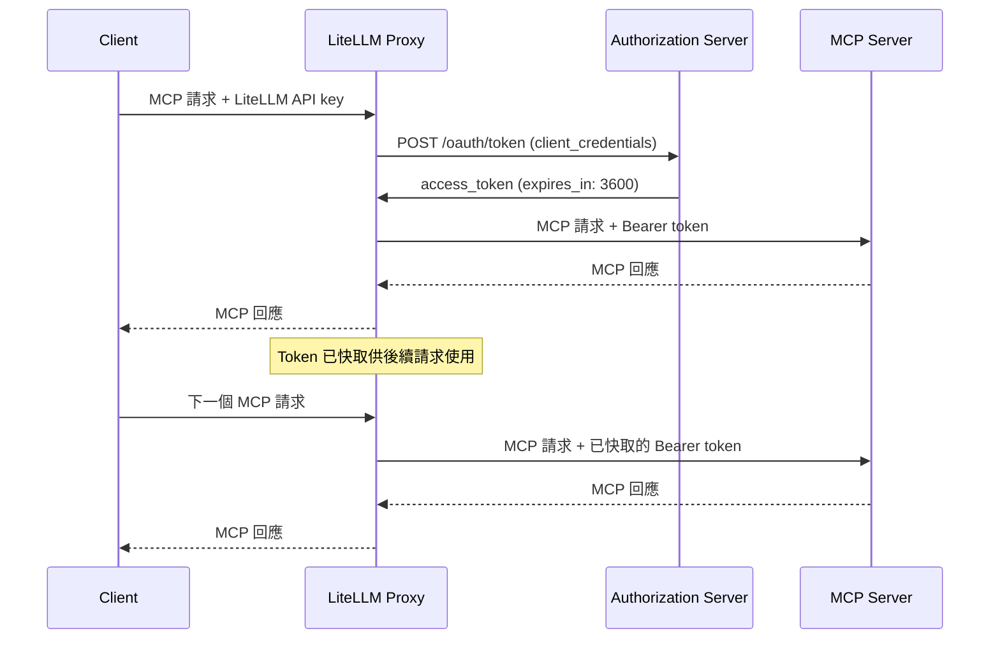
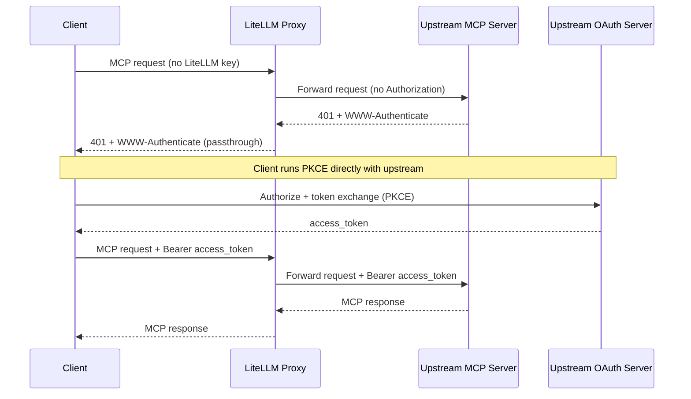

# MCP OAuth {#mcp-oauth}

LiteLLM 支援 MCP 伺服器的兩種 OAuth 2.0 流程。`config.yaml` 中的每個 `auth_type: oauth2` 伺服器都必須透過 `oauth2_flow` 宣告其使用哪一種：

| 流程 | `oauth2_flow` | 使用情境 | 運作方式 |
|------|---------------|----------|--------------|
| **互動式（PKCE）** | `authorization_code` | 面向使用者的應用程式（Claude Code、Cursor） | 基於瀏覽器的同意，每位使用者的權杖 |
| **機器對機器（M2M）** | `client_credentials` | 後端服務、CI/CD、自動化代理程式 | `client_credentials` 授權，代理管理的權杖 |
| **代替他方（OBO）** | n/a（使用 `auth_type: oauth2_token_exchange`） | 對受保護 MCP 伺服器的使用者情境工具請求 | LiteLLM 會將呼叫端權杖交換為具範圍限制的 MCP 權杖。請參閱 [MCP OBO Auth](./mcp_obo_auth.md)。 |

## 互動式 OAuth（PKCE） {#interactive-oauth-pkce}

對於面向使用者的 MCP 用戶端（Claude Code、Cursor），LiteLLM 支援完整的帶有 PKCE 的 OAuth 2.0 授權碼流程。

### 設定 {#setup}

```yaml title="config.yaml" showLineNumbers
mcp_servers:
  github_mcp:
    url: "https://api.githubcopilot.com/mcp"
    auth_type: oauth2
    oauth2_flow: authorization_code
    client_id: os.environ/GITHUB_OAUTH_CLIENT_ID
    client_secret: os.environ/GITHUB_OAUTH_CLIENT_SECRET
```

[**請參閱 Claude Code 教學**](./tutorials/claude_responses_api#connecting-mcp-servers)

### 運作方式 {#how-it-works}

```mermaid
sequenceDiagram
    participant Browser as 使用者代理程式（瀏覽器）
    participant Client as 用戶端
    participant LiteLLM as LiteLLM Proxy
    participant MCP as MCP Server（資源伺服器）
    participant Auth as 授權伺服器

    Note over Client,LiteLLM: 步驟 1 – 資源探索
    Client->>LiteLLM: GET /.well-known/oauth-protected-resource/{mcp_server_name}/mcp
    LiteLLM->>Client: 回傳資源中繼資料

    Note over Client,LiteLLM: 步驟 2 – 授權伺服器探索
    Client->>LiteLLM: GET /.well-known/oauth-authorization-server/{mcp_server_name}
    LiteLLM->>Client: 回傳授權伺服器中繼資料

    Note over Client,Auth: 步驟 3 – 動態用戶端註冊
    Client->>LiteLLM: POST /{mcp_server_name}/register
    LiteLLM->>Auth: 轉送註冊請求
    Auth->>LiteLLM: 發出用戶端憑證
    LiteLLM->>Client: 回傳用戶端憑證

    Note over Client,Browser: 步驟 4 – 使用者授權（PKCE）
    Client->>Browser: 開啟授權 URL + code_challenge + resource
    Browser->>Auth: 授權請求
    Note over Auth: 使用者授權
    Auth->>Browser: 重新導向並附上授權碼
    Browser->>LiteLLM: 帶著 code 回呼到 LiteLLM
    LiteLLM->>Browser: 重新導向回去並附上授權碼
    Browser->>Client: 帶著授權碼回呼

    Note over Client,Auth: 步驟 5 – 權杖交換
    Client->>LiteLLM: 權杖請求 + code_verifier + resource
    LiteLLM->>Auth: 轉送權杖請求
    Auth->>LiteLLM: 存取（以及重新整理）權杖
    LiteLLM->>Client: 回傳權杖

在 Client 與 MCP 之上：步驟 6 – 已驗證的 MCP 請求
    Client->>LiteLLM: 帶有 access token + LiteLLM API key 的 MCP 請求
    LiteLLM->>MCP: 帶有 Bearer token 的 MCP 請求
    MCP-->>LiteLLM: MCP 回應
    LiteLLM-->>Client: 傳回 MCP 回應
```

**參與者**

- **Client** -- 啟動 OAuth 探索、授權與工具呼叫、代表使用者操作的具備 MCP 功能的 AI 代理程式（例如 Claude Code、Cursor，或其他 IDE/代理程式）。
- **LiteLLM Proxy** -- 在保護已儲存憑證的同時，處理所有 OAuth 探索、註冊、token 交換與 MCP 流量。
- **Authorization Server** -- 透過動態用戶端註冊、PKCE 授權與 token 端點發出 OAuth 2.0 token。
- **MCP Server (Resource Server)** -- 接收 LiteLLM 已驗證 JSON-RPC 請求的受保護 MCP 端點。
- **User-Agent (Browser)** -- 暫時參與其中，讓最終使用者可在授權步驟中授予同意。

**流程步驟**

1. **資源探索**：用戶端會從 LiteLLM 的 `.well-known/oauth-protected-resource` 端點擷取 MCP 資源中繼資料，以了解範圍與功能。
2. **授權伺服器探索**：用戶端透過 LiteLLM 的 `.well-known/oauth-authorization-server` 端點取得 OAuth 伺服器中繼資料（token 端點、authorization 端點、支援的 PKCE 方法）。
3. **動態用戶端註冊**：用戶端透過 LiteLLM 註冊，而 LiteLLM 會將請求轉送至授權伺服器（RFC 7591）。如果提供者不支援動態註冊，您可以在 LiteLLM 中預先儲存 `client_id`/`client_secret`（例如 GitHub MCP），流程會以相同方式進行。
4. **使用者授權**：用戶端啟動瀏覽器工作階段（含 code challenge 與 resource hints）。使用者核准存取後，授權伺服器會透過 LiteLLM 將 code 傳回給用戶端。
5. **Token 交換**：用戶端以 authorization code、code verifier 與 resource 呼叫 LiteLLM。LiteLLM 會與授權伺服器交換這些資訊，並傳回已核發的 access/refresh tokens。
6. **MCP 呼叫**：有了有效 token 後，用戶端會將 MCP JSON-RPC 請求（以及 LiteLLM API key）送至 LiteLLM，LiteLLM 再將其轉送至 MCP server，並轉遞工具回應。

如需其他參考，請參閱官方 [MCP Authorization Flow](https://modelcontextprotocol.io/specification/2025-06-18/basic/authorization#authorization-flow-steps)。

### 反向代理與 ingress 設定 {#reverse-proxy-and-ingress-configuration}

如果 LiteLLM 執行於 TLS 終止型 ingress（Kubernetes、ALB、nginx、Cloudflare 等）之後，proxy 需要知道其公開 origin，才能讓 OAuth `authorize` 端點比較瀏覽器提供的 `redirect_uri`（例如 `https://llm.example.com/ui/mcp/oauth/callback`）與其自身的 scheme + host + port。如果 proxy 解析到其內部位址（`http://<pod-ip>:4000`），相同來源檢查就會失敗，而 MCP server 頁面上的 **Connect** 按鈕會回傳 `400 Bad Request` 與 `{"detail":"invalid_request"}`。

最簡單且建議的修正方式，是將 `PROXY_BASE_URL` 設為使用者在網址列中看到的精確 origin：

```bash
PROXY_BASE_URL=https://llm.example.com
```

此值規則：

- 只能是完整 origin：scheme + host（+ 若非預設則含 port）。
- 不可有結尾斜線，也不可包含 path 元件。
- 必須與網址列完全一致。`https://llm.example.com` 與 `https://llm.example.com:443` 會被視為相同的 origin（預設 port 會被正規化移除），但 `https://llm.example.com` 不會與執行於 `https://llm.example.com:8443` 的瀏覽器相符。

當設定了 `PROXY_BASE_URL` 時，LiteLLM 會直接使用它，並略過下方所述的 `X-Forwarded-*` 信任路徑。

#### Origin 解析順序 {#origin-resolution-order}

對於 MCP OAuth 端點，LiteLLM 會依下列順序解析 proxy 的公開 origin：

1. **`PROXY_BASE_URL` env var** — 若設定且為有效的 `http(s)` URL，則會原樣使用。無效值會被忽略並記錄警告。
2. **`X-Forwarded-Proto` / `X-Forwarded-Host` / `X-Forwarded-Port`** — 僅在 **同時** [`use_x_forwarded_for`](./proxy/config_settings#general_settings---reference) 為 `true` **且** 請求對等端的 IP 落在 [`mcp_trusted_proxy_ranges`](./proxy/config_settings#general_settings---reference) 內時才會接受。若在未設定 `mcp_trusted_proxy_ranges` 的情況下啟用 `use_x_forwarded_for`，則這些標頭不會被信任（因為無法區分受信任的反向 proxy 與直接攻擊者）。
3. **`request.base_url`** — FastAPI 在請求上看到的字面 URL。對於經由 ingress 的部署，這通常是 `http://<internal-host>:4000`，且不會與瀏覽器 origin 相符。

如果您無法或不想設定 `PROXY_BASE_URL`，請明確設定 X-Forwarded 路徑：

```yaml title="config.yaml" showLineNumbers
general_settings:
  use_x_forwarded_for: true
  mcp_trusted_proxy_ranges:
    - "10.0.0.0/8"      # your ingress / load-balancer CIDR(s)
```

並確認您的 ingress 會送出 `X-Forwarded-Proto`、`X-Forwarded-Host`，以及（若非預設）`X-Forwarded-Port`。請參閱 [MCP OAuth 疑難排解](./mcp_troubleshoot#mcp-oauth-invalid-request) 取得診斷用 curl。

#### 允許其他第一方 redirect_uri origin {#allowing-additional-first-party-redirect_uri-origins}

如果第一方 OAuth client 位於姊妹網域（例如，`app.example.com` 上的內部 web app，向 `llm.example.com` 上的 MCP proxy 註冊），請設定 `MCP_TRUSTED_REDIRECT_ORIGINS`，以將其 origin 加入允許清單，除了 proxy 自身的 origin 之外：

```bash
MCP_TRUSTED_REDIRECT_ORIGINS=app.example.com,*.tools.example.com
```

- 以逗號分隔的 `host` 或 `host:port` 項目清單。
- 僅限 HTTPS。允許清單路徑會拒絕任何非 `https` 的 `redirect_uri`。
- `*.suffix` 項目會比對任何嚴格更深一層的 `suffix` 子網域（`*.tools.example.com` 會比對 `a.tools.example.com`，但不會比對 `tools.example.com`）。
- Loopback（`localhost`、`127.0.0.0/8`、`::1`）無論此設定為何一律接受。

這適用於您可控的第一方 OAuth 用戶端。對於標準的入口案例，請優先使用 `PROXY_BASE_URL`。

#### 為什麼會存在同源檢查 {#why-the-same-origin-check-exists}

MCP 代理程式的 `/v1/mcp/server/oauth/<server_id>/authorize` 端點會驗證呼叫端的 `redirect_uri` 是否與代理程式自身的公開來源具備相同的 scheme + host + port（或與上方的其中一個 loopback / allowlist 項目相符）。此檢查的存在是為了阻止攻擊者誘騙已登入的管理員點擊一個連結，將授權碼——例如針對 GitHub 或 Slack 這類上游受 OAuth 保護的 MCP 伺服器——經由攻擊者控制的主機轉送。相同來源（再加上明確的營運 allowlist）是與僅限 loopback 規則相同、且符合威脅模型安全的等價作法，該規則用於原生 MCP 用戶端。

`PROXY_BASE_URL` 是入口部署的正確逃逸閥，因為營運者是透過帶外方式宣告代理程式的真實公開來源，而不是要求代理程式從攻擊者可能可設定的標頭推斷。此檢查本身不會放寬。

## 機器對機器（M2M）驗證 {#machine-to-machine-m2m-auth}

LiteLLM 會使用 `client_credentials` 授權，自動擷取、快取並重新整理 OAuth2 權杖。無需手動管理權杖。

### 設定 {#setup-1}

您可以透過 LiteLLM UI 或 `config.yaml` 設定 M2M OAuth。

### UI 設定 {#ui-setup}

前往 **MCP Servers** 頁面並點擊 **+ Add New MCP Server**。


輸入您的伺服器名稱，並將傳輸類型選為 **HTTP**。


貼上 MCP 伺服器 URL。


在 **Authentication** 下選擇 **OAuth**。


將 OAuth 流程類型選為 **Machine-to-Machine (M2M)**。這適用於使用 `client_credentials` 授權的伺服器對伺服器驗證——不需要瀏覽器互動。


填入您的 OAuth 提供者提供的 **Client ID** 與 **Client Secret**。


輸入 **Token URL** —— 這是 LiteLLM 會呼叫以使用 `client_credentials` 擷取存取權杖的端點。


向下捲動並檢查伺服器 URL 與所有欄位，然後按一下 **Create MCP Server**。


建立完成後，開啟伺服器並前往 **MCP Tools** 分頁，以確認 LiteLLM 可以連線並列出可用工具。


選取一個工具（例如 **echo**）來測試。填入所需參數，然後按一下 **Call Tool**。


LiteLLM 會在幕後自動擷取 OAuth token 並呼叫工具。結果確認 M2M OAuth 流程已端對端正常運作。


### Config.yaml 設定 {#configyaml-setup}

```yaml title="config.yaml" showLineNumbers
mcp_servers:
  my_mcp_server:
    url: "https://my-mcp-server.com/mcp"
    auth_type: oauth2
    oauth2_flow: client_credentials
    client_id: os.environ/MCP_CLIENT_ID
    client_secret: os.environ/MCP_CLIENT_SECRET
    token_url: "https://auth.example.com/oauth/token"
    scopes: ["mcp:read", "mcp:write"]  # optional
```

### 運作方式 {#how-it-works-1}

1. 在第一次 MCP 請求時，LiteLLM 會 POST 到 `token_url`，並帶上 `grant_type=client_credentials`
2. 存取 token 會以 TTL = `expires_in - 60s` 快取於記憶體中
3. 後續請求會重用已快取的 token
4. 當 token 到期時，LiteLLM 會自動擷取新的 token



### 使用 Mock Server 測試 {#test-with-mock-server}

使用 [BerriAI/mock-oauth2-mcp-server](https://github.com/BerriAI/mock-oauth2-mcp-server) 進行本機測試：

```bash title="Terminal 1 - Start mock server" showLineNumbers
uv add fastapi uvicorn
python mock_oauth2_mcp_server.py  # starts on :8765
```

```yaml title="config.yaml" showLineNumbers
mcp_servers:
  test_oauth2:
    url: "http://localhost:8765/mcp"
    auth_type: oauth2
    oauth2_flow: client_credentials
    client_id: "test-client"
    client_secret: "test-secret"
    token_url: "http://localhost:8765/oauth/token"
```

```bash title="Terminal 2 - Start proxy and test" showLineNumbers
litellm --config config.yaml --port 4000

# See MCP REST API guide for full examples (server_id, tool naming, common errors)
# https://docs.litellm.ai/docs/mcp_rest_api

curl http://localhost:4000/mcp-rest/tools/list \
  -H "Authorization: Bearer sk-1234"

curl http://localhost:4000/mcp-rest/tools/call \
  -H "Content-Type: application/json" \
  -H "Authorization: Bearer sk-1234" \
  -d '{
    "server_id": "test_oauth2",
    "name": "echo",
    "arguments": {"message": "hello"}
  }'
```

### 設定參考 {#config-reference}

| 欄位 | 必填 | 說明 |
|-------|----------|-------------|
| `auth_type` | 是 | 必須為 `oauth2`。對於 RFC 8693 On-Behalf-Of，請改用 `oauth2_token_exchange`——請參閱 [MCP OBO Auth](./mcp_obo_auth.md)。 |
| `oauth2_flow` | 是 | 流程選擇器。為 `"client_credentials"`（M2M）或 `"authorization_code"`（互動式 PKCE，包含 `delegate_auth_to_upstream`）之一。對於 `auth_type: oauth2` 伺服器，在 `config.yaml` 中必填；如果缺少或無效，proxy 會拒絕啟動。透過 UI 建立的伺服器會從 OAuth 流程類型選擇器取得此值。只有在此欄位存在之前建立的舊版資料庫列，才會在請求時根據欄位形狀回退推斷；設定項目永遠不會被推斷。 |
| `client_id` | M2M 必填，互動式選填 | OAuth2 client ID。`client_credentials` 時必填。對於互動式流程，如果上游支援，可透過位於 `POST /{server_name}/register` 的 Dynamic Client Registration（RFC 7591）取得。支援 `os.environ/VAR_NAME`。 |
| `client_secret` | M2M 必填，互動式選填 | OAuth2 client secret。適用性與 `client_id` 相同。支援 `os.environ/VAR_NAME`。 |
| `token_url` | M2M 必填，互動式選填 | Token endpoint URL。LiteLLM 會對此發送 POST，用於 `client_credentials` 以及授權碼交換。 |
| `authorization_url` | 僅互動式 | 上游授權端點。存在時，LiteLLM 會將伺服器視為互動式 PKCE，並將 `GET /{server_name}/authorize` 代理到此 URL。 |
| `registration_url` | 選填 | 上游 Dynamic Client Registration 端點（RFC 7591）。存在時，`POST /{server_name}/register` 會代理到此 URL。 |
| `scopes` | 否 | 要請求的 scope 清單。對於 M2M，會合併成 token 請求中的 `scope` 參數。對於互動式，則在 authorize 請求中轉送。 |
| `token_validation` | 否 | 在 `/token` 交換之後，針對 OAuth token 回應檢查的鍵值規則字典。任何規則不符都會以 `token_validation_failed` 失敗。可用於斷言像 `{"team.enterprise_id": "T12345"}` 之類的 tenant claim。 |
| `token_storage_ttl_seconds` | 否 | 覆寫每位使用者 token 快取（互動式流程）的 TTL。若未設定，LiteLLM 會使用 token 回應中的 `expires_in - buffer`。 |

## OAuth 除錯 {#debugging-oauth}

當 LiteLLM proxy 遠端代管，且無法存取伺服器記錄時，請啟用**除錯標頭**，以在 HTTP 回應中取得已遮蔽的驗證診斷資訊。

### 啟用除錯模式 {#enable-debug-mode}

將 `x-litellm-mcp-debug: true` 標頭加入您的 MCP client 請求。

**Claude Code：**

```bash
claude mcp add --transport http litellm_proxy http://proxy.example.com/atlassian_mcp/mcp \
  --header "x-litellm-api-key: Bearer sk-..." \
  --header "x-litellm-mcp-debug: true"
```

**curl：**

```bash
curl -X POST http://localhost:4000/atlassian_mcp/mcp \
  -H "Content-Type: application/json" \
  -H "x-litellm-api-key: Bearer sk-..." \
  -H "x-litellm-mcp-debug: true" \
  -d '{"jsonrpc":"2.0","id":1,"method":"tools/list","params":{}}'
```

### 讀取除錯回應標頭 {#reading-the-debug-response-headers}

回應包含以下標頭（所有敏感值均已遮罩）：

| 標頭 | 說明 |
|--------|-------------|
| `x-mcp-debug-inbound-auth` | 顯示有哪些傳入的驗證標頭存在。 |
| `x-mcp-debug-oauth2-token` | OAuth2 權杖（已遮罩）。如果 LiteLLM 金鑰外洩，會顯示 `SAME_AS_LITELLM_KEY`。 |
| `x-mcp-debug-auth-resolution` | 使用了哪種驗證方法：`oauth2-passthrough`、`m2m-client-credentials`、`per-request-header`、`static-token`，或 `no-auth`。 |
| `x-mcp-debug-outbound-url` | 上游 MCP 伺服器 URL。 |
| `x-mcp-debug-server-auth-type` | 伺服器上設定的 `auth_type`。 |

**範例 — 健康的 OAuth2 傳遞：**

```
x-mcp-debug-inbound-auth: x-litellm-api-key=Bearer****1234; authorization=Bearer****ef01
x-mcp-debug-oauth2-token: Bearer****ef01
x-mcp-debug-auth-resolution: oauth2-passthrough
x-mcp-debug-outbound-url: https://mcp.atlassian.com/v1/mcp
x-mcp-debug-server-auth-type: oauth2
```

**範例 — LiteLLM 金鑰外洩（設定錯誤）：**

```
x-mcp-debug-inbound-auth: authorization=Bearer****1234
x-mcp-debug-oauth2-token: Bearer****1234 (SAME_AS_LITELLM_KEY - likely misconfigured)
x-mcp-debug-auth-resolution: oauth2-passthrough
x-mcp-debug-outbound-url: https://mcp.atlassian.com/v1/mcp
x-mcp-debug-server-auth-type: oauth2
```

### 常見問題 {#common-issues}

#### LiteLLM API 金鑰洩漏到 MCP 伺服器 {#litellm-api-key-leaking-to-the-mcp-server}

**症狀：** `x-mcp-debug-oauth2-token` 顯示 `SAME_AS_LITELLM_KEY`。

`Authorization` 標頭帶的是 LiteLLM API 金鑰，而不是 OAuth2 權杖。由於用戶端已經設定了 `Authorization` 標頭，OAuth2 流程根本沒有執行。

**修正：** 將 LiteLLM 金鑰移到 `x-litellm-api-key`：

```bash
# WRONG — blocks OAuth2 discovery
claude mcp add --transport http my_server http://proxy/server/mcp \
    --header "Authorization: Bearer sk-..."

# CORRECT — LiteLLM key in dedicated header, Authorization free for OAuth2
claude mcp add --transport http my_server http://proxy/server/mcp \
    --header "x-litellm-api-key: Bearer sk-..."
```

#### 未存在 OAuth2 token {#no-oauth2-token-present}

**症狀：** `x-mcp-debug-oauth2-token` 顯示 `(none)`，而 `x-mcp-debug-auth-resolution` 顯示 `no-auth`。

請確認：
1. `Authorization` 標頭**未**作為用戶端設定中的靜態標頭設定。
2. LiteLLM 設定中的 MCP 伺服器具有 `auth_type: oauth2`。
3. `.well-known/oauth-protected-resource` 端點會回傳有效的中繼資料。

#### 使用 M2M token 代替使用者 token {#m2m-token-used-instead-of-user-token}

**症狀：** `x-mcp-debug-auth-resolution` 顯示 `m2m-client-credentials`。

伺服器已設定 `client_id`/`client_secret`/`token_url`，因此 LiteLLM 取得的是機器對機器的權杖，而不是使用每位使用者的 OAuth2 權杖。若要使用每位使用者的權杖，請從伺服器設定中移除用戶端憑證。

## 將驗證委派給上游（PKCE Passthrough） {#delegate-auth-to-upstream-pkce-passthrough}

對於 OAuth2 MCP 伺服器，如果用戶端（Claude Code、Cursor、ChatGPT 等）已經直接向上游伺服器自身的 OAuth 發行者完成驗證，您可以將該路由選擇為**上游委派驗證**：LiteLLM 停止檢查自己的 API 金鑰 / SSO，並讓用戶端的 PKCE 流程端到端地與上游 MCP 伺服器執行。

當上游伺服器是誰能存取它的唯一依據，而您不希望 LiteLLM 再次對該路由進行門控時，就使用這個方式。

### 設定 {#setup-2}

```yaml title="config.yaml" showLineNumbers
mcp_servers:
  notion_mcp:
    url: "https://mcp.notion.com/mcp"
    auth_type: oauth2
    oauth2_flow: authorization_code
    delegate_auth_to_upstream: true
```

這就是全部變更。委派伺服器是互動式的，因此需要 `oauth2_flow: authorization_code`。此旗標**僅**在 `auth_type: oauth2` 時才會生效；若設定在任何其他驗證類型上，會被靜默忽略。

:::warning 僅限內部（`available_on_public_internet: false`）**以及**上游 PKCE 委派

在 **`available_on_public_internet: false`** 與 **`delegate_auth_to_upstream: true`** 搭配使用於 **`auth_type: oauth2`** 互動式伺服器（非 `oauth2_flow: client_credentials`）時，仍允許**匿名**呼叫端存取上游 OAuth2 **`/authorize`** 流程，並為相符的 MCP 路由完成 PKCE，**無需 LiteLLM API 金鑰工作階段**。這個僅限內部標記主要控制基於 IP 的探索及相關行為（[請參閱指南](./mcp_public_internet.md)）；它**不會**停用此委派繞過。

**應採取的措施：** 在上游 IdP 與網路邊緣強制執行存取控管。當兩個設定都啟用時，LiteLLM UI 會顯示警告；當伺服器從設定檔或資料庫載入時，proxy 會記錄警告。

:::

### 運作方式 {#how-it-works-2}

1. 用戶端向 LiteLLM 傳送 MCP 請求，且沒有 `x-litellm-api-key`（且可選擇性地沒有 `Authorization` 標頭）。
2. LiteLLM 偵測到請求中的每個目標伺服器都是 `auth_type: oauth2` 且具有 `delegate_auth_to_upstream: true`，因此略過其自身的 API 金鑰/SSO 檢查。
3. LiteLLM 也略過其預先 401，因此上游 MCP 伺服器自身的 `401` + `WWW-Authenticate` 流程會回傳給用戶端。
4. 用戶端直接與上游 OAuth 發行者完成 PKCE。
5. 用戶端以 `Authorization: Bearer <upstream-token>` 重新請求。LiteLLM 會原封不動地轉送。



### 失敗即關閉行為 {#fail-closed-behavior}

只有當請求解析到的**每一個**目標都明確選擇啟用時，繞過才會生效。以下任一情況都會關閉並改為執行正常的 LiteLLM 驗證：

- 伺服器的 `auth_type` 不是 `oauth2`。
- 未明確將 `delegate_auth_to_upstream` 設為 `true`。
- 請求目標為多個伺服器（`x-mcp-servers: a,b`），且其中任何一個未委派。
- 無法從 URL 路徑或 `x-mcp-servers` 標頭解析出目標伺服器。

### 安全性取捨 {#security-trade-offs}

- 此旗標會將 MCP 路由在 LiteLLM 層轉為**未經驗證**的入口。這些請求不會執行費用追蹤、每個金鑰的速率限制，以及任何依賴 `user_api_key_auth.user_id` 的防護欄。
- LiteLLM 無法判斷呼叫者是誰——這正是其目的——因此每位使用者的稽核必須來自上游 MCP 伺服器本身的記錄。
- 只有在您信任其上游 OAuth 發行者會強制執行存取控制的伺服器上才啟用此功能。

### 設定參考 {#config-reference-1}

| 欄位 | 必填 | 說明 |
|-------|----------|-------------|
| `auth_type` | 是 | 必須為 `oauth2`。否則此旗標會被忽略。 |
| `oauth2_flow` | 是 | 設為 `authorization_code`；委派會將用戶端的互動式 PKCE 流程傳遞到上游伺服器。 |
| `delegate_auth_to_upstream` | 是 | 設為 `true`，即可將此伺服器納入 PKCE 傳遞。 |
