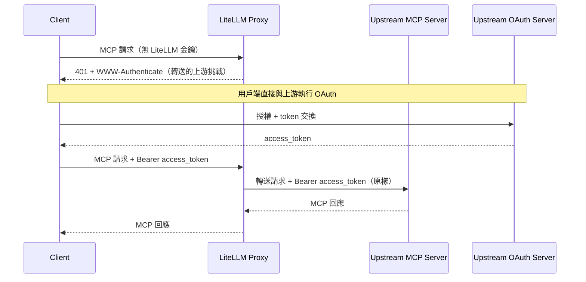
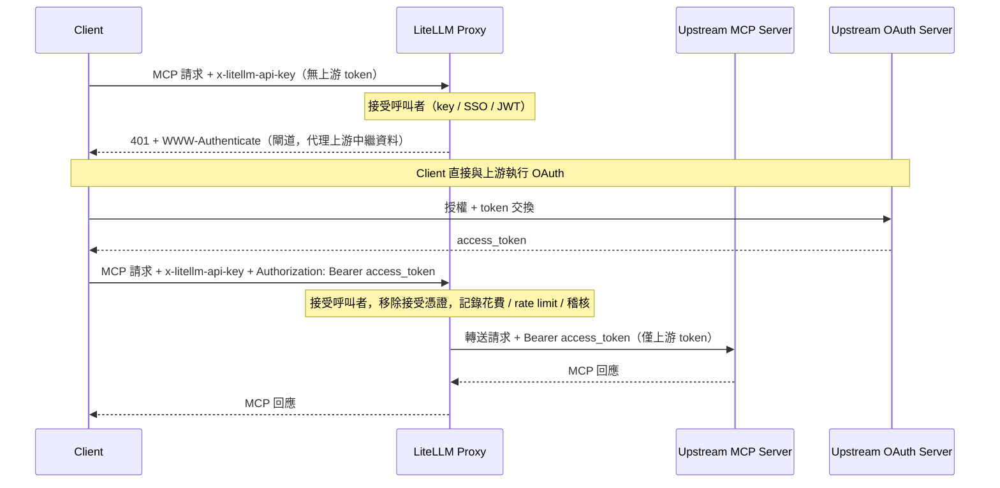
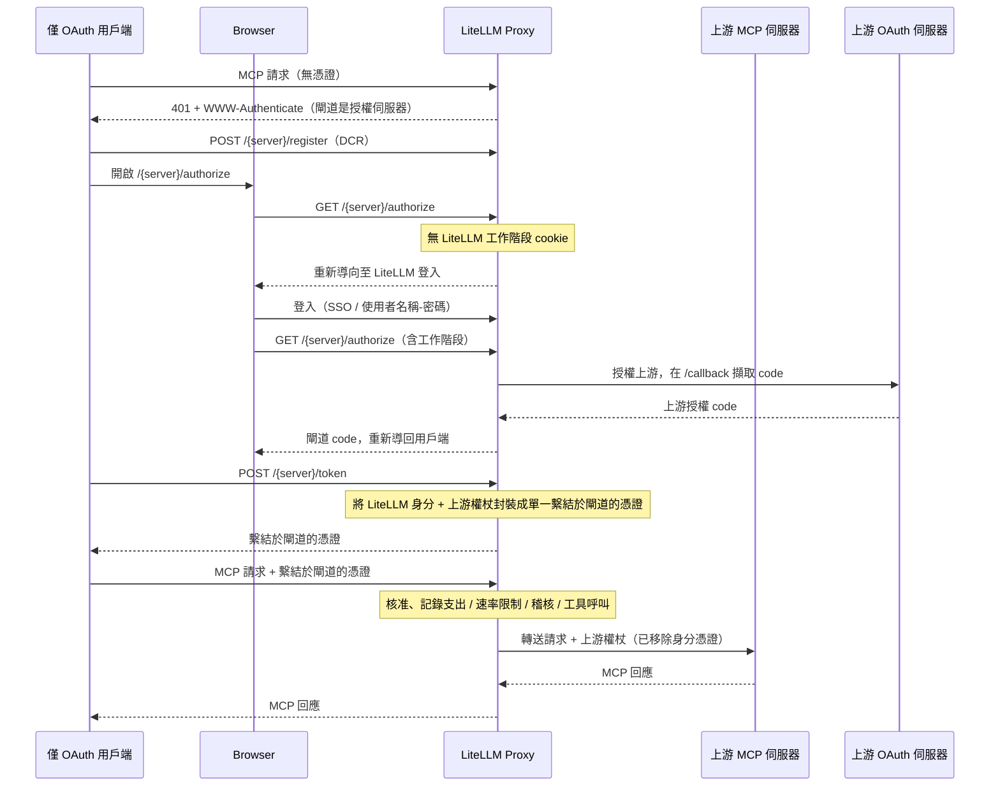

# MCP OAuth Passthrough {#mcp-oauth-passthrough}

有些 MCP 伺服器會執行自己的 OAuth 發行者，並期望用戶端（Claude Code、Cursor、ChatGPT 等）直接對其進行驗證。對於這些伺服器，LiteLLM 可以讓用戶端自己的上游 token 直接透傳，而不是由 LiteLLM 自行鑄造、儲存或重新整理任何內容。

這兩個 `auth_type` 值涵蓋了這點。它們只差一件事：LiteLLM 是否仍在自己的邊緣對呼叫者進行驗證。

| 模式 | LiteLLM 接入 | 向上游轉送的憑證 | 花費 / 速率限制 / 稽核 | 適用時機 |
|------|-------------------|-------------------------------|-----------------------------|----------|
| `true_passthrough` | 無；在 LiteLLM 層是匿名的 | 用戶端的 `Authorization`，原樣不變 | 不會記錄 | LiteLLM 應完全不加任何驗證，且上游是唯一的閘口 |
| `oauth_delegate` | 需要（LiteLLM 金鑰 / SSO / JWT） | 呼叫者隨接入一起提供的獨立上游 bearer | 會記錄，並以接入身分為索引 | 您希望 LiteLLM 繼續對路由進行閘控與觀測，而上游負責工具授權 |

這兩種模式在探索時都會原樣回傳上游的受保護資源中繼資料，因此用戶端一律會對真正的上游發行者進行授權。

兩者也都會完全按呼叫者送出的內容轉送 token。LiteLLM 不會解碼、不會檢查其 audience 或 scope，也不會交換它；驗證它的唯一一方是上游 MCP 伺服器。如果呼叫者的 token 是為了其他資源所鑄造，這兩種模式都無法讓它可用，此時您應改用 [`oauth2_token_exchange`](#audience-locked-tokens-passthrough-or-token-exchange)。

兩者還會另外採用一個互不相干的 `dcr_bridge` 旗標，來變更僅支援 OAuth 的用戶端發現其授權伺服器的位置。對於無法自行向上游 IdP 註冊或無法送出兩組獨立憑證的用戶端，請將其開啟，例如 OpenCode、Claude Code、Cursor 和 Claude Desktop。請參閱 [閘道代管登入（DCR 橋接）](#gateway-hosted-sign-in-dcr-bridge)。

## 受眾鎖定的 token：透傳或 token 交換 {#audience-locked-tokens-passthrough-or-token-exchange}

OAuth access token 會帶有一個 audience（`aud`，或其所請求的資源）。行為良好的上游 MCP 伺服器會拒絕任何 audience 指向其他內容的 token，例如代理程式為 SaaS API 取得、之後又提交給 MCP 伺服器的 token。由於 `true_passthrough` 和 `oauth_delegate` 會原樣轉送 token，這種拒絕會以回傳給用戶端的上游 `401` 形式呈現。這是正確且可避免 confused-deputy 的結果：閘道沒有把原本為某一資源鑄造的 token 洗成另一資源的存取權，這也不是 LiteLLM 的 bug 可回報。

請根據您實際持有的 token 選擇模式：

| 呼叫者的 token 是為了下列對象所鑄造 | 使用 | LiteLLM 如何處理 |
|-----------------------------------|-----|---------------------------|
| 上游 MCP 伺服器本身（用戶端對該伺服器的發行者執行 OAuth） | `true_passthrough` 或 `oauth_delegate` | 原樣轉送；由上游驗證 audience 與 scope |
| 其他資源（您的 IdP、內部 API、SaaS API），且您的 IdP 支援 RFC 8693 或 Entra On-Behalf-Of | `oauth2_token_exchange` | 將其作為 `subject_token` 傳送給 IdP，接收一個 audience 為 MCP 伺服器的 token（伺服器設定中的 `audience: ...`），快取後只轉送交換後的 token。請參閱 [MCP OBO Auth](./mcp_obo_auth.md) |
| LiteLLM 虛擬金鑰、SSO 工作階段，或僅向閘道證明身分的 IdP JWT | 兩種透傳模式都不是 | 接入憑證絕不會向上游轉送。請改為設定伺服器端憑證（`oauth2` client credentials、靜態 `authentication_token`，或 token 交換） |

實務上的測試方式：如果您必須要求 IdP 擴大 token 的 audience 才能讓上游接受，請停下來並改用 token 交換。擴大 audience 會把單一 bearer 變成多個資源的金鑰，而這些透傳模式存在的目的，正是為了讓閘道絕不代表呼叫者做這件事。

## true_passthrough {#true_passthrough}

LiteLLM 會扮演透明代理：不做接入檢查、不鑄造也不儲存任何內容，並將用戶端的 `Authorization` 原封不動地轉送。當上游才是存取的事實來源，而您不希望 LiteLLM 以雙重方式對路由進行閘控時，就適合使用它。

### 設定 {#setup}

```yaml title="config.yaml" showLineNumbers
mcp_servers:
  notion_passthrough:
    url: "https://mcp.notion.com/mcp"
    auth_type: true_passthrough
```

這就是全部設定。不需要用戶端憑證或 token endpoint，因為 LiteLLM 從不參與 token 交換。

### 運作方式 {#how-it-works}

- 用戶端送出 MCP 請求，且不帶 LiteLLM API 金鑰。
- 在尚未有上游 token 時，LiteLLM 會轉送上游自己的 `401` 與 `WWW-Authenticate`。
- 用戶端直接對上游發行者執行 OAuth。
- 用戶端以 `Authorization: Bearer <upstream-token>` 重試，LiteLLM 會不加改動地轉送它。



### 失敗封閉行為 {#fail-closed-behavior}

只有在每個目標都解析為 `true_passthrough` 時，透明路徑才會生效。以下情況會回退到一般 LiteLLM 接入：

- 伺服器的 `auth_type` 不是其他任何值。
- 請求同時指向多個伺服器（`x-mcp-servers: a,b`），且其中任何一個不是 `true_passthrough`。
- 無法從 URL 路徑或 `x-mcp-servers` 標頭解析出目標伺服器。

### 安全權衡 {#security-trade-offs}

- MCP 路由在 LiteLLM 層會變成未驗證的進入點。
- 花費追蹤、每金鑰速率限制，以及任何依賴 `user_api_key_auth.user_id` 的防護欄都不會執行。
- LiteLLM 無法辨識呼叫者身分，因此每位使用者的稽核必須來自上游伺服器的記錄。
- `available_on_public_internet: false` 在此不會新增任何驗證；它主要控制基於 IP 的探索（[請參閱指南](./mcp_public_internet.md)）。
- 只有在您信任其上游 OAuth 發行者會強制執行存取控制的伺服器上才啟用它。

### 設定參考 {#config-reference}

| 欄位 | 必要 | 說明 |
|-------|----------|-------------|
| `auth_type` | 是 | 必須為 `true_passthrough`。 |
| `url` | 是 | 上游 MCP 伺服器 URL。 |
| `allowed_tools` | 否 | 伺服器層級的工具允許清單。由於沒有呼叫者身分，就沒有每金鑰或每團隊的工具權限，因此此清單是唯一的工具限制，且對所有呼叫者一律適用。 |

```yaml title="config.yaml" showLineNumbers
mcp_servers:
  notion_passthrough:
    url: "https://mcp.notion.com/mcp"
    auth_type: true_passthrough
    allowed_tools:
      - search
      - fetch
```

## oauth_delegate {#oauth_delegate}

LiteLLM 仍會接納呼叫者（LiteLLM API 金鑰、SSO 或 JWT），然後轉送呼叫者提供的獨立上游 bearer。LiteLLM 不會鑄造任何內容，也絕不會把接入憑證向上游轉送。當上游負責工具層級授權，但您仍希望 LiteLLM 對路由進行閘控並保留花費、速率限制與稽核歸因時，請使用它。

### 設定 {#setup-1}

```yaml title="config.yaml" showLineNumbers
mcp_servers:
  notion_delegate:
    url: "https://mcp.notion.com/mcp"
    auth_type: oauth_delegate
```

與 `true_passthrough` 的原因相同，不需要用戶端憑證。不同之處在於請求：呼叫者會送出兩組憑證。

### 運作方式 {#how-it-works-1}

- 呼叫者以 `x-litellm-api-key` 中的 LiteLLM 憑證進行接入。
- 上游 token 放在 `Authorization` 中（若為彙總請求，則放在 `x-mcp-<alias>-authorization` 中）。
- LiteLLM 驗證接入後，只轉送上游 bearer，絕不轉送接入憑證。
- 在尚未有上游 token 時，LiteLLM 會回傳一個指向閘道 `oauth-protected-resource` well-known 的 `401`，而該 well-known 會原樣代理上游中繼資料。



:::warning[請將兩個憑證分開放在不同標頭中]

如果呼叫者在 `Authorization` 中送出單一憑證，且沒有 `x-litellm-api-key`，LiteLLM 會將其視為接受憑證（虛擬 key、IdP JWT，或 SSO 工作階段 token），且絕不會將其轉送到上游。這是避免 LiteLLM 或 IdP token 遭洩漏到第三方 MCP 伺服器的防護。

:::

### 安全性權衡 {#security-trade-offs-1}

- 接受流程一律會執行，因此沒有匿名入口。
- 花費、rate limit 與稽核會根據接受身分解析。
- LiteLLM 會原封不動轉送上游 token 而不檢查，因此上游仍然負責工具層級的授權與 token 驗證。

### 設定參考 {#config-reference-1}

| 欄位 | 必填 | 說明 |
|-------|------|------|
| `auth_type` | 是 | 必須為 `oauth_delegate`。 |
| `url` | 是 | 上游 MCP 伺服器 URL。 |

在請求時：接受在 `x-litellm-api-key` 中，上游 token 在 `Authorization: Bearer <upstream-token>` 中（或在聚合請求中，特定伺服器的 `x-mcp-<alias>-authorization` 中）。

因為接受流程會執行，所以完整的 LiteLLM 權限模型會套用在上游所強制執行的任何規則之上：[每個 key 與每個團隊的工具權限](./mcp_control.md#per-entity-tool-level-permissions)、伺服器層級的 `allowed_tools` 清單、每個 key 的 rate limit，以及在被接受的身分下對每次工具呼叫進行花費記錄。

## 多伺服器聚合請求 {#multi-server-aggregate-requests}

對聚合 `/mcp` 端點的請求（或帶有 `x-mcp-servers: a,b` 的請求）會分流到多個上游，但該請求只能攜帶一個 `Authorization` 標頭。如果其中兩個上游都會轉送呼叫者的 token，將這一個標頭同時送給兩者，就會把單一 bearer 在不相關的資源之間重放（這正是 cross-resource replay RFC 9700 所警告的）。因此，LiteLLM 對聚合範圍內的 `true_passthrough` 與 `oauth_delegate` 伺服器套用兩項規則。

使用 `x-mcp-{alias}-authorization` 將一個上游 token 綁定到一個伺服器。別名會轉為小寫，且 `a-z0-9_` 之外的任何字元都會變成 `_`，因此別名為 `Jira Cloud` 的伺服器會以 `x-mcp-jira_cloud-authorization` 來指定。值會原封不動轉送，因此請包含 scheme（`Bearer <token>`）。每個伺服器的標頭絕不會被保留，無論任何操作皆然，因為每個標頭都明確指定了唯一的接收者。

請求範圍內的 `Authorization` 會在清單分流（`tools/list`，以及 prompt 與資源清單）時，若同一範圍內的另一個伺服器也會消耗它，則不會轉送給由用戶端轉送的伺服器。那台伺服器此時會以沒有上游憑證的狀態列出，因此需要憑證的伺服器會回傳其 `401`，而聚合會吸收該回應（見下文）。明確指定的操作，例如在命名工具上的 `tools/call`、像 `/{server_name}/mcp` 這類單一伺服器路由，或只有一個伺服器會轉送呼叫者 token 的聚合範圍，則不受影響：用戶端已指定唯一接收者，因此請求範圍內的標頭會轉送給它。

實務上，這就是為什麼一個對多個上游都有效的單一 bearer，可以透過聚合端點執行工具，卻不會出現在聚合 `tools/list` 中：工具呼叫會指定一個伺服器，清單則不會。解法是改為針對每個伺服器分別送出 token，而不是以請求範圍送出。

```bash title="Aggregate tools/list with per-server tokens" showLineNumbers
curl -X POST "https://litellm.example.com/mcp" \
  -H "Content-Type: application/json" \
  -H "x-litellm-api-key: Bearer $LITELLM_API_KEY" \
  -H "x-mcp-servers: jira,confluence" \
  -H "x-mcp-jira-authorization: Bearer <token-for-jira>" \
  -H "x-mcp-confluence-authorization: Bearer <token-for-confluence>" \
  -d '{"jsonrpc":"2.0","id":1,"method":"tools/list","params":{}}'
```

在兩個每伺服器標頭上送出相同的 token 值，是您按伺服器明確做出的決定，而 LiteLLM 會遵循。它拒絕做的是，代替您決定，將一個未指定對象的 `Authorization` 分流出去。

對於 `true_passthrough` 還有另一項限制：只有當範圍內每個伺服器都是 `true_passthrough` 時，透明接受路徑才會啟用。若在聚合中混入一個 `true_passthrough` 伺服器與任何其他模式，則會退回一般 LiteLLM 接受流程，因此呼叫者需要為該請求提供 LiteLLM 憑證。

## 在 Admin UI 中預覽工具 {#previewing-tools-in-the-admin-ui}

LiteLLM 對這些伺服器不持有上游 token，因此建立與編輯表單無法自行列出工具。這兩個表單都會為 `true_passthrough` 與 `oauth_delegate` 顯示「Authorize & Fetch Tools（僅瀏覽器）」按鈕。它會在管理員的瀏覽器中執行上游 OAuth 流程，並只將產生的 token 保留在該瀏覽器工作階段中，將其按伺服器轉送給工具預覽以及設定 `allowed_tools`。該 token 不會寫入伺服器列、不會寫入每個使用者的憑證儲存區，也不會寫入任何快取；關閉分頁後便會丟棄。

按鈕旁邊可選的 OAuth Client ID 與 Client Secret 則不同：它們會隨伺服器一起作為宣告式設定儲存。當上游 issuer 不支援動態用戶端註冊，且每位管理員都應透過一個預先註冊的應用程式授權時，請設定它們。

## 刻意的限制 {#intentional-limits}

以下這些是原封不動轉送 token 而不檢查所造成的結果，屬於設計如此，而非缺陷。

在多伺服器聚合中，沒有每個伺服器「需要重新驗證」的訊號。單一伺服器路由會如實轉送上游的 `401` 與 `WWW-Authenticate`，但聚合會將某個伺服器的驗證失敗吸收為該伺服器的空白清單，因此其餘伺服器仍可列出。當您需要查看是哪個上游拒絕了 token 時，請使用單一伺服器路由，或每伺服器標頭。

受 sender 約束的 tokens（DPoP，RFC 9449，或 mTLS-bound tokens，RFC 8705）無法轉送。該綁定證明請求來自取得該 token 的 TLS 用戶端或金鑰持有人，而第 7 層 proxy 兩者皆非。上游會拒絕它們；請為 MCP 伺服器取得一般 bearer，或使用 token 交換。

已撤銷的 tokens 不會在連線時被偵測到。LiteLLM 不會保留任何關於已轉送 token 的狀態，也不會 introspect 它，因此在發行端已撤銷的 token，仍會被轉送，並在使用它的請求上被上游拒絕。屆時用戶端會看到上游的 `401`，就如同直接與上游通訊一樣。

## Gateway 托管登入（DCR 橋接） {#gateway-hosted-sign-in-dcr-bridge}

僅支援 OAuth 的 MCP 用戶端（OpenCode、Claude Code、Cursor、Claude Desktop）會透過對 discovery 中繼資料所宣告的任一授權伺服器執行單一 Dynamic Client Registration（RFC 7591）加上 PKCE 流程來連線。它們：

- 沒有預先由上游 IdP 提供的用戶端憑證。
- 無法在上游 token 旁再送出獨立的 LiteLLM 憑證。

因此，純粹的 `true_passthrough` 請求與雙標頭 `oauth_delegate` 請求都不適用於它們。`dcr_bridge` 標誌解決了這個落差：

- **On:** LiteLLM 在 discovery 期間宣告自己為授權伺服器，並代管 `/{server_name}/register`、`/{server_name}/authorize` 與 `/{server_name}/token`。用戶端會透過 gateway 註冊並登入，而 LiteLLM 會在這些端點背後執行上游 OAuth。
- **Off:** LiteLLM 原封不動轉送上游伺服器自己的 OAuth 中繼資料。適用於已在上游 IdP 註冊，或可直接對其執行 DCR 的用戶端。

設定位置：

- 僅對 `true_passthrough` 與 `oauth_delegate` 有效；在建立、更新與設定載入時，其他任何 `auth_type` 都會被拒絕。
- 在 Admin UI 中，它是 MCP 伺服器表單上的「Gateway 托管登入（DCR 橋接）」切換，對這兩種模式預設為開啟。
- 在設定中，它是一個布林欄位。

### 含橋接的 true_passthrough {#true_passthrough-with-the-bridge}

```yaml title="config.yaml" showLineNumbers
mcp_servers:
  miro:
    url: "https://mcp.miro.com/"
    transport: http
    auth_type: true_passthrough
    dcr_bridge: true
```

供僅支援 OAuth 的用戶端使用的透明選項：

- 用戶端將閘道視為其授權伺服器來發現，並透過 `POST /{server_name}/register` 註冊。
- 它針對 `GET /{server_name}/authorize` 和 `POST /{server_name}/token` 執行 PKCE。
- 若上游支援 DCR，LiteLLM 會將用戶端的註冊轉送給上游。
- 若伺服器未儲存 `client_id`，LiteLLM 會為此流程鑄造一個暫時性用戶端，且不保留任何內容。
- 不涉及 LiteLLM 登入，也不會記錄呼叫者身分或支出。

### oauth_delegate 與橋接 {#oauth_delegate-with-the-bridge}

```yaml title="config.yaml" showLineNumbers
mcp_servers:
  miro:
    url: "https://mcp.miro.com/"
    transport: http
    auth_type: oauth_delegate
    dcr_bridge: true
```

此組合會讓 LiteLLM 保持在僅 OAuth 用戶端的可觀測性路徑中，因此支出、速率限制、稽核，以及每次工具呼叫的歸屬都能正常解析。當您想在 LiteLLM 中查看呼叫者使用了哪個伺服器以及呼叫了哪些工具時，就選用它。

僅 OAuth 用戶端無法在內嵌時提供 LiteLLM 金鑰，因此身分改由 LiteLLM 瀏覽器工作階段提供：

- 在授權步驟中，LiteLLM 會尋找 LiteLLM UI 工作階段 cookie。
- 若沒有 cookie，會先重新導向至 LiteLLM 登入（`/sso/key/generate`）。
- 登入後，使用者會重新啟動連線。
- LiteLLM 會將該身分與上游權杖封裝為一個繫結於閘道的憑證。
- 用戶端會儲存該憑證，並在之後每次請求時重放；存取、支出與稽核都會以此為依據。

:::warning[兩個必要條件]

- **閘道需要可正常運作的瀏覽器登入**（SSO 或使用者名稱／密碼）。若沒有，便沒有可繫結的身分，且授權步驟無法進行。缺少閘道登入通常是 `oauth_delegate` 橋接連線卡在登入頁面的原因。
- **用戶端的 OAuth 流程必須在互動式瀏覽器工作階段中執行。** OpenCode、Claude Code、Cursor，以及 Claude Desktop 都是如此。

若要完全以腳本化、非互動方式委派，請關閉 `dcr_bridge`，並改用雙標頭 `oauth_delegate` 請求。

:::



### 選擇旗標 {#choosing-the-flag}

| 情境 | `dcr_bridge` |
|-----------|--------------|
| 一個僅 OAuth 的用戶端（OpenCode、Claude Code、Cursor、Claude Desktop、ChatGPT），其沒有任何上游 `client_id`，且無法傳送兩個憑證 | `true` |
| 已向上游 IdP 註冊的用戶端，或直接對上游執行 DCR 的用戶端 | `false` |
| 可傳送 `x-litellm-api-key` 加上上游 `Authorization` bearer 的腳本化、非互動式呼叫者 | `false`，並搭配 `auth_type: oauth_delegate`（雙標頭形式） |

### 連接用戶端 {#connecting-a-client}

- 將用戶端指向 `https://<gateway-host>/<server_name>/mcp`，並讓其從該處發現 OAuth。
- 請勿在用戶端上設定 `client_id` 或密鑰；由閘道負責註冊與權杖交換。
- 在 `true_passthrough` 橋接伺服器上，瀏覽器流程只會向上游進行授權。
- 在 `oauth_delegate` 橋接伺服器上，會先登入 LiteLLM，然後再向上游授權。

請遵循各用戶端自己的 MCP 文件以取得確切欄位名稱，這些名稱會隨時間變動。

Claude Code 會在首次使用時註冊並執行瀏覽器流程：

```bash
claude mcp add --transport http miro https://<gateway-host>/miro/mcp
```

Cursor 會從 `~/.cursor/mcp.json` 讀取遠端 MCP 伺服器：

```json
{
  "mcpServers": {
    "miro": {
      "url": "https://<gateway-host>/miro/mcp"
    }
  }
}
```

OpenCode 會從 `opencode.json` 讀取它們：

```json
{
  "mcp": {
    "miro": {
      "type": "remote",
      "url": "https://<gateway-host>/miro/mcp",
      "enabled": true
    }
  }
}
```

### 設定參考 {#config-reference-2}

| 欄位 | 必填 | 說明 |
|-------|----------|-------------|
| `auth_type` | 是 | 必須是 `true_passthrough` 或 `oauth_delegate`；`dcr_bridge` 會拒絕任何其他值。 |
| `url` | 是 | 上游 MCP 伺服器 URL。 |
| `dcr_bridge` | 是 | `true`，因此閘道會為僅 OAuth 用戶端代管登入。關閉則改為轉送上游自己的 OAuth 中繼資料。 |

## 將授權委派給上游（PKCE 透傳） {#delegate-auth-to-upstream-pkce-passthrough}

:::warning[已棄用]

`delegate_auth_to_upstream` 是 client-forwarded OAuth 的原始旗標式形式，現已棄用。它不再能繞過 LiteLLM 存取控制：在目前版本中，LiteLLM 對任何攜帶 bearer 的請求仍然要求其自身的 API 金鑰、SSO 或 JWT，且當伺服器載入 `auth_type: oauth2` 與 `delegate_auth_to_upstream: true` 時，proxy 會記錄棄用警告。新伺服器應使用 `auth_type: oauth_delegate`（需要存取控制，上游權杖會被轉送）或 `auth_type: true_passthrough`（不需存取控制）。既有設定應遷移至這兩者之一。下方章節說明這個舊旗標仍會做什麼。

:::

對於 OAuth2 MCP 伺服器，若用戶端直接對上游伺服器自己的 OAuth issuer 進行驗證，這個舊旗標可讓無憑證用戶端透過 LiteLLM 抵達上游的 OAuth challenge，以便開始 PKCE。一旦用戶端持有上游權杖，就必須同時提供 LiteLLM 憑證，與 `oauth_delegate` 完全相同。

### 設定 {#setup-2}

```yaml title="config.yaml" showLineNumbers
mcp_servers:
  notion_mcp:
    url: "https://mcp.notion.com/mcp"
    auth_type: oauth2
    oauth2_flow: authorization_code
    delegate_auth_to_upstream: true
```

委派伺服器是互動式的，因此會採用 `oauth2_flow: authorization_code`。此旗標**僅**在 `auth_type: oauth2` 時才會生效；將其設定於任何其他驗證類型時會被靜默忽略。

:::warning[僅限內部（`available_on_public_internet: false`）與匿名發現步驟]

`available_on_public_internet: false` 不會讓無憑證的冷啟動變成已驗證。沒有 `Authorization` 標頭的匿名呼叫者，仍可到達相符的 `auth_type: oauth2` 伺服器之上游 OAuth2 `/authorize` challenge，前提是該伺服器為 `delegate_auth_to_upstream: true`（而非 `oauth2_flow: client_credentials`）。內部限用旗標主要控制基於 IP 的發現與相關行為（[請參閱指南](./mcp_public_internet.md)）。工具呼叫不受影響：任何攜帶 bearer 的請求都會經過 LiteLLM 存取控制。

:::

### 運作方式 {#how-it-works-2}

1. 用戶端向 LiteLLM 傳送 MCP 請求，且沒有 `Authorization` 標頭和 `x-litellm-api-key`。
2. 因為每個目標伺服器都以 `delegate_auth_to_upstream: true` 設為 `auth_type: oauth2`，LiteLLM 會匿名核准這個無憑證請求，讓上游自己的 `401` + `WWW-Authenticate` 流程回到用戶端。
3. 用戶端直接與上游 OAuth issuer 完成 PKCE。
4. 用戶端以 `Authorization: Bearer <upstream-token>` 重試。LiteLLM 會對此請求執行自己的存取控制。由於沒有 LiteLLM 憑證，請求會以 `401` 失敗；用戶端必須在 `x-litellm-api-key` 中連同上游 bearer 一起傳送 LiteLLM 金鑰，這就是 `oauth_delegate` 請求形狀。
5. 一旦核准，LiteLLM 會不變地轉送上游 bearer，且絕不轉送 LiteLLM 憑證。

```mermaid
sequenceDiagram
    participant Client
    participant LiteLLM as LiteLLM Proxy
    participant MCP as 上游 MCP 伺服器
    participant Auth as 上游 OAuth 伺服器

    Client->>LiteLLM: MCP 請求（完全沒有憑證）
    LiteLLM->>MCP: 轉送請求（無 Authorization）
    MCP-->>LiteLLM: 401 + WWW-Authenticate
    LiteLLM-->>Client: 401 + WWW-Authenticate（透傳）

注意，Client 與 Auth：Client 直接與上游執行 PKCE
    Client->>Auth: 授權 + token 交換（PKCE）
    Auth-->>Client: access_token

    Client->>LiteLLM: MCP 請求 + Bearer access_token（無 LiteLLM key）
    LiteLLM-->>Client: 401（需要 LiteLLM admission）

    Client->>LiteLLM: MCP 請求 + x-litellm-api-key + Bearer access_token
    注意，LiteLLM：允許呼叫端，移除 admission 憑證
    LiteLLM->>MCP: 轉送請求 + Bearer access_token
    MCP-->>LiteLLM: MCP 回應
    LiteLLM-->>Client: MCP 回應
```

### Fail-Closed 行為 {#fail-closed-behavior-1}

匿名冷啟動只會在請求不帶 bearer 且**所有**目標都選擇加入時觸發。以下情況會執行正常的 LiteLLM 驗證：

- 請求帶有 `Authorization` 標頭（任何 bearer，包括上游 token）。
- 伺服器的 `auth_type` 不是 `oauth2` 以外的任何值。
- `delegate_auth_to_upstream` 沒有明確設為 `true`。
- 伺服器的有效 `oauth2_flow` 是 `client_credentials`。
- 請求目標為多個伺服器（`x-mcp-servers: a,b`），且其中任何一個未委派。
- 無法從 URL 路徑或 `x-mcp-servers` 標頭解析出目標伺服器。

### 安全性取捨 {#security-trade-offs-2}

- 只有免憑證探索步驟是匿名的。工具呼叫會在 LiteLLM 身分下執行，因此花費追蹤、每個 key 的速率限制，以及防護欄都會如同 `oauth_delegate` 一樣套用。
- LiteLLM 會轉送上游 token 而不檢查它，因此上游仍負責工具層級的授權與 token 驗證。
- 由於此旗標已棄用，且在存在 bearer 時行為如同 `oauth_delegate`，請改用 `auth_type: oauth_delegate`，不要依賴它。

### 設定參考 {#config-reference-3}

| 欄位 | 必填 | 說明 |
|-------|----------|-------------|
| `auth_type` | 是 | 必須為 `oauth2`。否則此旗標會被忽略。 |
| `oauth2_flow` | 是 | 設為 `authorization_code`；委派可讓用戶端的互動式 PKCE 流程在上游伺服器上啟動。 |
| `delegate_auth_to_upstream` | 是 | 設為 `true`，以將此伺服器納入傳統委派行為。已棄用，改用 `auth_type: oauth_delegate`。 |
