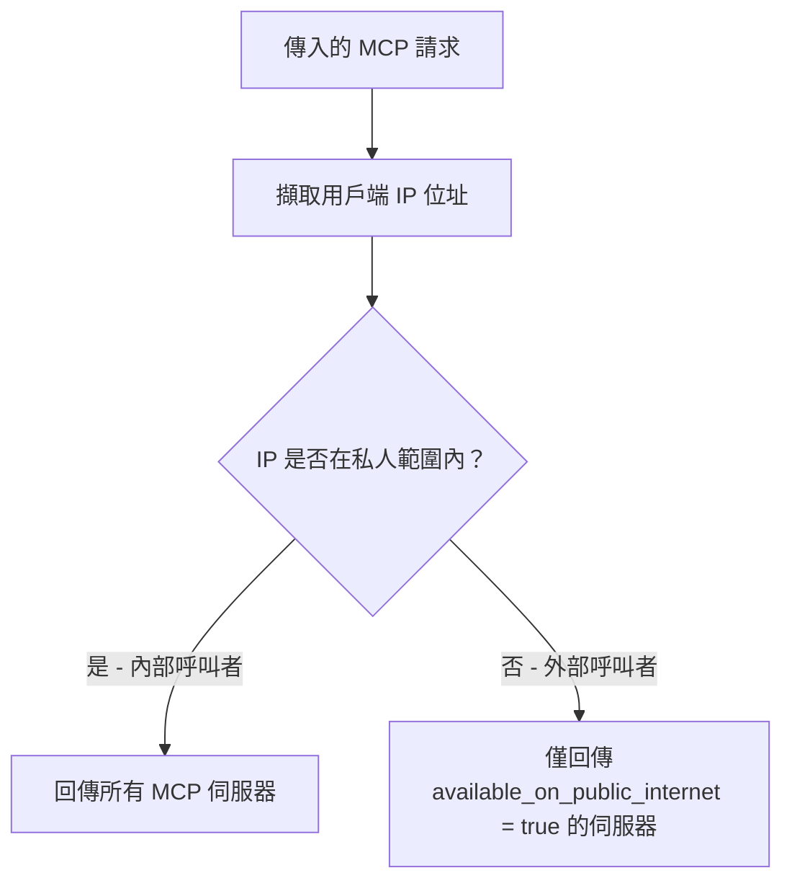

import Tabs from '@theme/Tabs';
import TabItem from '@theme/TabItem';

# 在公開網際網路上公開 MCP {#exposing-mcps-on-the-public-internet}

控制哪些 MCP 伺服器會對外部呼叫者（例如 ChatGPT、Claude Desktop）可見，哪些僅供內部呼叫者使用。當您希望部分 MCP 伺服器可公開存取，同時將敏感伺服器限制在私人網路內時，這非常有用。

## 概觀 {#overview}

| 屬性 | 詳細資訊 |
|-------|-------|
| 說明 | 針對 MCP 伺服器的基於 IP 存取控制 — 外部呼叫者只能看到標記為公開的伺服器 |
| 設定 | 每個 MCP 伺服器上的 `available_on_public_internet` |
| 網路設定 | `mcp_internal_ip_ranges` 於 `general_settings` |
| 支援的用戶端 | ChatGPT、Claude Desktop、Cursor、OpenAI API，或任何 MCP 用戶端 |

:::warning 與 `delegate_auth_to_upstream` 的互動

如果某個 MCP 伺服器是 **`available_on_public_internet: false`**（供基於 IP 探索的內部使用）**且** 具有 **`delegate_auth_to_upstream: true`** 與 **`auth_type: oauth2`**（互動式 PKCE，非 M2M），匿名呼叫者仍可在沒有 LiteLLM 工作階段的情況下使用上游 OAuth **`/authorize`** 路徑。請參閱 [MCP OAuth — 將驗證委派給上游](./mcp_oauth.md#delegate-auth-to-upstream-pkce-passthrough) 以了解詳情與緩解方式。

:::

## 運作方式 {#how-it-works}

當請求抵達 LiteLLM 的 MCP 端點時，LiteLLM 會檢查呼叫者的 IP 位址，以判定其是 **內部** 還是 **外部** 呼叫者：

1. **擷取用戶端 IP** 自傳入請求（在設定為位於反向代理後方時，支援 `X-Forwarded-For`）。
2. **將 IP 分類** 為內部或外部，方法是將其與已設定的私人 IP 範圍比對（預設為 RFC 1918：`10.0.0.0/8`、`172.16.0.0/12`、`192.168.0.0/16`、`127.0.0.0/8`）。
3. **過濾伺服器清單**：
   - **內部呼叫者** 可看到所有 MCP 伺服器（公開與私人）。
   - **外部呼叫者** 只能看到具有 `available_on_public_internet: true` 的伺服器。

此過濾會套用於每個 MCP 存取點：MCP 登錄、工具清單、工具呼叫、動態伺服器路由，以及 OAuth 探索端點。



## 操作流程 {#walkthrough}

本操作流程涵蓋兩個流程：
1. **新增公開的 MCP 伺服器**（DeepWiki）並從 ChatGPT 連線
2. **將現有伺服器設為私人**（Exa）並驗證 ChatGPT 不再看見它

### 流程 1：新增公開的 MCP 伺服器（DeepWiki） {#flow-1-add-a-public-mcp-server-deepwiki}

DeepWiki 是一個免費的 MCP 伺服器 — 很適合公開，以便 AI 閘道使用者可從 ChatGPT 存取。

#### 步驟 1：建立 MCP 伺服器 {#step-1-create-the-mcp-server}

前往 MCP Servers 頁面並點擊 **"+ Add New MCP Server"**。


建立對話框會開啟。將 **"DeepWiki"** 輸入為伺服器名稱。


在傳輸類型下拉選單中，選擇 **HTTP**，因為 DeepWiki 使用 Streamable HTTP 傳輸。


現在向下捲動到 MCP Server URL 欄位。


輸入 DeepWiki MCP URL：`https://mcp.deepwiki.com/mcp`。


完成名稱、傳輸與 URL 填寫後，基本伺服器設定即完成。


#### 步驟 2：啟用「可在公開網際網路上使用」 {#step-2-enable-available-on-public-internet}

在建立之前，向下捲動並展開 **Permission Management / Access Control** 區段。您可以在此控制誰能看見這部伺服器。


將 **"Available on Public Internet"** 開啟。這是關鍵設定 — 它告訴 LiteLLM 外部呼叫者（例如從公開網際網路連線的 ChatGPT）應該能夠探索並使用這部伺服器。


啟用切換後，點擊 **"Create"** 以儲存伺服器。


#### 步驟 3：從 ChatGPT 連線 {#step-3-connect-from-chatgpt}

現在讓我們驗證它是否可運作。開啟 ChatGPT，尋找 MCP 伺服器圖示以新增連線。要使用的端點是 `<your-litellm-url>/mcp`。


在下拉選單中，選擇 **"Add an MCP server"** 以設定新連線。


ChatGPT 會要求伺服器標籤。請給它一個容易辨識的名稱，例如 "LiteLLM"。


接著輸入 Server URL。這應該是您的 LiteLLM proxy 的 MCP 端點 — `<your-litellm-url>/mcp`。


貼上您的 LiteLLM URL，並確認其看起來正確。


ChatGPT 也需要驗證。請在驗證欄位輸入您的 LiteLLM API 金鑰，以便它可以連線到 proxy。


點擊 **"Connect"** 建立連線。


ChatGPT 連線後會顯示可用工具。由於目前 DeepWiki 和 Exa 都標記為公開，ChatGPT 可以看到來自兩部伺服器的工具。


---

### 流程 2：將現有伺服器設為私人（Exa） {#flow-2-make-an-existing-server-private-exa}

現在讓我們反向操作 — 將目前公開的現有 MCP 伺服器（Exa）限制為僅內部存取。完成此變更後，ChatGPT 不應再看到 Exa 的工具。

#### 步驟 1：編輯伺服器 {#step-1-edit-the-server}

前往 MCP Servers 表格並點擊 Exa 伺服器以開啟其詳細檢視。


切換到 **"Settings"** 分頁以存取編輯表單。


編輯表單會載入 Exa 目前的設定。


#### 步驟 2：關閉「可在公開網際網路上使用」 {#step-2-toggle-off-available-on-public-internet}

向下捲動並展開 **Permission Management / Access Control** 區段，以找到公開網際網路切換。


將 **"Available on Public Internet"** 關閉。這會對您私人網路之外的任何呼叫者隱藏 Exa。


點擊 **"Save Changes"** 套用。變更會立即生效 — 不需要重新啟動 proxy。


#### 步驟 3：在 ChatGPT 中驗證 {#step-3-verify-in-chatgpt}

回到 ChatGPT 確認 Exa 已不再可見。您需要重新連線，讓 ChatGPT 重新取得工具清單。


開啟 MCP 伺服器設定並選擇新增或重新連線伺服器。


輸入與先前相同的 LiteLLM MCP URL。


設定伺服器標籤。


輸入您的 API 金鑰以進行驗證。


點擊 **"Connect"** 重新建立連線。


這次只會顯示 DeepWiki 的工具 — Exa 已消失。LiteLLM 偵測到 ChatGPT 是從公開 IP 呼叫，因為 Exa 已不再標記為公開，所以已將其過濾掉。您私人網路上的內部使用者仍然會看到兩部伺服器。


## 設定參考 {#configuration-reference}

### 每部伺服器的設定 {#per-server-setting}

<Tabs>
<TabItem value="ui" label="UI">

在建立或編輯 MCP 伺服器時，於 Permission Management 區段切換 **"Available on Public Internet"**。

</TabItem>
<TabItem value="config" label="config.yaml">

```yaml title="config.yaml" showLineNumbers
mcp_servers:
  deepwiki:
    url: https://mcp.deepwiki.com/mcp
    available_on_public_internet: true   # visible to external callers

  exa:
    url: https://exa.ai/mcp
    auth_type: api_key
    auth_value: os.environ/EXA_API_KEY
    available_on_public_internet: false  # internal only (default)
```

</TabItem>
<TabItem value="api" label="API">

```bash title="Create a public MCP server" showLineNumbers
curl -X POST <your-litellm-url>/v1/mcp/server \
  -H "Authorization: Bearer sk-..." \
  -H "Content-Type: application/json" \
  -d '{
    "server_name": "DeepWiki",
    "url": "https://mcp.deepwiki.com/mcp",
    "transport": "http",
    "available_on_public_internet": true
  }'
```

```bash title="Update an existing server" showLineNumbers
curl -X PUT <your-litellm-url>/v1/mcp/server \
  -H "Authorization: Bearer sk-..." \
  -H "Content-Type: application/json" \
  -d '{
    "server_id": "<server-id>",
    "available_on_public_internet": false
  }'
```

</TabItem>
</Tabs>

### 自訂私人 IP 範圍 {#custom-private-ip-ranges}

預設情況下，LiteLLM 會將 RFC 1918 私人範圍視為內部。您可以在 MCP Servers 底下的 **Network Settings** 分頁中自訂此設定，或透過設定：

```yaml title="config.yaml" showLineNumbers
general_settings:
  mcp_internal_ip_ranges:
    - "10.0.0.0/8"
    - "172.16.0.0/12"
    - "192.168.0.0/16"
    - "100.64.0.0/10"    # Add your VPN/Tailscale range
```

當留空時，會使用標準私人範圍（`10.0.0.0/8`、`172.16.0.0/12`、`192.168.0.0/16`、`127.0.0.0/8`）。

---

## 公網 vs MCP Hub 可見性 {#public-internet-vs-mcp-hub-visibility}

`available_on_public_internet` 與 **MCP Hub**（`GET /public/mcp_hub`）是兩個容易混淆的獨立機制：

| 顧慮 | 由誰控制 | 預設 |
|---|---|---|
| 外部（非私人 CIDR）呼叫端是否可以在 MCP 工具端點（list/call）看到此伺服器？ | 伺服器上的 `available_on_public_internet` | `True`（預設可見；切換為 `false` 可限制為私人 CIDR） |
| 此伺服器是否會出現在未驗證的 `GET /public/mcp_hub` 廣告中？ | `litellm.public_mcp_servers` 清單，受 `litellm.public_mcp_hub_strict_whitelist` 控制 | Hub 嚴格白名單預設為**開啟**——只有明確列於 `public_mcp_servers` 的伺服器才會被廣告 |

在**預設嚴格白名單模式**下，`available_on_public_internet: true`（預設）不會讓伺服器出現在 hub 中。若要在 hub 上廣告某個伺服器，您還需要將其加入 `public_mcp_servers`：

```yaml title="Server on the hub AND visible to external callers (the default)" showLineNumbers
litellm_settings:
  public_mcp_servers:
    - deepwiki
  # public_mcp_hub_strict_whitelist defaults to true

mcp_servers:
  deepwiki:
    url: https://mcp.deepwiki.com/mcp
    # available_on_public_internet defaults to true
```

如果您設定 `litellm.public_mcp_hub_strict_whitelist: false`，hub 會退回為廣告所有具有 `available_on_public_internet: true` 的伺服器——但本頁面的基於 IP 存取篩選器仍會獨立套用至實際的工具端點。
