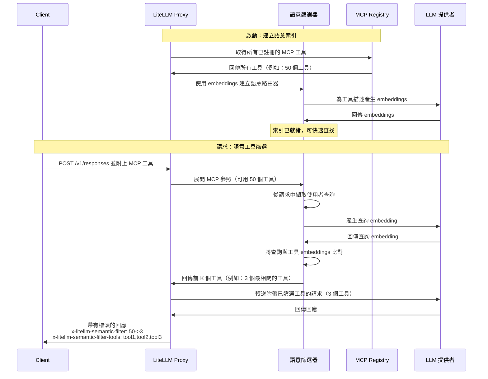

import Tabs from '@theme/Tabs';
import TabItem from '@theme/TabItem';

# MCP 語意工具篩選器 {#mcp-semantic-tool-filter}

根據語意相關性自動篩選 MCP 工具。當您註冊了許多 MCP 工具時，LiteLLM 會依據語意將使用者的查詢與工具描述進行比對，並只將最相關的工具傳送給 LLM。

## 運作方式 {#how-it-works}

工具搜尋將工具選擇從提示工程問題轉變為檢索問題。語意篩選器不再將大型靜態工具清單注入每個提示，而是：

1. 在啟動時為所有可用的 MCP 工具建立語意索引
2. 在每次請求時，將使用者的查詢與工具描述進行語意比對
3. 只將最相關的前 K 個工具回傳給 LLM

此方法可提升上下文效率、透過減少工具混淆來提高可靠性，並使其能擴展到包含數百或數千個 MCP 工具的生態系統。



## 設定 {#configuration}

在您的 LiteLLM 設定中啟用語意篩選：

```yaml title="config.yaml" showLineNumbers
litellm_settings:
  mcp_semantic_tool_filter:
    enabled: true
    embedding_model: "text-embedding-3-small"  # Model for semantic matching
    top_k: 5                                    # Max tools to return
    similarity_threshold: 0.3                   # Min similarity score
```

**設定選項：**
- `enabled` - 啟用／停用語意篩選（預設：`false`）
- `embedding_model` - 用於產生 embeddings 的模型（預設：`"text-embedding-3-small"`）
- `top_k` - 要回傳的工具數量上限（預設：`10`）
- `similarity_threshold` - 比對所需的最低相似度分數（預設：`0.3`）

## 使用方式 {#usage}

照常透過 Responses API 或 Chat Completions 使用 MCP 工具。語意篩選器會自動執行：

<Tabs>
<TabItem value="responses" label="Responses API">

```bash title="Responses API with Semantic Filtering" showLineNumbers
curl --location 'http://localhost:4000/v1/responses' \
--header 'Content-Type: application/json' \
--header "Authorization: Bearer sk-1234" \
--data '{
    "model": "gpt-4o",
    "input": [
    {
      "role": "user",
      "content": "give me TLDR of what BerriAI/litellm repo is about",
      "type": "message"
    }
  ],
    "tools": [
        {
            "type": "mcp",
            "server_url": "litellm_proxy",
            "require_approval": "never"
        }
    ],
    "tool_choice": "required"
}'
```

</TabItem>
<TabItem value="chat" label="Chat Completions">

```bash title="Chat Completions with Semantic Filtering" showLineNumbers
curl --location 'http://localhost:4000/v1/chat/completions' \
--header 'Content-Type: application/json' \
--header "Authorization: Bearer sk-1234" \
--data '{
  "model": "gpt-4o",
  "messages": [
    {"role": "user", "content": "Search Wikipedia for LiteLLM"}
  ],
  "tools": [
    {
      "type": "mcp",
      "server_url": "litellm_proxy"
    }
  ]
}'
```

</TabItem>
</Tabs>

## 回應標頭 {#response-headers}

語意篩選器會為每個回應新增診斷標頭：

```
x-litellm-semantic-filter: 10->3
x-litellm-semantic-filter-tools: wikipedia-fetch,github-search,slack-post
```

- **`x-litellm-semantic-filter`** - 顯示工具數量的前→後變化（例如：`10->3` 代表 10 個工具被篩選為 3 個）
- **`x-litellm-semantic-filter-tools`** - 已篩選工具名稱的 CSV 清單（最多 150 個字元，若更長則以 `...` 截斷）

這些標頭可幫助您了解每個請求選用了哪些工具，並驗證篩選器是否正常運作。

## 範例 {#example}

如果您註冊了 50 個 MCP 工具，並提出一個詢問 Wikipedia 的請求，語意篩選器會：

1. 將您的查詢 `"Search Wikipedia for LiteLLM"` 與全部 50 個工具描述進行語意比對
2. 選取最相關的前 5 個工具（例如：`wikipedia-fetch`、`wikipedia-search` 等）
3. 只將這 5 個工具傳送給 LLM
4. 新增顯示 `x-litellm-semantic-filter: 50->5` 的標頭

這可大幅減少提示大小，同時確保 LLM 能存取執行該任務所需的正確工具。

## 效能 {#performance}

語意篩選器針對正式環境進行最佳化：
- 路由器只在啟動時建構一次（每次請求沒有額外負擔）
- 語意比對通常少於 50ms
- 失敗時會優雅降級 - 若篩選失敗則回傳所有工具
- 對沒有 MCP 工具的請求沒有延遲影響

## 相關內容 {#related}

- [MCP 概觀](./mcp.md) - 了解 LiteLLM 中的 MCP
- [MCP 權限管理](./mcp_control.md) - 依金鑰／團隊控制工具存取權
- [使用 MCP](./mcp_usage.md) - 完整的 MCP 使用指南
