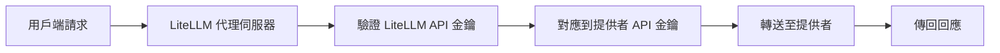

# 為什麼要使用轉接端點？ {#why-pass-through-endpoints}

這些端點適用於 2 種情境：

1. **將既有專案遷移** 到 litellm proxy。例如：如果您已經有使用 Anthropic SDK 並在正式環境中的用戶，您只需要變更 base url，就能取得成本追蹤/記錄/預算等功能。 

2. **使用特定提供者的端點**。例如：如果您想使用 [Vertex AI 的 token 計數端點](https://docs.litellm.ai/docs/pass_through/vertex_ai#count-tokens-api)

## 您的請求如何被處理？ {#how-is-your-request-handled}

請求會被轉送到提供者的端點。接著回應會傳回給用戶端。**不會進行任何轉換。**

### 請求轉送流程 {#request-forwarding-process}

1. **接收請求**：LiteLLM 會在 `/provider/endpoint` 接收您的請求
2. **驗證**：您的 LiteLLM API 金鑰會被驗證，並對應到提供者的 API 金鑰
3. **請求轉換**：請求會重新格式化以符合目標提供者的 API
4. **轉送**：請求會傳送到實際的提供者端點
5. **回應處理**：提供者回應會直接傳回給您

### 驗證流程 {#authentication-flow}

**重點：**
- 請在請求中使用您的 **LiteLLM API 金鑰**，而不是提供者的金鑰
- LiteLLM 會在內部處理提供者驗證
- 相同的驗證可用於所有轉接端點

### 錯誤處理 {#error-handling}

**提供者錯誤**：會連同原始錯誤代碼與訊息直接轉送給您

**LiteLLM 錯誤**： 
- `401`：無效的 LiteLLM API 金鑰
- `404`：不支援的提供者或端點
- `500`：內部路由/轉送錯誤

### 好處 {#benefits}

- **統一驗證**：一組 API 金鑰適用於所有提供者
- **集中式記錄**：所有請求都會透過 LiteLLM 記錄
- **成本追蹤**：跨所有端點追蹤用量
- **存取控制**：相同權限適用於轉接端點
