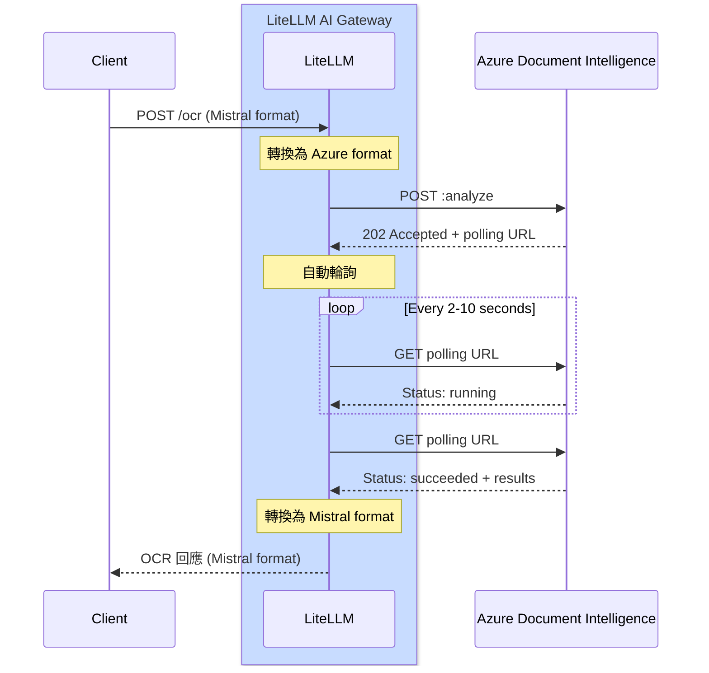

# Azure 文件智慧 OCR {#azure-document-intelligence-ocr}

## 總覽 {#overview}

| 屬性 | 詳細資訊 |
|-------|-------|
| 說明 | Azure Document Intelligence（前稱 Form Recognizer）提供進階文件分析功能，包括文字擷取、版面分析與結構辨識 |
| LiteLLM 上的提供者路由 | `azure_ai/doc-intelligence/` |
| 支援的操作 | `/ocr` |
| 提供者文件連結 | [Azure Document Intelligence ↗](https://learn.microsoft.com/en-us/azure/ai-services/document-intelligence/)

使用 Azure Document Intelligence 強大的預建模型擷取文字並分析文件結構。

## 快速開始 {#quick-start}

### **LiteLLM SDK** {#litellm-sdk}

```python showLineNumbers title="SDK Usage"
import litellm
import os

# Set environment variables
os.environ["AZURE_DOCUMENT_INTELLIGENCE_API_KEY"] = "your-api-key"
os.environ["AZURE_DOCUMENT_INTELLIGENCE_ENDPOINT"] = "https://your-resource.cognitiveservices.azure.com"

# OCR with PDF URL
response = litellm.ocr(
    model="azure_ai/doc-intelligence/prebuilt-layout",
    document={
        "type": "document_url",
        "document_url": "https://example.com/document.pdf"
    }
)

# Access extracted text
for page in response.pages:
    print(f"Page {page.index}:")
    print(page.markdown)
```

### **LiteLLM PROXY** {#litellm-proxy}

```yaml showLineNumbers title="proxy_config.yaml"
model_list:
  - model_name: azure-doc-intel
    litellm_params:
      model: azure_ai/doc-intelligence/prebuilt-layout
      api_key: os.environ/AZURE_DOCUMENT_INTELLIGENCE_API_KEY
      api_base: os.environ/AZURE_DOCUMENT_INTELLIGENCE_ENDPOINT
    model_info:
      mode: ocr
```

**啟動 Proxy**
```bash
litellm --config proxy_config.yaml
```

**透過 Proxy 呼叫 OCR**
```bash showLineNumbers title="cURL Request"
curl -X POST http://localhost:4000/ocr \
  -H "Content-Type: application/json" \
  -H "Authorization: Bearer your-api-key" \
  -d '{
    "model": "azure-doc-intel",
    "document": {
      "type": "document_url",
      "document_url": "https://arxiv.org/pdf/2201.04234"
    }
  }'
```

## 運作方式 {#how-it-works}

Azure Document Intelligence 使用非同步 API 模式。LiteLLM AI Gateway 會自動處理請求/回應轉換與輪詢。

### 完整流程圖 {#complete-flow-diagram}



### LiteLLM 為您完成的工作 {#what-litellm-does-for-you}

當您透過 SDK 呼叫 `litellm.ocr()` 或透過 Proxy 呼叫 `/ocr` 時：

1. **請求轉換**：將 Mistral OCR format 轉換 → Azure Document Intelligence format
2. **提交文件**：將轉換後的請求送至 Azure DI API
3. **處理 202 回應**：從回應標頭擷取 `Operation-Location` URL
4. **自動輪詢**： 
   - 依據 `retry-after` 標頭指定的間隔輪詢 operation URL（預設：2 秒）
   - 持續直到狀態為 `succeeded` 或 `failed`
   - 透過 `retry-after` 標頭遵守 Azure 的速率限制
5. **回應轉換**：將 Azure DI format 轉換 → Mistral OCR format
6. **返回結果**：將統一的 Mistral format 回應送回用戶端

**輪詢設定：**
- 預設逾時：120 秒
- 可透過 `AZURE_OPERATION_POLLING_TIMEOUT` 環境變數設定
- 依呼叫類型使用 sync（`time.sleep()`）或 async（`await asyncio.sleep()`）

:::info
**典型處理時間**：2-10 秒，視文件大小與複雜度而定
:::

## 支援的模型 {#supported-models}

Azure Document Intelligence 提供多種針對不同使用情境最佳化的預建模型：

### prebuilt-layout（建議） {#prebuilt-layout-recommended}

最適合需要保留結構的一般文件 OCR。

import Tabs from '@theme/Tabs';
import TabItem from '@theme/TabItem';

<Tabs>
<TabItem value="sdk" label="SDK">

```python showLineNumbers title="Layout Model - SDK"
import litellm
import os

os.environ["AZURE_DOCUMENT_INTELLIGENCE_API_KEY"] = "your-api-key"
os.environ["AZURE_DOCUMENT_INTELLIGENCE_ENDPOINT"] = "https://your-resource.cognitiveservices.azure.com"

response = litellm.ocr(
    model="azure_ai/doc-intelligence/prebuilt-layout",
    document={
        "type": "document_url",
        "document_url": "https://example.com/document.pdf"
    }
)
```

</TabItem>
<TabItem value="proxy" label="Proxy 設定">

```yaml showLineNumbers title="proxy_config.yaml"
model_list:
  - model_name: azure-layout
    litellm_params:
      model: azure_ai/doc-intelligence/prebuilt-layout
      api_key: os.environ/AZURE_DOCUMENT_INTELLIGENCE_API_KEY
      api_base: os.environ/AZURE_DOCUMENT_INTELLIGENCE_ENDPOINT
    model_info:
      mode: ocr
```

**用法：**
```bash
curl -X POST http://localhost:4000/ocr \
  -H "Authorization: Bearer your-api-key" \
  -d '{"model": "azure-layout", "document": {"type": "document_url", "document_url": "https://example.com/doc.pdf"}}'
```

</TabItem>
</Tabs>

**功能：**
- 具有 markdown 格式的文字擷取
- 表格偵測與擷取
- 文件結構分析
- 段落與章節辨識

**價格：** 每 1,000 頁 $10

### prebuilt-read {#prebuilt-read}

針對從文件讀取文字進行最佳化——速度最快且成本效益最高。

<Tabs>
<TabItem value="sdk" label="SDK">

```python showLineNumbers title="Read Model - SDK"
import litellm
import os

os.environ["AZURE_DOCUMENT_INTELLIGENCE_API_KEY"] = "your-api-key"
os.environ["AZURE_DOCUMENT_INTELLIGENCE_ENDPOINT"] = "https://your-resource.cognitiveservices.azure.com"

response = litellm.ocr(
    model="azure_ai/doc-intelligence/prebuilt-read",
    document={
        "type": "document_url",
        "document_url": "https://example.com/document.pdf"
    }
)
```

</TabItem>
<TabItem value="proxy" label="Proxy 設定">

```yaml showLineNumbers title="proxy_config.yaml"
model_list:
  - model_name: azure-read
    litellm_params:
      model: azure_ai/doc-intelligence/prebuilt-read
      api_key: os.environ/AZURE_DOCUMENT_INTELLIGENCE_API_KEY
      api_base: os.environ/AZURE_DOCUMENT_INTELLIGENCE_ENDPOINT
    model_info:
      mode: ocr
```

**用法：**
```bash
curl -X POST http://localhost:4000/ocr \
  -H "Authorization: Bearer your-api-key" \
  -d '{"model": "azure-read", "document": {"type": "document_url", "document_url": "https://example.com/doc.pdf"}}'
```

</TabItem>
</Tabs>

**功能：**
- 快速文字擷取
- 針對重度閱讀型文件最佳化
- 基本結構辨識

**價格：** 每 1,000 頁 $1.50

### prebuilt-document {#prebuilt-document}

具有鍵值組的一般用途文件分析。

<Tabs>
<TabItem value="sdk" label="SDK">

```python showLineNumbers title="Document Model - SDK"
import litellm
import os

os.environ["AZURE_DOCUMENT_INTELLIGENCE_API_KEY"] = "your-api-key"
os.environ["AZURE_DOCUMENT_INTELLIGENCE_ENDPOINT"] = "https://your-resource.cognitiveservices.azure.com"

response = litellm.ocr(
    model="azure_ai/doc-intelligence/prebuilt-document",
    document={
        "type": "document_url",
        "document_url": "https://example.com/document.pdf"
    }
)
```

</TabItem>
<TabItem value="proxy" label="Proxy 設定">

```yaml showLineNumbers title="proxy_config.yaml"
model_list:
  - model_name: azure-document
    litellm_params:
      model: azure_ai/doc-intelligence/prebuilt-document
      api_key: os.environ/AZURE_DOCUMENT_INTELLIGENCE_API_KEY
      api_base: os.environ/AZURE_DOCUMENT_INTELLIGENCE_ENDPOINT
    model_info:
      mode: ocr
```

**用法：**
```bash
curl -X POST http://localhost:4000/ocr \
  -H "Authorization: Bearer your-api-key" \
  -d '{"model": "azure-document", "document": {"type": "document_url", "document_url": "https://example.com/doc.pdf"}}'
```

</TabItem>
</Tabs>

**價格：** 每 1,000 頁 $10

## 文件類型 {#document-types}

Azure Document Intelligence 支援各種文件格式。

### PDF 文件 {#pdf-documents}

```python showLineNumbers title="PDF OCR"
response = litellm.ocr(
    model="azure_ai/doc-intelligence/prebuilt-layout",
    document={
        "type": "document_url",
        "document_url": "https://example.com/document.pdf"
    }
)
```

### 圖片文件 {#image-documents}

```python showLineNumbers title="Image OCR"
response = litellm.ocr(
    model="azure_ai/doc-intelligence/prebuilt-layout",
    document={
        "type": "image_url",
        "image_url": "https://example.com/image.png"
    }
)
```

**支援的圖片格式：** JPEG、PNG、BMP、TIFF

### Base64 編碼文件 {#base64-encoded-documents}

```python showLineNumbers title="Base64 PDF"
import base64

# Read and encode PDF
with open("document.pdf", "rb") as f:
    pdf_base64 = base64.b64encode(f.read()).decode()

response = litellm.ocr(
    model="azure_ai/doc-intelligence/prebuilt-layout",
    document={
        "type": "document_url",
        "document_url": f"data:application/pdf;base64,{pdf_base64}"
    }
)
```

## 回應格式 {#response-format}

```python showLineNumbers title="Response Structure"
# Response has the following structure
response.pages          # List of pages with extracted text
response.model          # Model used
response.object         # "ocr"
response.usage_info     # Token usage information

# Access page content
for page in response.pages:
    print(f"Page {page.index}:")
    print(page.markdown)
    
    # Page dimensions (in pixels)
    if page.dimensions:
        print(f"Width: {page.dimensions.width}px")
        print(f"Height: {page.dimensions.height}px")
```

## 非同步支援 {#async-support}

```python showLineNumbers title="Async Usage"
import litellm
import asyncio

async def process_document():
    response = await litellm.aocr(
        model="azure_ai/doc-intelligence/prebuilt-layout",
        document={
            "type": "document_url",
            "document_url": "https://example.com/document.pdf"
        }
    )
    return response

# Run async function
response = asyncio.run(process_document())
```

## 成本追蹤 {#cost-tracking}

LiteLLM 會自動追蹤 Azure Document Intelligence OCR 的成本：

| 模型 | 每 1,000 頁成本 |
|-------|---------------------|
| prebuilt-read | $1.50 |
| prebuilt-layout | $10.00 |
| prebuilt-document | $10.00 |

```python showLineNumbers title="View Cost"
response = litellm.ocr(
    model="azure_ai/doc-intelligence/prebuilt-layout",
    document={"type": "document_url", "document_url": "https://..."}
)

# Access cost information
print(f"Cost: ${response._hidden_params.get('response_cost', 0)}")
```

## 其他資源 {#additional-resources}

- [Azure Document Intelligence 文件](https://learn.microsoft.com/en-us/azure/ai-services/document-intelligence/)
- [價格詳情](https://azure.microsoft.com/en-us/pricing/details/ai-document-intelligence/)
- [支援的檔案格式](https://learn.microsoft.com/en-us/azure/ai-services/document-intelligence/concept-model-overview)
- [LiteLLM OCR 文件](https://docs.litellm.ai/docs/ocr)
