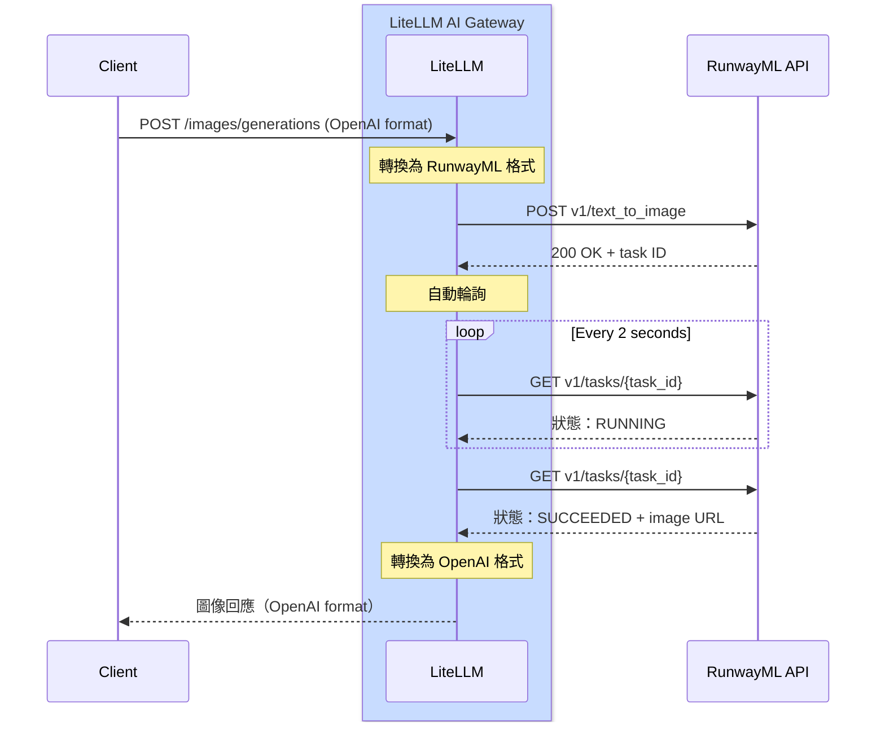

# RunwayML - 圖像生成 {#runwayml---image-generation}

## 總覽 {#overview}

| 屬性 | 詳細資料 |
|-------|-------|
| 說明 | RunwayML 提供先進的 AI 驅動圖像生成，並帶來高品質結果 |
| LiteLLM 上的提供者路由 | `runwayml/` |
| 支援的操作 | [`/images/generations`](#quick-start) |
| 提供者文件連結 | [RunwayML API ↗](https://docs.dev.runwayml.com/) |

LiteLLM 支援 RunwayML 的 Gen-4 圖像生成 API，讓您可以從文字提示生成高品質圖像。

## 快速開始 {#quick-start}

```python showLineNumbers title="Basic Image Generation"
from litellm import image_generation
import os

os.environ["RUNWAYML_API_KEY"] = "your-api-key"

response = image_generation(
    model="runwayml/gen4_image",
    prompt="A serene mountain landscape at sunset",
    size="1920x1080"
)

print(response.data[0].url)
```

## 驗證 {#authentication}

設定您的 RunwayML API 金鑰：

```python showLineNumbers title="Set API Key"
import os

os.environ["RUNWAYML_API_KEY"] = "your-api-key"
```

## 支援的參數 {#supported-parameters}

| 參數 | 型別 | 必填 | 說明 |
|-----------|------|----------|-------------|
| `model` | string | Yes | 要使用的模型（例如，`runwayml/gen4_image`） |
| `prompt` | string | Yes | 圖像的文字描述 |
| `size` | string | No | 圖像尺寸（預設：`1920x1080`） |

### 支援的尺寸 {#supported-sizes}

- `1024x1024`
- `1792x1024`
- `1024x1792`
- `1920x1080`（預設）
- `1080x1920`

## 非同步用法 {#async-usage}

```python showLineNumbers title="Async Image Generation"
from litellm import aimage_generation
import os
import asyncio

os.environ["RUNWAYML_API_KEY"] = "your-api-key"

async def generate_image():
    response = await aimage_generation(
        model="runwayml/gen4_image",
        prompt="A futuristic city skyline at night",
        size="1920x1080"
    )
    
    print(response.data[0].url)

asyncio.run(generate_image())
```

## LiteLLM Proxy 用法 {#litellm-proxy-usage}

將 RunwayML 新增至您的 proxy 設定：

```yaml showLineNumbers title="config.yaml"
model_list:
  - model_name: gen4-image
    litellm_params:
      model: runwayml/gen4_image
      api_key: os.environ/RUNWAYML_API_KEY
```

啟動 proxy：

```bash
litellm --config /path/to/config.yaml
```

透過 proxy 生成圖像：

```bash showLineNumbers title="Proxy Request"
curl --location 'http://localhost:4000/v1/images/generations' \
--header 'Content-Type: application/json' \
--header 'x-litellm-api-key: sk-1234' \
--data '{
    "model": "runwayml/gen4_image",
    "prompt": "A serene mountain landscape at sunset",
    "size": "1920x1080"
}'
```

## 支援的模型 {#supported-models}

| 模型 | 說明 | 預設尺寸 |
|-------|-------------|--------------|
| `runwayml/gen4_image` | 高品質圖像生成 | 1920x1080 |

## 成本追蹤 {#cost-tracking}

LiteLLM 會自動追蹤 RunwayML 圖像生成成本：

```python showLineNumbers title="Cost Tracking"
from litellm import image_generation, completion_cost

response = image_generation(
    model="runwayml/gen4_image",
    prompt="A serene mountain landscape at sunset",
    size="1920x1080"
)

cost = completion_cost(completion_response=response)
print(f"Image generation cost: ${cost}")
```

## 支援的功能 {#supported-features}

| 功能 | 支援 |
|---------|-----------|
| 圖像生成 | ✅ |
| 成本追蹤 | ✅ |
| 記錄 | ✅ |
| 備援 | ✅ |
| 負載平衡 | ✅ |

## 運作方式 {#how-it-works}

RunwayML 使用非同步、基於任務的 API 模式。LiteLLM 會自動處理輪詢與回應轉換。

### 完整流程圖 {#complete-flow-diagram}



### LiteLLM 會替您做什麼 {#what-litellm-does-for-you}

當您呼叫 `litellm.image_generation()` 或 `/v1/images/generations` 時：

1. **請求轉換**：將 OpenAI 圖像生成格式轉換 → RunwayML 格式
2. **提交任務**：將轉換後的請求送至 RunwayML API
3. **接收任務 ID**：從初始回應擷取任務 ID
4. **自動輪詢**： 
   - 每 2 秒輪詢一次任務狀態端點
   - 持續直到狀態為 `SUCCEEDED` 或 `FAILED`
   - 預設逾時：10 分鐘（可透過 `RUNWAYML_POLLING_TIMEOUT` 設定）
5. **回應轉換**：將 RunwayML 格式轉換 → OpenAI 格式
6. **返回結果**：將統一的 OpenAI 格式回應傳送給用戶端

**輪詢設定：**
- 預設逾時：600 秒（10 分鐘）
- 可透過 `RUNWAYML_POLLING_TIMEOUT` 環境變數設定
- 依呼叫類型使用 sync（`time.sleep()`）或 async（`await asyncio.sleep()`）

:::info
**一般處理時間**：10-30 秒，視圖像尺寸與複雜度而定
:::
