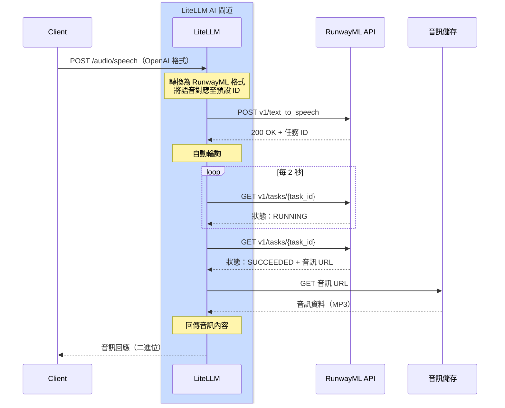

# RunwayML - 文字轉語音 {#runwayml---text-to-speech}

## 總覽 {#overview}

| 屬性 | 詳細資訊 |
|-------|-------|
| 說明 | RunwayML 提供高品質、由 AI 驅動且具自然聽感的文字轉語音 |
| LiteLLM 上的提供者路由 | `runwayml/` |
| 支援的操作 | [`/audio/speech`](#quick-start) |
| 提供者文件連結 | [RunwayML API ↗](https://docs.dev.runwayml.com/) |

LiteLLM 支援 RunwayML 的文字轉語音 API，並具備自動任務輪詢功能，讓您能從文字產生自然聽感的音訊。

## 快速開始 {#quick-start}

```python showLineNumbers title="Basic Text-to-Speech"
from litellm import speech
import os

os.environ["RUNWAYML_API_KEY"] = "your-api-key"

response = speech(
    model="runwayml/eleven_multilingual_v2",
    input="Step right up, ladies and gentlemen! Have you ever wished for a toaster that's not just a toaster but a marvel of modern ingenuity?",
    voice="alloy"
)

# Save the audio
with open("output.mp3", "wb") as f:
    f.write(response.content)
```

## 驗證 {#authentication}

設定您的 RunwayML API 金鑰：

```python showLineNumbers title="Set API Key"
import os

os.environ["RUNWAYML_API_KEY"] = "your-api-key"
```

## 支援的參數 {#supported-parameters}

| 參數 | 型別 | 必填 | 說明 |
|-----------|------|----------|-------------|
| `model` | string | 是 | 要使用的模型（例如，`runwayml/eleven_multilingual_v2`） |
| `input` | string | 是 | 要轉換為語音的文字 |
| `voice` | string or dict | 是 | 要使用的語音（OpenAI 名稱、RunwayML 預設語音，或語音設定） |

## 語音選項 {#voice-options}

### 使用 OpenAI 語音名稱 {#using-openai-voice-names}

OpenAI 語音名稱會自動對應到適當的 RunwayML 語音：

```python showLineNumbers title="OpenAI Voice Names"
from litellm import speech

# These OpenAI voice names work automatically
response = speech(
    model="runwayml/eleven_multilingual_v2",
    input="Hello, world!",
    voice="alloy"  # Maya - neutral, balanced female voice
)
```

**語音對應：**
- `alloy` → Maya（中性、平衡的女性聲音）
- `echo` → James（男性聲音）
- `fable` → Bernard（溫暖、敘事感的聲音）
- `onyx` → Vincent（低沉男性聲音）
- `nova` → Serene（溫暖、富表情的女性聲音）
- `shimmer` → Ella（清晰、親切的女性聲音）

### 使用 RunwayML 預設語音 {#using-runwayml-preset-voices}

您可以直接透過傳入預設名稱字串來指定任何 RunwayML 預設語音：

```python showLineNumbers title="RunwayML Preset Names"
from litellm import speech

# Pass the RunwayML voice name as a string
response = speech(
    model="runwayml/eleven_multilingual_v2",
    input="Hello, world!",
    voice="Maya"  # LiteLLM automatically formats this for RunwayML
)

# Try different RunwayML voices
response = speech(
    model="runwayml/eleven_multilingual_v2",
    input="Step right up, ladies and gentlemen!",
    voice="Bernard"  # Great for storytelling
)
```

**可用的 RunwayML 語音：**

Maya, Arjun, Serene, Bernard, Billy, Mark, Clint, Mabel, Chad, Leslie, Eleanor, Elias, Elliot, Grungle, Brodie, Sandra, Kirk, Kylie, Lara, Lisa, Malachi, Marlene, Martin, Miriam, Monster, Paula, Pip, Rusty, Ragnar, Xylar, Maggie, Jack, Katie, Noah, James, Rina, Ella, Mariah, Frank, Claudia, Niki, Vincent, Kendrick, Myrna, Tom, Wanda, Benjamin, Kiana, Rachel

:::tip
只要將語音名稱以字串形式傳入即可 - LiteLLM 會自動處理內部的 RunwayML API 格式轉換。
:::

## 非同步用法 {#async-usage}

```python showLineNumbers title="Async Text-to-Speech"
from litellm import aspeech
import os
import asyncio

os.environ["RUNWAYML_API_KEY"] = "your-api-key"

async def generate_speech():
    response = await aspeech(
        model="runwayml/eleven_multilingual_v2",
        input="This is an asynchronous text-to-speech request.",
        voice="nova"
    )
    
    with open("output.mp3", "wb") as f:
        f.write(response.content)
    
    print("Audio generated successfully!")

asyncio.run(generate_speech())
```

## LiteLLM Proxy 用法 {#litellm-proxy-usage}

將 RunwayML 新增至您的 proxy 設定：

```yaml showLineNumbers title="config.yaml"
model_list:
  - model_name: runway-tts
    litellm_params:
      model: runwayml/eleven_multilingual_v2
      api_key: os.environ/RUNWAYML_API_KEY
```

啟動 proxy：

```bash
litellm --config /path/to/config.yaml
```

透過 proxy 產生語音：

```bash showLineNumbers title="Proxy Request"
curl --location 'http://localhost:4000/v1/audio/speech' \
--header 'Content-Type: application/json' \
--header 'x-litellm-api-key: sk-1234' \
--data '{
    "model": "runwayml/eleven_multilingual_v2",
    "input": "Hello from the LiteLLM proxy!",
    "voice": "alloy"
}'
```

使用 RunwayML 特定語音：

```bash showLineNumbers title="Proxy Request with RunwayML Voice"
curl --location 'http://localhost:4000/v1/audio/speech' \
--header 'Content-Type: application/json' \
--header 'x-litellm-api-key: sk-1234' \
--data '{
    "model": "runwayml/eleven_multilingual_v2",
    "input": "Hello with a custom RunwayML voice!",
    "voice": "Bernard"
}'
```

## 支援的模型 {#supported-models}

| 模型 | 說明 |
|-------|-------------|
| `runwayml/eleven_multilingual_v2` | 高品質多語言文字轉語音 |

## 成本追蹤 {#cost-tracking}

LiteLLM 會自動追蹤 RunwayML 文字轉語音成本：

```python showLineNumbers title="Cost Tracking"
from litellm import speech, completion_cost

response = speech(
    model="runwayml/eleven_multilingual_v2",
    input="Hello, world!",
    voice="alloy"
)

cost = completion_cost(completion_response=response)
print(f"Text-to-speech cost: ${cost}")
```

## 支援的功能 {#supported-features}

| 功能 | 支援 |
|---------|-----------|
| 文字轉語音 | ✅ |
| 成本追蹤 | ✅ |
| 記錄 | ✅ |
| 備援 | ✅ |
| 負載平衡 | ✅ |
| 50+ 語音預設 | ✅ |

## 運作方式 {#how-it-works}

RunwayML 使用非同步、以任務為基礎的 API 模式。LiteLLM 會自動處理輪詢與回應轉換。

### 完整流程圖 {#complete-flow-diagram}


