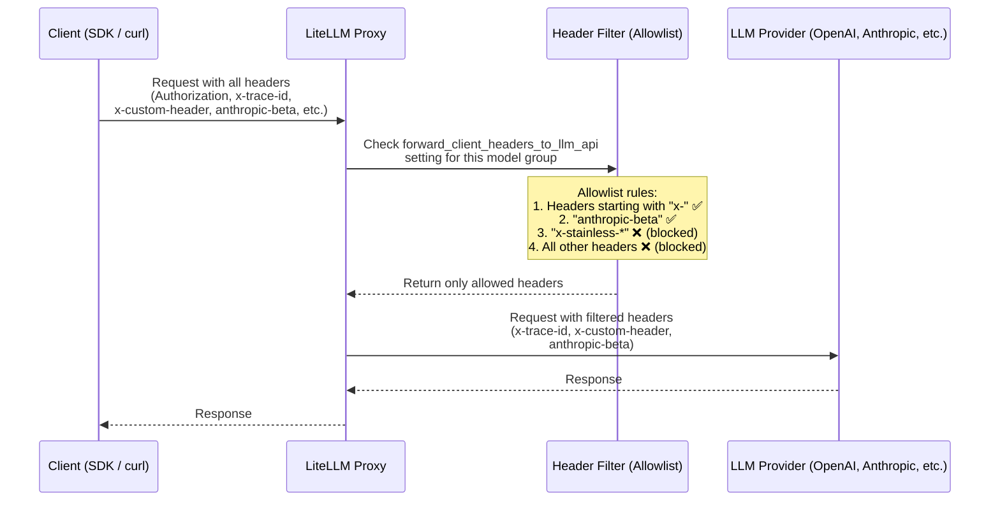

# 將用戶端標頭轉送至 LLM API {#forward-client-headers-to-llm-api}

控制哪些模型群組可以將用戶端標頭轉送至底層 LLM 提供者 API。

## 概覽 {#overview}

預設情況下，LiteLLM 基於安全考量，不會將用戶端標頭轉送至 LLM 提供者 API。不過，您可以使用 `forward_client_headers_to_llm_api` 設定，針對特定模型群組選擇性啟用標頭轉送。

## 運作方式 {#how-it-works}

LiteLLM **不會**將所有用戶端標頭轉送到 LLM 提供者。相反地，它採用 **allowlist** 方法：只有符合特定規則的標頭才會被轉送。因此，敏感標頭（例如您的 LiteLLM API 金鑰）絕不會意外送到上游提供者。


```mermaid
sequenceDiagram
    participant Client as Client (SDK / curl)
    participant Proxy as LiteLLM Proxy
    participant Filter as Header Filter (Allowlist)
    participant LLM as LLM Provider (OpenAI, Anthropic, etc.)

    Client->>Proxy: Request with all headers<br/>(Authorization, x-trace-id,<br/>x-custom-header, anthropic-beta, etc.)
    
    Proxy->>Filter: Check forward_client_headers_to_llm_api<br/>setting for this model group

    Note over Filter: Allowlist rules:<br/>1. Headers starting with "x-" ✅<br/>2. "anthropic-beta" ✅<br/>3. "x-stainless-*" ❌ (blocked)<br/>4. All other headers ❌ (blocked)

    Filter-->>Proxy: Return only allowed headers

    Proxy->>LLM: Request with filtered headers<br/>(x-trace-id, x-custom-header,<br/>anthropic-beta)
    
    LLM-->>Proxy: Response
    Proxy-->>Client: Response
```

### 標頭 Allowlist 規則 {#header-allowlist-rules}

以下規則決定哪些標頭會被轉送（請參閱 [`_get_forwardable_headers`](https://github.com/litellm/litellm/blob/main/litellm/proxy/litellm_pre_call_utils.py) 於 `litellm/proxy/litellm_pre_call_utils.py`）：

| 規則 | 範例 | 轉送？ |
|---|---|---|
| 以 `x-` 開頭的標頭 | `x-trace-id`, `x-custom-header`, `x-request-source` |  是 |
| `anthropic-beta` 標頭 | `anthropic-beta: prompt-caching-2024-07-31` |  是 |
| 以 `x-stainless-*` 開頭的標頭 | `x-stainless-lang`, `x-stainless-arch` |  否（會造成 OpenAI SDK 問題） |
| 標準 HTTP 標頭 | `Authorization`, `Content-Type`, `Host` |  否 |
| 其他提供者標頭 | `Accept`, `User-Agent` |  否 |

### 其他標頭機制 {#additional-header-mechanisms}

| 機制 | 說明 | 參考 |
|---|---|---|
| **`x-pass-` 前綴** | 以 `x-pass-` 為前綴的標頭，無論設定為何，都會一律轉送且會移除前綴。例如：`x-pass-anthropic-beta: value` → `anthropic-beta: value`。適用於所有 pass-through 端點。 | [原始碼](https://github.com/litellm/litellm/blob/main/litellm/passthrough/utils.py) |
| **`openai-organization`** | 只有在 `forward_openai_org_id: true` 中設定 `general_settings` 時才會轉送。 | [轉送 OpenAI Org ID](#enable-globally) |
| **使用者資訊標頭** | 當 `add_user_information_to_llm_headers: true` 時，LiteLLM 會加入 `x-litellm-user-id`、`x-litellm-org-id` 等。 | [使用者資訊標頭](#user-information-headers-optional) |
| **Vertex AI pass-through** | 使用獨立且更嚴格的 allowlist：只有 `anthropic-beta` 與 `content-type`。 | [原始碼](https://github.com/litellm/litellm/blob/main/litellm/constants.py) |

## 設定 {#configuration}

## 全域啟用 {#enable-globally}

```yaml
general_settings:
  forward_client_headers_to_llm_api: true
```

## 轉送 LLM 提供者驗證標頭 {#forward-llm-provider-authentication-headers}

**v1.82+ 新功能**：預設情況下，LiteLLM 會基於安全考量，從用戶端請求中移除 `x-api-key`、`x-goog-api-key` 和 `api-key` 等驗證標頭（這些通常用於向 proxy 本身驗證）。不過，您可以啟用這些 LLM 提供者驗證標頭的轉送，以支援 **Bring Your Own Key (BYOK)** 情境，讓用戶端將自己的 API 金鑰送到 LLM 提供者。

### 設定 {#configuration-1}

將 `forward_llm_provider_auth_headers: true` 加入您的 `general_settings`：

```yaml
general_settings:
  forward_client_headers_to_llm_api: true
  forward_llm_provider_auth_headers: true  # 👈 Enable BYOK
```

### 哪些標頭會被轉送 {#which-headers-are-forwarded}

當 `forward_llm_provider_auth_headers: true` 時，下列 LLM 提供者驗證標頭會被保留並轉送：

| 標頭 | 提供者 | 範例 |
|--------|----------|---------|
| `x-api-key` | Anthropic、Azure AI、Databricks | `x-api-key: sk-ant-api03-...` |
| `x-goog-api-key` | Google AI Studio | `x-goog-api-key: AIza...` |
| `api-key` | Azure OpenAI | `api-key: your-azure-key` |
| `ocp-apim-subscription-key` | Azure APIM | `ocp-apim-subscription-key: your-key` |

:::warning[重要安全注意事項]
proxy 的 `Authorization` 標頭（用於 proxy 驗證）**絕不會**轉送至 LLM 提供者，即使啟用此設定也是如此。這可確保您的 proxy 驗證維持安全。
:::

### 使用情境：用戶端 API 金鑰（BYOK） {#use-case-client-side-api-keys-byok}

此功能可支援以下情境：
1. **用戶端使用自己的 LLM 提供者 API 金鑰**，而非使用在 proxy 中設定的金鑰
2. **多租戶應用程式**，每個租戶都有自己的 Anthropic/OpenAI 帳戶
3. **開發環境**，開發者透過共用 proxy 使用個人 API 金鑰

#### 範例：Anthropic BYOK {#example-anthropic-byok}

```yaml
# proxy_config.yaml
model_list:
  - model_name: {{anthropic}}
    litellm_params:
      model: anthropic/{{anthropic}}
      # No api_key configured! Will use client's key

general_settings:
  forward_client_headers_to_llm_api: true
  forward_llm_provider_auth_headers: true  # Enable BYOK
```

關於 **Claude Code**，請參閱 [Claude Code BYOK](../tutorials/claude_code_byok.md)。使用 `ANTHROPIC_CUSTOM_HEADERS="x-litellm-api-key: $LITELLM_API_KEY"` 傳遞您的 LiteLLM 金鑰。已設定的 Anthropic API 金鑰會以 `x-api-key` 傳送，且需要上方的 `forward_llm_provider_auth_headers` 才會被轉送；`/login` 則會改為將 OAuth token 以 `Authorization: Bearer <token>` 傳送，而 LiteLLM 無論此設定為何都會轉送該 token。

用戶端請求：
```bash
# Authorization: Proxy authentication (stripped)
# x-api-key: Client's Anthropic key (forwarded!)
curl -X POST "http://localhost:4000/v1/messages" \
  -H "Authorization: Bearer sk-proxy-auth-123" \
  -H "x-api-key: sk-ant-api03-YOUR-KEY..." \
  -H "Content-Type: application/json" \
  -d '{
    "model": "{{anthropic}}",
    "messages": [{"role": "user", "content": "Hello"}],
    "max_tokens": 100
  }'
```

#### 範例：Google AI Studio BYOK {#example-google-ai-studio-byok}

```yaml
model_list:
  - model_name: {{gemini_pro}}
    litellm_params:
      model: gemini/{{gemini_pro}}
      # No api_key configured

general_settings:
  forward_client_headers_to_llm_api: true
  forward_llm_provider_auth_headers: true
```

用戶端請求：
```bash
curl -X POST "http://localhost:4000/v1/chat/completions" \
  -H "Authorization: Bearer sk-proxy-auth-123" \
  -H "x-goog-api-key: AIza..." \
  -d '{
    "model": "{{gemini_pro}}",
    "messages": [{"role": "user", "content": "Hello"}]
  }'
```

#### 範例：自訂 Anthropic 相容的 `api_base` {#example-custom-anthropic-compatible-api_base}

當模型位於您自己的閘道之後，且該閘道支援 Anthropic Messages API，而每位使用者都持有自己的 token 時，請使用此方式。萬用字元路由會將呼叫端所指定的任何模型傳遞到閘道，因此新可用的模型不需要變更設定。此處只需要 `forward_llm_provider_auth_headers`

```yaml
model_list:
  - model_name: "my-gateway/*"
    litellm_params:
      model: "anthropic/*"
      api_base: "https://gateway.example.com/anthropic"
      # No api_key: each request supplies its own

general_settings:
  forward_llm_provider_auth_headers: true
```

使用 `Authorization: Bearer` 或 `x-litellm-api-key` 驗證 LiteLLM，並將使用者的閘道 token 放入 `x-api-key`：

```bash
curl -X POST "http://localhost:4000/v1/chat/completions" \
  -H "Authorization: Bearer $LITELLM_API_KEY" \
  -H "x-api-key: $USER_GATEWAY_TOKEN" \
  -H "Content-Type: application/json" \
  -d '{
    "model": "my-gateway/claude-sonnet-4-5",
    "messages": [{"role": "user", "content": "Hello"}]
  }'
```

LiteLLM 會去除 `my-gateway/` 前綴，並以 `"model": "claude-sonnet-4-5"` 和 `x-api-key: $USER_GATEWAY_TOKEN` 呼叫 `https://gateway.example.com/anthropic/v1/messages`。對 `/v1/messages` 和 `/v1/chat/completions` 的請求都會以這種方式到達閘道。該 token 一律會以 `x-api-key` 送出，因此閘道必須接受該標頭。若要在 `/v1/models` 列出閘道的模型，請參閱 [模型探索](./model_discovery.md#which-key-discovery-uses)

#### 哪個金鑰會到達提供者 {#which-key-reaches-the-provider}

轉送的提供者標頭會優先於該部署的 `api_key`，適用於該次請求。當請求未帶有提供者金鑰時，LiteLLM 會先回退到部署的 `api_key`，接著回退到 proxy 主機上的提供者環境變數（例如 `ANTHROPIC_API_KEY`），並以該金鑰執行呼叫，不會發生任何錯誤。若要要求每位呼叫端都提供自己的金鑰，請將兩者都保留為未設定；未提供金鑰的請求會在任何內容送到提供者之前以 `Missing Anthropic API Key` 失敗。

請勿在 `x-api-key` 中傳送 LiteLLM 金鑰。LiteLLM 會將其作為 proxy 驗證接受，然後移除，因此不會被轉送，而請求會如上所述回退。

### 安全性考量 {#security-considerations}

**何時使用此功能：**
-  您信任所有用戶端的內部工具
-  開發／測試環境
-  具有適當用戶端驗證的多租戶應用程式
-  希望用戶端使用自己的 API 金鑰的情境

**何時不要使用：**
-  您不信任所有用戶端的公開 API
-  您希望集中式計費／成本控制
-  您需要在 proxy 層級強制速率限制時

### 向後相容性 {#backward-compatibility}

為了向後相容，若您有 `forward_client_headers_to_llm_api: true` 但沒有明確設定 `forward_llm_provider_auth_headers`，其行為如下：
- **預設**：LLM 提供者驗證標頭**不會**被轉送（安全預設）
- **明確設定 `true`**：LLM 提供者驗證標頭**會**被轉送（已啟用 BYOK）

```yaml
# Safe default - auth headers NOT forwarded
general_settings:
  forward_client_headers_to_llm_api: true

# BYOK enabled - auth headers ARE forwarded
general_settings:
  forward_client_headers_to_llm_api: true
  forward_llm_provider_auth_headers: true  # 👈 Opt-in required
```

## 對特定模型群組啟用 {#enable-for-a-model-group}

在您的設定中，於 `forward_client_headers_to_llm_api` 下新增 `model_group_settings` 設定：

```yaml
model_list:
  - model_name: {{openai_small}}
    litellm_params:
      model: openai/{{openai_small}}
      api_key: "your-api-key"
  - model_name: "wildcard-models/*"
    litellm_params:
      model: "openai/*"
      api_key: "your-api-key"

litellm_settings:
  model_group_settings:
    forward_client_headers_to_llm_api:
      - {{openai_small}}
      - wildcard-models/*
```

## 支援的模型模式 {#supported-model-patterns}

此設定支援多種模型比對模式：

### 1. 精確模型名稱 {#1-exact-model-names}
```yaml
forward_client_headers_to_llm_api:
  - {{openai_small}}
  - {{anthropic}}
```

### 2. 萬用字元模式 {#2-wildcard-patterns}
```yaml
forward_client_headers_to_llm_api:
  - "openai/*"          # All OpenAI models
  - "anthropic/*"       # All Anthropic models
  - "wildcard-group/*"  # All models in wildcard-group
```

### 3. 團隊模型別名 {#3-team-model-aliases}
如果您的團隊已設定模型別名，轉送功能對原始模型名稱與別名都可正常運作。

## 轉送的標頭 {#forwarded-headers}

當針對模型群組啟用時，LiteLLM 會轉送以下類型的標頭：

### 自訂標頭（x- 前綴） {#custom-headers-x--prefix}
- 任何以 `x-` 開頭的標頭（除了 `x-stainless-*`，它可能造成 OpenAI SDK 問題）
- 範例：`x-custom-header`、`x-request-id`、`x-trace-id`

### 提供者特定標頭 {#provider-specific-headers}
- **Anthropic**：`anthropic-beta` 標頭
- **OpenAI**：`openai-organization`（透過 `forward_openai_org_id: true` 啟用時）

### 使用者資訊標頭（選用） {#user-information-headers-optional}
當 `add_user_information_to_llm_headers` 啟用時，LiteLLM 會加入：
- `x-litellm-user-id`
- `x-litellm-org-id`
- 其他使用者中繼資料作為 `x-litellm-*` 標頭

## 安全性考量 {#security-considerations-1}

⚠️ **重要安全注意事項：**

1. **敏感資料**：僅對可信任的模型群組啟用標頭轉送，因為標頭可能包含敏感資訊
2. **API 金鑰**：切勿在轉送的標頭中包含 API 金鑰或密鑰
3. **PII**：請謹慎轉送可能包含個人識別資訊的標頭
4. **提供者限制**：某些提供者對自訂標頭有限制

## 範例使用情境 {#example-use-cases}

### 1. 請求追蹤 {#1-request-tracing}
轉送追蹤標頭以追蹤您系統中的請求：

```bash
curl -X POST "https://your-proxy.com/v1/chat/completions" \
  -H "Authorization: Bearer your-key" \
  -H "x-trace-id: abc123" \
  -H "x-request-source: mobile-app" \
  -d '{
    "model": "{{openai_small}}",
    "messages": [{"role": "user", "content": "Hello"}]
  }'
```

### 2. 自訂中繼資料 {#2-custom-metadata}
將自訂中繼資料傳遞給您的 LLM 提供者：

```bash
curl -X POST "https://your-proxy.com/v1/chat/completions" \
  -H "Authorization: Bearer your-key" \
  -H "x-customer-id: customer-123" \
  -H "x-environment: production" \
  -d '{
    "model": "{{openai_small}}", 
    "messages": [{"role": "user", "content": "Hello"}]
  }'
```

### 3. Anthropic Beta 功能 {#3-anthropic-beta-features}
為 Anthropic 模型啟用 beta 功能：

```bash
curl -X POST "https://your-proxy.com/v1/chat/completions" \
  -H "Authorization: Bearer your-key" \
  -H "anthropic-beta: tools-2024-04-04" \
  -d '{
    "model": "{{anthropic}}",
    "messages": [{"role": "user", "content": "Hello"}]
  }'
```

## 完整組態範例 {#complete-configuration-example}

```yaml
model_list:
  # Fixed model with header forwarding
  - model_name: byok-fixed-gpt-4o-mini
    litellm_params:
      model: openai/{{openai_small}}
      api_base: "https://your-openai-endpoint.com"
      api_key: "your-api-key"
      
  # Wildcard model group with header forwarding
  - model_name: "byok-wildcard/*"
    litellm_params:
      model: "openai/*"
      api_base: "https://your-openai-endpoint.com"
      api_key: "your-api-key"
      
  # Standard model without header forwarding
  - model_name: standard-gpt-4o
    litellm_params:
      model: openai/{{openai_large}}
      api_key: "your-api-key"

litellm_settings:
  # Enable user info headers globally (optional)
  add_user_information_to_llm_headers: true
  
  model_group_settings:
    forward_client_headers_to_llm_api:
      - byok-fixed-gpt-4o-mini
      - byok-wildcard/*
      # Note: standard-gpt-4o is NOT included, so no headers forwarded

general_settings:
  # Enable OpenAI organization header forwarding (optional)
  forward_openai_org_id: true
```

## 測試標頭轉送 {#testing-header-forwarding}

若要測試標頭是否正在轉送：

1. **啟用除錯記錄**：在您的設定中將 `set_verbose: true` 設為
2. **檢查提供者記錄**：監控您的 LLM 提供者的請求記錄
3. **使用 Webhook 網站**：為了測試，您可以將 webhook.site URL 作為 api_base 使用，以查看轉送的標頭

## 疑難排解 {#troubleshooting}

### 標頭未被轉送 {#headers-not-being-forwarded}

1. **檢查模型名稱**：確認您請求中的模型名稱與組態相符
2. **驗證模式比對**：萬用字元模式必須完全相符
3. **檢視記錄**：啟用詳細記錄以查看標頭處理

### 提供者錯誤 {#provider-errors}

1. **無效的標頭**：某些提供者會拒絕未知標頭
2. **標頭限制**：提供者可能對標頭數量／大小有限制
3. **驗證**：確保轉送的標頭不會與驗證衝突

## 相關功能 {#related-features}

- [請求標頭](./request_headers.md) - 支援的請求標頭完整清單
- [回應標頭](./response_headers.md) - LiteLLM 傳回的標頭
- [團隊模型別名](./team_model_add.md) - 為團隊設定模型別名
- [模型存取控制](./model_access.md) - 控制哪些使用者可以存取哪些模型

## API 參考 {#api-reference}

標頭轉送由 `ModelGroupSettings` 組態控制：

```python
class ModelGroupSettings(BaseModel):
    forward_client_headers_to_llm_api: Optional[List[str]] = None
```

其中清單中的每個字串都可以是：
- 精確的模型名稱（例如，`"{{openai_small}}"`）
- 萬用字元模式（例如，`"openai/*"`）
- 模型群組名稱（例如，`"my-model-group/*"`）
