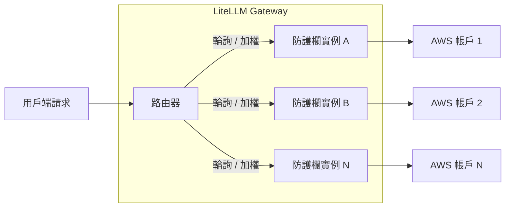
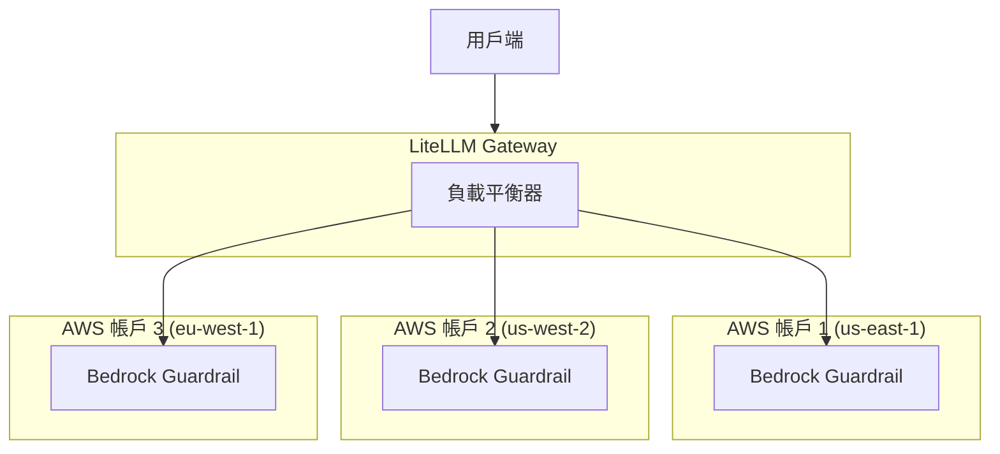

import Tabs from '@theme/Tabs';
import TabItem from '@theme/TabItem';

# 防護欄負載平衡 {#guardrail-load-balancing}

將防護欄請求分散到多個防護欄部署之間進行負載平衡。當防護欄提供者有速率限制（例如 AWS Bedrock Guardrails）且您想在多個帳戶或區域之間分配請求時，這很有用。

## 運作方式 {#how-it-works}



當您定義多個具有**相同 `guardrail_name`** 的防護欄時，LiteLLM 會使用路由器的負載平衡策略自動在它們之間對請求進行負載平衡。

## 為什麼要使用防護欄負載平衡？ {#why-use-guardrail-load-balancing}

| 使用情境 | 好處 |
|----------|---------|
| **AWS Bedrock 速率限制** | Bedrock Guardrails 具有每個帳戶的速率限制。跨多個 AWS 帳戶分散以提高吞吐量 |
| **多區域備援** | 在不同區域部署防護欄以進行故障轉移並降低延遲 |
| **成本最佳化** | 將用量分散到具有不同定價層級或額度的帳戶 |
| **A/B 測試** | 以加權分配測試不同的防護欄設定 |

## 快速開始 {#quick-start}

### 1. 定義多個同名防護欄 {#1-define-multiple-guardrails-with-same-name}

定義多個具有**相同 `guardrail_name`** 但不同設定的防護欄項目：

<Tabs>
<TabItem value="bedrock" label="Bedrock Guardrails">

```yaml showLineNumbers title="config.yaml"
model_list:
  - model_name: gpt-4
    litellm_params:
      model: openai/gpt-4
      api_key: os.environ/OPENAI_API_KEY

guardrails:
  # First Bedrock guardrail - AWS Account 1
  - guardrail_name: "content-filter"
    litellm_params:
      guardrail: bedrock/guardrail
      mode: "pre_call"
      guardrailIdentifier: "abc123"
      guardrailVersion: "1"
      aws_access_key_id: os.environ/AWS_ACCESS_KEY_ID_1
      aws_secret_access_key: os.environ/AWS_SECRET_ACCESS_KEY_1
      aws_region_name: "us-east-1"
  
  # Second Bedrock guardrail - AWS Account 2
  - guardrail_name: "content-filter"
    litellm_params:
      guardrail: bedrock/guardrail
      mode: "pre_call"
      guardrailIdentifier: "def456"
      guardrailVersion: "1"
      aws_access_key_id: os.environ/AWS_ACCESS_KEY_ID_2
      aws_secret_access_key: os.environ/AWS_SECRET_ACCESS_KEY_2
      aws_region_name: "us-west-2"
```

</TabItem>

<TabItem value="custom" label="自訂防護欄">

```yaml showLineNumbers title="config.yaml"
model_list:
  - model_name: gpt-4
    litellm_params:
      model: openai/gpt-4
      api_key: os.environ/OPENAI_API_KEY

guardrails:
  # First custom guardrail instance
  - guardrail_name: "pii-filter"
    litellm_params:
      guardrail: custom_guardrail.PIIFilterA
      mode: "pre_call"
  
  # Second custom guardrail instance
  - guardrail_name: "pii-filter"
    litellm_params:
      guardrail: custom_guardrail.PIIFilterB
      mode: "pre_call"
```

</TabItem>

<TabItem value="aporia" label="Aporia Guardrails">

```yaml showLineNumbers title="config.yaml"
model_list:
  - model_name: gpt-4
    litellm_params:
      model: openai/gpt-4
      api_key: os.environ/OPENAI_API_KEY

guardrails:
  # First Aporia instance
  - guardrail_name: "toxicity-filter"
    litellm_params:
      guardrail: aporia
      mode: "pre_call"
      api_key: os.environ/APORIA_API_KEY_1
      api_base: os.environ/APORIA_API_BASE_1
  
  # Second Aporia instance
  - guardrail_name: "toxicity-filter"
    litellm_params:
      guardrail: aporia
      mode: "pre_call"
      api_key: os.environ/APORIA_API_KEY_2
      api_base: os.environ/APORIA_API_BASE_2
```

</TabItem>
</Tabs>

### 2. 啟動 LiteLLM Gateway {#2-start-litellm-gateway}

```bash showLineNumbers title="Start proxy"
litellm --config config.yaml --detailed_debug
```

### 3. 發送請求 {#3-make-requests}

使用防護欄的請求將自動進行負載平衡：

```bash showLineNumbers title="Test request"
curl -X POST http://localhost:4000/v1/chat/completions \
  -H "Content-Type: application/json" \
  -H "Authorization: Bearer sk-1234" \
  -d '{
    "model": "gpt-4",
    "messages": [{"role": "user", "content": "Hello, how are you?"}],
    "guardrails": ["content-filter"]
  }'
```

## 加權負載平衡 {#weighted-load-balancing}

指派權重以在防護欄實例之間不均勻地分配流量：

```yaml showLineNumbers title="config.yaml - Weighted distribution"
guardrails:
  # 80% of traffic
  - guardrail_name: "content-filter"
    litellm_params:
      guardrail: bedrock/guardrail
      mode: "pre_call"
      guardrailIdentifier: "primary-guard"
      guardrailVersion: "1"
      weight: 8  # Higher weight = more traffic
  
  # 20% of traffic
  - guardrail_name: "content-filter"
    litellm_params:
      guardrail: bedrock/guardrail
      mode: "pre_call"
      guardrailIdentifier: "secondary-guard"
      guardrailVersion: "1"
      weight: 2  # Lower weight = less traffic
```

## Bedrock Guardrails - 多帳戶設定 {#bedrock-guardrails---multi-account-setup}

AWS Bedrock Guardrails 具有每個帳戶的速率限制。以下說明如何在多個 AWS 帳戶之間設定負載平衡：

### 架構 {#architecture}



### 設定 {#configuration}

```yaml showLineNumbers title="config.yaml - Multi-account Bedrock"
model_list:
  - model_name: claude-3
    litellm_params:
      model: bedrock/anthropic.claude-3-sonnet-20240229-v1:0

guardrails:
  # AWS Account 1 - US East
  - guardrail_name: "bedrock-content-filter"
    litellm_params:
      guardrail: bedrock/guardrail
      mode: "during_call"
      guardrailIdentifier: "guard-us-east"
      guardrailVersion: "DRAFT"
      aws_access_key_id: os.environ/AWS_ACCESS_KEY_1
      aws_secret_access_key: os.environ/AWS_SECRET_KEY_1
      aws_region_name: "us-east-1"
  
  # AWS Account 2 - US West
  - guardrail_name: "bedrock-content-filter"
    litellm_params:
      guardrail: bedrock/guardrail
      mode: "during_call"
      guardrailIdentifier: "guard-us-west"
      guardrailVersion: "DRAFT"
      aws_access_key_id: os.environ/AWS_ACCESS_KEY_2
      aws_secret_access_key: os.environ/AWS_SECRET_KEY_2
      aws_region_name: "us-west-2"
  
  # AWS Account 3 - EU West
  - guardrail_name: "bedrock-content-filter"
    litellm_params:
      guardrail: bedrock/guardrail
      mode: "during_call"
      guardrailIdentifier: "guard-eu-west"
      guardrailVersion: "DRAFT"
      aws_access_key_id: os.environ/AWS_ACCESS_KEY_3
      aws_secret_access_key: os.environ/AWS_SECRET_KEY_3
      aws_region_name: "eu-west-1"
```

### 測試多帳戶設定 {#test-multi-account-setup}

```bash showLineNumbers title="Run multiple requests to verify load balancing"
# Run 10 requests - they will be distributed across accounts
for i in {1..10}; do
  curl -s -X POST http://localhost:4000/v1/chat/completions \
    -H "Content-Type: application/json" \
    -H "Authorization: Bearer sk-1234" \
    -d '{
      "model": "claude-3",
      "messages": [{"role": "user", "content": "Hello"}],
      "guardrails": ["bedrock-content-filter"]
    }' &
done
wait
```

請檢查 proxy 記錄，以驗證請求是否分散到不同的 AWS 帳戶。

## 自訂防護欄範例 {#custom-guardrails-example}

建立兩個用於負載平衡的自訂防護欄類別：

```python showLineNumbers title="custom_guardrail.py"
from litellm.integrations.custom_guardrail import CustomGuardrail
from litellm.proxy._types import UserAPIKeyAuth
from litellm.caching.caching import DualCache


class PIIFilterA(CustomGuardrail):
    """PII Filter Instance A"""
    
    async def async_pre_call_hook(
        self,
        user_api_key_dict: UserAPIKeyAuth,
        cache: DualCache,
        data: dict,
        call_type: str,
    ):
        print("PIIFilterA processing request")
        # Your PII filtering logic here
        return data


class PIIFilterB(CustomGuardrail):
    """PII Filter Instance B"""
    
    async def async_pre_call_hook(
        self,
        user_api_key_dict: UserAPIKeyAuth,
        cache: DualCache,
        data: dict,
        call_type: str,
    ):
        print("PIIFilterB processing request")
        # Your PII filtering logic here
        return data
```

```yaml showLineNumbers title="config.yaml"
guardrails:
  - guardrail_name: "pii-filter"
    litellm_params:
      guardrail: custom_guardrail.PIIFilterA
      mode: "pre_call"
  
  - guardrail_name: "pii-filter"
    litellm_params:
      guardrail: custom_guardrail.PIIFilterB
      mode: "pre_call"
```

## 驗證負載平衡 {#verifying-load-balancing}

啟用詳細的除錯記錄，以驗證負載平衡是否正常運作：

```bash showLineNumbers title="Start with debug logging"
litellm --config config.yaml --detailed_debug
```

您應該會看到指出已選取哪個防護欄實例的記錄：

```
Selected guardrail deployment: bedrock/guardrail (guard-us-east)
Selected guardrail deployment: bedrock/guardrail (guard-us-west)
Selected guardrail deployment: bedrock/guardrail (guard-eu-west)
...
```

## 相關 {#related}

- [防護欄快速開始](./quick_start.md)
- [Bedrock Guardrails](./bedrock.md)
- [自訂防護欄](./custom_guardrail.md)
- [LLM 請求的負載平衡](../load_balancing.md)
