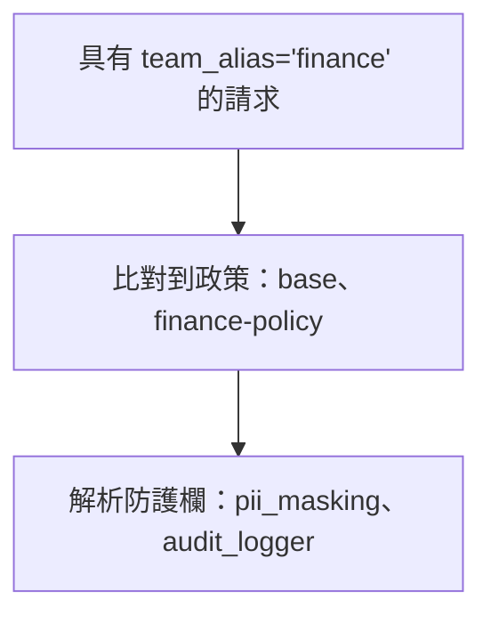

import Image from '@theme/IdealImage';
import Tabs from '@theme/Tabs';
import TabItem from '@theme/TabItem';

# [Beta] 防護欄政策 {#beta-guardrail-policies}

使用政策來分組防護欄，並控制哪些防護欄會針對特定團隊、金鑰或模型執行。

## 為什麼要使用政策？ {#why-use-policies}

- 針對團隊、金鑰或模型啟用/停用特定防護欄
- 將防護欄分組成單一政策
- 繼承現有政策，並覆寫您需要的部分

## 快速開始 {#quick-start}

<Tabs>
<TabItem value="config" label="config.yaml">

```yaml showLineNumbers title="config.yaml"
model_list:
  - model_name: gpt-4
    litellm_params:
      model: openai/gpt-4

# 1. Define your guardrails
guardrails:
  - guardrail_name: pii_masking
    litellm_params:
      guardrail: presidio
      mode: pre_call

  - guardrail_name: prompt_injection
    litellm_params:
      guardrail: lakera
      mode: pre_call
      api_key: os.environ/LAKERA_API_KEY

# 2. Create a policy
policies:
  my-policy:
    guardrails:
      add:
        - pii_masking
        - prompt_injection

# 3. Attach the policy
policy_attachments:
  - policy: my-policy
    scope: "*"  # apply to all requests
```

</TabItem>
<TabItem value="ui" label="UI (LiteLLM Dashboard)">

**步驟 1：建立政策**

前往 **Policies** 分頁並點擊 **+ Create New Policy**。填入政策名稱、描述，並選擇要新增的防護欄。


</TabItem>
</Tabs>

回應標頭會顯示哪些內容已執行：

```
x-litellm-applied-policies: my-policy
x-litellm-applied-guardrails: pii_masking,prompt_injection
```

## 為特定團隊新增防護欄 {#add-guardrails-for-a-specific-team}

:::info
✨ 僅限企業版功能，適用於基於團隊/金鑰的政策附加。 [取得免費試用](https://www.litellm.ai/enterprise#trial)
:::

您有一個全域基準，但想為特定團隊新增額外的防護欄。

<Tabs>
<TabItem value="config" label="config.yaml">

```yaml showLineNumbers title="config.yaml"
policies:
  global-baseline:
    guardrails:
      add:
        - pii_masking

  finance-team-policy:
    inherit: global-baseline
    guardrails:
      add:
        - strict_compliance_check
        - audit_logger

policy_attachments:
  - policy: global-baseline
    scope: "*"

  - policy: finance-team-policy
    teams:
      - finance  # team alias from /team/new
```

</TabItem>
<TabItem value="ui" label="UI (LiteLLM Dashboard)">

**選項 1：建立以團隊為範圍的附加項目**

前往 **Policies** > **Attachments** 分頁並點擊 **+ Create New Attachment**。選擇政策以及要套用的團隊範圍。


**選項 2：從團隊設定中附加**

前往 **Teams** > 點擊某個團隊 > **Settings** 分頁 > 在 **Policies** 下方，選擇要附加的政策。


<Image img={require('../../../img/policy_team_attach.png')} />

</TabItem>
</Tabs>

現在 `finance` 團隊會取得 `pii_masking` + `strict_compliance_check` + `audit_logger`，而其他所有人只會取得 `pii_masking`。

## 移除特定團隊的防護欄 {#remove-guardrails-for-a-specific-team}

:::info
✨ 僅限企業版功能，適用於基於團隊/金鑰的政策附加。 [取得免費試用](https://www.litellm.ai/enterprise#trial)
:::

您有全域執行的防護欄，但想為特定團隊停用其中一些（例如：內部測試）。

```yaml showLineNumbers title="config.yaml"
policies:
  global-baseline:
    guardrails:
      add:
        - pii_masking
        - prompt_injection

  internal-team-policy:
    inherit: global-baseline
    guardrails:
      remove:
        - pii_masking  # don't need PII masking for internal testing

policy_attachments:
  - policy: global-baseline
    scope: "*"

  - policy: internal-team-policy
    teams:
      - internal-testing  # team alias from /team/new
```

現在 `internal-testing` 團隊只會取得 `prompt_injection`，而其他所有人會取得兩個防護欄。

## 繼承 {#inheritance}

從基礎政策開始，並在其上擴充：

```yaml showLineNumbers title="config.yaml"
policies:
  base:
    guardrails:
      add:
        - pii_masking
        - toxicity_filter

  strict:
    inherit: base
    guardrails:
      add:
        - prompt_injection

  relaxed:
    inherit: base
    guardrails:
      remove:
        - toxicity_filter
```

您會得到：
- `base` → `[pii_masking, toxicity_filter]`
- `strict` → `[pii_masking, toxicity_filter, prompt_injection]`
- `relaxed` → `[pii_masking]`

## 模型條件 {#model-conditions}

僅針對特定模型執行防護欄：

```yaml showLineNumbers title="config.yaml"
policies:
  gpt4-safety:
    guardrails:
      add:
        - strict_content_filter
    condition:
      model: "gpt-4.*"  # regex - matches gpt-4, gpt-4-turbo, gpt-4o

  bedrock-compliance:
    guardrails:
      add:
        - audit_logger
    condition:
      model:  # exact match list
        - bedrock/claude-3
        - bedrock/claude-2
```

## 附加項目 {#attachments}

在您附加之前，政策不會發揮任何作用。附加項目會告訴 LiteLLM 要在何處套用每個政策。

**全域** - 會在每個請求上執行：

```yaml showLineNumbers title="config.yaml"
policy_attachments:
  - policy: default
    scope: "*"
```

**特定團隊**（使用來自 `/team/new` 的團隊別名）：

```yaml showLineNumbers title="config.yaml"
policy_attachments:
  - policy: hipaa-compliance
    teams:
      - healthcare-team  # team alias
      - medical-research  # team alias
```

**特定金鑰**（使用來自 `/key/generate` 的金鑰別名，支援萬用字元）：

```yaml showLineNumbers title="config.yaml"
policy_attachments:
  - policy: internal-testing
    keys:
      - "dev-*"  # key alias pattern
      - "test-*"  # key alias pattern
```

**基於標籤**（依據中繼資料標籤比對金鑰/團隊，支援萬用字元）：

```yaml showLineNumbers title="config.yaml"
policy_attachments:
  - policy: hipaa-compliance
    tags:
      - "healthcare"
      - "health-*"  # wildcard - matches health-team, health-dev, etc.
```

標籤會從金鑰和團隊 `metadata.tags` 讀取。範例來說，以 `metadata: {"tags": ["healthcare"]}` 建立的金鑰會符合上方的附加項目。

## 測試政策比對 {#test-policy-matching}

除錯哪些政策和防護欄會套用到給定情境。請在部署之前使用此功能驗證您的政策設定。

<Tabs>
<TabItem value="ui" label="UI (LiteLLM Dashboard)">

前往 **Policies** > **Test** 分頁。輸入團隊別名、金鑰別名、模型或標籤，然後點擊 **Test**，查看哪些政策會比對以及會套用哪些防護欄。

<Image img={require('../../../img/policy_test_matching.png')} />

</TabItem>
<TabItem value="api" label="API">

```bash
curl -X POST "http://localhost:4000/policies/resolve" \
    -H "Authorization: Bearer <your_api_key>" \
    -H "Content-Type: application/json" \
    -d '{
        "tags": ["healthcare"],
        "model": "gpt-4"
    }'
```

回應：

```json
{
    "effective_guardrails": ["pii_masking"],
    "matched_policies": [
        {
            "policy_name": "hipaa-compliance",
            "matched_via": "tag:healthcare",
            "guardrails_added": ["pii_masking"]
        }
    ]
}
```

</TabItem>
</Tabs>

## 政策流程建構器 {#policy-flow-builder}

若要進行條件式執行（例如：只有在第一個防護欄失敗時才執行第二個防護欄），請使用 [Policy Flow Builder](./policy_flow_builder) 來定義具有每一步 **通過**、**失敗** 與可選 **錯誤** 動作的管線（`on_pass`、`on_fail`、可選的 `on_error`）。

## 設定參考 {#config-reference}

### `policies` {#policies}

```yaml
policies:
  <policy-name>:
    description: ...
    inherit: ...
    guardrails:
      add: [...]
      remove: [...]
    condition:
      model: ...
    pipeline: ...  # optional; see Policy Flow Builder
```

| 欄位 | 類型 | 說明 |
|-------|------|-------------|
| `description` | `string` | 選填。此政策的作用。 |
| `inherit` | `string` | 選填。要從中繼承防護欄的父政策。 |
| `guardrails.add` | `list[string]` | 要啟用的防護欄。 |
| `guardrails.remove` | `list[string]` | 要停用的防護欄（在繼承時很有用）。 |
| `condition.model` | `string` 或 `list[string]` | 選填。僅在模型符合時套用。支援 regex。 |
| `pipeline` | `object` | 選填。依序執行防護欄，並對每一步設定動作（`on_pass`、`on_fail`、可選的 `on_error`）。請參閱 [Policy Flow Builder](./policy_flow_builder)。 |

### `policy_attachments` {#policy_attachments}

```yaml
policy_attachments:
  - policy: ...
    scope: ...
    teams: [...]
    keys: [...]
    models: [...]
    tags: [...]
```

| 欄位 | 類型 | 說明 |
|-------|------|-------------|
| `policy` | `string` | **必要。** 要附加的政策名稱。 |
| `scope` | `string` | 使用 `"*"` 來全域套用。 |
| `teams` | `list[string]` | 團隊別名（來自 `/team/new`）。支援 `*` 萬用字元。 |
| `keys` | `list[string]` | 金鑰別名（來自 `/key/generate`）。支援 `*` 萬用字元。 |
| `models` | `list[string]` | 模型名稱。支援 `*` 萬用字元。 |
| `tags` | `list[string]` | 標籤樣式（來自金鑰/團隊 `metadata.tags`）。支援 `*` 萬用字元。 |

### 回應標頭 {#response-headers}

| 標頭 | 說明 |
|--------|-------------|
| `x-litellm-applied-policies` | 與此請求比對成功的政策 |
| `x-litellm-applied-guardrails` | 實際執行的防護欄 |
| `x-litellm-policy-sources` | 每個政策為何比對成功（例如：`hipaa=tag:healthcare; baseline=scope:*`） |

## 運作方式 {#how-it-works}

設定範例：

```yaml showLineNumbers title="config.yaml"
policies:
  base:
    guardrails:
      add: [pii_masking]

  finance-policy:
    inherit: base
    guardrails:
      add: [audit_logger]

policy_attachments:
  - policy: base
    scope: "*"
  - policy: finance-policy
    teams: [finance]
```



1. 請求以 `team_alias='finance'` 進來
2. 比對到 `base`（透過 `scope: "*"`）以及 `finance-policy`（透過 `teams: [finance]`）
3. 解析防護欄：`base` 新增 `pii_masking`，`finance-policy` 繼承並新增 `audit_logger`
4. 最終防護欄：`pii_masking`、`audit_logger`
