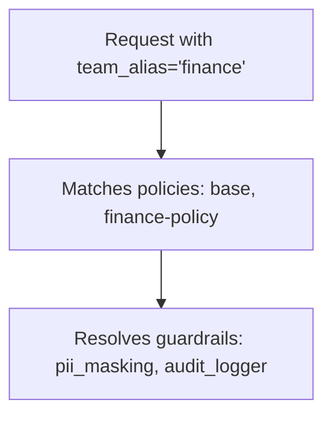

import Image from '@theme/IdealImage';
import Tabs from '@theme/Tabs';
import TabItem from '@theme/TabItem';

# [Beta] 防護欄政策 {#beta-guardrail-policies}

使用政策來分組防護欄，並控制哪些防護欄會針對特定團隊、金鑰或模型執行。

## 為什麼要使用政策？ {#why-use-policies}

- 針對團隊、金鑰或模型啟用/停用特定防護欄
- 將防護欄分組成單一政策
- 繼承現有政策，並覆寫您需要的部分

## 快速開始 {#quick-start}

<Tabs>
<TabItem value="config" label="config.yaml">

```yaml showLineNumbers title="config.yaml"
model_list:
  - model_name: {{openai_large}}
    litellm_params:
      model: openai/{{openai_large}}

# 1. Define your guardrails
guardrails:
  - guardrail_name: pii_masking
    litellm_params:
      guardrail: presidio
      mode: pre_call

  - guardrail_name: prompt_injection
    litellm_params:
      guardrail: lakera
      mode: pre_call
      api_key: os.environ/LAKERA_API_KEY

# 2. Create a policy
policies:
  my-policy:
    guardrails:
      add:
        - pii_masking
        - prompt_injection

# 3. Attach the policy
policy_attachments:
  - policy: my-policy
    scope: "*"  # apply to all requests
```

</TabItem>
<TabItem value="ui" label="UI (LiteLLM Dashboard)">

**步驟 1：建立政策**

前往 **Policies** 分頁並點擊 **+ Create New Policy**。填入政策名稱、描述，並選擇要新增的防護欄。


</TabItem>
</Tabs>

回應標頭會顯示哪些內容已執行：

```
x-litellm-applied-policies: my-policy
x-litellm-applied-guardrails: pii_masking,prompt_injection
```

## 為特定團隊新增防護欄 {#add-guardrails-for-a-specific-team}

<EnterpriseFeature feature="Team/key-based policy attachment" />

您有一個全域基準，但想為特定團隊新增額外的防護欄。

<Tabs>
<TabItem value="config" label="config.yaml">

```yaml showLineNumbers title="config.yaml"
policies:
  global-baseline:
    guardrails:
      add:
        - pii_masking

  finance-team-policy:
    inherit: global-baseline
    guardrails:
      add:
        - strict_compliance_check
        - audit_logger

policy_attachments:
  - policy: global-baseline
    scope: "*"

  - policy: finance-team-policy
    teams:
      - finance  # team alias from /team/new
```

</TabItem>
<TabItem value="ui" label="UI (LiteLLM Dashboard)">

**選項 1：建立以團隊為範圍的附加項目**

前往 **Policies** > **Attachments** 分頁並點擊 **+ Create New Attachment**。選擇政策以及要套用的團隊範圍。


**選項 2：從團隊設定中附加**

前往 **Teams** > 點擊某個團隊 > **Settings** 分頁 > 在 **Policies** 下方，選擇要附加的政策。


<Image img={require('../../../img/policy_team_attach.png')} />

</TabItem>
</Tabs>

現在 `finance` 團隊會取得 `pii_masking` + `strict_compliance_check` + `audit_logger`，而其他所有人只會取得 `pii_masking`。

## 移除特定團隊的防護欄 {#remove-guardrails-for-a-specific-team}

<EnterpriseFeature feature="Team/key-based policy attachment" />

您有全域執行的防護欄，但想為特定團隊停用其中一些（例如：內部測試）。

```yaml showLineNumbers title="config.yaml"
policies:
  global-baseline:
    guardrails:
      add:
        - pii_masking
        - prompt_injection

  internal-team-policy:
    inherit: global-baseline
    guardrails:
      remove:
        - pii_masking  # don't need PII masking for internal testing

policy_attachments:
  - policy: global-baseline
    scope: "*"

  - policy: internal-team-policy
    teams:
      - internal-testing  # team alias from /team/new
```

現在 `internal-testing` 團隊只會取得 `prompt_injection`，而其他所有人會取得兩個防護欄。

## 繼承 {#inheritance}

從基礎政策開始，並在其上擴充：

```yaml showLineNumbers title="config.yaml"
policies:
  base:
    guardrails:
      add:
        - pii_masking
        - toxicity_filter

  strict:
    inherit: base
    guardrails:
      add:
        - prompt_injection

  relaxed:
    inherit: base
    guardrails:
      remove:
        - toxicity_filter
```

您會得到：
- `base` → `[pii_masking, toxicity_filter]`
- `strict` → `[pii_masking, toxicity_filter, prompt_injection]`
- `relaxed` → `[pii_masking]`

## 模型條件 {#model-conditions}

僅針對特定模型執行防護欄：

```yaml showLineNumbers title="config.yaml"
policies:
  gpt-safety:
    guardrails:
      add:
        - strict_content_filter
    condition:
      model: "gpt-5.6.*"  # regex - matches {{openai_small}}, {{openai_large}}

  bedrock-compliance:
    guardrails:
      add:
        - audit_logger
    condition:
      model:  # exact match list
        - bedrock/anthropic.{{anthropic}}
        - bedrock/anthropic.{{anthropic_large}}
```

## 附加項目 {#attachments}

在您附加之前，政策不會發揮任何作用。附加項目會告訴 LiteLLM 要在何處套用每個政策。

**全域** - 會在每個請求上執行：

```yaml showLineNumbers title="config.yaml"
policy_attachments:
  - policy: default
    scope: "*"
```

**特定團隊**（使用來自 `/team/new` 的團隊別名）：

```yaml showLineNumbers title="config.yaml"
policy_attachments:
  - policy: hipaa-compliance
    teams:
      - healthcare-team  # team alias
      - medical-research  # team alias
```

**特定金鑰**（使用來自 `/key/generate` 的金鑰別名，支援萬用字元）：

```yaml showLineNumbers title="config.yaml"
policy_attachments:
  - policy: internal-testing
    keys:
      - "dev-*"  # key alias pattern
      - "test-*"  # key alias pattern
```

**基於標籤**（依據中繼資料標籤比對金鑰/團隊，支援萬用字元）：

```yaml showLineNumbers title="config.yaml"
policy_attachments:
  - policy: hipaa-compliance
    tags:
      - "healthcare"
      - "health-*"  # wildcard - matches health-team, health-dev, etc.
```

標籤會從金鑰和團隊 `metadata.tags` 讀取。範例來說，以 `metadata: {"tags": ["healthcare"]}` 建立的金鑰會符合上方的附加項目。

## 測試政策比對 {#test-policy-matching}

除錯哪些政策和防護欄會套用到給定情境。請在部署之前使用此功能驗證您的政策設定。

<Tabs>
<TabItem value="ui" label="UI (LiteLLM Dashboard)">

前往 **Policies** > **Test** 分頁。輸入團隊別名、金鑰別名、模型或標籤，然後點擊 **Test**，查看哪些政策會比對以及會套用哪些防護欄。

<Image img={require('../../../img/policy_test_matching.png')} />

</TabItem>
<TabItem value="api" label="API">

```bash
curl -X POST "http://localhost:4000/policies/resolve" \
    -H "Authorization: Bearer <your_api_key>" \
    -H "Content-Type: application/json" \
    -d '{
        "tags": ["healthcare"],
        "model": "{{openai_large}}"
    }'
```

回應：

```json
{
    "effective_guardrails": ["pii_masking"],
    "matched_policies": [
        {
            "policy_name": "hipaa-compliance",
            "matched_via": "tag:healthcare",
            "guardrails_added": ["pii_masking"]
        }
    ]
}
```

</TabItem>
</Tabs>

## 政策執行順序 {#policy-execution-order}

當多個政策符合單一請求時，LiteLLM 會依從最廣的附加範圍到最狹的附加範圍執行：先 `scope: "*"`，再 `teams`，接著 `keys`，再來 `tags`，最後 `models`。結合了其中多種條件的附加，會依其最狹的條件排序，且排在該層級中的單一條件附加之後（`models: [gpt-4o]` 先於 `teams: [finance], models: [gpt-4o]`）。仍然同順位的附加，會保留其 `config.yaml` 順序，接著是透過 API 或 UI 建立的附加，且以最新建立者優先。透過請求本文（`"policies": [...]`）傳入的政策，會在每個附加符合之後依照給定順序執行。在各層級之間，順序不會取決於附加在 `config.yaml` 中的列出方式，也不取決於哪個 proxy worker 處理該請求。

這就是管線執行的順序，因此全域封鎖政策一定會在模型範圍的政策執行之前拒絕請求。這也是 `x-litellm-applied-policies` 以及 `matched_policies` 在 `/policies/resolve` 和 Policy Simulator 中的順序。當同一項政策附加在多個符合的範圍時，它只會執行一次，並依其排序最前的附加來排名，而 `matched_via` 會回報該附加（`scope:*` 而非 `model:gpt-4o`，當兩者都沒有 `priority` 時）。

若要覆寫層級順序，請在附加上設定可選的整數 `priority`。具有 `priority` 的附加會先於沒有該值的所有附加執行，且值越小越先執行；當兩者數值相同時，則回退到上述層級順序。沒有 `priority` 的附加行為完全相同，因此既有設定不會變更。此處 `model-policy` 會先於 `tag-policy` 執行，即使 `tags` 是較廣的層級：

```yaml showLineNumbers title="config.yaml"
policy_attachments:
  - policy: model-policy
    models: [gpt-4o]
    priority: 1
  - policy: tag-policy
    tags: [production]
    priority: 2
```

同一欄位可由 `POST /policies/attachments` 接受、由 `GET /policies/attachments/list` 回傳，並在 Admin UI 的 Attachments 分頁中顯示為可排序的 Priority 欄位，以及一個可選的 Priority 輸入欄位。數值必須符合有號 32 位元整數（-2147483648 到 2147483647）。

```yaml showLineNumbers title="config.yaml"
policy_attachments:
  - policy: model-policy
    models: [gpt-4o]
  - policy: team-policy
    teams: [finance]
  - policy: global-policy
    scope: "*"
```

來自 `finance` 金鑰的 `gpt-4o` 請求會先執行 `global-policy`，再執行 `team-policy`，接著執行 `model-policy`，並回傳 `x-litellm-applied-policies: global-policy,team-policy,model-policy`。

## 預設（備援）附加 {#default-fallback-attachments}

附加匹配是累加式的：每個範圍符合請求的附加都會貢獻其政策。若要讓某個政策只在選擇加入的請求上執行，並讓不同的政策套用於其他所有人，請將備援附加標記為 `default: true`。只要有任何非預設附加符合該請求且其政策適用（該政策存在，且其 `condition`，若有的話，符合請求模型），預設附加就會被略過。當沒有非預設附加符合時，所有自身範圍符合的預設附加都會依一般執行順序套用。

```yaml showLineNumbers title="config.yaml"
policy_attachments:
  - policy: strict-guardrail
    tags: [strict-opt-in]
  - policy: standard-guardrail
    scope: "*"
    default: true
```

帶有 `strict-opt-in` 標籤的請求只會執行 `strict-guardrail`。沒有該標籤的請求只會執行 `standard-guardrail`，而且其在 `matched_via` 與 Policy Simulator 中的 `/policies/resolve` 會以前綴 `default:`（例如 `default:scope:*`）。預設附加仍會遵守 `teams`、`keys`、`models` 和 `tags`，因此 `teams: [finance], default: true` 只會套用於未匹配到其他任何條件的 finance 請求。沒有 `default` 的附加行為完全相同。

同一欄位可由 `POST /policies/attachments` 接受、由 `GET /policies/attachments/list` 回傳，並在 Admin UI 的建立附加表單中以 Default 開關呈現，且在 Attachments 分頁中以 Default 欄位呈現。

## 政策流程建構器 {#policy-flow-builder}

若要進行條件式執行（例如：只有在第一個防護欄失敗時才執行第二個防護欄），請使用 [Policy Flow Builder](./policy_flow_builder) 來定義具有每一步 **通過**、**失敗** 與可選 **錯誤** 動作的管線（`on_pass`、`on_fail`、可選的 `on_error`）。

## 設定參考 {#config-reference}

### `policies` {#policies}

```yaml
policies:
  <policy-name>:
    description: ...
    inherit: ...
    guardrails:
      add: [...]
      remove: [...]
    condition:
      model: ...
    pipeline: ...  # optional; see Policy Flow Builder
```

| 欄位 | 類型 | 說明 |
|-------|------|-------------|
| `description` | `string` | 選填。此政策的作用。 |
| `inherit` | `string` | 選填。要從中繼承防護欄的父政策。 |
| `guardrails.add` | `list[string]` | 要啟用的防護欄。 |
| `guardrails.remove` | `list[string]` | 要停用的防護欄（在繼承時很有用）。 |
| `condition.model` | `string` 或 `list[string]` | 選填。僅在模型符合時套用。支援 regex。 |
| `pipeline` | `object` | 選填。依序執行防護欄，並對每一步設定動作（`on_pass`、`on_fail`、可選的 `on_error`）。請參閱 [Policy Flow Builder](./policy_flow_builder)。 |

### `policy_attachments` {#policy_attachments}

```yaml
policy_attachments:
  - policy: ...
    scope: ...
    teams: [...]
    keys: [...]
    models: [...]
    tags: [...]
    priority: ...
    default: ...
```

| Field | Type | Description |
|-------|------|-------------|
| `policy` | `string` | **必填。** 要附加的政策名稱。 |
| `scope` | `string` | 使用 `"*"` 以全域套用。 |
| `teams` | `list[string]` | 團隊別名（來自 `/team/new`）。支援 `*` 萬用字元。 |
| `keys` | `list[string]` | 金鑰別名（來自 `/key/generate`）。支援 `*` 萬用字元。 |
| `models` | `list[string]` | 模型名稱。支援 `*` 萬用字元。 |
| `tags` | `list[string]` | 標籤樣式（來自金鑰/團隊 `metadata.tags`）。支援 `*` 萬用字元。 |
| `priority` | `integer` | 選填。數值越小越先執行。具有優先順序的附加會先於沒有優先順序的附加執行；同值時則回退到層級順序。 |
| `default` | `boolean` | 選填，預設為 `false`。只有在沒有任何非預設附加符合請求時，才套用此附加。 |

### 回應標頭 {#response-headers}

| 標頭 | 說明 |
|--------|-------------|
| `x-litellm-applied-policies` | 與此請求比對成功的政策 |
| `x-litellm-applied-guardrails` | 實際執行的防護欄 |
| `x-litellm-policy-sources` | 每個政策為何比對成功（例如：`hipaa=tag:healthcare; baseline=scope:*`） |

## 運作方式 {#how-it-works}

設定範例：

```yaml showLineNumbers title="config.yaml"
policies:
  base:
    guardrails:
      add: [pii_masking]

  finance-policy:
    inherit: base
    guardrails:
      add: [audit_logger]

policy_attachments:
  - policy: base
    scope: "*"
  - policy: finance-policy
    teams: [finance]
```


```mermaid
flowchart TD
    A["Request with team_alias='finance'"] --> B["Matches policies: base, finance-policy"]
    B --> C["Resolves guardrails: pii_masking, audit_logger"]
```

1. 請求以 `team_alias='finance'` 進來
2. 比對到 `base`（透過 `scope: "*"`）以及 `finance-policy`（透過 `teams: [finance]`）
3. 解析防護欄：`base` 新增 `pii_masking`，`finance-policy` 繼承並新增 `audit_logger`
4. 最終防護欄：`pii_masking`、`audit_logger`
