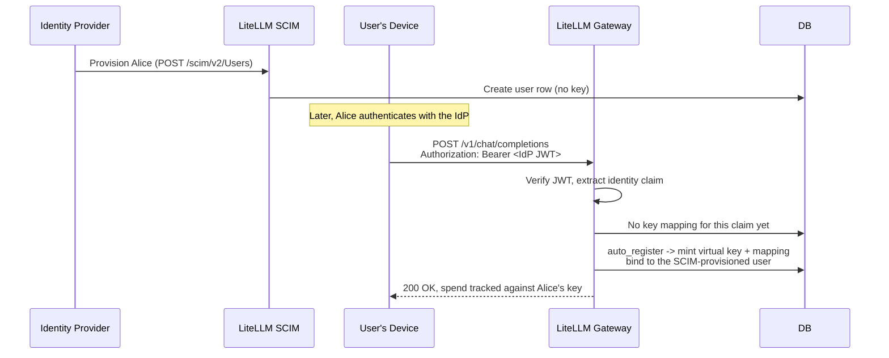

# Provisioning identities and issuing keys

A question that comes up with SSO deployments is whether a user provisioned through your identity provider (via SCIM) automatically ends up with a virtual key and a credential on their laptop, ready to call the gateway. LiteLLM has all the pieces for this, but they are separate features you compose rather than one turnkey flow. This page is the step-by-step guide that takes you from nothing to a working setup where a SCIM-provisioned user authenticates from their device and gets their own virtual key, with a checkpoint after each step so you can see where you are.

If you only need the reference for one feature, its dedicated page goes deeper: [SCIM provisioning](../tutorials/scim_litellm.md), [OIDC JWT auth](./token_auth.md), [JWT to virtual key mapping](./jwt_key_mapping.md), and [CLI authentication](./cli_sso.md).

---

## What you are building

Four layers combine into the end-to-end flow, and each is a distinct feature that does one job:

| Layer | Feature | What it produces | Enterprise? |
|---|---|---|---|
| Identity provisioning | SCIM | `LiteLLM_UserTable` rows and teams, synced from your IdP | Yes |
| Request authentication | JWT auth | A verified caller identity per request, from an IdP token | Yes |
| Authorization + spend | Virtual keys | Model access, budgets, rate limits, spend tracking | No |
| On-device credential + agent launch | CLI login and wrappers (`lite login`, `lite claude` / `lite codex`) | A stored session token, and coding agents launched with the proxy env vars set for you | No |

These do not hand off to each other automatically. SCIM creating a user does not mint a key; JWT auth verifying a token does not by itself create a key; and neither puts anything on the user's device. You get the end-to-end behavior by turning on the right combination and aligning them on a shared identity claim, which is what the steps below do.

The target flow, once configured:



---

## Prerequisites

You need a LiteLLM proxy backed by a database (both SCIM and `auto_register` write to it), an enterprise license (SCIM and JWT auth are both enterprise features), your proxy `master_key`, and an identity provider that supports OIDC for the JWTs and SCIM 2.0 for provisioning (Okta, Entra ID, OneLogin, Keycloak, Auth0, Google Workspace).

---

## Step 1. Turn on JWT auth

Point the gateway at your IdP's signing keys and tell it which claims carry the user, email, and team. Set `JWT_PUBLIC_KEY_URL` to your IdP's JWKS or OIDC discovery URL, and optionally `JWT_AUDIENCE` and `JWT_ISSUER` to restrict which tokens are accepted:

```bash
export JWT_PUBLIC_KEY_URL="https://your-idp.example.com/.well-known/openid-configuration"
export JWT_AUDIENCE="litellm-proxy"     # optional but recommended
export JWT_ISSUER="https://your-idp.example.com"  # optional but recommended
```

```yaml title="config.yaml"
general_settings:
  master_key: sk-1234
  enable_jwt_auth: True
  litellm_jwtauth:
    user_id_jwt_field: "sub"        # stable per-user id from your IdP
    user_email_jwt_field: "email"
    team_ids_jwt_field: "groups"    # claim carrying the user's group/team ids
```

**Checkpoint.** Restart the proxy and send a request with a valid IdP JWT as the bearer token. It should authenticate and resolve the caller to a team. If you get a 401, the signature, audience, or issuer check is failing; see [OIDC JWT auth](./token_auth.md) for troubleshooting.

---

## Step 2. Provision users and teams with SCIM

Create the SCIM token the IdP will use, then connect provisioning. In the Admin UI, go to Settings > Admin Settings > SCIM and create a SCIM token; this is an ordinary virtual key whose routes are locked to `/scim/*`. Copy the tenant URL (`https://<your-proxy>/scim/v2`) and the token. In your IdP's provisioning configuration for the LiteLLM app, paste that URL and token, then assign the users and groups you want synced. Full walkthrough with screenshots on the [SCIM page](../tutorials/scim_litellm.md).

**Checkpoint.** After assignment, confirm the users and teams landed:

```bash
curl 'https://<your-proxy>/scim/v2/Users' \
  -H 'Authorization: Bearer <SCIM_TOKEN>'
```

You should see the provisioned users, and the assigned groups should appear as teams in the UI. Note that these users have no virtual key yet; SCIM creates the identity with `auto_create_key=False` and never mints a key. That is what Step 3 handles.

---

## Step 3. Turn on virtual key auto-registration

Add two settings to `litellm_jwtauth`: the claim that identifies each client, and the behavior when a client has no key yet.

```yaml title="config.yaml"
general_settings:
  master_key: sk-1234
  enable_jwt_auth: True
  litellm_jwtauth:
    user_id_jwt_field: "sub"
    user_email_jwt_field: "email"
    team_ids_jwt_field: "groups"
    virtual_key_claim_field: "email"                    # per-client key lookup
    unregistered_jwt_client_behavior: "auto_register"   # mint on first request
```

`unregistered_jwt_client_behavior` accepts `fallback_team_mapping` (the default, fall through to team auth), `reject` (403 when there is no mapping), or `auto_register`. With `auto_register`, the first request carrying a new claim value mints a virtual key and a claim-to-key mapping on the fly, with no admin call. The key is created only after the token clears full policy (signature, RBAC and scope, `custom_validate`, and `user_allowed_email_domain`); it inherits the team, user, and org resolved from the JWT; it is skipped for tokens that resolve to a proxy admin; and it requires the database. See [JWT to virtual key mapping](./jwt_key_mapping.md) for per-client budgets and manual mappings.

**Checkpoint.** Restart the proxy. Nothing is created yet, because the trigger is the first request, not this config change. You verify it in Step 5.

---

## Step 4. Connect a coding agent to the gateway

A developer's tool needs the proxy as its base URL and a credential as its bearer token. Rather than have each developer export those by hand, the `lite` CLI wires them for you. Pick the model that fits.

**Recommended: launch the agent with the `lite` CLI.** The CLI ships wrapper commands, `lite claude`, `lite codex`, and `lite opencode`, that log the developer in over SSO if they have no credential yet, verify the key against the proxy, set the environment variables the agent reads, then hand off. The developer exports nothing.

```bash
export LITELLM_PROXY_URL=https://your-litellm-proxy:4000
lite claude          # or: lite codex / lite opencode
```

On first run this triggers `lite login` (browser SSO), stores a short-lived session token at `~/.litellm/token.json` (`0600`), then starts the agent. The wrapper sets the right variables per agent: Claude Code gets `ANTHROPIC_BASE_URL` (the proxy root) and `ANTHROPIC_AUTH_TOKEN`, and it clears any stray `ANTHROPIC_API_KEY` so the proxy token wins; Codex and OpenCode get `OPENAI_BASE_URL` (proxy plus `/v1`) and `OPENAI_API_KEY`, with Codex additionally pointed at a custom provider since it ignores `OPENAI_BASE_URL`. Forward the agent's own flags through the wrapper, for example `lite claude --model my-proxy-model`, and whatever model it requests must exist on the proxy. This path uses the session token from `lite login`, tied to the SSO'd (and SCIM-provisioned) user, so it does not go through the Step 3 `auto_register` path; the login flow issues the credential and spend still tracks against that user. To use a long-lived virtual key instead of the SSO session token, pass `--api-key` or set `LITELLM_PROXY_API_KEY`. See [CLI authentication](./cli_sso.md) for deployment prerequisites.

**Clients that already carry an IdP JWT.** Services, or agents already wired to your IdP, send the IdP-minted JWT straight to the proxy as the bearer token; LiteLLM never stores it. This is the path that triggers Step 3's `auto_register`, minting a per-user virtual key on the first request. For an Anthropic-style client, point it at the proxy root and pass the JWT as the auth token:

```bash
export ANTHROPIC_BASE_URL="https://your-litellm-proxy:4000"
export ANTHROPIC_AUTH_TOKEN="<user-sso-jwt-token>"
```

Two clarifications that trip people up. LiteLLM has no OS keychain or credential-helper integration; the on-device store for the CLI flow is that `0600` JSON file, not the macOS Keychain, Windows Credential Manager, or a git-style credential helper, so if you want it in an OS keychain you wrap `lite login` with your own tooling. And the session token the CLI stores is a LiteLLM-issued token scoped to the gateway, not the raw IdP JWT and not a persisted virtual key that appears in the Keys UI.

---

## Step 5. Trigger and verify auto-registration

This verifies the `auto_register` path from Step 4's second option, where the client sends an IdP JWT directly. If your developers onboard through `lite claude` / `lite codex` instead, there is no mapping to inspect; you confirm success when the agent launches and the user's spend shows up in the dashboard. For the IdP-JWT path, send the first real request as the provisioned user, using their JWT:

```bash
JWT_TOKEN="eyJhbG..."   # a valid IdP token for the SCIM-provisioned user

curl -X POST 'https://your-litellm-proxy:4000/v1/chat/completions' \
  -H "Authorization: Bearer $JWT_TOKEN" \
  -H 'Content-Type: application/json' \
  -d '{"model": "claude-sonnet-4-5", "messages": [{"role": "user", "content": "Hello"}]}'
```

That first request mints the user's virtual key and the claim-to-key mapping. Confirm both:

```bash
# The mapping now exists, keyed on the claim value (the user's email here)
curl 'https://your-litellm-proxy:4000/jwt/key/mapping/list?page=1&size=50' \
  -H 'Authorization: Bearer sk-1234'
```

In the Admin UI, the auto-registered key appears under the user with `auto_registered: true` in its metadata, and spend, rate limits, and model access now track per user. From here every subsequent request from that user reuses the same key. This is the point where the flow is self-sustaining; you only step back in to adjust a specific user's budget or model set, which you do by updating the underlying key.

---

## Making the key bind to the right user

The one thing to get right is the identity join between SCIM and the JWT, otherwise `auto_register` mints a key that is not attached to the user SCIM provisioned. SCIM stores the user's id from the SCIM `userName` (so the LiteLLM `user_id` equals the `userName` your IdP sends), keeps `externalId` as `sso_user_id`, and stores the address from `emails[0]`. The auto-registered key binds to the user resolved from `user_id_jwt_field`, so map that to the JWT claim carrying the same value your IdP sends as the SCIM `userName`. Email is a reliable secondary join: LiteLLM also matches a JWT user to an existing user by email, so as long as your IdP sends the same email in both SCIM (`emails[0]`) and the JWT (`user_email_jwt_field`), the key attaches to the provisioned user even if the primary ids differ. Use a globally unique claim for `virtual_key_claim_field` (email or a stable subject id) so two different users never collide on the same mapping.

---

## What LiteLLM does and does not do

| Behavior | Supported? |
|---|---|
| SCIM provisions users and teams from your IdP | Yes |
| SCIM auto-creates a virtual key for a provisioned user | No (`auto_create_key=False`) |
| SCIM deprovisioning revokes the user's keys | Yes |
| JWT auth authenticates requests with IdP tokens | Yes |
| JWT auth auto-registers a per-client virtual key | Yes, with `virtual_key_claim_field` + `auto_register` |
| SCIM provisioning event directly triggers key creation | No (the first request does, lazily) |
| `lite login` stores a gateway credential on the device | Yes (`~/.litellm/token.json`, `0600`) |
| `lite claude` / `lite codex` / `lite opencode` set the agent's env vars for you | Yes (base URL and bearer token wired per agent) |
| Credential stored in an OS keychain / credential helper | No (plain file with owner-only permissions) |
| Device-stored credential is the raw IdP JWT | No (it is a LiteLLM-issued session token) |

---

## Related

- [SCIM with LiteLLM](../tutorials/scim_litellm.md): provisioning users and teams from your IdP
- [OIDC JWT auth](./token_auth.md): base JWT auth setup
- [JWT to virtual key mapping](./jwt_key_mapping.md): per-client keys, manual mappings, and `auto_register`
- [CLI authentication](./cli_sso.md): the `lite login` device flow
- [Virtual keys](./virtual_keys.md): the unit of access control and spend
