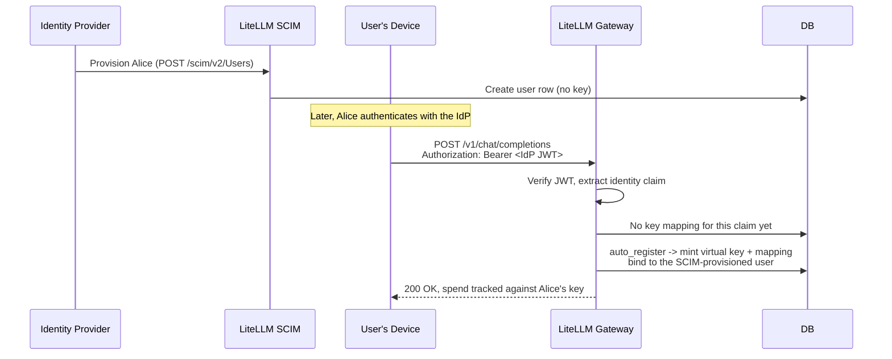

# 身分佈建與金鑰發放 {#provisioning-identities-and-issuing-keys}

在 SSO 部署中常見的一個問題是，透過您的身分提供者（經由 SCIM）佈建的使用者，是否會自動在其筆電上獲得虛擬金鑰與憑證，並準備好呼叫閘道。LiteLLM 為此備齊了所有元件，但它們是可自行組合的獨立功能，而非單一的一鍵式流程。本頁是逐步指南，帶您從零開始建立可運作的設定：讓經由 SCIM 佈建的使用者從其裝置完成驗證並取得自己的虛擬金鑰，且每一步之後都有檢查點，讓您知道目前進度。

如果您只需要某個功能的參考文件，其專屬頁面會更深入： [SCIM 佈建](../tutorials/scim_litellm.md)、[OIDC JWT 驗證](./token_auth.md)、[JWT 到虛擬金鑰對應](./jwt_key_mapping.md)，以及 [CLI 驗證](./cli_sso.md)。

---

## 您要建立的是什麼 {#what-you-are-building}

四層組合成端到端流程，而每一層都是各司其職的獨立功能：

| 層級 | 功能 | 產出內容 | Enterprise？ |
|---|---|---|---|
| 身分佈建 | SCIM | 來自您的 IdP 同步的 `LiteLLM_UserTable` 列與團隊 | 是 |
| 請求驗證 | JWT 驗證 | 每個請求經由 IdP token 驗證後的呼叫者身分 | 是 |
| 授權 + 支出 | 虛擬金鑰 | 模型存取、預算、速率限制、支出追蹤 | 否 |
| 裝置上的憑證 + 代理程式啟動 | CLI 登入與包裝器（`lite login`、`lite claude` / `lite codex`） | 已儲存的工作階段 token，以及代您設定好 proxy 環境變數後啟動的 coding agents | 否 |

這些功能不會自動彼此交接。SCIM 建立使用者不會鑄造金鑰；JWT 驗證 token 本身也不會建立金鑰；而且兩者都不會在使用者裝置上放入任何東西。您需要透過啟用正確的組合，並讓它們對齊一個共用的身分宣告，才能得到端到端行為，以下步驟就是在做這件事。

完成設定後的目標流程：


```mermaid
sequenceDiagram
    participant IdP as Identity Provider
    participant SCIM as LiteLLM SCIM
    participant Device as User's Device
    participant Proxy as LiteLLM Gateway
    participant DB as DB

    IdP->>SCIM: Provision Alice (POST /scim/v2/Users)
    SCIM->>DB: Create user row (no key)
    Note over Device: Later, Alice authenticates with the IdP
    Device->>Proxy: POST /v1/chat/completions<br/>Authorization: Bearer <IdP JWT>
    Proxy->>Proxy: Verify JWT, extract identity claim
    Proxy->>DB: No key mapping for this claim yet
    Proxy->>DB: auto_register -> mint virtual key + mapping<br/>bind to the SCIM-provisioned user
    Proxy-->>Device: 200 OK, spend tracked against Alice's key
```

---

## 必要條件 {#prerequisites}

您需要一個由資料庫支援的 LiteLLM proxy（SCIM 與 `auto_register` 都會寫入其中）、Enterprise 授權（SCIM 與 JWT 驗證皆為 Enterprise 功能）、您的 proxy `master_key`，以及一個支援 JWT 的 OIDC 與支援 SCIM 2.0 佈建的身分提供者（Okta、Entra ID、OneLogin、Keycloak、Auth0、Google Workspace）。

---

## 步驟 1. 啟用 JWT 驗證 {#step-1-turn-on-jwt-auth}

將閘道指向您的 IdP 簽署金鑰，並告訴它哪些 claims 包含使用者、電子郵件與團隊。將 `JWT_PUBLIC_KEY_URL` 設為您的 IdP JWKS 或 OIDC discovery URL，並可選擇設定 `JWT_AUDIENCE` 與 `JWT_ISSUER` 來限制可接受的 token：

```bash
export JWT_PUBLIC_KEY_URL="https://your-idp.example.com/.well-known/openid-configuration"
export JWT_AUDIENCE="litellm-proxy"     # optional but recommended
export JWT_ISSUER="https://your-idp.example.com"  # optional but recommended
```

```yaml title="config.yaml"
general_settings:
  master_key: os.environ/LITELLM_MASTER_KEY
  enable_jwt_auth: True
  litellm_jwtauth:
    user_id_jwt_field: "sub"        # stable per-user id from your IdP
    user_email_jwt_field: "email"
    team_ids_jwt_field: "groups"    # claim carrying the user's group/team ids
```

**檢查點。** 重新啟動 proxy，並使用有效的 IdP JWT 作為 bearer token 發送請求。它應該會通過驗證並將呼叫者解析為某個團隊。如果您收到 401，表示簽章、audience 或 issuer 檢查失敗；請參閱 [OIDC JWT 驗證](./token_auth.md) 進行疑難排解。

---

## 步驟 2. 使用 SCIM 佈建使用者與團隊 {#step-2-provision-users-and-teams-with-scim}

建立 IdP 將使用的 SCIM token，然後連接佈建流程。在 Admin UI 中，前往 Settings > Admin Settings > SCIM 並建立一個 SCIM token；這是一個一般的虛擬金鑰，其路由被鎖定為 `/scim/*`。複製 tenant URL（`https://<your-proxy>/scim/v2`）與 token。在您的 IdP 中 LiteLLM app 的佈建設定裡，貼上該 URL 與 token，然後指派您要同步的使用者與群組。附有截圖的完整操作流程請見 [SCIM 頁面](../tutorials/scim_litellm.md)。

**檢查點。** 指派完成後，確認使用者與團隊已落地：

```bash
curl 'https://<your-proxy>/scim/v2/Users' \
  -H 'Authorization: Bearer <SCIM_TOKEN>'
```

您應該會看到已佈建的使用者，而指派的群組應會在 UI 中顯示為團隊。請注意，這些使用者此時還沒有虛擬金鑰；SCIM 只會以 `auto_create_key=False` 建立身分，絕不會鑄造金鑰。這就是步驟 3 要處理的部分。

---

## 步驟 3. 啟用虛擬金鑰自動註冊 {#step-3-turn-on-virtual-key-auto-registration}

在 `litellm_jwtauth` 中新增兩個設定：識別每個 client 的 claim，以及當 client 尚無金鑰時的行為。

```yaml title="config.yaml"
general_settings:
  master_key: os.environ/LITELLM_MASTER_KEY
  enable_jwt_auth: True
  litellm_jwtauth:
    user_id_jwt_field: "sub"
    user_email_jwt_field: "email"
    team_ids_jwt_field: "groups"
    virtual_key_claim_field: "email"                    # per-client key lookup
    unregistered_jwt_client_behavior: "auto_register"   # mint on first request
```

`unregistered_jwt_client_behavior` 接受 `fallback_team_mapping`（預設值，回落到團隊驗證）、`reject`（沒有對應時回傳 403），或 `auto_register`。使用 `auto_register` 時，第一個帶有新 claim 值的請求會即時鑄造虛擬金鑰與 claim-to-key 對應，無需管理員呼叫。只有在 token 通過完整政策（簽章、RBAC 與 scope、`custom_validate`，以及 `user_allowed_email_domain`）後才會建立金鑰；它會繼承從 JWT 解析出的團隊、使用者與組織；若 token 解析為 proxy 管理員則會略過；且需要資料庫。關於每個 client 的預算與手動對應，請參閱 [JWT 到虛擬金鑰對應](./jwt_key_mapping.md)。

**檢查點。** 重新啟動 proxy。此時不會建立任何東西，因為觸發點是第一個請求，而不是這次設定變更。您會在步驟 5 中驗證。

---

## 步驟 4. 將 coding agent 連接到閘道 {#step-4-connect-a-coding-agent-to-the-gateway}

開發者工具需要將 proxy 作為基礎 URL，並將憑證作為 bearer token。與其讓每位開發者手動匯出這些設定，不如由 `lite` CLI 幫您串接。請選擇最適合的模型。

**建議做法：使用 `lite` CLI 啟動代理程式。** 此 CLI 隨附包裝器命令 `lite claude`、`lite codex` 與 `lite opencode`；若開發者尚無憑證，這些命令會透過 SSO 讓其登入、向 proxy 驗證金鑰、設定代理程式讀取的環境變數，然後交由後續流程處理。開發者不需要匯出任何內容。

```bash
export LITELLM_PROXY_URL=https://your-litellm-proxy:4000
lite claude          # or: lite codex / lite opencode
```

首次執行時，這會觸發 `lite login`（瀏覽器 SSO），將短效期的工作階段權杖儲存在開發者的作業系統金鑰鏈中，然後啟動代理程式。包裝器會為每個代理程式設定正確的變數：Claude Code 會取得 `ANTHROPIC_BASE_URL`（proxy root）和 `ANTHROPIC_AUTH_TOKEN`，並清除任何多餘的 `ANTHROPIC_API_KEY`，讓 proxy 權杖生效；Codex 和 OpenCode 會取得 `OPENAI_BASE_URL`（proxy 加上 `/v1`）和 `OPENAI_API_KEY`，而 Codex 另外會指向自訂提供者，因為它忽略 `OPENAI_BASE_URL`。將代理程式自己的旗標透過包裝器傳入，例如 `lite claude --model my-proxy-model`，而且它請求的任何模型都必須存在於 proxy 上。這條路徑使用來自 `lite login` 的工作階段權杖，該權杖綁定到已經完成 SSO（且已由 SCIM provisioned）的使用者，因此不會經過 Step 3 `auto_register` 路徑；登入流程會簽發憑證，而支出仍會計入該使用者。若要使用長效期的虛擬金鑰而非 SSO 工作階段權杖，請傳入 `--api-key` 或設定 `LITELLM_PROXY_API_KEY`。請參閱 [CLI 驗證](./cli_sso.md) 以了解部署先決條件。

**已攜帶 IdP JWT 的用戶端。** 服務，或已與您的 IdP 串接的代理程式，會將 IdP 鑄造的 JWT 直接作為 bearer token 傳給 proxy；LiteLLM 不會儲存它。這條路徑會觸發 Step 3 的 `auto_register`，在第一次請求時為每位使用者鑄造虛擬金鑰。對於 Anthropic 風格的 client，請將其指向 proxy root，並將 JWT 作為驗證 token 傳入：

```bash
export ANTHROPIC_BASE_URL="https://your-litellm-proxy:4000"
export ANTHROPIC_AUTH_TOKEN="<user-sso-jwt-token>"
```

有兩點說明常讓人搞混。來自 `lite login` 的憑證會存在作業系統金鑰鏈（macOS Keychain、Windows Credential Manager 或 Linux Secret Service）中，服務名稱為 `litellm-cli`，而 `~/.litellm/token.json` 只保留非機密中繼資料：閘道 URL、使用者的 id、電子郵件與角色、驗證標頭名稱，以及登入時間戳記。存取金鑰鏈需要 `keyring` 套件，而這個套件包含在 `cli` 額外功能中，因此請將 CLI 安裝為 `litellm[cli]`。在沒有可用金鑰鏈的地方，例如無頭 Linux 主機，或您設定 `LITELLM_CLI_DISABLE_KEYRING` 以關閉金鑰鏈儲存時，憑證會回退到同一個 `0600` 檔案，而 `lite login` 會指出它使用了哪一種。仍然沒有 git 樣式的 credential-helper 整合。而 CLI 儲存的工作階段權杖是 LiteLLM 簽發、範圍限於閘道的權杖，不是原始的 IdP JWT，也不是會顯示在 Keys UI 中的持久化虛擬金鑰

---

## 第 5 步。觸發並驗證自動註冊 {#step-5-trigger-and-verify-auto-registration}

這會驗證第 4 步第二個選項中的 `auto_register` 路徑，也就是用戶端直接傳送 IdP JWT。如果您的開發人員是透過 `lite claude` / `lite codex` 入門，則沒有對應可檢查；當代理程式啟動且使用者的支出出現在儀表板中時，就代表成功。對於 IdP-JWT 路徑，請使用已佈建使用者的 JWT 傳送第一個實際請求：

```bash
JWT_TOKEN="eyJhbG..."   # a valid IdP token for the SCIM-provisioned user

curl -X POST 'https://your-litellm-proxy:4000/v1/chat/completions' \
  -H "Authorization: Bearer $JWT_TOKEN" \
  -H 'Content-Type: application/json' \
  -d '{"model": "{{anthropic}}", "messages": [{"role": "user", "content": "Hello"}]}'
```

第一個請求會鑄造使用者的虛擬金鑰與 claim-to-key 對應。請確認兩者：

```bash
# The mapping now exists, keyed on the claim value (the user's email here)
curl 'https://your-litellm-proxy:4000/jwt/key/mapping/list?page=1&size=50' \
  -H "Authorization: Bearer $LITELLM_API_KEY"
```

在 Admin UI 中，自動註冊的金鑰會以 `auto_registered: true` 顯示在該使用者底下，其中繼資料也會包含，且支出、速率限制與模型存取現在會依使用者追蹤。從這裡開始，該使用者之後的每個請求都會重用同一把金鑰。到了這一步，流程就能自我維持；只有在您要調整特定使用者的預算或模型集合時，才需要再介入，而這是透過更新底層金鑰來完成。

---

## 讓金鑰綁定到正確的使用者 {#making-the-key-bind-to-the-right-user}

若要將自動註冊的金鑰與正確的 SCIM provisioned 使用者關聯，請在 SCIM 與 JWT claims 之間設定一致的身分值。LiteLLM 會將 SCIM `userName` 儲存為 `user_id`，並將 `emails[0].value` 儲存為 `user_email`。`externalId` 屬性會在 `PUT` 和 `PATCH` 請求中儲存為 `sso_user_id`，但在初始 `POST` 期間不會；因此，在使用者更新之前，`sso_user_id` 可能會保持空白。請參閱 [屬性對應表](../tutorials/scim_litellm.md#user-attribute-mapping)。

設定 `user_id_jwt_field` 以參照包含與 SCIM `userName` 所提供相同值的 JWT claim。當 `emails[0].value` 與由 `user_email_jwt_field` 設定的 JWT claim 相符時，LiteLLM 也可以透過電子郵件比對既有使用者。將 `virtual_key_claim_field` 設為全域唯一值，例如電子郵件地址或穩定的 subject 識別碼，以避免多個使用者共用相同的金鑰對應。

---

## LiteLLM 會做與不會做的事 {#what-litellm-does-and-does-not-do}

| 行為 | 是否支援？ |
|---|---|
| SCIM 從您的 IdP 為使用者與團隊進行 provision | 是 |
| SCIM 為已 provision 的使用者自動建立虛擬金鑰 | 否（`auto_create_key=False`） |
| SCIM deprovisioning 會撤銷使用者的金鑰 | 是 |
| JWT 驗證使用 IdP token 驗證請求 | 是 |
| JWT 驗證會為每個用戶端自動註冊虛擬金鑰 | 是，搭配 `virtual_key_claim_field` + `auto_register` |
| SCIM provisioning 事件會直接觸發金鑰建立 | 否（第一次請求會，且為 lazy 方式） |
| `lite login` 會在裝置上儲存閘道憑證 | 是（OS 金鑰鏈，或在沒有金鑰鏈時於 `0600` 使用 `~/.litellm/token.json`） |
| `lite claude` / `lite codex` / `lite opencode` 會替您設定代理程式的環境變數 | 是（依每個代理程式連接 base URL 與 bearer token） |
| 儲存在 OS 金鑰鏈中的憑證 | 是（服務 `litellm-cli`；沒有 git 樣式的 credential-helper 整合） |
| 儲存在裝置上的憑證是原始 IdP JWT | 否（它是 LiteLLM 簽發的工作階段權杖） |

---

## 相關 {#related}

- [LiteLLM 的 SCIM](../tutorials/scim_litellm.md)：從您的 IdP 佈建使用者和團隊
- [OIDC JWT 驗證](./token_auth.md)：基礎 JWT 驗證設定
- [JWT 到虛擬金鑰對應](./jwt_key_mapping.md)：每個用戶端的金鑰、手動對應，以及 `auto_register`
- [CLI 驗證](./cli_sso.md)：`lite login` 裝置流程
- [虛擬金鑰](./virtual_keys.md)：存取控制與支出的單位
