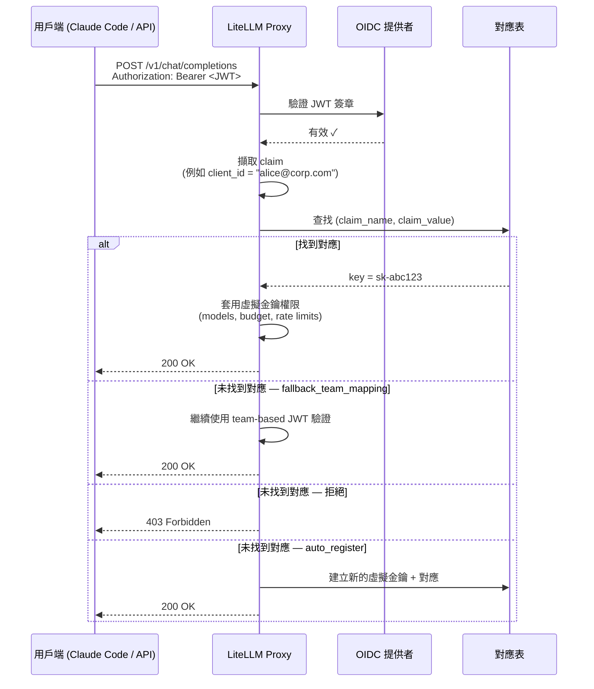

# JWT → 虛擬金鑰對應 {#jwt--virtual-key-mapping}

:::info Enterprise

JWT → 虛擬金鑰對應是 Enterprise 功能。

[取得免費試用](https://enterprise.litellm.ai/demo)

:::

將 JWT token 對應到 LiteLLM 虛擬金鑰——如此一來，每個 JWT 用戶端都能獲得與虛擬金鑰相同的細緻控管：模型限制、花費上限、速率限制、防護欄與完整花費追蹤。

**這很重要的原因：** 標準 JWT 驗證會將 JWT 對應到一個 *team*。那是一個共享邊界——同一 team 下的所有用戶端都共享相同限制。透過 JWT → 虛擬金鑰對應，每個個別 JWT 用戶端（由 `client_id`、`azp` 或 `sub` 等 claim 識別）都會對應到自己的虛擬金鑰。您可以對每位用戶端進行責任追蹤，而不必把 API 金鑰發給使用者。

**常見使用情境：** 您的公司使用 SSO/OIDC。開發者使用 Claude Code 搭配自己的身分 token。您希望在不為每個人發放 LiteLLM API 金鑰的情況下，強制執行每位開發者的模型存取與花費上限。

---

## 運作方式 {#how-it-works}



---

## 設定 {#setup}

### 先決條件 {#prerequisites}

請先完成 [OIDC JWT 驗證設定](./token_auth.md)——您需要先設定好 `JWT_PUBLIC_KEY_URL`，並在您的 proxy 設定中啟用 `enable_jwt_auth: True`。

### 步驟 1. 設定要用來對應的 JWT claim {#step-1-configure-the-jwt-claim-to-map-on}

將 `virtual_key_claim_field` 加入您的 `litellm_jwtauth` 設定。這是 LiteLLM 用來作為查找鍵的 JWT claim：

```yaml
general_settings:
  master_key: sk-1234
  enable_jwt_auth: True
  litellm_jwtauth:
    team_id_jwt_field: "team_id"          # existing team mapping (optional)
    user_id_jwt_field: "sub"
    virtual_key_claim_field: "client_id"  # claim used as the key-mapping lookup
    unregistered_jwt_client_behavior: "fallback_team_mapping"  # see below
```

`virtual_key_claim_field` 先前名為 `jwt_client_id_field`；舊名稱仍可作為向後相容別名使用。

**`unregistered_jwt_client_behavior`** 控制當 JWT 沒有已註冊對應時會發生什麼事：

| Value | 行為 |
|-------|----------|
| `fallback_team_mapping` | 直接回退到以 team 為基礎的 JWT 驗證（預設值 — 向後相容） |
| `reject` | 若找不到對應則回傳 403 |
| `auto_register` | 首次遇到時自動建立虛擬金鑰 + 對應 |

使用 `auto_register` 時，第一個帶有新 claim 值的請求會即時建立一把虛擬金鑰與對應，無需管理員呼叫。只有在 JWT 通過完整政策檢查（簽章、RBAC/scope、`custom_validate` 與 `user_allowed_email_domain`）後才會建立金鑰；如果 token 未通過任一檢查，請求會被拒絕且不會建立任何內容。新金鑰會繼承從已驗證 JWT 解析出的 team、user 與 org，因此請確保這些 claim 已設定完成。若 token 解析為 proxy 管理員，則不會自動註冊，因為管理員本來就擁有完整存取權。`auto_register` 需要資料庫連線

### 步驟 2. 註冊 JWT 用戶端 → 虛擬金鑰對應 {#step-2-register-a-jwt-client--virtual-key-mapping}

**建議：讓 `auto_register` 自動處理。** 在步驟 1 設定 `unregistered_jwt_client_behavior: "auto_register"`，之後每個新的 claim 值第一次發送請求時，就會自動建立自己的金鑰，無需管理員呼叫。當每位用戶端都應從相同預設值開始時，請使用此方式。

**手動：註冊一把具有特定限制的金鑰。** 當某位用戶端需要自己的預算或模型集合時，先建立虛擬金鑰，再將某個 claim 值對應到該金鑰。沒有單一原子化端點；需要兩次呼叫。

```bash
# 1. Create a virtual key with the limits you want
curl -X POST 'http://0.0.0.0:4000/key/generate' \
  -H 'Authorization: Bearer <PROXY_MASTER_KEY>' \
  -H 'Content-Type: application/json' \
  -d '{
    "models": ["claude-sonnet-4-5", "claude-haiku-4-5"],
    "max_budget": 50.0,
    "budget_duration": "30d",
    "rpm_limit": 100,
    "tpm_limit": 50000,
    "team_id": "engineering"
  }'
# -> {"key": "sk-abc123...", ...}

# 2. Map a JWT claim value to that key
curl -X POST 'http://0.0.0.0:4000/jwt/key/mapping/new' \
  -H 'Authorization: Bearer <PROXY_MASTER_KEY>' \
  -H 'Content-Type: application/json' \
  -d '{
    "jwt_claim_name": "client_id",
    "jwt_claim_value": "dev-alice",
    "key": "sk-abc123...",
    "description": "dev-alice"
  }'
```

### 步驟 3. 測試 {#step-3-test-it}

```bash
# Get a JWT from your OIDC provider (must have client_id: dev-alice)
JWT_TOKEN="eyJhbG..."

curl -X POST 'http://0.0.0.0:4000/v1/chat/completions' \
  -H "Authorization: Bearer $JWT_TOKEN" \
  -H 'Content-Type: application/json' \
  -d '{
    "model": "claude-sonnet-4-5",
    "messages": [{"role": "user", "content": "Hello"}]
  }'
```

此請求現在會以 `dev-alice` 的虛擬金鑰進行追蹤——花費、速率限制與模型存取都會套用到每位用戶端。

---

## 範例流程：管理員授予細緻存取權，team 使用 Claude Code {#walkthrough-admin-grants-granular-access-team-uses-claude-code}

這是工程團隊使用 Claude Code 搭配公司 SSO 的完整流程。

### 管理員設定 {#admin-setup}

**1. 為工程團隊建立一個 team**

```bash
curl -X POST 'http://0.0.0.0:4000/team/new' \
  -H 'Authorization: Bearer <MASTER_KEY>' \
  -H 'Content-Type: application/json' \
  -d '{
    "team_alias": "engineering",
    "models": ["claude-sonnet-4-5", "claude-haiku-4-5"]
  }'
```

**2. 為每位開發者註冊自己的金鑰與花費上限**

每位開發者都是一個虛擬金鑰，再加上從其 JWT claim 到該金鑰的對應。先使用 `/key/generate` 建立金鑰，再使用 `/jwt/key/mapping/new` 將 claim 值對應上去。

```bash
# Alice: senior eng, higher budget
ALICE_KEY=$(curl -s -X POST 'http://0.0.0.0:4000/key/generate' \
  -H 'Authorization: Bearer <MASTER_KEY>' -H 'Content-Type: application/json' \
  -d '{"team_id": "engineering", "models": ["claude-sonnet-4-5", "claude-haiku-4-5"], "max_budget": 200.0, "budget_duration": "30d", "rpm_limit": 200}' \
  | jq -r '.key')

curl -X POST 'http://0.0.0.0:4000/jwt/key/mapping/new' \
  -H 'Authorization: Bearer <MASTER_KEY>' -H 'Content-Type: application/json' \
  -d "{\"jwt_claim_name\": \"client_id\", \"jwt_claim_value\": \"alice@corp.com\", \"key\": \"$ALICE_KEY\", \"description\": \"alice@corp.com\"}"

# Bob: contractor, tighter limits
BOB_KEY=$(curl -s -X POST 'http://0.0.0.0:4000/key/generate' \
  -H 'Authorization: Bearer <MASTER_KEY>' -H 'Content-Type: application/json' \
  -d '{"team_id": "engineering", "models": ["claude-haiku-4-5"], "max_budget": 20.0, "budget_duration": "30d", "rpm_limit": 30}' \
  | jq -r '.key')

curl -X POST 'http://0.0.0.0:4000/jwt/key/mapping/new' \
  -H 'Authorization: Bearer <MASTER_KEY>' -H 'Content-Type: application/json' \
  -d "{\"jwt_claim_name\": \"client_id\", \"jwt_claim_value\": \"bob@contractor.com\", \"key\": \"$BOB_KEY\", \"description\": \"bob@contractor.com\"}"
```

對於所有人都從相同預設值開始的團隊，請略過每位開發者各自呼叫，改為設定 `unregistered_jwt_client_behavior: "auto_register"`。

**3. 設定 Claude Code 使用 proxy**

在團隊的 Claude Code 設定中，將 proxy 設為 API base：

```bash
# Point Claude Code at the LiteLLM proxy instead of Anthropic directly.
# ANTHROPIC_API_KEY here is the bearer token sent to the proxy — set it to
# the user's SSO/OIDC JWT token (obtained from your IdP at login).
export ANTHROPIC_API_KEY="<user-sso-jwt-token>"
export ANTHROPIC_BASE_URL="http://your-litellm-proxy:4000"
```

或者在 `~/.claude/settings.json` 中：

```json
{
  "env": {
    "ANTHROPIC_BASE_URL": "http://your-litellm-proxy:4000"
  }
}
```

**4. 開發者照常使用 SSO 驗證**

當 Alice 執行 Claude Code 時，她的 JWT（由您的 IdP 發出，且帶有 `client_id: alice@corp.com`）會送到 proxy。LiteLLM 會查找對應、找到她的虛擬金鑰，並強制執行她的特定限制——每月 $200 預算、200 RPM 上限，以及僅能存取 Sonnet 和 Haiku。

Bob 的 token 會對應到他自己的金鑰——每月 $20、僅限 Haiku、30 RPM。

不需要分發 API 金鑰。沒有共享限制。LiteLLM dashboard 中可完整查看每位開發者的花費。

---

## 管理對應 {#managing-mappings}

每個對應都有一個 `id`（建立時會回傳）。`info`、`update` 和 `delete` 端點都以該 `id` 為索引，因此請先從 `list` 開始找出它。

**列出對應**

```bash
curl 'http://0.0.0.0:4000/jwt/key/mapping/list?page=1&size=50' \
  -H 'Authorization: Bearer <MASTER_KEY>'
```

**依 id 檢視單一對應**

```bash
curl 'http://0.0.0.0:4000/jwt/key/mapping/info?id=<mapping-id>' \
  -H 'Authorization: Bearer <MASTER_KEY>'
```

回應是該對應本身的中繼資料：claim 名稱和值、描述、`is_active`、時間戳記，以及建立或最後更新者。它不包含關聯的金鑰或其設定，而且雜湊金鑰永遠不會回傳。若要檢查該金鑰的模型、預算或花費，請使用 `/key/info`。

**更新對應**

`update` 會變更對應本身：將它指向另一把金鑰、編輯描述，或切換 `is_active`。若要變更預算或模型存取權，請使用 `/key/update` 更新底層金鑰；對應只會儲存 claim、連結的金鑰、描述與啟用旗標。

```bash
curl -X POST 'http://0.0.0.0:4000/jwt/key/mapping/update' \
  -H 'Authorization: Bearer <MASTER_KEY>' \
  -H 'Content-Type: application/json' \
  -d '{
    "id": "<mapping-id>",
    "key": "sk-newkey...",
    "description": "rotated key",
    "is_active": true
  }'
```

**刪除對應**

```bash
curl -X POST 'http://0.0.0.0:4000/jwt/key/mapping/delete' \
  -H 'Authorization: Bearer <MASTER_KEY>' \
  -H 'Content-Type: application/json' \
  -d '{"id": "<mapping-id>"}'
```

---

## 安全性 {#security}

- 建立、更新與刪除對應僅限 proxy 管理員；列出與檢視也允許 admin viewer 角色。所有 `/jwt/key/mapping/*` 路由都會以 403 拒絕其他呼叫者。
- 對應端點永遠不會回傳底層金鑰或其雜湊 token；回應僅包含對應的中繼資料。
- 已對應或自動註冊的金鑰就是標準虛擬金鑰。它會精確套用該金鑰上設定的模型、預算、速率限制、team 與防護欄設定，而且如同任何非管理員金鑰一樣，它可以呼叫 LLM 路由，但不能管理其他金鑰或管理資源。

---

## 多個身分提供者 {#multiple-identity-providers}

對應只會以 `(jwt_claim_name, jwt_claim_value)` 為索引；沒有按 issuer 區分的維度。若兩個身分提供者可以送出相同的 claim 值（例如兩者都送出 `sub: user-123`），那些 token 會解析到同一個對應並發生衝突。請對全域唯一的 claim 進行對應，例如 `email`，或使用 [issuer 綁定的 JWT 規則](./token_auth.md) 設定每個 issuer 的驗證，讓各提供者的身分落在不同的 claim 值上。

---

## JWT 用戶端相較於虛擬金鑰可以與不能做的事 {#what-jwt-clients-can-and-cant-do-vs-virtual-keys}

| 功能 | 虛擬金鑰 | JWT → 金鑰對應 |
|---|---|---|
| 每位用戶端的模型存取 | ✅ | ✅ |
| 每位用戶端的花費預算 | ✅ | ✅ |
| 每位用戶端的 RPM/TPM 限制 | ✅ | ✅ |
| team 成員資格 | ✅ | ✅ |
| 儀表板中的花費追蹤 | ✅ | ✅ |
| 防護欄 | ✅ | ✅ |
| 金鑰輪替 | ✅ | ✅（僅限管理員） |
| 金鑰到期 | ✅ | ✅ |
| 無需分發 API 金鑰 | ❌ | ✅ |
| 可與現有 SSO/OIDC 搭配使用 | ❌ | ✅ |

---

## 相關 {#related}

- [OIDC JWT 驗證](./token_auth.md) — 使用此功能前所需的基礎 JWT 驗證設定
- [虛擬金鑰](./virtual_keys.md) — 完整的虛擬金鑰文件
- [存取控制](./access_control.md) — 模型與團隊存取控制
