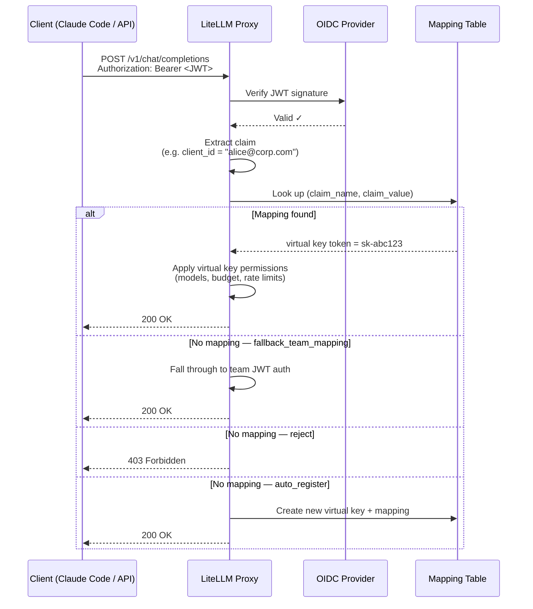

# JWT → Virtual Key Mapping

:::info Enterprise

JWT → Virtual Key Mapping is an Enterprise feature.

[Get a free trial](https://enterprise.litellm.ai/demo)

:::

Map JWT tokens to LiteLLM virtual keys — so every JWT client gets the same granular controls as a virtual key: model restrictions, spend limits, rate limits, guardrails, and full spend tracking.

**Why this matters:** Standard JWT auth maps a JWT to a *team*. That's a shared boundary — all clients under a team share the same limits. With JWT → Virtual Key Mapping, each individual JWT client (identified by a claim like `client_id`, `azp`, or `sub`) maps to its own virtual key. You get per-client accountability without issuing API keys to your users.

**Common use case:** Your company uses SSO/OIDC. Developers use Claude Code with their identity tokens. You want to enforce per-developer model access and spend limits without giving each person a LiteLLM API key.

---

## How It Works



---

## Setup

### Prerequisites

Complete [OIDC JWT Auth setup](./token_auth.md) first — you need `JWT_PUBLIC_KEY_URL` configured and `enable_jwt_auth: True` in your proxy config.

### Step 1. Configure the JWT claim to map on

Add `virtual_key_claim_field` to your `litellm_jwtauth` config. This is the JWT claim LiteLLM uses as the lookup key (dot notation is supported for nested claims):

```yaml
general_settings:
  master_key: sk-1234
  enable_jwt_auth: True
  litellm_jwtauth:
    team_id_jwt_field: "team_id"          # existing team mapping (optional)
    user_id_jwt_field: "sub"
    virtual_key_claim_field: "client_id"  # 👈 claim used for key mapping
    unregistered_jwt_client_behavior: "fallback_team_mapping"  # see below
```

`jwt_client_id_field` is accepted as a deprecated alias for `virtual_key_claim_field`; prefer the new name

**`unregistered_jwt_client_behavior`** controls what happens when a JWT has no registered mapping:

| Value | Behavior |
|-------|----------|
| `fallback_team_mapping` | Fall through to team-based JWT auth (default — backward compatible) |
| `reject` | Return 403 if no mapping found |
| `auto_register` | Auto-create a virtual key + mapping on first encounter |

### Step 2. Register a JWT client -> virtual key mapping

A mapping links a JWT claim value to an existing virtual key, so first generate the key with whatever models, budget, and rate limits you want to enforce, then map the JWT claim to it.

**1. Generate a virtual key**

```bash
curl -X POST 'http://0.0.0.0:4000/key/generate' \
  -H 'Authorization: Bearer <PROXY_MASTER_KEY>' \
  -H 'Content-Type: application/json' \
  -d '{
    "models": ["claude-sonnet-4-5", "claude-haiku-4-5"],
    "max_budget": 50.0,
    "budget_duration": "30d",
    "rpm_limit": 100,
    "tpm_limit": 50000,
    "team_id": "engineering"
  }'
```

The response returns the key token (only shown on creation), e.g. `{"key": "sk-abc123...", ...}`

**2. Map the JWT claim value to that key**

```bash
curl -X POST 'http://0.0.0.0:4000/jwt/key/mapping/new' \
  -H 'Authorization: Bearer <PROXY_MASTER_KEY>' \
  -H 'Content-Type: application/json' \
  -d '{
    "jwt_claim_name": "client_id",
    "jwt_claim_value": "dev-alice",
    "key": "sk-abc123..."
  }'
```

The response is the mapping record (the key token is stored hashed and never returned):

```json
{
  "id": "b0c1...",
  "jwt_claim_name": "client_id",
  "jwt_claim_value": "dev-alice",
  "description": null,
  "is_active": true,
  "created_at": "2026-01-01T00:00:00Z",
  "updated_at": "2026-01-01T00:00:00Z",
  "created_by": "...",
  "updated_by": "..."
}
```

### Step 3. Test it

```bash
# Get a JWT from your OIDC provider (must have client_id: dev-alice)
JWT_TOKEN="eyJhbG..."

curl -X POST 'http://0.0.0.0:4000/v1/chat/completions' \
  -H "Authorization: Bearer $JWT_TOKEN" \
  -H 'Content-Type: application/json' \
  -d '{
    "model": "claude-sonnet-4-5",
    "messages": [{"role": "user", "content": "Hello"}]
  }'
```

The request is now tracked against `dev-alice`'s virtual key — spend, rate limits, and model access enforced per-client.

---

## Walkthrough: Admin grants granular access, team uses Claude Code

This is the full flow for an engineering team using Claude Code with company SSO.

### Admin setup

**1. Create a team for engineering**

```bash
curl -X POST 'http://0.0.0.0:4000/team/new' \
  -H 'Authorization: Bearer <MASTER_KEY>' \
  -H 'Content-Type: application/json' \
  -d '{
    "team_alias": "engineering",
    "models": ["claude-sonnet-4-5", "claude-haiku-4-5"]
  }'
```

**2. Register each developer with their own key and spend limit**

Generate a virtual key per developer with `/key/generate`, then map their `client_id` claim to it with `/jwt/key/mapping/new`.

```bash
# Alice — senior eng, higher budget
ALICE_KEY=$(curl -sX POST 'http://0.0.0.0:4000/key/generate' \
  -H 'Authorization: Bearer <MASTER_KEY>' \
  -H 'Content-Type: application/json' \
  -d '{
    "team_id": "engineering",
    "models": ["claude-sonnet-4-5", "claude-haiku-4-5"],
    "max_budget": 200.0,
    "budget_duration": "30d",
    "rpm_limit": 200
  }' | jq -r .key)

curl -X POST 'http://0.0.0.0:4000/jwt/key/mapping/new' \
  -H 'Authorization: Bearer <MASTER_KEY>' \
  -H 'Content-Type: application/json' \
  -d "{
    \"jwt_claim_name\": \"client_id\",
    \"jwt_claim_value\": \"alice@corp.com\",
    \"key\": \"$ALICE_KEY\"
  }"

# Bob — contractor, tighter limits
BOB_KEY=$(curl -sX POST 'http://0.0.0.0:4000/key/generate' \
  -H 'Authorization: Bearer <MASTER_KEY>' \
  -H 'Content-Type: application/json' \
  -d '{
    "team_id": "engineering",
    "models": ["claude-haiku-4-5"],
    "max_budget": 20.0,
    "budget_duration": "30d",
    "rpm_limit": 30
  }' | jq -r .key)

curl -X POST 'http://0.0.0.0:4000/jwt/key/mapping/new' \
  -H 'Authorization: Bearer <MASTER_KEY>' \
  -H 'Content-Type: application/json' \
  -d "{
    \"jwt_claim_name\": \"client_id\",
    \"jwt_claim_value\": \"bob@contractor.com\",
    \"key\": \"$BOB_KEY\"
  }"
```

**3. Configure Claude Code to use the proxy**

Set the proxy as the API base in your team's Claude Code config:

```bash
# Point Claude Code at the LiteLLM proxy instead of Anthropic directly.
# ANTHROPIC_API_KEY here is the bearer token sent to the proxy — set it to
# the user's SSO/OIDC JWT token (obtained from your IdP at login).
export ANTHROPIC_API_KEY="<user-sso-jwt-token>"
export ANTHROPIC_BASE_URL="http://your-litellm-proxy:4000"
```

Or in `~/.claude/settings.json`:

```json
{
  "env": {
    "ANTHROPIC_BASE_URL": "http://your-litellm-proxy:4000"
  }
}
```

**4. Developers authenticate with SSO as usual**

When Alice runs Claude Code, her JWT (issued by your IdP with `client_id: alice@corp.com`) goes to the proxy. LiteLLM looks up the mapping, finds her virtual key, and enforces her specific limits — her $200/month budget, 200 RPM cap, and access to Sonnet and Haiku only.

Bob's token maps to his own key — $20/month, Haiku only, 30 RPM.

No API keys distributed. No shared limits. Full per-developer spend visibility in the LiteLLM dashboard.

---

## Managing mappings

Mapping management endpoints identify a mapping by its `id` (returned when you create it, or from the list endpoint). To change a client's budget, models, or rate limits, update the underlying virtual key with `/key/update`; the mapping only links a claim value to a key.

**List mappings**

```bash
curl 'http://0.0.0.0:4000/jwt/key/mapping/list?page=1&size=50' \
  -H 'Authorization: Bearer <MASTER_KEY>'
```

**View a single mapping**

```bash
curl 'http://0.0.0.0:4000/jwt/key/mapping/info?id=<MAPPING_ID>' \
  -H 'Authorization: Bearer <MASTER_KEY>'
```

The response is the mapping record (claim name/value, description, `is_active`, timestamps); it does not include the linked key's settings.

**Update a mapping**

Re-point the mapping at a different key, toggle `is_active`, or change the description.

```bash
curl -X POST 'http://0.0.0.0:4000/jwt/key/mapping/update' \
  -H 'Authorization: Bearer <MASTER_KEY>' \
  -H 'Content-Type: application/json' \
  -d '{
    "id": "<MAPPING_ID>",
    "key": "sk-newkey...",
    "is_active": true
  }'
```

**Delete a mapping**

```bash
curl -X POST 'http://0.0.0.0:4000/jwt/key/mapping/delete' \
  -H 'Authorization: Bearer <MASTER_KEY>' \
  -H 'Content-Type: application/json' \
  -d '{
    "id": "<MAPPING_ID>"
  }'
```

---

## Security

Only proxy admins can create, update, or delete mappings; admin viewers can list and view them. The management endpoints return 403 for everyone else

With `auto_register`, an unmapped JWT client gets a freshly created virtual key with no budget or model restrictions on first encounter, so tighten it afterwards (via `/key/update` on the generated key) or prefer `reject` when every client must be pre-registered

---

## Handling identical claim values across IdPs

A mapping is unique per `(jwt_claim_name, jwt_claim_value)`, with no issuer dimension, so two identity providers that emit the same value for the configured claim (e.g. both send `sub: user-123`) would collide onto one mapping. If you federate multiple IdPs, map on a claim that is globally unique across them (for example a namespaced `client_id` rather than a bare `sub`) so each client resolves to its own key

---

## What JWT clients can and can't do vs virtual keys

| Capability | Virtual Key | JWT → Key Mapping |
|---|---|---|
| Per-client model access | ✅ | ✅ |
| Per-client spend budget | ✅ | ✅ |
| Per-client RPM/TPM limits | ✅ | ✅ |
| Team membership | ✅ | ✅ |
| Spend tracking in dashboard | ✅ | ✅ |
| Guardrails | ✅ | ✅ |
| Key rotation | ✅ | ✅ (via the underlying virtual key) |
| Key expiry | ✅ | ✅ |
| No API key distribution needed | ❌ | ✅ |
| Works with existing SSO/OIDC | ❌ | ✅ |

---

## Related

- [OIDC JWT Auth](./token_auth.md) — base JWT auth setup required before using this feature
- [Virtual Keys](./virtual_keys.md) — full virtual key documentation
- [Access Control](./access_control.md) — model and team access control
