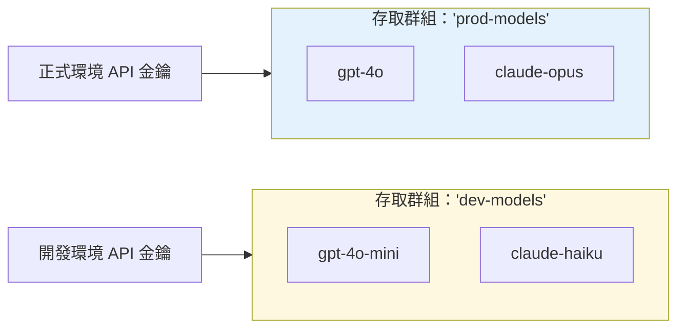

import Tabs from '@theme/Tabs';
import TabItem from '@theme/TabItem';

# 模型存取群組 {#model-access-groups}

### 總覽 {#overview}

將多個模型歸組到單一名稱下，然後授權金鑰或團隊存取整個群組。可在不更新個別金鑰的情況下，將模型加入或移出群組。

使用情境：
- 將正式環境與開發環境模型分開
- 將昂貴模型限制給特定團隊
- 依提供者或能力整理模型
- 使用萬用字元控制對模型家族的存取（例如，`openai/*`）

### 運作方式 {#how-it-works}



**重點概念：** 將模型分組 → 將群組附加到金鑰 → 金鑰即可存取群組中的所有模型

**步驟 1. 在 config.yaml 中指定 model, access group**

```yaml showLineNumbers title="config.yaml"
model_list:
  - model_name: gpt-4
    litellm_params:
      model: openai/fake
      api_key: fake-key
      api_base: https://exampleopenaiendpoint-production.up.railway.app/
    model_info:
      access_groups: ["beta-models"] # 👈 Model Access Group
  - model_name: fireworks-llama-v3-70b-instruct
    litellm_params:
      model: fireworks_ai/accounts/fireworks/models/llama-v3-70b-instruct
      api_key: "os.environ/FIREWORKS"
    model_info:
      access_groups: ["beta-models"] # 👈 Model Access Group
```

<Tabs>

<TabItem value="key" label="金鑰存取群組">

**建立具有存取群組的金鑰**

```bash showLineNumbers title="Create Key with Access Group"
curl --location 'http://localhost:4000/key/generate' \
-H 'Authorization: Bearer <your-master-key>' \
-H 'Content-Type: application/json' \
-d '{"models": ["beta-models"], # 👈 Model Access Group
			"max_budget": 0,}'
```

測試金鑰 

<Tabs>
<TabItem label="允許的存取" value = "allowed">

```bash showLineNumbers title="Test Key - Allowed Access"
curl -i http://localhost:4000/v1/chat/completions \
  -H "Content-Type: application/json" \
  -H "Authorization: Bearer sk-<key-from-previous-step>" \
  -d '{
    "model": "gpt-4",
    "messages": [
      {"role": "user", "content": "Hello"}
    ]
  }'
```

</TabItem>

<TabItem label="不允許的存取" value = "not-allowed">

:::info

預期會失敗，因為 gpt-4o 不在 `beta-models` 存取群組中

:::

```bash showLineNumbers title="Test Key - Disallowed Access"
curl -i http://localhost:4000/v1/chat/completions \
  -H "Content-Type: application/json" \
  -H "Authorization: Bearer sk-<key-from-previous-step>" \
  -d '{
    "model": "gpt-4o",
    "messages": [
      {"role": "user", "content": "Hello"}
    ]
  }'
```

</TabItem>

</Tabs>

</TabItem>

<TabItem value="team" label="團隊存取群組">

建立團隊

```bash showLineNumbers title="Create Team"
curl --location 'http://localhost:4000/team/new' \
-H 'Authorization: Bearer sk-<key-from-previous-step>' \
-H 'Content-Type: application/json' \
-d '{"models": ["beta-models"]}'
```

為團隊建立金鑰 

```bash showLineNumbers title="Create Key for Team"
curl --location 'http://0.0.0.0:4000/key/generate' \
--header 'Authorization: Bearer sk-<key-from-previous-step>' \
--header 'Content-Type: application/json' \
--data '{"team_id": "0ac97648-c194-4c90-8cd6-40af7b0d2d2a"}
```


測試金鑰

<Tabs>
<TabItem label="允許的存取" value = "allowed">

```bash showLineNumbers title="Test Team Key - Allowed Access"
curl -i http://localhost:4000/v1/chat/completions \
  -H "Content-Type: application/json" \
  -H "Authorization: Bearer sk-<key-from-previous-step>" \
  -d '{
    "model": "gpt-4",
    "messages": [
      {"role": "user", "content": "Hello"}
    ]
  }'
```

</TabItem>

<TabItem label="不允許的存取" value = "not-allowed">

:::info

預期會失敗，因為 gpt-4o 不在 `beta-models` 存取群組中

:::

```bash showLineNumbers title="Test Team Key - Disallowed Access"
curl -i http://localhost:4000/v1/chat/completions \
  -H "Content-Type: application/json" \
  -H "Authorization: Bearer sk-<key-from-previous-step>" \
  -d '{
    "model": "gpt-4o",
    "messages": [
      {"role": "user", "content": "Hello"}
    ]
  }'
```

</TabItem>

</Tabs>

</TabItem>

</Tabs>

### ✨ 控制萬用字元模型的存取 {#-control-access-on-wildcard-models}

控制對所有具有特定前綴的模型的存取（例如 `openai/*`）。 

也可用於讓使用者存取所有模型，但排除少數您不希望他們使用的模型（例如 `openai/o1-*`）。 

:::info

在萬用字元模型上設定模型存取群組是 Enterprise 功能。 

查看價格 [這裡](https://litellm.ai/#pricing)

取得試用金鑰 [這裡](https://litellm.ai/#trial)
:::

1. 設定 config.yaml

```yaml showLineNumbers title="config.yaml - Wildcard Models"
model_list:
  - model_name: openai/*
    litellm_params:
      model: openai/*
      api_key: os.environ/OPENAI_API_KEY
    model_info:
      access_groups: ["default-models"]
  - model_name: openai/o1-*
    litellm_params:
      model: openai/o1-*
      api_key: os.environ/OPENAI_API_KEY
    model_info:
      access_groups: ["restricted-models"]
```

2. 產生可存取 `default-models` 的金鑰

```bash showLineNumbers title="Generate Key for Wildcard Access Group"
curl -L -X POST 'http://0.0.0.0:4000/key/generate' \
-H 'Authorization: Bearer sk-1234' \
-H 'Content-Type: application/json' \
-d '{
    "models": ["default-models"],
}'
``` 

3. 測試金鑰

<Tabs>
<TabItem label="成功的請求" value = "success">

```bash showLineNumbers title="Test Wildcard Access - Allowed"
curl -i http://localhost:4000/v1/chat/completions \
  -H "Content-Type: application/json" \
  -H "Authorization: Bearer sk-<key-from-previous-step>" \
  -d '{
    "model": "openai/gpt-4",
    "messages": [
      {"role": "user", "content": "Hello"}
    ]
  }'
```
</TabItem>
<TabItem value="bad-request" label="遭拒的請求">

```bash showLineNumbers title="Test Wildcard Access - Rejected"
curl -i http://localhost:4000/v1/chat/completions \
  -H "Content-Type: application/json" \
  -H "Authorization: Bearer sk-<key-from-previous-step>" \
  -d '{
    "model": "openai/o1-mini",
    "messages": [
      {"role": "user", "content": "Hello"}
    ]
  }'
```

</TabItem>
</Tabs>

## 透過 API 管理存取群組 {#managing-access-groups-via-api}

:::warning 僅限資料庫模型
存取群組管理 API 僅適用於儲存在資料庫中的模型（透過 `/model/new` 新增）。 

定義於 `config.yaml` 的模型無法透過這些 API 管理，且必須直接在設定檔中設定。
:::

使用存取群組管理端點可動態建立、更新及刪除存取群組，而無需重新啟動 proxy。

### 教學：完整的存取群組工作流程 {#tutorial-complete-access-group-workflow}

本教學將示範如何建立存取群組、檢視其詳細資訊、將其附加到金鑰，以及更新群組中的模型。

**必要條件：**
- 模型必須先新增至資料庫（不能只在 config.yaml 中）
- 您需要使用 master key 進行授權

#### 步驟 1：將模型新增至資料庫 {#step-1-add-models-to-database}

首先，將一些模型新增至資料庫：

```bash showLineNumbers title="Add Models to Database"
# Add GPT-4 to database
curl -X POST 'http://localhost:4000/model/new' \
  -H 'Authorization: Bearer sk-1234' \
  -H 'Content-Type: application/json' \
  -d '{
    "model_name": "gpt-4",
    "litellm_params": {
      "model": "gpt-4",
      "api_key": "os.environ/OPENAI_API_KEY"
    }
  }'

# Add Claude to database
curl -X POST 'http://localhost:4000/model/new' \
  -H 'Authorization: Bearer sk-1234' \
  -H 'Content-Type: application/json' \
  -d '{
    "model_name": "claude-3-opus",
    "litellm_params": {
      "model": "claude-3-opus-20240229",
      "api_key": "os.environ/ANTHROPIC_API_KEY"
    }
  }'
```

#### 步驟 2：建立存取群組 {#step-2-create-access-group}

建立一個包含多個模型的存取群組：

```bash showLineNumbers title="Create Access Group"
curl -X POST 'http://localhost:4000/access_group/new' \
  -H 'Authorization: Bearer sk-1234' \
  -H 'Content-Type: application/json' \
  -d '{
    "access_group": "production-models",
    "model_names": ["gpt-4", "claude-3-opus"]
  }'
```

**回應：**
```json showLineNumbers title="Response"
{
  "access_group": "production-models",
  "model_names": ["gpt-4", "claude-3-opus"],
  "models_updated": 2
}
```

#### 步驟 3：檢視存取群組資訊 {#step-3-view-access-group-info}

檢查存取群組詳細資訊：

```bash showLineNumbers title="Get Access Group Info"
curl -X GET 'http://localhost:4000/access_group/production-models/info' \
  -H 'Authorization: Bearer sk-1234'
```

**回應：**
```json showLineNumbers title="Response"
{
  "access_group": "production-models",
  "model_names": ["gpt-4", "claude-3-opus"],
  "deployment_count": 2
}
```

#### 步驟 4：建立具有存取群組的金鑰 {#step-4-create-key-with-access-group}

建立一個可存取群組中所有模型的 API 金鑰：

```bash showLineNumbers title="Create Key with Access Group"
curl -X POST 'http://localhost:4000/key/generate' \
  -H 'Authorization: Bearer sk-1234' \
  -H 'Content-Type: application/json' \
  -d '{
    "models": ["production-models"],
    "max_budget": 100
  }'
```

**回應：**
```json showLineNumbers title="Response"
{
  "key": "sk-...",
  "models": ["production-models"]
}
```

**測試金鑰：**
```bash showLineNumbers title="Test Key Access"
# This succeeds - gpt-4 is in production-models
curl -X POST 'http://localhost:4000/v1/chat/completions' \
  -H 'Authorization: Bearer sk-...' \
  -H 'Content-Type: application/json' \
  -d '{
    "model": "gpt-4",
    "messages": [{"role": "user", "content": "Hello"}]
  }'

# This succeeds - claude-3-opus is in production-models
curl -X POST 'http://localhost:4000/v1/chat/completions' \
  -H 'Authorization: Bearer sk-...' \
  -H 'Content-Type: application/json' \
  -d '{
    "model": "claude-3-opus",
    "messages": [{"role": "user", "content": "Hello"}]
  }'
```

#### 步驟 5：更新存取群組 {#step-5-update-access-group}

將模型新增至或從存取群組中移除：

```bash showLineNumbers title="Update Access Group"
curl -X PUT 'http://localhost:4000/access_group/production-models/update' \
  -H 'Authorization: Bearer sk-1234' \
  -H 'Content-Type: application/json' \
  -d '{
    "model_names": ["gpt-4", "claude-3-opus", "gemini-pro"]
  }'
```

**回應：**
```json showLineNumbers title="Response"
{
  "access_group": "production-models",
  "model_names": ["gpt-4", "claude-3-opus", "gemini-pro"],
  "models_updated": 3
}
```

第 4 步的 API 金鑰現在會自動存取 `gemini-pro`，而無需對金鑰本身做任何變更。
### API 參考文件 - 存取群組管理 {#api-reference---access-group-management}

如需包含所有端點、參數與回應 schema 的完整 API 文件，請參閱 [存取群組管理 API 參考文件](https://litellm-api.up.railway.app/#/model%20management/create_model_group_access_group_new_post)。

## 透過 UI 管理存取群組 {#managing-access-groups-via-ui}

您也可以透過 LiteLLM Admin UI 管理存取群組。

### 步驟 1：將模型新增至存取群組 {#step-1-add-model-to-access-group}

將模型新增至資料庫時，請使用「Model Access Group」欄位將其指派給存取群組：


在此範例中，`gpt-4` 被新增至 `production-models` 存取群組。

### 步驟 2：建立具有存取群組的金鑰 {#step-2-create-key-with-access-group}

建立 API 金鑰時，請在「Models」欄位中指定存取群組：


該金鑰將可存取 `production-models` 群組中的所有模型。

### 步驟 3：測試金鑰 {#step-3-test-the-key}

使用產生的金鑰發出請求：

```bash showLineNumbers title="Test Key with Access Group"
# This succeeds - gpt-4 is in production-models
curl -X POST 'http://localhost:4000/v1/chat/completions' \
  -H 'Authorization: Bearer sk-...' \
  -H 'Content-Type: application/json' \
  -d '{
    "model": "gpt-4",
    "messages": [{"role": "user", "content": "Hello"}]
  }'
```

**回應：**
```json showLineNumbers title="Success Response"
{
  "id": "chatcmpl-...",
  "object": "chat.completion",
  "created": 1234567890,
  "model": "gpt-4",
  "choices": [
    {
      "index": 0,
      "message": {
        "role": "assistant",
        "content": "Hello! How can I help you today?"
      },
      "finish_reason": "stop"
    }
  ]
}
```

如果您嘗試存取不在該存取群組中的模型，該請求將會被拒絕：

```bash showLineNumbers title="Test Rejected Request"
# This fails - gpt-4o is not in production-models
curl -X POST 'http://localhost:4000/v1/chat/completions' \
  -H 'Authorization: Bearer sk-...' \
  -H 'Content-Type: application/json' \
  -d '{
    "model": "gpt-4o",
    "messages": [{"role": "user", "content": "Hello"}]
  }'
```

**回應：**
```json showLineNumbers title="Error Response"
{
  "error": {
    "message": "Invalid model for key",
    "type": "invalid_request_error"
  }
}
```
