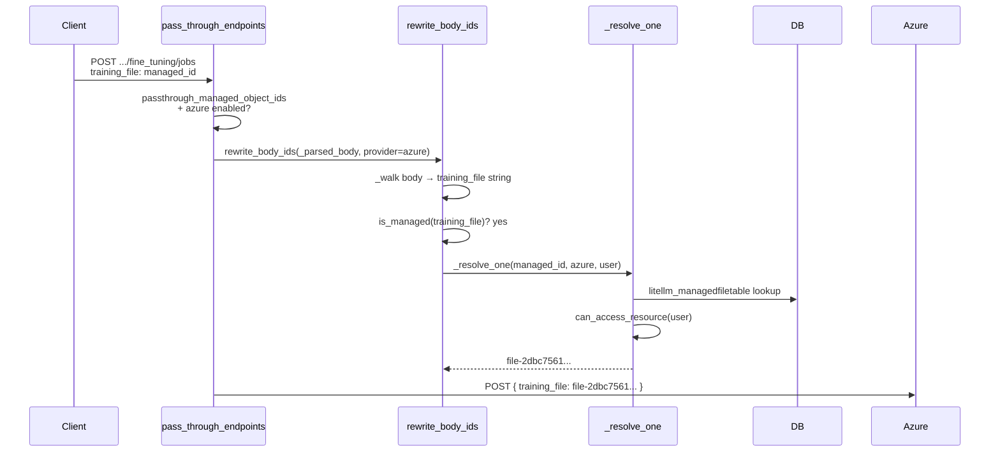

# 直通受控 ID {#passthrough-managed-ids}

當您使用 LiteLLM 的 passthrough endpoints（例如 `/openai/v1/files`、`/azure/openai/batches`）時，上游提供者會回傳它自己的原始 ID，例如 `file-abc123` 或 `batch_xyz`。預設情況下，這些 ID 會直接回傳給您的 client，這表示：

- 任何猜到或攔截到其他使用者 `file-abc123` 的人都可以使用它。
- 您沒有 proxy 層級的紀錄可追蹤誰擁有什麼。
- 多租戶隔離必須完全在您的應用程式程式碼中完成。

**Passthrough Managed IDs** 解決了這個問題。啟用此功能後，proxy 會：

1. **建立** 它在回應中看到的每個原始提供者 ID 對應的穩定、不可讀的 managed ID。
2. **儲存** `managed_id → raw_id` 對應關係到 proxy 資料庫，並標註建立該項目的使用者/團隊。
3. 在將任何請求轉送到上游之前，先執行擁有權/權限檢查，然後再將 managed ID **解析** 回原始提供者 ID。

您的 client 永遠看不到原始提供者 ID，也永遠無法存取不屬於自己的資源——即使他們猜測或偽造 managed ID 字串也一樣。

## 如何啟用 {#how-to-enable}

在您的 proxy 設定中，新增一行到 `general_settings`：

```yaml
general_settings:
  passthrough_managed_object_ids: true
```

此功能需要：
- 為 proxy 設定的資料庫（Prisma / PostgreSQL）。
- 可用的 `managed_files` enterprise hook。

此功能僅適用於 **OpenAI** 與 **Azure OpenAI** 的 passthrough 路由。

## 原生受控端點 vs 直通 {#native-managed-endpoints-vs-passthrough}

| | 原生 managed endpoints | 具有 managed IDs 的 passthrough |
|---|---|---|
| **URL prefix** | `/v1/files`、`/v1/batches` | `/openai/v1/files`、`/azure/openai/batches` |
| **Routing** | LiteLLM 內部邏輯；以模型為基礎的路由 | 直接轉送到上游提供者 |
| **Credential resolution** | 透過 `model_list` router | 透過 `PassthroughEndpointRouter` / 環境變數 |
| **Use when** | 您希望 LiteLLM 自動選擇正確的 deployment，或您需要跨提供者批次處理 | 您希望直接呼叫提供者 API（例如 fine-tuning、responses、自訂端點），但仍需要 proxy 層級的存取控制 |
| **ID management** | 一律由 LiteLLM 管理 | 只有在 `passthrough_managed_object_ids: true` 時才使用 managed IDs |
| **Streaming ID minting** | 支援 | **尚未支援**（streaming 回應中的輸出 IDs 不會被重寫） |

## 支援的端點 {#supported-endpoints}

### 回應 ID 鑄造（輸出） {#response-id-minting-output}

這些是 LiteLLM 會在 **回應本文** 中看到原始提供者 ID 時，建立 managed ID 並在回傳給 client 之前替換的特定路由。

| 提供者 | 方法 | 路徑 | 已重寫欄位 |
|----------|--------|------|-----------------|
| OpenAI | `POST` | `/v1/files` | `id` (`file-`) |
| OpenAI | `GET` | `/v1/files/{file_id}` | `id` (`file-`) |
| OpenAI | `DELETE` | `/v1/files/{file_id}` | `id` (`file-`) |
| OpenAI | `POST` | `/v1/batches` | `id` (`batch_`), `input_file_id`, `output_file_id`, `error_file_id` |
| OpenAI | `GET` | `/v1/batches/{batch_id}` | `id` (`batch_`), `input_file_id`, `output_file_id`, `error_file_id` |
| OpenAI | `POST` | `/v1/batches/{batch_id}/cancel` | `id` (`batch_`), `input_file_id`, `output_file_id`, `error_file_id` |
| OpenAI | `POST` | `/v1/responses` | `id` (`resp_`) |
| OpenAI | `GET` | `/v1/responses/{response_id}` | `id` (`resp_`) |
| OpenAI | `DELETE` | `/v1/responses/{response_id}` | `id` (`resp_`) |
| Azure | `POST` | `/v1/files` | `id` (`file-`) |
| Azure | `GET` | `/v1/files/{file_id}` | `id` (`file-`) |
| Azure | `DELETE` | `/v1/files/{file_id}` | `id` (`file-`) |
| Azure | `POST` | `/v1/batches` | `id` (`batch_`), `input_file_id`, `output_file_id`, `error_file_id` |
| Azure | `GET` | `/v1/batches/{batch_id}` | `id` (`batch_`), `input_file_id`, `output_file_id`, `error_file_id` |
| Azure | `POST` | `/v1/batches/{batch_id}/cancel` | `id` (`batch_`), `input_file_id`, `output_file_id`, `error_file_id` |
| Azure | `POST` | `/v1/responses` | `id` (`resp_`) |
| Azure | `GET` | `/v1/responses/{response_id}` | `id` (`resp_`) |

| Azure | `DELETE` | `/v1/responses/{response_id}` | `id` (`resp_`) |

### 受控 ID 解析（輸入） {#managed-id-resolution-input}

這**不是路由專屬**的。對於每一個 OpenAI 或 Azure 的 passthrough 請求，LiteLLM 會在轉送到上游之前掃描整個請求：

| 位置 | 掃描內容 |
|----------|----------|
| **URL path** | 每個路徑片段 |
| **Query params** | 每個字串型別參數 |
| **Request body** | 所有字串值，遞迴掃描（可作用於巢狀物件與陣列） |

這表示任何在 path、query 或 body 中接受 file ID、batch ID 或 response ID 的 endpoint，都會自動解析 managed IDs——包括上方輸出表中未列出的 endpoint，例如 fine-tuning jobs（`/v1/fine_tuning/jobs`）、assistants，或任何自訂 endpoint。

**範例 — fine-tuning job：**

```python
# Client sends managed IDs for training_file and validation_file
response = client.post("/azure/openai/v1/fine_tuning/jobs", json={
    "model": "gpt-4o-mini",
    "training_file": "bGl0ZWxsbV9wcm94eTpwYXNzdGhyb3VnaDtwcm92...",  # managed ID
    "validation_file": "bGl0ZWxsbV9wcm94eTpwYXNzdGhyb3VnaDtwcm92...",  # managed ID
})

# Proxy resolves both to raw file IDs and forwards:
# POST .../fine_tuning/jobs
# { "model": "gpt-4o-mini", "training_file": "file-2dbc75...", "validation_file": "file-2dbc75..." }
```

## 請求流程 - 任一端點 {#request-flow---any-endpoint}

這適用於**任何** OpenAI 或 Azure passthrough endpoint——不只是 fine-tuning。每個請求都會執行相同的 path/query/body 掃描；下方範例使用的是 body 中帶有 managed file ID 的 fine-tuning job。



在**回應**路徑上，`rewrite_response_ids()` 會為原始提供者 ID 鑄造 managed IDs——但只會針對輸出對應表中列出的路由（files、batches、responses）執行。其他 endpoint（例如 fine-tuning）會原樣回傳上游 ID，除非它們出現在該對應表中。

## 權限檢查 {#permission-checks}

每次 managed ID 解析都會依序執行四項檢查。**全部都必須通過**，否則請求會被拒絕。

### 1. 提供者比對 {#1-provider-match}

managed ID 內含其鑄造時所對應的提供者（例如 `azure`）。如果您在 OpenAI passthrough 路由上送出 Azure 鑄造的 ID（反之亦然），代理會回傳**404**，且絕不會將該 ID 轉送到上游。

### 2. 資料庫存在性 {#2-db-existence}

managed ID 必須對應到代理資料庫中的真實資料列。猜測、偽造或以 base64 構造、但無法對應到真實資料列的字串，會回傳**404**。當資料庫檢查失敗時，原始提供者 ID **絕不會**被轉送到上游。

### 3. 存取檢查 - 每次請求 {#3-access-check---per-request}

`can_access_resource()` 會決定呼叫端是否可使用特定資源：

| 呼叫端身分 | 授予存取權時 |
|-----------------|---------------------|
| Proxy 管理員 / master key | 一律 |
| 具有 `user_id` | `created_by == user_id` |
| 具有 `team_id`（service account） | `team_id == resource.team_id` |
| 同時具有 `user_id` 和 `team_id` | 以上任一條件 |
| 兩者皆無 | 永不（**403**） |

### 4. 存取檢查 - 清單端點 {#4-access-check---list-endpoints}

`build_owner_filter()` 會為列表操作界定資料庫查詢的範圍（見下文）。同樣的規則，以 Prisma `WHERE` 子句表示如下：

| 呼叫端 | WHERE 子句 |
|--------|-------------|
| Proxy 管理員 / master key | `{}`（無篩選條件——可看見所有資料列） |
| 僅 `user_id` | `created_by = user_id` |
| 僅 `team_id` | `team_id = team_id` |
| 同時具有 `user_id` 和 `team_id` | `created_by = user_id OR team_id = team_id` |
| 兩者皆無 | 立即回傳空清單——不進行 DB 查詢 |

## 清單端點運作方式 {#how-list-endpoints-work}

`GET /openai/v1/files` 和 `GET /openai/v1/batches`（以及其 Azure 對應項）會被**完全攔截**。請求不會轉送至上游提供者。相反地，proxy 會查詢自己的資料庫，並只回傳呼叫端擁有的資料列：

```
GET /openai/v1/files
                                     ┌─────────────────────────────┐
                         admin key?  │  WHERE {}                   │
                                     │  (all rows)                 │
                                     └─────────────────────────────┘
                         user key?   ┌─────────────────────────────┐
                                     │  WHERE created_by = user_id │
                                     │  OR team_id = team_id       │
                                     └─────────────────────────────┘
                                               │
                                               ▼
                              OpenAI-style paginated response
                              { "object": "list", "data": [...] }
                              All IDs in data[] are managed IDs
```

支援分頁參數 `limit`、`after` 和 `before`，並直接對應到 `created_at` 上的游標。

沒有 `user_id` 且沒有 `team_id` 的呼叫端一律會收到空清單——proxy 絕不會退回到未受範圍限制的查詢。

## 限制 {#limitations}

### 串流回應 - 不支援輸出 ID 鑄造 {#streaming-responses---output-id-minting-not-supported}

當上游回傳**串流**（SSE）回應時，串流區塊中的原始提供者 ID 不會被鑄造為 managed IDs。用戶端會收到原始的上游 ID。

### 原始 ID 會原樣直通 {#raw-ids-are-passed-through-unchanged}

如果您傳送的是原始提供者 ID（例如 `file-abc123`）而不是 managed ID，proxy 會直接傳遞，不會進行任何擁有權檢查。權限系統只會套用於可解碼為 passthrough managed IDs 的字串。

### ID 以提供者為範圍 {#ids-are-provider-scoped}

為 `azure` 鑄造的 managed ID 不能用於 `openai` passthrough 路由，反之亦然。嘗試這麼做會回傳 **404**。
