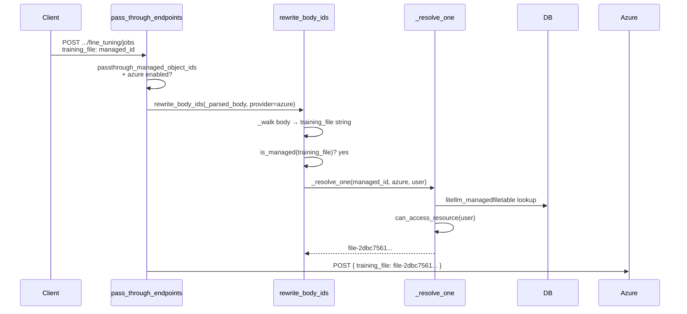

# 直通受管 ID {#passthrough-managed-ids}

當您使用 LiteLLM 的 passthrough 端點（例如 `/openai_passthrough/v1/files`、`/azure/openai/batches`）時，上游提供者會回傳其自己的原始 ID，例如 `file-abc123` 或 `batch_xyz`。預設情況下，這些 ID 會直接回傳給您的用戶端，這表示：

- 任何猜到或攔截到其他使用者 `file-abc123` 的人都可以使用它。
- 您在 proxy 層級沒有任何誰擁有什麼的紀錄。
- 多租戶隔離必須完全在您的應用程式程式碼中完成。

**Passthrough Managed IDs** 可解決這個問題。啟用此功能後，proxy 會：

1. **產生** 一個穩定、不可讀的 managed ID，對應它在回應中看到的每個原始提供者 ID。
2. **儲存** `managed_id → raw_id` 對應關係到 proxy 資料庫，並標記建立它的使用者/團隊。
3. 在將任何請求轉送上游之前，先進行擁有權/權限檢查，然後將 managed ID **解析** 回原始提供者 ID。

即使使用者猜到或偽造一個 managed ID 字串，您的用戶端也永遠看不到原始提供者 ID，也永遠無法存取不屬於自己的資源。

## 如何啟用 {#how-to-enable}

在您的 proxy 設定中，將一行加入 `general_settings`：

```yaml
general_settings:
  passthrough_managed_object_ids: true
```

此功能需要：
- 已為 proxy 設定資料庫（Prisma / PostgreSQL）。
- 可用的 `managed_files` enterprise hook。

此功能僅對 **OpenAI**（`/openai_passthrough/...`）與 **Azure OpenAI**（`/azure/openai/...`）的 passthrough 路由生效。

:::info[`/openai/v1/files`、`/openai/v1/batches` 和 `/openai/v1/responses` 不是 passthrough 路由]

這三個路徑由 LiteLLM 的原生端點提供服務，完全像 `/v1/files`、`/v1/batches` 和 `/v1/responses` 一樣，因此 `passthrough_managed_object_ids` 永遠看不到它們。若要在這裡隔離租戶，請將 [`require_managed_files`](./litellm_managed_files) 用於檔案與批次，並使用內建的 Responses API 擁有權檢查來處理回應。OpenAI 的 passthrough 前綴是 `/openai_passthrough`。

:::

## 原生受管端點與直通模式 {#native-managed-endpoints-vs-passthrough}

| | 原生 managed 端點 | 具有 managed ID 的 passthrough |
|---|---|---|
| **URL 前綴** | `/v1/files`、`/v1/batches` | `/openai_passthrough/v1/files`、`/azure/openai/batches` |
| **路由** | LiteLLM 內部邏輯；基於模型的路由 | 直接轉送至上游提供者 |
| **憑證解析** | 透過 `model_list` router | 透過 `PassthroughEndpointRouter` / 環境變數 |
| **適用情境** | 您希望 LiteLLM 自動選擇正確的 deployment，或您需要跨提供者批次處理 | 您想直接呼叫提供者 API（例如微調、responses、自訂端點），但仍需要 proxy 層級的存取控制 |
| **ID 管理** | 一律由 LiteLLM 管理 | 僅在 `passthrough_managed_object_ids: true` 時由 managed IDs 管理 |
| **串流 ID 產生** | 支援 | 支援 `POST /v1/responses` 搭配 `stream: true`（每個事件中的 `response.id` 都會被重寫） |

## 支援的端點 {#supported-endpoints}

### 回應 ID 鑄造（OUTPUT） {#response-id-minting-output}

以下是 LiteLLM 會針對其在**回應本文**中看到的原始提供者 ID 產生 managed ID，並在回傳給用戶端之前替換掉它們的特定路由。

| 提供者 | 方法 | 路徑 | 重寫的欄位 |
|----------|--------|------|-----------------|
| OpenAI | `POST` | `/v1/files` | `id`（`file-`） |
| OpenAI | `GET` | `/v1/files/{file_id}` | `id`（`file-`） |
| OpenAI | `DELETE` | `/v1/files/{file_id}` | `id`（`file-`） |
| OpenAI | `POST` | `/v1/batches` | `id`（`batch_`）、`input_file_id`、`output_file_id`、`error_file_id` |
| OpenAI | `GET` | `/v1/batches/{batch_id}` | `id`（`batch_`）、`input_file_id`、`output_file_id`、`error_file_id` |
| OpenAI | `POST` | `/v1/batches/{batch_id}/cancel` | `id`（`batch_`）、`input_file_id`、`output_file_id`、`error_file_id` |
| OpenAI | `POST` | `/v1/responses` | `id`（`resp_`） |
| OpenAI | `GET` | `/v1/responses/{response_id}` | `id`（`resp_`） |
| OpenAI | `DELETE` | `/v1/responses/{response_id}` | `id`（`resp_`） |
| Azure | `POST` | `/v1/files` | `id`（`file-`） |
| Azure | `GET` | `/v1/files/{file_id}` | `id`（`file-`） |
| Azure | `DELETE` | `/v1/files/{file_id}` | `id`（`file-`） |
| Azure | `POST` | `/v1/batches` | `id`（`batch_`）、`input_file_id`、`output_file_id`、`error_file_id` |
| Azure | `GET` | `/v1/batches/{batch_id}` | `id`（`batch_`）、`input_file_id`、`output_file_id`、`error_file_id` |
| Azure | `POST` | `/v1/batches/{batch_id}/cancel` | `id`（`batch_`）、`input_file_id`、`output_file_id`、`error_file_id` |
| Azure | `POST` | `/v1/responses` | `id`（`resp_`） |
| Azure | `GET` | `/v1/responses/{response_id}` | `id`（`resp_`） |
| Azure | `DELETE` | `/v1/responses/{response_id}` | `id`（`resp_`） |

`POST /v1/responses` 搭配 `stream: true` 也一樣適用。proxy 會從第一個 `response.created` 事件起就將回應記錄為呼叫者自己的回應，並在串流轉送時將每個事件中的 `response.id` 重寫，因此串流回應的擁有與保護方式與非串流回應完全相同。

### 受管 ID 解析（INPUT） {#managed-id-resolution-input}

這**不依路由而定**。對每一個 OpenAI 或 Azure passthrough 請求，LiteLLM 在轉送上游之前都會掃描整個請求：

| 位置 | 掃描內容 |
|----------|-----------------|
| **URL path** | 每個 path segment |
| **Query params** | 每個字串型別參數 |
| **Request body** | 所有字串值，遞迴掃描（可用於巢狀物件與陣列） |

這表示任何在 path、query 或 body 中接受檔案 ID、批次 ID 或回應 ID 的端點，都會自動解析 managed ID，包括上方輸出表格中未列出的端點，例如微調工作（`/v1/fine_tuning/jobs`）、assistants，或任何自訂端點。

**範例，微調工作：**

```python
# Client sends managed IDs for training_file and validation_file
response = client.post("/azure/openai/v1/fine_tuning/jobs", json={
    "model": "gpt-4o-mini",
    "training_file": "bGl0ZWxsbV9wcm94eTpwYXNzdGhyb3VnaDtwcm92...",  # managed ID
    "validation_file": "bGl0ZWxsbV9wcm94eTpwYXNzdGhyb3VnaDtwcm92...",  # managed ID
})

# Proxy resolves both to raw file IDs and forwards:
# POST .../fine_tuning/jobs
# { "model": "gpt-4o-mini", "training_file": "file-2dbc75...", "validation_file": "file-2dbc75..." }
```

## 請求流程 - 任一端點 {#request-flow---any-endpoint}

這適用於**任何** OpenAI 或 Azure passthrough 端點，不只微調。相同的 path/query/body 掃描會在每個請求上執行；下方範例使用的是 body 中含有 managed file ID 的微調工作。


```mermaid
sequenceDiagram
    participant Client
    participant Passthrough as pass_through_endpoints
    participant Rewriter as rewrite_body_ids
    participant Resolve as _resolve_one
    participant DB
    participant Azure

    Client->>Passthrough: POST .../fine_tuning/jobs<br/>training_file: managed_id
    Passthrough->>Passthrough: passthrough_managed_object_ids<br/>+ azure enabled?
    Passthrough->>Rewriter: rewrite_body_ids(_parsed_body, provider=azure)
    Rewriter->>Rewriter: _walk body → training_file string
    Rewriter->>Rewriter: is_managed(training_file)? yes
    Rewriter->>Resolve: _resolve_one(managed_id, azure, user)
    Resolve->>DB: litellm_managedfiletable lookup
    Resolve->>Resolve: can_access_resource(user)
    Resolve-->>Rewriter: file-2dbc7561...
    Passthrough->>Azure: POST { training_file: file-2dbc7561... }
```

在**回應**路徑上，`rewrite_response_ids()` 會為原始提供者 ID 產生 managed ID，但只限於輸出對應表中列出的路由（files、batches、responses）。其他端點（例如微調）會原樣回傳上游 ID，除非它們出現在該對應表中。

## 權限檢查 {#permission-checks}

每次 managed ID 解析都會依序執行四項檢查。**全部都必須通過**，否則請求會被拒絕。

### 1. 提供者比對 {#1-provider-match}

managed ID 會編碼其鑄造時所對應的提供者（例如 `azure`）。如果您在 OpenAI passthrough 路由上送出 Azure 鑄造的 ID（反之亦然），proxy 會回傳 **404**，並且絕不會將該 ID 轉送到上游。

### 2. 資料庫存在性 {#2-db-existence}

managed ID 必須對應到 proxy 資料庫中的真實資料列。猜測、偽造或以 base64 構造的字串，只要不對應到真實資料列，就會回傳 **404**。當 DB 檢查失敗時，原始提供者 ID **絕不**會被轉送到上游。

### 3. 存取檢查 - 每次請求 {#3-access-check---per-request}

`can_access_resource()` 會決定呼叫者是否可使用特定資源：

| 呼叫者身分 | 在以下情況授予存取權 |
|-----------------|---------------------|
| Proxy 管理員 / master key | 一律 |
| 擁有 `user_id` | `created_by == user_id` |
| 擁有 `team_id`（service account） | `team_id == resource.team_id` |
| 同時擁有 `user_id` 和 `team_id` | 上述任一條件 |
| 兩者皆無 | 從不（**403**） |

### 4. 存取檢查 - 列出端點 {#4-access-check---list-endpoints}

`build_owner_filter()` 會為列表操作限制資料庫查詢範圍（見下方）。相同規則以 Prisma `WHERE` 子句表示如下：

| 呼叫者 | WHERE 子句 |
|--------|-------------|
| Proxy 管理員 / master key | `{}`（無篩選條件 — 可看見所有資料列） |
| 僅 `user_id` | `created_by = user_id` |
| 僅 `team_id` | `team_id = team_id` |
| 同時擁有 `user_id` 和 `team_id` | `created_by = user_id OR team_id = team_id` |
| 兩者皆無 | 立即回傳空清單 — 不進行 DB 查詢 |

## 列出端點的運作方式 {#how-list-endpoints-work}

`GET /openai_passthrough/v1/files` 和 `GET /openai_passthrough/v1/batches`（以及它們的 Azure 對應項目）會被**完全攔截**。請求不會被轉送到上游提供者。相反地，proxy 會查詢自己的資料庫，並且只回傳呼叫者擁有的資料列：

```
GET /openai_passthrough/v1/files
                                     ┌─────────────────────────────┐
                         admin key?  │  WHERE {}                   │
                                     │  (all rows)                 │
                                     └─────────────────────────────┘
                         user key?   ┌─────────────────────────────┐
                                     │  WHERE created_by = user_id │
                                     │  OR team_id = team_id       │
                                     └─────────────────────────────┘
                                               │
                                               ▼
                              OpenAI-style paginated response
                              { "object": "list", "data": [...] }
                              All IDs in data[] are managed IDs
```

支援分頁參數 `limit`、`after` 和 `before`，並且會直接對應到 `created_at` 上的游標。

沒有 `user_id` 且沒有 `team_id` 的呼叫者一律只會收到空清單；proxy 絕不會退回到未限定範圍的查詢。

## 代理程式從未看過的物件 {#objects-the-proxy-never-saw}

當物件是透過已啟用此功能的 passthrough 路由建立時，系統會記錄其擁有權。在您啟用之前建立的檔案、批次或回應，或是直接以相同 API 金鑰在提供者端建立的物件，在 proxy 端都沒有擁有者，因此任何被允許使用 passthrough 路由的金鑰，仍可透過其原始提供者 ID 存取它（請見下方限制）。LiteLLM 會刻意不嘗試替任何人認領這些物件。

如果這些既有物件也必須被隔離，嚴格的做法是停止讓多個租戶共用同一組提供者金鑰：為每個團隊定義一個 [自訂 passthrough endpoint](./pass_through)，每個 endpoint 的 `headers` 都帶有該團隊自己的提供者 API 金鑰，並在團隊的 metadata 中使用 `allowed_passthrough_routes` 將每個團隊限制到其對應的 endpoint。如此一來，提供者本身會管理可見性，而 managed ID 仍可在其上正常運作。

## 限制 {#limitations}

### 串流僅會針對回應重新寫入 {#streaming-is-only-rewritten-for-responses}

`POST /v1/responses` 串流是唯一會攜帶可鑄造 ID 的 SSE 回應，因此也是 proxy 唯一會重寫的串流。其他所有串流 passthrough 回應都會原封不動地轉送。

### 原始 ID 僅對其擁有者有效 {#raw-ids-only-work-for-their-owner}

如果您送出的是原始提供者 ID（例如 `file-abc123`）而不是 managed ID，proxy 會先檢查它是否屬於受管理資源，再決定是否轉送。若原始 ID 對應到其他呼叫者的資源，會以 **404** 拒絕（與未知的 managed ID 相同，讓呼叫者無法探測哪些 ID 存在）。擁有者自己的原始 ID 會被轉送。proxy 從未記錄過的原始 ID 會在不進行擁有權檢查的情況下被轉送，這也是上述物件可被存取的原因。

### ID 以提供者為範圍 {#ids-are-provider-scoped}

為 `azure` 鑄造的 managed ID 不能用在 `openai` passthrough 路由上，反之亦然。嘗試這麼做會回傳 **404**。
