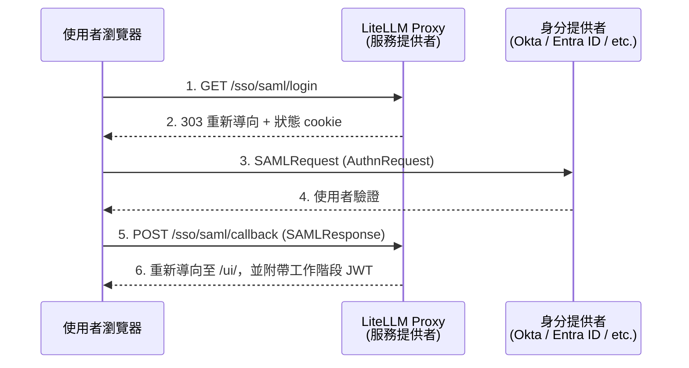

import Image from '@theme/IdealImage';
import Tabs from '@theme/Tabs';
import TabItem from '@theme/TabItem';

# SAML 2.0 單一登入 {#saml-20-sso}

<EnterpriseFeature feature="SSO">SSO 最多可免費供 5 位使用者使用。超過後則需要企業授權。</EnterpriseFeature>

LiteLLM 支援管理介面的 SAML 2.0 單一登入，並可與現有的 OIDC 提供者（Google、Microsoft、Generic OAuth）並用。SAML 可從管理介面（**Admin Settings -> SSO Settings**）或透過環境變數進行設定；不需要對 `config.yaml` 做任何變更。當已設定 SAML 且未設定 OIDC 提供者時，管理介面上既有的 **SSO** 登入按鈕會自動重新導向至 SAML 身分提供者。

## 運作方式 {#how-it-works}



該 proxy 充當 SAML 服務提供者（SP）。使用者點擊登入按鈕後，會攜帶已簽署的 AuthnRequest 重新導向至身分提供者（IdP）。使用者在 IdP 完成驗證後，瀏覽器會將已簽署的 SAML assertion POST 回 proxy 的 Assertion Consumer Service（ACS）端點。proxy 會驗證 assertion 的簽章、受眾與時間戳，必要時在資料庫中建立使用者，並發出一個工作階段 JWT，讓使用者登入管理介面。

HTTP-POST binding 同時支援由 SP 發起與由 IdP 發起的流程。由 SP 發起的登入會透過 HttpOnly 狀態 cookie 與啟動它的瀏覽器綁定，因此擷取到的 assertion 無法重放到其他瀏覽器。由 IdP 發起（未請求）的回應預設會被拒絕，只有在 `SAML_ALLOW_UNSOLICITED=true` 明確設定時才會接受。

## 從管理介面設定 {#configure-from-the-admin-ui}

設定 SAML 最快的方式是從儀表板開始。前往 **Admin Settings -> SSO Settings**，點擊 **Configure SSO**，並在提供者下拉選單中選擇 **SAML SSO**。貼上您的 IdP 中繼資料（URL 或內嵌 XML）、設定 SP Entity ID 與 Proxy Base URL，並可選擇啟用由 IdP 發起的回應，然後儲存。

<Image img={require('../../img/saml_ui_config_form.png')} style={{ width: '800px', height: 'auto' }} />

這些設定會（加密後）儲存在 SSO 設定表中，並以處理常式讀取的 `SAML_*` 環境變數形式套用，因此即使沒有 env vars 也能在重新啟動後保留。無頭部署或 GitOps 部署建議使用環境變數；下面的[快速開始](#quick-start)會說明該路徑。

## 快速開始 {#quick-start}

### 1. 安裝 SAML extra {#1-install-the-saml-extra}

SAML 整合依賴 `python3-saml` 函式庫，該函式庫封裝了原生的 `xmlsec`/`libxml2` 函式庫。使用 `saml` extra 安裝：

```bash
pip install 'litellm[saml]'
```

官方 Docker 映像檔已包含此 extra。如果您是自行建置映像檔，請在安裝步驟中加入 `litellm[saml]`。

### 2. 設定環境變數 {#2-set-environment-variables}

至少需要您的 IdP 中繼資料（URL 或內嵌 XML），以及可選的 SP entity ID：

```bash
# Point to your IdP's metadata (pick one)
SAML_IDP_METADATA_URL="https://your-idp.example.com/app/abc123/sso/saml/metadata"
# or
SAML_IDP_METADATA_XML="<EntityDescriptor ...>...</EntityDescriptor>"

# Optional: override the SP entity ID (defaults to the metadata endpoint URL)
SAML_SP_ENTITY_ID="https://litellm.yourcompany.com/sso/saml/metadata"

# Required for any SSO
PROXY_BASE_URL="https://litellm.yourcompany.com"
LITELLM_MASTER_KEY="sk-..."
DATABASE_URL="postgresql://..."
```

### 3. 在您的 IdP 註冊 proxy {#3-register-the-proxy-at-your-idp}

您的 IdP 需要從 proxy 取得兩個值：

| 欄位 | 值 |
| --- | --- |
| **ACS URL**（Assertion Consumer Service） | `https://<proxy_base_url>/sso/saml/callback` |
| **SP Entity ID** / Audience | `https://<proxy_base_url>/sso/saml/metadata`（或您在 `SAML_SP_ENTITY_ID` 中設定的任何值） |

如果您的 IdP 支援中繼資料上傳，您可以直接從 `GET /sso/saml/metadata` 下載 SP 中繼資料 XML，並匯入到您的 IdP。

儲存後，SSO Settings 頁面會顯示已設定的提供者，包括您在 IdP 註冊的 SP Entity ID：

<Image img={require('../../img/saml_ui_configured.png')} style={{ width: '800px', height: 'auto' }} />

### 4. 啟動 proxy 並測試 {#4-start-the-proxy-and-test}

啟動（或重新啟動）proxy。前往 `https://<proxy_base_url>/ui` 並點擊 SSO 登入按鈕。您應該會被重新導向至您的 IdP，完成驗證後再被重新導向回管理介面。

## IdP 設定指南 {#idp-setup-guides}

<Tabs>
<TabItem value="okta" label="Okta">

#### 步驟 1：在 Okta 建立 SAML 應用程式 {#step-1-create-a-saml-application-in-okta}

在您的 Okta Admin Console 中，前往 **Applications > Create App Integration** 並選擇 **SAML 2.0**。

在 **General Settings** 頁面，為應用程式命名（例如「LiteLLM Proxy」）。

在 **Configure SAML** 頁面，填入：

| 欄位 | 值 |
| --- | --- |
| **Single sign-on URL** | `https://<proxy_base_url>/sso/saml/callback` |
| **Audience URI (SP Entity ID)** | `https://<proxy_base_url>/sso/saml/metadata` |
| **Name ID format** | EmailAddress |

在 **Attribute Statements** 下，新增 proxy 會讀取的屬性。預設值可直接與常見的 claim 名稱搭配使用，但您也可以新增明確對應：

| 名稱 | 值 |
| --- | --- |
| `email` | `user.email` |
| `firstName` | `user.firstName` |
| `lastName` | `user.lastName` |

如果您想從 Okta 控制使用者角色，請新增 **Group Attribute Statement** 或名為 `role` 的自訂屬性，值可為 `proxy_admin`、`proxy_admin_viewer`、`internal_user` 或 `internal_user_viewer`。

#### 步驟 2：複製 IdP 中繼資料 URL {#step-2-copy-the-idp-metadata-url}

建立應用程式後，前往 **Sign On** 分頁並複製 **Metadata URL**（看起來像 `https://your-org.okta.com/app/abc123/sso/saml/metadata`）。

#### 步驟 3：設定環境變數 {#step-3-set-environment-variables}

```bash
SAML_IDP_METADATA_URL="https://your-org.okta.com/app/abc123/sso/saml/metadata"
PROXY_BASE_URL="https://litellm.yourcompany.com"
```

#### 步驟 4：指派使用者 {#step-4-assign-users}

在 Okta 應用程式的 **Assignments** 分頁中，指派應可存取 LiteLLM 管理介面的使用者或群組。

</TabItem>
<TabItem value="azure" label="Microsoft Entra ID (Azure AD)">

#### 步驟 1：建立 Enterprise Application {#step-1-create-an-enterprise-application}

在 Azure portal 中，前往 **Microsoft Entra ID > Enterprise applications > New application > Create your own application**。為其命名（例如「LiteLLM Proxy」），並選擇「Integrate any other application you don't find in the gallery (Non-gallery)」。

#### 步驟 2：設定 SAML SSO {#step-2-set-up-saml-sso}

前往 **Single sign-on > SAML** 並設定：

| 欄位 | 值 |
| --- | --- |
| **Identifier (Entity ID)** | `https://<proxy_base_url>/sso/saml/metadata` |
| **Reply URL (ACS URL)** | `https://<proxy_base_url>/sso/saml/callback` |

在 **Attributes & Claims** 下，確認預設 claim 包含使用者電子郵件。預設的 Entra ID claims（`emailaddress`、`givenname`、`surname`）會被 LiteLLM 自動偵測。

若要對應 LiteLLM 角色，請新增名為 `role` 的自訂 claim，其值來源可為 App Role 或目錄屬性。

#### 步驟 3：複製中繼資料 URL {#step-3-copy-the-metadata-url}

在 **SAML Certificates** 下，複製 **App Federation Metadata Url**。

#### 步驟 4：設定環境變數 {#step-4-set-environment-variables}

```bash
SAML_IDP_METADATA_URL="https://login.microsoftonline.com/<tenant-id>/federationmetadata/2007-06/federationmetadata.xml?appid=<app-id>"
PROXY_BASE_URL="https://litellm.yourcompany.com"
```

#### 步驟 5：指派使用者 {#step-5-assign-users}

在 **Users and groups** 中，指派應可存取的使用者或群組。

</TabItem>
<TabItem value="generic" label="其他 SAML IdP">

任何符合 SAML 2.0 的 IdP 都可使用。您需要：

1. IdP 的中繼資料 XML（作為 URL 或直接貼上內嵌內容）。
2. 在 IdP 註冊 proxy 的 ACS URL（`/sso/saml/callback`）與 Entity ID（`/sso/saml/metadata`）。
3. IdP 必須傳送已簽署的 assertion，且至少包含使用者電子郵件（作為 NameID 或屬性）。

```bash
# URL-based metadata
SAML_IDP_METADATA_URL="https://idp.example.com/metadata"

# Or paste the full metadata XML inline
SAML_IDP_METADATA_XML='<EntityDescriptor xmlns="urn:oasis:names:tc:SAML:2.0:metadata" entityID="https://idp.example.com">...</EntityDescriptor>'

PROXY_BASE_URL="https://litellm.yourcompany.com"
```

</TabItem>
</Tabs>

## 屬性對應 {#attribute-mapping}

LiteLLM 會自動偵測常見的 SAML 屬性名稱（URN/OID 與友善名稱），用於電子郵件、名字、姓氏、角色與團隊。如果您的 IdP 使用非標準屬性名稱，請使用環境變數覆寫它們：

| 環境變數 | 預設候選項 | 說明 |
| --- | --- | --- |
| `SAML_ATTRIBUTE_EMAIL` | `urn:oid:0.9.2342.19200300.100.1.3`, `emailaddress` 聲明 URI, `email`, `mail` | 包含使用者電子郵件的屬性 |
| `SAML_ATTRIBUTE_USER_ID` | NameID | 穩定使用者識別碼的屬性 |
| `SAML_ATTRIBUTE_FIRST_NAME` | `urn:oid:2.5.4.42`, `givenname` 聲明 URI, `givenName` | 名字屬性 |
| `SAML_ATTRIBUTE_LAST_NAME` | `urn:oid:2.5.4.4`, `surname` 聲明 URI, `sn` | 姓氏屬性 |
| `SAML_ATTRIBUTE_ROLE` | `role`, `roles`, `litellm_role` | 映射到 LiteLLM 使用者角色的屬性 |
| `SAML_ATTRIBUTE_TEAM_IDS` | `teams`, `team_ids`, `groups` | 映射到 LiteLLM 團隊 ID 的屬性 |

角色屬性值必須是以下其中之一：`proxy_admin`、`proxy_admin_viewer`、`internal_user`，或 `internal_user_viewer`。

## 設定參考 {#configuration-reference}

所有設定皆透過環境變數完成。當設定了 `SAML_IDP_METADATA_URL` 或 `SAML_IDP_METADATA_XML` 時，SAML 即會啟用。

| 變數 | 預設值 | 用途 |
| --- | --- | --- |
| `SAML_IDP_METADATA_URL` | 未設定 | 要擷取並解析的 IdP 中繼資料 URL |
| `SAML_IDP_METADATA_XML` | 未設定 | 內嵌 IdP 中繼資料 XML（URL 的替代方案） |
| `SAML_IDP_METADATA_VALIDATE_CERT` | `true` | 透過 HTTPS 擷取中繼資料時驗證 TLS 憑證 |
| `SAML_SP_ENTITY_ID` | `<proxy_base_url>/sso/saml/metadata` | 服務提供者實體 ID |
| `SAML_SP_NAME_ID_FORMAT` | `emailAddress` | 要求的 NameID 格式 |
| `SAML_STRICT` | `true` | 強制嚴格 SAML 驗證（受眾、時間戳記、目的地） |
| `SAML_WANT_ASSERTIONS_SIGNED` | `true` | 拒絕未簽署的 assertion |
| `SAML_WANT_MESSAGES_SIGNED` | `false` | 要求 SAML 回應訊息本身必須已簽署 |
| `SAML_AUTHN_REQUESTS_SIGNED` | `false` | 對外送的 AuthnRequests 進行簽署 |
| `SAML_ALLOW_UNSOLICITED` | `false` | 接受 IdP 發起（未經請求）的回應 |
| `SAML_ATTRIBUTE_EMAIL` | 自動偵測 | 覆寫電子郵件的 assertion 屬性名稱 |
| `SAML_ATTRIBUTE_USER_ID` | NameID | 覆寫使用者 ID 的 assertion 屬性 |
| `SAML_ATTRIBUTE_FIRST_NAME` | 自動偵測 | 覆寫名字的 assertion 屬性 |
| `SAML_ATTRIBUTE_LAST_NAME` | 自動偵測 | 覆寫姓氏的 assertion 屬性 |
| `SAML_ATTRIBUTE_ROLE` | `role` | 覆寫 LiteLLM 角色的 assertion 屬性 |
| `SAML_ATTRIBUTE_TEAM_IDS` | `teams`/`groups` | 覆寫團隊 ID 的 assertion 屬性 |

## SP 端點 {#sp-endpoints}

此 proxy 會公開三個 SAML 端點：

| 方法 | 路徑 | 用途 |
| --- | --- | --- |
| `GET` | `/sso/saml/login` | SP 發起登入；將瀏覽器重新導向至 IdP |
| `GET` | `/sso/saml/metadata` | 用於在 IdP 註冊 proxy 的 SP 中繼資料 XML |
| `POST` | `/sso/saml/callback` | Assertion Consumer Service；驗證 IdP 的已簽署回應 |

現有的 `GET /sso/key/generate` 端點（管理員 UI 上的登入按鈕）在 SAML 是唯一已設定的 SSO 提供者時，會自動重新導向至 SAML IdP。

## 安全性 {#security}

SP 發起的登入會使用 HttpOnly 狀態 cookie（`litellm_saml_authn`）將 SAML 回應繫結至啟動登入的瀏覽器。這可防止登入 CSRF 攻擊，也就是擷取已簽署的回應並將其重放到不同的瀏覽器工作階段。此 cookie 會在 HTTPS 下 `Secure; SameSite=None`（因此可透過 IdP 的跨網站 POST 保留），並且在純 HTTP 下 `SameSite=Lax`，以供本機開發使用。

系統會透過以 assertion ID 為鍵的已使用 assertion 保護機制檢查 assertion 是否遭重放。每個 assertion 在其有效期限內只能使用一次。

IdP 發起（未經請求）的回應無法與瀏覽器繫結，因此預設會遭拒絕。只有在您的部署需要 IdP 發起登入且您了解其取捨時，才設定 `SAML_ALLOW_UNSOLICITED=true`。

## 疑難排解 {#troubleshooting}

**「SAML SSO 需要選用的 'python3-saml' 依賴項」**（501 錯誤）。安裝 SAML 額外套件：`pip install 'litellm[saml]'`。官方 Docker 映像檔已包含它。

**「無法從 SAML 中繼資料解析 IdP entityID/SSO URL/certificate」**（502 錯誤）。中繼資料 URL 回傳的內容，解析器無法從中擷取 IdP 描述元。請確認 URL 正確且可從 proxy 存取。如果使用 `SAML_IDP_METADATA_XML`，請確保已設定完整 XML（未被 shell 引號截斷）。

**「SAML 回應參照了未知或已使用過的登入請求」**（401 錯誤）。assertion 中的 `InResponseTo` 與任何待處理登入都不符。這可能發生在登入狀態過期（10 分鐘視窗）、使用者將 IdP 重新導向頁面加入書籤，或 assertion 被重放時。請讓使用者從 `/sso/saml/login` 重新開始登入。

**「未經請求（IdP 發起）的 SAML 回應已停用」**（401 錯誤）。proxy 收到的 SAML 回應沒有 `InResponseTo` 屬性，這表示它是 IdP 發起的登入。如果您要允許此流程，請設定 `SAML_ALLOW_UNSOLICITED=true`。

**在 IdP 的跨網站 POST 之後，assertion 驗證失敗。** 請確認 `PROXY_BASE_URL` 已設定為 proxy 的公開 URL（包含 `https://`）。SP 中繼資料中的 ACS URL 與受眾都是由它衍生而來，而不符會導致驗證失敗。
