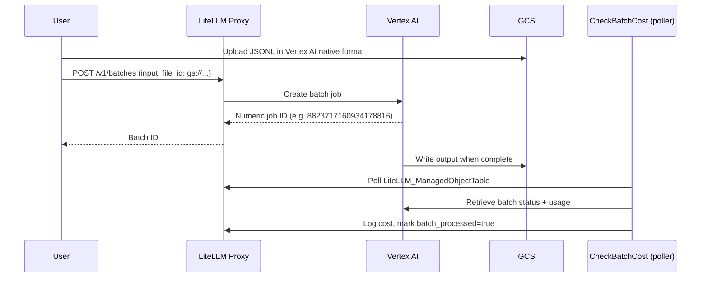

# Unmanaged Vertex AI Batches

:::info

This is a LiteLLM Enterprise feature.

:::

LiteLLM supports two paths for Vertex AI batch jobs. The managed path handles file upload and format conversion automatically. The unmanaged path lets you upload batch files directly to GCS in Vertex AI's native format; LiteLLM skips transformation but tracks cost when enabled.

## How it works



## Setup

Enable cost tracking in your proxy config:

```yaml
general_settings:
  track_unmanaged_vertex_batch_cost: true  # Default: false
```

Configure a `vertex_ai` deployment for the model you want to batch. The poller uses this deployment's credentials to poll Vertex and compute cost:

```yaml
model_list:
  - model_name: gemini-2.5-flash
    litellm_params:
      model: vertex_ai/gemini-2.5-flash
      vertex_project: my-gcp-project
      vertex_location: us-central1
      vertex_credentials: /path/to/service-account.json
```

## GCS path requirement

The GCS path must include `publishers/google/models/<model-name>/` so LiteLLM can derive the model name for credential lookup.

```
gs://my-bucket/<any-prefix>/publishers/google/models/gemini-2.5-flash/<filename>.jsonl
```

The bucket name and any prefix before `publishers/` can be anything.

## Batch file format

Unmanaged batches must be in Vertex AI native JSONL format. The managed path accepts OpenAI format and converts it; the unmanaged path skips conversion entirely, so you must provide Vertex AI format directly:

```json
{"custom_id": "1", "method": "POST", "url": "/v1/chat/completions", "body": {"model": "gemini-2.5-flash", "messages": [{"role": "user", "content": "What is 2+2?"}]}}
{"custom_id": "2", "method": "POST", "url": "/v1/chat/completions", "body": {"model": "gemini-2.5-flash", "messages": [{"role": "user", "content": "What is 3+3?"}]}}
```

## Usage

### 1. Upload to GCS

```bash
gsutil cp batch.jsonl gs://my-bucket/batches/publishers/google/models/gemini-2.5-flash/batch.jsonl
```

### 2. Create batch

Pass the GCS URI as `input_file_id`:

```bash
curl -X POST http://localhost:4000/v1/batches \
  -H "Authorization: Bearer sk-1234" \
  -H "Content-Type: application/json" \
  -d '{
    "input_file_id": "gs://my-bucket/batches/publishers/google/models/gemini-2.5-flash/batch.jsonl",
    "endpoint": "/v1/chat/completions",
    "completion_window": "24h",
    "custom_llm_provider": "vertex_ai"
  }'
```

The response contains a raw Vertex numeric job ID (e.g., `8823717160934178816`).

### 3. Monitor status

Pass `custom_llm_provider=vertex_ai` so the proxy routes to Vertex instead of OpenAI:

```bash
curl -X GET "http://localhost:4000/v1/batches/8823717160934178816?custom_llm_provider=vertex_ai" \
  -H "Authorization: Bearer sk-1234"
```

### 4. Retrieve results

When `status` is `completed`, the output file location is in `output_file_id`. Download it from GCS:

```bash
gsutil cp gs://my-bucket/output/batch-results.jsonl .
```

Each line is a Vertex AI response object:

```json
{"custom_id": "1", "response": {"status_code": 200, "body": {"choices": [{"message": {"content": "2 + 2 = 4"}}]}}}
```

## Cost tracking

With `track_unmanaged_vertex_batch_cost: true`, the CheckBatchCost poller handles cost tracking automatically. It extracts the model from the GCS path, uses the configured `vertex_ai` deployment to poll Vertex for results, computes token cost, and marks the batch as processed. Cost appears in the proxy logs UI at `http://localhost:4000/ui/?page=logs`.

The polling interval is controlled by `proxy_batch_polling_interval` in `general_settings` (base seconds; the poller adds 0-30s jitter). Set it to `10` for faster feedback during testing.

## Troubleshooting

**Batch not costed.** Check that `track_unmanaged_vertex_batch_cost: true` is set, that your GCS path contains `publishers/google/models/<model>/`, and that you have a `vertex_ai` deployment configured. Look for log lines like:

```
Skipping unmanaged vertex batch 8823717160934178816: no vertex_ai deployment configured for model gemini-2.5-flash
```

**Cost is zero.** Vertex AI includes token usage in the response body only after the batch fully completes. If status is `completed` but cost is zero, manually download the output file to verify it contains response data with usage fields.

## Managed vs unmanaged

| | Managed | Unmanaged |
|---|---|---|
| Input format | OpenAI chat completion | Vertex AI native |
| File upload | Via proxy | Direct to GCS |
| Format conversion | Automatic | None |
| Batch ID format | Base64-encoded unified ID | Raw Vertex numeric ID |
| Cost tracking | On by default | Opt-in flag |

## See also

- [Managed Batches](/docs/proxy/managed_batches)
- [Vertex AI Batch Prediction](https://cloud.google.com/vertex-ai/docs/batch-prediction/batch-prediction)
