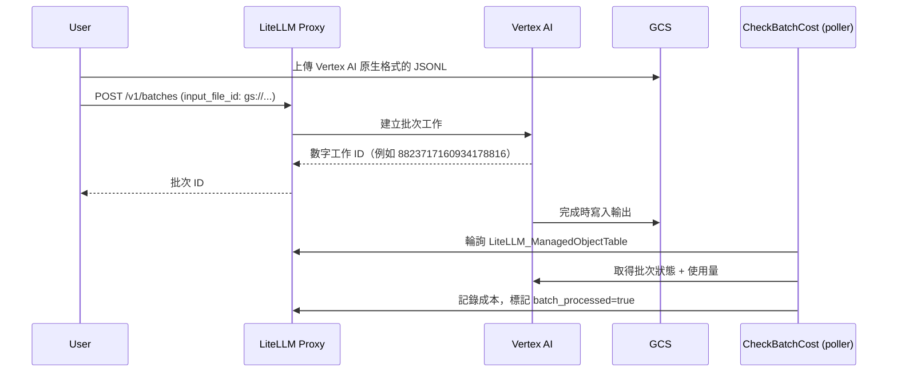

# 未管理的 Vertex AI 批次 {#unmanaged-vertex-ai-batches}

:::info

這是 LiteLLM Enterprise 功能。

:::

LiteLLM 支援 Vertex AI 批次工作的兩種路徑。受管理路徑會自動處理檔案上傳與格式轉換。未管理路徑則讓您直接以上傳批次檔案到 GCS，並使用 Vertex AI 的原生格式；LiteLLM 會略過轉換，但在啟用時會追蹤成本。

## 運作方式 {#how-it-works}



## 設定 {#setup}

在您的 proxy 設定中啟用成本追蹤：

```yaml
general_settings:
  track_unmanaged_vertex_batch_cost: true  # Default: false
```

為您要批次處理的模型設定 `vertex_ai` 部署。poller 會使用此部署的憑證來輪詢 Vertex 並計算成本：

```yaml
model_list:
  - model_name: gemini-2.5-flash
    litellm_params:
      model: vertex_ai/gemini-2.5-flash
      vertex_project: my-gcp-project
      vertex_location: us-central1
      vertex_credentials: /path/to/service-account.json
```

## GCS 路徑需求 {#gcs-path-requirement}

GCS 路徑必須包含 `publishers/google/models/<model-name>/`，如此 LiteLLM 才能推導出用於憑證查找的模型名稱。

```
gs://my-bucket/<any-prefix>/publishers/google/models/gemini-2.5-flash/<filename>.jsonl
```

儲存桶名稱以及 `publishers/` 之前的任何前綴都可以是任意值。

## 批次檔案格式 {#batch-file-format}

未管理批次必須使用 Vertex AI 原生 JSONL 格式。受管理路徑接受 OpenAI 格式並加以轉換；未管理路徑則完全略過轉換，因此您必須直接提供 Vertex AI 格式：

```json
{"custom_id": "1", "method": "POST", "url": "/v1/chat/completions", "body": {"model": "gemini-2.5-flash", "messages": [{"role": "user", "content": "What is 2+2?"}]}}
{"custom_id": "2", "method": "POST", "url": "/v1/chat/completions", "body": {"model": "gemini-2.5-flash", "messages": [{"role": "user", "content": "What is 3+3?"}]}}
```

## 用法 {#usage}

### 1. 上傳到 GCS {#1-upload-to-gcs}

```bash
gsutil cp batch.jsonl gs://my-bucket/batches/publishers/google/models/gemini-2.5-flash/batch.jsonl
```

### 2. 建立批次 {#2-create-batch}

將 GCS URI 作為 `input_file_id` 傳入：

```bash
curl -X POST http://localhost:4000/v1/batches \
  -H "Authorization: Bearer sk-1234" \
  -H "Content-Type: application/json" \
  -d '{
    "input_file_id": "gs://my-bucket/batches/publishers/google/models/gemini-2.5-flash/batch.jsonl",
    "endpoint": "/v1/chat/completions",
    "completion_window": "24h",
    "custom_llm_provider": "vertex_ai"
  }'
```

回應會包含原始的 Vertex 數字工作 ID（例如，`8823717160934178816`）。

### 3. 監控狀態 {#3-monitor-status}

傳入 `custom_llm_provider=vertex_ai`，讓 proxy 路由到 Vertex 而非 OpenAI：

```bash
curl -X GET "http://localhost:4000/v1/batches/8823717160934178816?custom_llm_provider=vertex_ai" \
  -H "Authorization: Bearer sk-1234"
```

### 4. 取得結果 {#4-retrieve-results}

當 `status` 為 `completed` 時，輸出檔案位置會在 `output_file_id` 中。從 GCS 下載：

```bash
gsutil cp gs://my-bucket/output/batch-results.jsonl .
```

每一行都是一個 Vertex AI 回應物件：

```json
{"custom_id": "1", "response": {"status_code": 200, "body": {"choices": [{"message": {"content": "2 + 2 = 4"}}]}}}
```

## 成本追蹤 {#cost-tracking}

啟用 `track_unmanaged_vertex_batch_cost: true` 後，CheckBatchCost poller 會自動處理成本追蹤。它會從 GCS 路徑擷取模型，使用已設定的 `vertex_ai` 部署來輪詢 Vertex 取得結果，計算 token 成本，並將批次標記為已處理。成本會顯示在 proxy 記錄 UI 的 `http://localhost:4000/ui/?page=logs`。

輪詢間隔由 `proxy_batch_polling_interval` 在 `general_settings` 中控制（基礎秒數；poller 會加入 0-30 秒抖動）。在測試期間可將其設為 `10` 以獲得更快的回饋。

## 疑難排解 {#troubleshooting}

**未計成本。** 請檢查 `track_unmanaged_vertex_batch_cost: true` 是否已設定、您的 GCS 路徑是否包含 `publishers/google/models/<model>/`，以及您是否已設定 `vertex_ai` 部署。請留意如下記錄行：

```
Skipping unmanaged vertex batch 8823717160934178816: no vertex_ai deployment configured for model gemini-2.5-flash
```

**成本為零。** 只有在批次完全完成後，Vertex AI 才會在回應本文中包含 token 使用量。如果狀態是 `completed` 但成本為零，請手動下載輸出檔案以確認其中包含帶有 usage 欄位的回應資料。

## 受管理 vs 未管理 {#managed-vs-unmanaged}

| | 受管理 | 未管理 |
|---|---|---|
| 輸入格式 | OpenAI 聊天完成 | Vertex AI 原生 |
| 檔案上傳 | 透過 proxy | 直接到 GCS |
| 格式轉換 | 自動 | 無 |
| 批次 ID 格式 | Base64 編碼的統一 ID | 原始 Vertex 數字 ID |
| 成本追蹤 | 預設啟用 | opt-in 標記 |

## 另請參閱 {#see-also}

- [受管理批次](/docs/proxy/managed_batches)
- [Vertex AI 批次預測](https://cloud.google.com/vertex-ai/docs/batch-prediction/batch-prediction)
