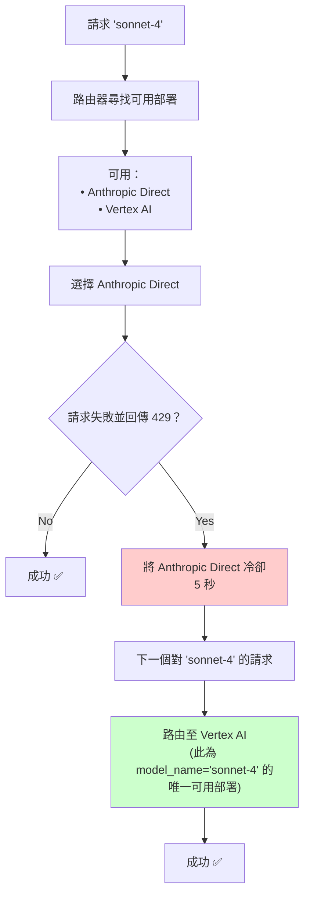

import Image from '@theme/IdealImage';
import Tabs from '@theme/Tabs';
import TabItem from '@theme/TabItem';


# Router - 負載平衡 {#router---load-balancing}

LiteLLM 管理：
- 在多個部署之間進行負載平衡（例如 Azure/OpenAI）
- 將重要請求排在優先位置，以確保它們不會失敗（亦即排隊）
- 基本可靠性邏輯 - 在多個部署/提供者之間進行冷卻、備援、逾時與重試（固定 + 指數退避）。

在正式環境中，litellm 支援使用 Redis 來追蹤冷卻伺服器與使用量（管理 tpm/rpm 限制）。

:::info

如果您想要一個可在不同 LLM API 之間進行負載平衡的伺服器，請使用我們的 [LiteLLM Proxy Server](./proxy/load_balancing.md)

:::

## 負載平衡 {#load-balancing}
（感謝 [@paulpierre](https://www.linkedin.com/in/paulpierre/) 與 [sweep proxy](https://docs.sweep.dev/blogs/openai-proxy) 對此實作的貢獻）
[**查看程式碼**](https://github.com/BerriAI/litellm/blob/main/litellm/router.py)

### 快速開始 {#quick-start}

在多個 [azure](./providers/azure)/[bedrock](./providers/bedrock.md)/[provider](./providers/) 部署之間進行負載平衡。若呼叫失敗，LiteLLM 會處理在不同區域的重試。

<Tabs>
<TabItem value="sdk" label="SDK">

```python
from litellm import Router

model_list = [{ # list of model deployments 
	"model_name": "gpt-3.5-turbo", # model alias -> loadbalance between models with same `model_name`
	"litellm_params": { # params for litellm completion/embedding call 
		"model": "azure/chatgpt-v-2", # actual model name
		"api_key": os.getenv("AZURE_API_KEY"),
		"api_version": os.getenv("AZURE_API_VERSION"),
		"api_base": os.getenv("AZURE_API_BASE")
	}
}, {
    "model_name": "gpt-3.5-turbo", 
	"litellm_params": { # params for litellm completion/embedding call 
		"model": "azure/chatgpt-functioncalling", 
		"api_key": os.getenv("AZURE_API_KEY"),
		"api_version": os.getenv("AZURE_API_VERSION"),
		"api_base": os.getenv("AZURE_API_BASE")
	}
}, {
    "model_name": "gpt-3.5-turbo", 
	"litellm_params": { # params for litellm completion/embedding call 
		"model": "gpt-3.5-turbo", 
		"api_key": os.getenv("OPENAI_API_KEY"),
	}
}, {
    "model_name": "gpt-4", 
	"litellm_params": { # params for litellm completion/embedding call 
		"model": "azure/gpt-4", 
		"api_key": os.getenv("AZURE_API_KEY"),
		"api_base": os.getenv("AZURE_API_BASE"),
		"api_version": os.getenv("AZURE_API_VERSION"),
	}
}, {
    "model_name": "gpt-4", 
	"litellm_params": { # params for litellm completion/embedding call 
		"model": "gpt-4", 
		"api_key": os.getenv("OPENAI_API_KEY"),
	}
},

]

router = Router(model_list=model_list)

# openai.ChatCompletion.create replacement
# requests with model="gpt-3.5-turbo" will pick a deployment where model_name="gpt-3.5-turbo"
response = await router.acompletion(model="gpt-3.5-turbo", 
				messages=[{"role": "user", "content": "Hey, how's it going?"}])

print(response)

# openai.ChatCompletion.create replacement
# requests with model="gpt-4" will pick a deployment where model_name="gpt-4"
response = await router.acompletion(model="gpt-4", 
				messages=[{"role": "user", "content": "Hey, how's it going?"}])

print(response)
```
</TabItem>
<TabItem value="proxy" label="PROXY">

:::info

請參閱詳細的 proxy 負載平衡/備援文件 [這裡](./proxy/reliability.md)

:::

1. 使用多個部署設定 model_list
```yaml
model_list:
  - model_name: gpt-3.5-turbo
    litellm_params:
      model: azure/<your-deployment-name>
      api_base: <your-azure-endpoint>
      api_key: <your-azure-api-key>
  - model_name: gpt-3.5-turbo
    litellm_params:
      model: azure/gpt-turbo-small-ca
      api_base: https://my-endpoint-canada-berri992.openai.azure.com/
      api_key: <your-azure-api-key>
  - model_name: gpt-3.5-turbo
    litellm_params:
      model: azure/gpt-turbo-large
      api_base: https://openai-france-1234.openai.azure.com/
      api_key: <your-azure-api-key>
```

2. 啟動 proxy 

```bash
litellm --config /path/to/config.yaml 
```

3. 測試它！ 

```bash
curl -X POST 'http://0.0.0.0:4000/chat/completions' \
-H 'Content-Type: application/json' \
-H 'Authorization: Bearer sk-1234' \
-d '{
  "model": "gpt-3.5-turbo",
  "messages": [
        {"role": "user", "content": "Hi there!"}
    ],
    "mock_testing_rate_limit_error": true
}'
```
</TabItem>
</Tabs>

### 可用端點 {#available-endpoints}
- `router.completion()` - 用於呼叫 100+ 個 LLM 的聊天完成端點
- `router.acompletion()` - 非同步聊天完成呼叫
- `router.embedding()` - Azure、OpenAI、Huggingface 端點的嵌入端點
- `router.aembedding()` - 非同步嵌入呼叫
- `router.text_completion()` - 舊版 OpenAI `/v1/completions` 端點格式中的完成呼叫
- `router.atext_completion()` - 非同步文字完成呼叫
- `router.image_generation()` - OpenAI `/v1/images/generations` 端點格式中的完成呼叫
- `router.aimage_generation()` - 非同步圖片生成呼叫

## 進階 - 路由策略 ⭐️ {#advanced---routing-strategies-️}
#### 路由策略 - 權重選取、感知速率限制、最少忙碌、基於延遲、基於成本 {#routing-strategies---weighted-pick-rate-limit-aware-least-busy-latency-based-cost-based}

Router 提供多種策略，可將您的呼叫路由到多個部署。**我們建議在正式環境中使用 `simple-shuffle`（預設）以獲得最佳效能。**

<Tabs>
<TabItem value="simple-shuffle" label="（預設）權重選取 - 推薦">

**正式環境的預設與推薦** - 以最小的延遲額外負擔達到最佳效能。

根據提供的 **每分鐘請求數（rpm）或每分鐘 tokens 數（tpm）** 選取一個部署

如果未提供 `rpm` 或 `tpm`，則會隨機選取一個部署

您也可以設定 `weight` 參數，以指定何時應選取哪個模型。

<Tabs>
<TabItem value="rpm" label="基於 RPM 的洗牌">

##### **LiteLLM Proxy Config.yaml** {#litellm-proxy-configyaml}

```yaml
model_list:
	- model_name: gpt-3.5-turbo
	  litellm_params:
	  	model: azure/chatgpt-v-2
		api_key: os.environ/AZURE_API_KEY
		api_version: os.environ/AZURE_API_VERSION
		api_base: os.environ/AZURE_API_BASE
		rpm: 900 
	- model_name: gpt-3.5-turbo
	  litellm_params:
	  	model: azure/chatgpt-functioncalling
		api_key: os.environ/AZURE_API_KEY
		api_version: os.environ/AZURE_API_VERSION
		api_base: os.environ/AZURE_API_BASE
		rpm: 10 
```

##### **Python SDK** {#python-sdk}

```python
from litellm import Router 
import asyncio

model_list = [{ # list of model deployments 
	"model_name": "gpt-3.5-turbo", # model alias 
	"litellm_params": { # params for litellm completion/embedding call 
		"model": "azure/chatgpt-v-2", # actual model name
		"api_key": os.getenv("AZURE_API_KEY"),
		"api_version": os.getenv("AZURE_API_VERSION"),
		"api_base": os.getenv("AZURE_API_BASE"),
		"rpm": 900,			# requests per minute for this API
	}
}, {
    "model_name": "gpt-3.5-turbo", 
	"litellm_params": { # params for litellm completion/embedding call 
		"model": "azure/chatgpt-functioncalling", 
		"api_key": os.getenv("AZURE_API_KEY"),
		"api_version": os.getenv("AZURE_API_VERSION"),
		"api_base": os.getenv("AZURE_API_BASE"),
		"rpm": 10,
	}
},]

# init router
router = Router(model_list=model_list, routing_strategy="simple-shuffle")
async def router_acompletion():
	response = await router.acompletion(
		model="gpt-3.5-turbo", 
		messages=[{"role": "user", "content": "Hey, how's it going?"}]
	)
	print(response)
	return response

asyncio.run(router_acompletion())
```

</TabItem>
<TabItem value="weight" label="基於權重的洗牌">

##### **LiteLLM Proxy Config.yaml** {#litellm-proxy-configyaml-1}

```yaml
model_list:
	- model_name: gpt-3.5-turbo
	  litellm_params:
	  	model: azure/chatgpt-v-2
		api_key: os.environ/AZURE_API_KEY
		api_version: os.environ/AZURE_API_VERSION
		api_base: os.environ/AZURE_API_BASE
		weight: 9
	- model_name: gpt-3.5-turbo
	  litellm_params:
	  	model: azure/chatgpt-functioncalling
		api_key: os.environ/AZURE_API_KEY
		api_version: os.environ/AZURE_API_VERSION
		api_base: os.environ/AZURE_API_BASE
		weight: 1 
```

##### **Python SDK** {#python-sdk-1}

```python
from litellm import Router 
import asyncio

model_list = [{
	"model_name": "gpt-3.5-turbo", # model alias 
	"litellm_params": { 
		"model": "azure/chatgpt-v-2", # actual model name
		"api_key": os.getenv("AZURE_API_KEY"),
		"api_version": os.getenv("AZURE_API_VERSION"),
		"api_base": os.getenv("AZURE_API_BASE"),
		"weight": 9, # pick this 90% of the time
	}
}, {
    "model_name": "gpt-3.5-turbo", 
	"litellm_params": { 
		"model": "azure/chatgpt-functioncalling", 
		"api_key": os.getenv("AZURE_API_KEY"),
		"api_version": os.getenv("AZURE_API_VERSION"),
		"api_base": os.getenv("AZURE_API_BASE"),
		"weight": 1,
	}
}]

# init router
router = Router(model_list=model_list, routing_strategy="simple-shuffle")
async def router_acompletion():
	response = await router.acompletion(
		model="gpt-3.5-turbo", 
		messages=[{"role": "user", "content": "Hey, how's it going?"}]
	)
	print(response)
	return response

asyncio.run(router_acompletion())
```

</TabItem>
</Tabs>

</TabItem>
<TabItem value="usage-based-v2" label="感知速率限制 v2（非同步）">

> [!WARNING]  
**不建議在正式環境使用以使用量為基礎的路由，因為會影響效能。** 在高流量情境下，請使用 `simple-shuffle`（預設）以獲得最佳效能。以使用量為基礎的路由會因為使用 Redis 跨部署追蹤使用量而增加顯著延遲。

**🎉 NEW** 這是以使用量為基礎路由的非同步實作。

**如果 tpm/rpm 限制超過，則會過濾掉部署** - 如果您傳入該部署的 tpm/rpm 限制。

路由至該分鐘中 **TPM 使用量最低的部署**。 

在正式環境中，我們使用 Redis 追蹤跨多個部署的使用量（TPM/RPM）。此實作使用 **非同步 redis 呼叫**（redis.incr 和 redis.mget）。

對於 Azure，[每 1000 TPM 有 6 RPM](https://stackoverflow.com/questions/77368844/what-is-the-request-per-minute-rate-limit-for-azure-openai-models-for-gpt-3-5-tu)

<Tabs>
<TabItem value="sdk" label="sdk">

```python
from litellm import Router 


model_list = [{ # list of model deployments 
	"model_name": "gpt-3.5-turbo", # model alias 
	"litellm_params": { # params for litellm completion/embedding call 
		"model": "azure/chatgpt-v-2", # actual model name
		"api_key": os.getenv("AZURE_API_KEY"),
		"api_version": os.getenv("AZURE_API_VERSION"),
		"api_base": os.getenv("AZURE_API_BASE")
		"tpm": 100000,
		"rpm": 10000,
	}, 
}, {
    "model_name": "gpt-3.5-turbo", 
	"litellm_params": { # params for litellm completion/embedding call 
		"model": "azure/chatgpt-functioncalling", 
		"api_key": os.getenv("AZURE_API_KEY"),
		"api_version": os.getenv("AZURE_API_VERSION"),
		"api_base": os.getenv("AZURE_API_BASE")
		"tpm": 100000,
		"rpm": 1000,
	},
}, {
    "model_name": "gpt-3.5-turbo", 
	"litellm_params": { # params for litellm completion/embedding call 
		"model": "gpt-3.5-turbo", 
		"api_key": os.getenv("OPENAI_API_KEY"),
		"tpm": 100000,
		"rpm": 1000,
	},
}]
router = Router(model_list=model_list, 
                redis_host=os.environ["REDIS_HOST"], 
				redis_password=os.environ["REDIS_PASSWORD"], 
				redis_port=os.environ["REDIS_PORT"], 
                routing_strategy="simple-shuffle" # 👈 RECOMMENDED - best performance
				enable_pre_call_checks=True, # enables router rate limits for concurrent calls
				)

response = await router.acompletion(model="gpt-3.5-turbo", 
				messages=[{"role": "user", "content": "Hey, how's it going?"}]

print(response)
```
</TabItem>
<TabItem value="proxy" label="proxy">

**1. 在設定中設定 strategy**

```yaml
model_list:
	- model_name: gpt-3.5-turbo # model alias 
	  litellm_params: # params for litellm completion/embedding call 
		model: azure/chatgpt-v-2 # actual model name
		api_key: os.environ/AZURE_API_KEY
		api_version: os.environ/AZURE_API_VERSION
		api_base: os.environ/AZURE_API_BASE
      tpm: 100000
	  rpm: 10000
	- model_name: gpt-3.5-turbo 
	  litellm_params: # params for litellm completion/embedding call 
		model: gpt-3.5-turbo 
		api_key: os.getenv(OPENAI_API_KEY)
      tpm: 100000
	  rpm: 1000

router_settings:
  routing_strategy: simple-shuffle # 👈 RECOMMENDED - best performance
  redis_host: <your-redis-host>
  redis_password: <your-redis-password>
  redis_port: <your-redis-port>
  enable_pre_call_check: true

general_settings:
  master_key: sk-1234
```

**2. 啟動 proxy**

```bash
litellm --config /path/to/config.yaml
```

**3. 測試它！**

```bash
curl --location 'http://localhost:4000/v1/chat/completions' \
--header 'Content-Type: application/json' \
--header 'Authorization: Bearer sk-1234' \
--data '{
    "model": "gpt-3.5-turbo", 
    "messages": [{"role": "user", "content": "Hey, how's it going?"}]
}'
```

</TabItem>
</Tabs>

</TabItem>
<TabItem value="latency-based" label="基於延遲">

選取回應時間最低的部署。

它會根據請求送出與從部署接收的時間，快取並更新各部署的回應時間。

[**如何測試**](https://github.com/BerriAI/litellm/blob/main/tests/local_testing/test_lowest_latency_routing.py)

```python
from litellm import Router 
import asyncio

model_list = [{ ... }]

# init router
router = Router(model_list=model_list,
				routing_strategy="latency-based-routing",# 👈 set routing strategy
				enable_pre_call_check=True, # enables router rate limits for concurrent calls
				)

## CALL 1+2
tasks = []
response = None
final_response = None
for _ in range(2):
	tasks.append(router.acompletion(model=model, messages=messages))
response = await asyncio.gather(*tasks)

if response is not None:
	## CALL 3 
	await asyncio.sleep(1)  # let the cache update happen
	picked_deployment = router.lowestlatency_logger.get_available_deployments(
		model_group=model, healthy_deployments=router.healthy_deployments
	)
	final_response = await router.acompletion(model=model, messages=messages)
	print(f"min deployment id: {picked_deployment}")
	print(f"model id: {final_response._hidden_params['model_id']}")
	assert (
		final_response._hidden_params["model_id"]
		== picked_deployment["model_info"]["id"]
	)
```

#### 設定時間視窗  {#set-time-window}

設定計算部署平均延遲時要回溯考量的時間視窗。 

**在 Router 中**
```python 
router = Router(..., routing_strategy_args={"ttl": 10})
```

**在 Proxy 中**

```yaml
router_settings:
	routing_strategy_args: {"ttl": 10}
```

#### 設定最低延遲緩衝  {#set-lowest-latency-buffer}

設定一個緩衝區，只有在此範圍內的部署才是可用來發出呼叫的候選者。 

例如： 

如果您有 5 個部署

```
https://litellm-prod-1.openai.azure.com/: 0.07s
https://litellm-prod-2.openai.azure.com/: 0.1s
https://litellm-prod-3.openai.azure.com/: 0.1s
https://litellm-prod-4.openai.azure.com/: 0.1s
https://litellm-prod-5.openai.azure.com/: 4.66s
```

為了避免一開始就以所有請求過度負載 `prod-1`，我們可以將緩衝設為 50%，以考慮部署 `prod-2, prod-3, prod-4`。 

**在 Router 中**
```python 
router = Router(..., routing_strategy_args={"lowest_latency_buffer": 0.5})
```

**在 Proxy 中**

```yaml
router_settings:
	routing_strategy_args: {"lowest_latency_buffer": 0.5}
```

</TabItem>

<TabItem value="usage-based" label="感知速率限制">

這會將請求路由到該分鐘 TPM 使用量最低的部署。 

在正式環境中，我們使用 Redis 追蹤跨多個部署的使用量（TPM/RPM）。 

如果您傳入部署的 tpm/rpm 限制，這也會一併檢查，並過濾掉任何其限制會被超出的部署。 

對於 Azure，您的 RPM = TPM/6。 

```python
from litellm import Router 


model_list = [{ # list of model deployments 
	"model_name": "gpt-3.5-turbo", # model alias 
	"litellm_params": { # params for litellm completion/embedding call 
		"model": "azure/chatgpt-v-2", # actual model name
		"api_key": os.getenv("AZURE_API_KEY"),
		"api_version": os.getenv("AZURE_API_VERSION"),
		"api_base": os.getenv("AZURE_API_BASE")
	}, 
    "tpm": 100000,
	"rpm": 10000,
}, {
    "model_name": "gpt-3.5-turbo", 
	"litellm_params": { # params for litellm completion/embedding call 
		"model": "azure/chatgpt-functioncalling", 
		"api_key": os.getenv("AZURE_API_KEY"),
		"api_version": os.getenv("AZURE_API_VERSION"),
		"api_base": os.getenv("AZURE_API_BASE")
	},
    "tpm": 100000,
	"rpm": 1000,
}, {
    "model_name": "gpt-3.5-turbo", 
	"litellm_params": { # params for litellm completion/embedding call 
		"model": "gpt-3.5-turbo", 
		"api_key": os.getenv("OPENAI_API_KEY"),
	},
    "tpm": 100000,
	"rpm": 1000,
}]
router = Router(model_list=model_list, 
                redis_host=os.environ["REDIS_HOST"], 
				redis_password=os.environ["REDIS_PASSWORD"], 
				redis_port=os.environ["REDIS_PORT"], 
                routing_strategy="usage-based-routing"
				enable_pre_call_check=True, # enables router rate limits for concurrent calls
				)

response = await router.acompletion(model="gpt-3.5-turbo", 
				messages=[{"role": "user", "content": "Hey, how's it going?"}]

print(response)
```


</TabItem>
<TabItem value="least-busy" label="最少忙碌">

選取目前處理中的呼叫數量最少的部署。

[**如何測試**](https://github.com/BerriAI/litellm/blob/main/tests/local_testing/test_least_busy_routing.py)

```python
from litellm import Router 
import asyncio

model_list = [{ # list of model deployments 
	"model_name": "gpt-3.5-turbo", # model alias 
	"litellm_params": { # params for litellm completion/embedding call 
		"model": "azure/chatgpt-v-2", # actual model name
		"api_key": os.getenv("AZURE_API_KEY"),
		"api_version": os.getenv("AZURE_API_VERSION"),
		"api_base": os.getenv("AZURE_API_BASE"),
	}
}, {
    "model_name": "gpt-3.5-turbo", 
	"litellm_params": { # params for litellm completion/embedding call 
		"model": "azure/chatgpt-functioncalling", 
		"api_key": os.getenv("AZURE_API_KEY"),
		"api_version": os.getenv("AZURE_API_VERSION"),
		"api_base": os.getenv("AZURE_API_BASE"),
	}
}, {
    "model_name": "gpt-3.5-turbo", 
	"litellm_params": { # params for litellm completion/embedding call 
		"model": "gpt-3.5-turbo", 
		"api_key": os.getenv("OPENAI_API_KEY"),
	}
}]

# init router
router = Router(model_list=model_list, routing_strategy="least-busy")
async def router_acompletion():
	response = await router.acompletion(
		model="gpt-3.5-turbo", 
		messages=[{"role": "user", "content": "Hey, how's it going?"}]
	)
	print(response)
	return response

asyncio.run(router_acompletion())
```

</TabItem>

<TabItem value="custom" label="自訂路由策略">

**插入自訂路由策略以選取部署**

步驟 1. 定義您的自訂路由策略

```python

from litellm.router import CustomRoutingStrategyBase
class CustomRoutingStrategy(CustomRoutingStrategyBase):
    async def async_get_available_deployment(
        self,
        model: str,
        messages: Optional[List[Dict[str, str]]] = None,
        input: Optional[Union[str, List]] = None,
        specific_deployment: Optional[bool] = False,
        request_kwargs: Optional[Dict] = None,
    ):
        """
        Asynchronously retrieves the available deployment based on the given parameters.

        Args:
            model (str): The name of the model.
            messages (Optional[List[Dict[str, str]]], optional): The list of messages for a given request. Defaults to None.
            input (Optional[Union[str, List]], optional): The input for a given embedding request. Defaults to None.
            specific_deployment (Optional[bool], optional): Whether to retrieve a specific deployment. Defaults to False.
            request_kwargs (Optional[Dict], optional): Additional request keyword arguments. Defaults to None.

        Returns:
            Returns an element from litellm.router.model_list

        """
        print("In CUSTOM async get available deployment")
        model_list = router.model_list
        print("router model list=", model_list)
        for model in model_list:
            if isinstance(model, dict):
                if model["litellm_params"]["model"] == "openai/very-special-endpoint":
                    return model
        pass

    def get_available_deployment(
        self,
        model: str,
        messages: Optional[List[Dict[str, str]]] = None,
        input: Optional[Union[str, List]] = None,
        specific_deployment: Optional[bool] = False,
        request_kwargs: Optional[Dict] = None,
    ):
        """
        Synchronously retrieves the available deployment based on the given parameters.

        Args:
            model (str): The name of the model.
            messages (Optional[List[Dict[str, str]]], optional): The list of messages for a given request. Defaults to None.
            input (Optional[Union[str, List]], optional): The input for a given embedding request. Defaults to None.
            specific_deployment (Optional[bool], optional): Whether to retrieve a specific deployment. Defaults to False.
            request_kwargs (Optional[Dict], optional): Additional request keyword arguments. Defaults to None.

        Returns:
            Returns an element from litellm.router.model_list

        """
        pass
```

步驟 2. 使用自訂路由策略初始化 Router
```python
from litellm import Router

router = Router(
    model_list=[
        {
            "model_name": "azure-model",
            "litellm_params": {
                "model": "openai/very-special-endpoint",
                "api_base": "https://exampleopenaiendpoint-production.up.railway.app/",  # If you are Krrish, this is OpenAI Endpoint3 on our Railway endpoint :)
                "api_key": "fake-key",
            },
            "model_info": {"id": "very-special-endpoint"},
        },
        {
            "model_name": "azure-model",
            "litellm_params": {
                "model": "openai/fast-endpoint",
                "api_base": "https://exampleopenaiendpoint-production.up.railway.app/",
                "api_key": "fake-key",
            },
            "model_info": {"id": "fast-endpoint"},
        },
    ],
    set_verbose=True,
    debug_level="DEBUG",
    timeout=1,
)  # type: ignore

router.set_custom_routing_strategy(CustomRoutingStrategy()) # 👈 Set your routing strategy here
```

步驟 3. 測試您的路由策略。預期在執行 `router.acompletion` 請求時會呼叫您的自訂路由策略
```python
for _ in range(10):
	response = await router.acompletion(
		model="azure-model", messages=[{"role": "user", "content": "hello"}]
	)
	print(response)
	_picked_model_id = response._hidden_params["model_id"]
	print("picked model=", _picked_model_id)
```


</TabItem>

<TabItem value="lowest-cost" label="最低成本路由（非同步）">

根據最低成本選取一個部署

運作方式：
- 取得所有健康的部署
- 選取所有低於其所提供 `rpm/tpm` 限制的部署
- 對每個部署檢查 `litellm_param["model"]` 是否存在於 [`litellm_model_cost_map`](https://github.com/BerriAI/litellm/blob/main/model_prices_and_context_window.json) 中 
	- 如果部署不存在於 `litellm_model_cost_map` 中 -> 使用 deployment_cost= `$1`
- 選取成本最低的部署

```python
from litellm import Router 
import asyncio

model_list =  [
	{
		"model_name": "gpt-3.5-turbo",
		"litellm_params": {"model": "gpt-4"},
		"model_info": {"id": "openai-gpt-4"},
	},
	{
		"model_name": "gpt-3.5-turbo",
		"litellm_params": {"model": "groq/llama3-8b-8192"},
		"model_info": {"id": "groq-llama"},
	},
]

# init router
router = Router(model_list=model_list, routing_strategy="cost-based-routing")
async def router_acompletion():
	response = await router.acompletion(
		model="gpt-3.5-turbo", 
		messages=[{"role": "user", "content": "Hey, how's it going?"}]
	)
	print(response)

	print(response._hidden_params["model_id"]) # expect groq-llama, since groq/llama has lowest cost
	return response

asyncio.run(router_acompletion())

```


#### 使用自訂輸入/輸出定價 {#using-custom-inputoutput-pricing}

設定 `litellm_params["input_cost_per_token"]` 和 `litellm_params["output_cost_per_token"]` 以在路由時使用自訂定價

```python
model_list = [
	{
		"model_name": "gpt-3.5-turbo",
		"litellm_params": {
			"model": "azure/chatgpt-v-2",
			"input_cost_per_token": 0.00003,
			"output_cost_per_token": 0.00003,
		},
		"model_info": {"id": "chatgpt-v-experimental"},
	},
	{
		"model_name": "gpt-3.5-turbo",
		"litellm_params": {
			"model": "azure/chatgpt-v-1",
			"input_cost_per_token": 0.000000001,
			"output_cost_per_token": 0.00000001,
		},
		"model_info": {"id": "chatgpt-v-1"},
	},
	{
		"model_name": "gpt-3.5-turbo",
		"litellm_params": {
			"model": "azure/chatgpt-v-5",
			"input_cost_per_token": 10,
			"output_cost_per_token": 12,
		},
		"model_info": {"id": "chatgpt-v-5"},
	},
]
# init router
router = Router(model_list=model_list, routing_strategy="cost-based-routing")
async def router_acompletion():
	response = await router.acompletion(
		model="gpt-3.5-turbo", 
		messages=[{"role": "user", "content": "Hey, how's it going?"}]
	)
	print(response)

	print(response._hidden_params["model_id"]) # expect chatgpt-v-1, since chatgpt-v-1 has lowest cost
	return response

asyncio.run(router_acompletion())
```

</TabItem>
</Tabs>

## 路由群組 - 每模型策略 {#routing-groups---per-model-strategies}

將不同的路由策略套用到同一個 Router 中的不同模型。**路由群組** 會將一個 `model_name` 清單綁定到某個策略，並（可選）綁定策略參數。未被任何群組納入的模型，會回退到 Router 的頂層 `routing_strategy`。

:::tip
您也可以從儀表板建立、編輯與刪除路由群組。請參閱 [透過 UI 管理路由群組](./proxy/ui/routing_groups.md)。
:::

**適用時機：**您希望對 `gpt-4o` 使用基於延遲的路由，而對較便宜的模型使用單純的權重選取——而不需要再啟動第二個 Router。

#### 規則 {#rules}

- 每個 `model_name` 最多只能屬於一個群組。重疊會在初始化時引發 `ValueError`。
- 不屬於任何群組的模型會使用頂層 `routing_strategy` / `routing_strategy_args`（一個隱含的 `"default"` 群組）。名稱 `"default"` 已保留。
- 每個群組都可以覆寫 `routing_strategy_args`（例如：延遲視窗 TTL、TPM 上限）。
- 群組會根據預路由 hook 之後的 `model` 名稱，逐請求解析。

<Tabs>
<TabItem value="config-yaml" label="LiteLLM Proxy Config.yaml">

```yaml
model_list:
  - model_name: gpt-4o
    litellm_params:
      model: openai/gpt-4o
      api_key: os.environ/OPENAI_API_KEY
  - model_name: gpt-4o
    litellm_params:
      model: azure/gpt-4o
      api_base: os.environ/AZURE_API_BASE
      api_key: os.environ/AZURE_API_KEY
      api_version: "2024-08-01-preview"
  - model_name: cheap-model
    litellm_params:
      model: openai/gpt-4o-mini
      api_key: os.environ/OPENAI_API_KEY

router_settings:
  # fallback strategy for models not in any explicit group
  routing_strategy: simple-shuffle

  routing_groups:
    - group_name: latency-sensitive
      models: [gpt-4o]
      routing_strategy: latency-based-routing
      routing_strategy_args:
        ttl: 3600
```

行為：
- `gpt-4o` → 依延遲在 OpenAI + Azure 部署之間路由。
- `cheap-model` → simple-shuffle（預設群組）。

</TabItem>
<TabItem value="sdk" label="Python SDK">

```python
from litellm import Router

router = Router(
    model_list=[
        {"model_name": "gpt-4o", "litellm_params": {"model": "openai/gpt-4o"}},
        {"model_name": "gpt-4o", "litellm_params": {"model": "azure/gpt-4o", "api_base": "...", "api_key": "..."}},
        {"model_name": "cheap-model", "litellm_params": {"model": "openai/gpt-4o-mini"}},
    ],
    routing_strategy="simple-shuffle",  # fallback for ungrouped models
    routing_groups=[
        {
            "group_name": "latency-sensitive",
            "models": ["gpt-4o"],
            "routing_strategy": "latency-based-routing",
            "routing_strategy_args": {"ttl": 3600},
        },
    ],
)
```

</TabItem>
</Tabs>

#### 多個群組 {#multiple-groups}

兩個群組可以使用相同策略但帶有不同的引數；每個群組都會取得獨立的狀態實例。

```yaml
router_settings:
  routing_strategy: simple-shuffle
  routing_groups:
    - group_name: hot-path
      models: [gpt-4o, claude-sonnet]
      routing_strategy: latency-based-routing
      routing_strategy_args:
        ttl: 60          # short window — react quickly to latency changes
    - group_name: batch
      models: [gpt-4o-mini, llama-70b]
      routing_strategy: usage-based-routing-v2
      routing_strategy_args:
        rpm: 10000
```

#### 執行階段更新 {#updating-at-runtime}

路由群組可透過 `Router.update_settings(routing_groups=[...])` 或 proxy 的 `/config/update` 端點更新。更新時會重建每個群組的狀態。

## 流量鏡像 / 靜默實驗 {#traffic-mirroring--silent-experiments}

流量鏡像可讓您將正式環境流量「模擬」到次要（靜默）模型，以供評估之用。靜默模型的回應會在背景中收集，不會影響主要請求的延遲或結果。

[**請在此查看 A/B 測試 - 流量鏡像的詳細指南**](./traffic_mirroring.md)

## 基本可靠性 {#basic-reliability}

### 部署排序（優先順序） {#deployment-ordering-priority}

在 `litellm_params` 中設定 `order` 以優先處理部署。數值越低＝優先順序越高。當多個部署共享相同的 `order` 時，路由策略會在它們之間進行選擇。

當對 `order=1` 部署的請求失敗（連線錯誤、404、429 等）時，路由器會自動嘗試 `order=2` 部署，接著是 `order=3`，以此類推。每個順序層級都會先獲得自己的重試次數，然後才升級到下一層。如果所有順序層級都耗盡，路由器就會轉往任何已設定的 [fallbacks](#fallbacks)。

<Tabs>
<TabItem value="sdk" label="SDK">

```python
from litellm import Router

model_list = [
    {
        "model_name": "gpt-4",
        "litellm_params": {
            "model": "azure/gpt-4-primary",
            "api_key": os.getenv("AZURE_API_KEY"),
            "order": 1,  # 👈 Highest priority
        },
    },
    {
        "model_name": "gpt-4",
        "litellm_params": {
            "model": "azure/gpt-4-fallback",
            "api_key": os.getenv("AZURE_API_KEY_2"),
            "order": 2,  # 👈 Tried when order=1 fails
        },
    },
]

router = Router(model_list=model_list)
```

</TabItem>
<TabItem value="proxy" label="PROXY">

```yaml
model_list:
  - model_name: gpt-4
    litellm_params:
      model: azure/gpt-4-primary
      api_key: os.environ/AZURE_API_KEY
      order: 1  # 👈 Highest priority

  - model_name: gpt-4
    litellm_params:
      model: azure/gpt-4-fallback
      api_key: os.environ/AZURE_API_KEY_2
      order: 2  # 👈 Tried when order=1 fails
```

</TabItem>
</Tabs>

### 加權部署  {#weighted-deployments}

在部署上設定 `weight`，即可讓某個部署比其他部署更常被選中。 

這適用於 **simple-shuffle** 路由策略（如果未選擇路由策略，這就是預設值）。 

<Tabs>
<TabItem value="sdk" label="SDK">

```python
from litellm import Router 

model_list = [
	{
		"model_name": "o1",
		"litellm_params": {
			"model": "o1-preview", 
			"api_key": os.getenv("OPENAI_API_KEY"), 
			"weight": 1
		},
	},
	{
		"model_name": "o1",
		"litellm_params": {
			"model": "o1-preview", 
			"api_key": os.getenv("OPENAI_API_KEY"), 
			"weight": 2 # 👈 PICK THIS DEPLOYMENT 2x MORE OFTEN THAN o1-preview
		},
	},
]

router = Router(model_list=model_list, routing_strategy="cost-based-routing")

response = await router.acompletion(
	model="gpt-3.5-turbo", 
	messages=[{"role": "user", "content": "Hey, how's it going?"}]
)
print(response)
```
</TabItem>
<TabItem value="proxy" label="PROXY">

```yaml
model_list:
  - model_name: o1
  	litellm_params:
		model: o1
		api_key: os.environ/OPENAI_API_KEY
		weight: 1	
  - model_name: o1
    litellm_params:
		model: o1-preview
		api_key: os.environ/OPENAI_API_KEY
		weight: 2 # 👈 PICK THIS DEPLOYMENT 2x MORE OFTEN THAN o1-preview
```

</TabItem>
</Tabs>

### 加權故障轉移 {#weighted-failover}

預設情況下，當模型群組中的某個部署失敗時，路由器會移到 `fallbacks`（另一個模型群組）中的下一個項目。使用 `enable_weighted_failover` 時，路由器會先在**同一模型群組內**重新重試，使用現有權重重新挑選不同的部署，只有在群組中的每個部署都嘗試過之後，才升級到跨群組備援。

當您有同一模型的多個區域副本（例如 Azure `eastus2` + `swedencentral`），並且希望失敗的區域故障轉移到同樣 `model_name` 的健康同儕，而不是立即切換到不同模型時，這就很有用。

**行為**

- 僅在 `routing_strategy="simple-shuffle"`（預設值）時生效。
- 發生可重試失敗時，會排除失敗的部署 ID，並從同一模型群組中剩餘的同儕裡選出新的部署，同時遵守 `weight` / `rpm` / `tpm`。
- 排除會跨跳次累積：每次重試都會把前一次失敗加入排除集合，因此剛失敗過的部署絕不會在同一個請求鏈中再次被選中。
- 受 `max_fallbacks` 限制（預設 `5`）。
- 不會對 `ContextWindowExceededError` 或 `ContentPolicyViolationError` 觸發——它們仍會保留各自專用的備援路徑。
- 僅限非同步：由 `router.acompletion()` 與其他非同步進入點支援。同步的 `router.completion()` 路徑會轉入一般備援。
- 冷卻時間仍然適用：跨越 `allowed_fails` 的部署會獨立於加權故障轉移而進入冷卻。

**順序 vs. 權重**

如果同一群組也使用 `order`，順序篩選會在加權選取**之前**執行。因此，加權故障轉移只會在目前最低順序層級中的部署之間重新選取。晉升到下一個順序層級則會透過既有的基於順序的備援路徑發生。

**設定**

<Tabs>
<TabItem value="sdk" label="SDK">

```python
from litellm import Router

model_list = [
    {
        "model_name": "gpt-4.1-mini",
        "litellm_params": {
            "model": "azure/gpt-4.1-mini",
            "api_base": "https://eastus2.example.azure.com",
            "api_key": os.getenv("AZURE_EASTUS2_KEY"),
            "weight": 1,
        },
    },
    {
        "model_name": "gpt-4.1-mini",
        "litellm_params": {
            "model": "azure/gpt-4.1-mini",
            "api_base": "https://swedencentral.example.azure.com",
            "api_key": os.getenv("AZURE_SWEDEN_KEY"),
            "weight": 1,
        },
    },
]

router = Router(
    model_list=model_list,
    routing_strategy="simple-shuffle",
    enable_weighted_failover=True,  # 👈 retry within the same model group on failure
)

response = await router.acompletion(
    model="gpt-4.1-mini",
    messages=[{"role": "user", "content": "Hey"}],
)
```

</TabItem>
<TabItem value="proxy" label="PROXY">

```yaml
model_list:
  - model_name: gpt-4.1-mini
    litellm_params:
      model: azure/gpt-4.1-mini
      api_base: https://eastus2.example.azure.com
      api_key: os.environ/AZURE_EASTUS2_KEY
      weight: 1
  - model_name: gpt-4.1-mini
    litellm_params:
      model: azure/gpt-4.1-mini
      api_base: https://swedencentral.example.azure.com
      api_key: os.environ/AZURE_SWEDEN_KEY
      weight: 1

router_settings:
  routing_strategy: simple-shuffle
  enable_weighted_failover: true  # 👈 retry within the same model group on failure
```

</TabItem>
</Tabs>

**操作流程**

使用上述設定並對 `gpt-4.1-mini` 發出請求時：

1. `simple-shuffle` 會使用 `weight` 從兩個部署中選出一個。
2. 如果被選中的部署拋出提供者錯誤（例如 `RateLimitError`、`InternalServerError`），其部署 ID 會加入 `metadata._failover_excluded_ids`。
3. 路由器會以排除失敗部署後的狀態重新進入 `simple-shuffle`，並在剩餘項目上重新正規化權重。
4. 重複步驟 2–3，直到某個部署成功、每個同儕都已被排除，或達到 `max_fallbacks`。
5. 只有在所有同儕都用盡之後，路由器才會轉入為該群組設定的任何 `fallbacks`。

請參閱路由器設定參考中的 [`enable_weighted_failover`](./proxy/config_settings#router_settings---reference) 以了解此旗標。

### 最大平行請求數（ASYNC） {#max-parallel-requests-async}

用於路由器上非同步請求的 semaphore。限制對部署發出的最大並行呼叫數。在高流量情境下很有用。 

如果已設定 tpm/rpm，且未提供最大平行請求限制，我們會使用 RPM 或計算出的 RPM（tpm/1000/6）作為最大平行請求限制。 

```python
from litellm import Router 

model_list = [{
	"model_name": "gpt-4",
	"litellm_params": {
		"model": "azure/gpt-4",
		...
		"max_parallel_requests": 10 # 👈 SET PER DEPLOYMENT
	}
}]

### OR ### 

router = Router(model_list=model_list, default_max_parallel_requests=20) # 👈 SET DEFAULT MAX PARALLEL REQUESTS 


# deployment max parallel requests > default max parallel requests
```

[**查看程式碼**](https://github.com/BerriAI/litellm/blob/a978f2d8813c04dad34802cb95e0a0e35a3324bc/litellm/utils.py#L5605)

### 冷卻時間 {#cooldowns}

設定模型在一分鐘內允許失敗的呼叫次數上限，超過後會冷卻一分鐘。 

<Tabs>
<TabItem value="sdk" label="SDK">

```python
from litellm import Router

model_list = [{...}]

router = Router(model_list=model_list, 
                allowed_fails=1,      # cooldown model if it fails > 1 call in a minute. 
				cooldown_time=100    # cooldown the deployment for 100 seconds if it num_fails > allowed_fails
		)

user_message = "Hello, whats the weather in San Francisco??"
messages = [{"content": user_message, "role": "user"}]

# normal call 
response = router.completion(model="gpt-3.5-turbo", messages=messages)

print(f"response: {response}")
```

</TabItem>
<TabItem value="proxy" label="PROXY">

**設定全域值**

```yaml
router_settings:
	allowed_fails: 3 # cooldown model if it fails > 1 call in a minute. 
  	cooldown_time: 30 # (in seconds) how long to cooldown model if fails/min > allowed_fails
```

預設值：
- allowed_fails: 3
- cooldown_time: 5s（`DEFAULT_COOLDOWN_TIME_SECONDS` 於 constants.py）

**按模型設定**

```yaml
model_list:
- model_name: fake-openai-endpoint
  litellm_params:
    model: predibase/llama-3-8b-instruct
    api_key: os.environ/PREDIBASE_API_KEY
    tenant_id: os.environ/PREDIBASE_TENANT_ID
    max_new_tokens: 256
    cooldown_time: 0 # 👈 KEY CHANGE
```

</TabItem>
</Tabs>

**預期回應**

```
No deployments available for selected model, Try again in 60 seconds. Passed model=claude-3-5-sonnet. pre-call-checks=False, allowed_model_region=n/a.
```

#### **停用冷卻時間** {#disable-cooldowns}

<Tabs>
<TabItem value="sdk" label="SDK">

```python
from litellm import Router 


router = Router(..., disable_cooldowns=True)
```
</TabItem>
<TabItem value="proxy" label="PROXY">

```yaml
router_settings:
	disable_cooldowns: True
```

</TabItem>
</Tabs>

### 冷卻時間如何運作 {#how-cooldowns-work}

冷卻時間是套用在單一部署上，而不是整個模型群組。路由器會將失敗隔離到特定部署，同時保留可用的健康替代方案。

#### 什麼是部署？ {#what-is-a-deployment}

部署是您 `config.yaml` 模型清單中的一個單一項目。每個部署代表一組具有其自身 `litellm_params` 的唯一設定。 

LiteLLM 會透過對所有 `litellm_params` 進行決定性雜湊，為每個部署產生唯一的 `model_id`。這讓路由器能夠獨立追蹤與管理每個部署。

**範例：同一模型的多個部署**

```yaml showLineNumbers title="Load Balancing config.yaml"
model_list:
  - model_name: sonnet-4              # Deployment 1
    litellm_params:
      model: anthropic/claude-sonnet-4-20250514
      api_key: <our-real-key>
      
  - model_name: byok-sonnet-4         # Deployment 2  
    litellm_params:
      model: anthropic/claude-sonnet-4-20250514
      api_key: <customer-managed-key>
      api_base: https://proxy.litellm.ai/api.anthropic.com
      
  - model_name: sonnet-4              # Deployment 3
    litellm_params:
      model: vertex_ai/claude-sonnet-4-20250514
      vertex_project: my-project
```

每個部署都會取得唯一的 `model_id`（例如 `1234567890`、`9129922`、`4982929292`），路由器會使用它來追蹤健康狀態與冷卻狀態。

#### 部署何時會進入冷卻？ {#when-are-deployments-cooled-down}

路由器會根據以下條件自動讓部署進入冷卻：

| Condition | Trigger | Cooldown Duration |
|-----------|---------|-------------------|
| **Rate Limiting (429)** | 收到 429 回應時立即觸發 | 5 秒（預設） |
| **High Failure Rate** | 目前這一分鐘內失敗率 >50% | 5 秒（預設） |
| **Non-Retryable Errors** | 401（認證）、404（找不到）、408（逾時） | 5 秒（預設） |

在冷卻期間，特定部署會暫時從可用池中移除，而其他健康的部署會繼續提供請求服務。

#### 冷卻恢復 {#cooldown-recovery}

部署會在冷卻期間結束後自動從冷卻中恢復。路由器將會：

1. **監控冷卻計時器**，針對每個部署
2. 在冷卻結束時**自動重新啟用**部署  
3. **逐步重新引入**已冷卻的部署到輪替中
4. 當部署再次健康時**重設失敗計數器**

#### 真實世界範例 {#real-world-example}

考慮這個具有多個提供者的高可用性設定：

```yaml showLineNumbers title="Load Balancing config.yaml"
model_list:
  - model_name: sonnet-4              # Primary: Anthropic Direct
    litellm_params:
      model: anthropic/claude-sonnet-4-20250514
      api_key: <anthropic-key>
      
  - model_name: byok-sonnet-4         # BYOK: Customer-managed keys
    litellm_params:
      model: anthropic/claude-sonnet-4-20250514
      api_key: <customer-managed-key>
      api_base: https://proxy.litellm.ai/api.anthropic.com
      
  - model_name: sonnet-4              # Fallback: Vertex AI
    litellm_params:
      model: vertex_ai/claude-sonnet-4-20250514
      vertex_project: my-project
```

**失敗情境：**


### 重試 {#retries}

對於 async 與 sync 函式，我們都支援重試失敗的請求。 

對於 RateLimitError，我們會實作指數退避 

對於一般錯誤，我們會立即重試 

以下快速看一下如何設定 `num_retries = 3`： 

```python 
from litellm import Router

model_list = [{...}]

router = Router(model_list=model_list,  
                num_retries=3)

user_message = "Hello, whats the weather in San Francisco??"
messages = [{"content": user_message, "role": "user"}]

# normal call 
response = router.completion(model="gpt-3.5-turbo", messages=messages)

print(f"response: {response}")
```

我們也支援設定在重試失敗請求前，至少要等待的時間。這是透過 `retry_after` 參數來設定。 

```python 
from litellm import Router

model_list = [{...}]

router = Router(model_list=model_list,  
                num_retries=3, retry_after=5) # waits min 5s before retrying request

user_message = "Hello, whats the weather in San Francisco??"
messages = [{"content": user_message, "role": "user"}]

# normal call 
response = router.completion(model="gpt-3.5-turbo", messages=messages)

print(f"response: {response}")
```

### [進階]：依錯誤類型自訂重試、冷卻 {#advanced-custom-retries-cooldowns-based-on-error-type}

- 如果您想根據收到的 Exception 設定 `num_retries`，請使用 `RetryPolicy`
- 使用 `AllowedFailsPolicy` 來在將部署冷卻之前，設定每分鐘自訂的 `allowed_fails` 數量

[**查看所有 Exception 類型**](https://github.com/BerriAI/litellm/blob/ccda616f2f881375d4e8586c76fe4662909a7d22/litellm/types/router.py#L436)

<Tabs>
<TabItem value="sdk" label="SDK">

範例：

```python
retry_policy = RetryPolicy(
    ContentPolicyViolationErrorRetries=3, 		  # run 3 retries for ContentPolicyViolationErrors
    AuthenticationErrorRetries=0,         		  # run 0 retries for AuthenticationErrorRetries
)

allowed_fails_policy = AllowedFailsPolicy(
	ContentPolicyViolationErrorAllowedFails=1000, # Allow 1000 ContentPolicyViolationError before cooling down a deployment
	RateLimitErrorAllowedFails=100,               # Allow 100 RateLimitErrors before cooling down a deployment
)
```

使用範例

```python
from litellm.router import RetryPolicy, AllowedFailsPolicy

retry_policy = RetryPolicy(
	ContentPolicyViolationErrorRetries=3,         # run 3 retries for ContentPolicyViolationErrors
	AuthenticationErrorRetries=0,		          # run 0 retries for AuthenticationErrorRetries
	BadRequestErrorRetries=1,
	TimeoutErrorRetries=2,
	RateLimitErrorRetries=3,
)

allowed_fails_policy = AllowedFailsPolicy(
	ContentPolicyViolationErrorAllowedFails=1000, # Allow 1000 ContentPolicyViolationError before cooling down a deployment
	RateLimitErrorAllowedFails=100,               # Allow 100 RateLimitErrors before cooling down a deployment
)

router = litellm.Router(
	model_list=[
		{
			"model_name": "gpt-3.5-turbo",  # openai model name
			"litellm_params": {  # params for litellm completion/embedding call
				"model": "azure/chatgpt-v-2",
				"api_key": os.getenv("AZURE_API_KEY"),
				"api_version": os.getenv("AZURE_API_VERSION"),
				"api_base": os.getenv("AZURE_API_BASE"),
			},
		},
		{
			"model_name": "bad-model",  # openai model name
			"litellm_params": {  # params for litellm completion/embedding call
				"model": "azure/chatgpt-v-2",
				"api_key": "bad-key",
				"api_version": os.getenv("AZURE_API_VERSION"),
				"api_base": os.getenv("AZURE_API_BASE"),
			},
		},
	],
	retry_policy=retry_policy,
	allowed_fails_policy=allowed_fails_policy,
)

response = await router.acompletion(
	model=model,
	messages=messages,
)
```

</TabItem>
<TabItem value="proxy" label="PROXY">

```yaml
router_settings: 
  retry_policy: {
    "BadRequestErrorRetries": 3,
    "ContentPolicyViolationErrorRetries": 4
  }
  allowed_fails_policy: {
	"ContentPolicyViolationErrorAllowedFails": 1000, # Allow 1000 ContentPolicyViolationError before cooling down a deployment
	"RateLimitErrorAllowedFails": 100 # Allow 100 RateLimitErrors before cooling down a deployment
  }
```

</TabItem>
</Tabs>

### 快取 {#caching}

在正式環境中，我們建議使用 Redis 快取。若要在本機快速測試，也支援簡單的記憶體內快取。 

**記憶體內快取**

```python
router = Router(model_list=model_list, 
                cache_responses=True)

print(response)
```

**Redis 快取**
```python
router = Router(model_list=model_list, 
                redis_host=os.getenv("REDIS_HOST"), 
                redis_password=os.getenv("REDIS_PASSWORD"), 
                redis_port=os.getenv("REDIS_PORT"),
                cache_responses=True)

print(response)
```

**傳入 Redis URL、額外 kwargs** 
```python 
router = Router(model_list: Optional[list] = None,
                 ## CACHING ## 
                 redis_url=os.getenv("REDIS_URL")",
				 cache_kwargs= {}, # additional kwargs to pass to RedisCache (see caching.py)
				 cache_responses=True)
```

:::info
在路由器設定中設定 Redis 快取時，請使用 `cache_kwargs` 傳入額外的 Redis 參數，特別是對於那些透過 `REDIS_*` 環境變數設定時可能失敗的非字串值。
:::

## 預先呼叫檢查（Context Window、EU 區域） {#pre-call-checks-context-window-eu-regions}

啟用預先呼叫檢查以篩選出：
1. context window 上限 < 該請求訊息數量的部署。
2. 位於 eu-region 之外的部署

<Tabs>
<TabItem value="sdk" label="SDK">

**1. 啟用預先呼叫檢查**
```python 
from litellm import Router 
# ...
router = Router(model_list=model_list, enable_pre_call_checks=True) # 👈 Set to True
```


**2. 設定模型清單**

若要針對 azure 部署進行 context window 檢查，請設定 base model。請從[此清單](https://github.com/BerriAI/litellm/blob/main/model_prices_and_context_window.json)中選擇 base model，所有 azure 模型都以 `azure/` 開頭。 

對於 'eu-region' 篩選，請設定部署的 'region_name'。 

**注意：** 我們會根據您的 litellm 參數，自動推斷 Vertex AI、Bedrock 和 IBM WatsonxAI 的 region_name。對於 Azure，請設定 `litellm.enable_preview = True`。

[**查看程式碼**](https://github.com/BerriAI/litellm/blob/d33e49411d6503cb634f9652873160cd534dec96/litellm/router.py#L2958)

```python
model_list = [
            {
                "model_name": "gpt-3.5-turbo", # model group name
                "litellm_params": {  # params for litellm completion/embedding call
                    "model": "azure/chatgpt-v-2",
                    "api_key": os.getenv("AZURE_API_KEY"),
                    "api_version": os.getenv("AZURE_API_VERSION"),
                    "api_base": os.getenv("AZURE_API_BASE"),
					"region_name": "eu" # 👈 SET 'EU' REGION NAME
					"base_model": "azure/gpt-35-turbo", # 👈 (Azure-only) SET BASE MODEL
                },
            },
            {
                "model_name": "gpt-3.5-turbo", # model group name
                "litellm_params": {  # params for litellm completion/embedding call
                    "model": "gpt-3.5-turbo-1106",
                    "api_key": os.getenv("OPENAI_API_KEY"),
                },
            },
			{
				"model_name": "gemini-pro",
				"litellm_params: {
					"model": "vertex_ai/gemini-pro-1.5", 
					"vertex_project": "adroit-crow-1234",
					"vertex_location": "us-east1" # 👈 AUTOMATICALLY INFERS 'region_name'
				}
			}
        ]

router = Router(model_list=model_list, enable_pre_call_checks=True) 
```


**3. 測試它！**

<Tabs>
<TabItem value="context-window-check" label="Context Window Check">

```python
"""
- Give a gpt-3.5-turbo model group with different context windows (4k vs. 16k)
- Send a 5k prompt
- Assert it works
"""
from litellm import Router
import os

model_list = [
	{
		"model_name": "gpt-3.5-turbo",  # model group name
		"litellm_params": {  # params for litellm completion/embedding call
			"model": "azure/chatgpt-v-2",
			"api_key": os.getenv("AZURE_API_KEY"),
			"api_version": os.getenv("AZURE_API_VERSION"),
			"api_base": os.getenv("AZURE_API_BASE"),
			"base_model": "azure/gpt-35-turbo",
		},
		"model_info": {
			"base_model": "azure/gpt-35-turbo", 
		}
	},
	{
		"model_name": "gpt-3.5-turbo",  # model group name
		"litellm_params": {  # params for litellm completion/embedding call
			"model": "gpt-3.5-turbo-1106",
			"api_key": os.getenv("OPENAI_API_KEY"),
		},
	},
]

router = Router(model_list=model_list, enable_pre_call_checks=True) 

text = "What is the meaning of 42?" * 5000

response = router.completion(
	model="gpt-3.5-turbo",
	messages=[
		{"role": "system", "content": text},
		{"role": "user", "content": "Who was Alexander?"},
	],
)

print(f"response: {response}")
```
</TabItem>
<TabItem value="eu-region-check" label="EU Region Check">

```python
"""
- Give 2 gpt-3.5-turbo deployments, in eu + non-eu regions
- Make a call
- Assert it picks the eu-region model
"""

from litellm import Router
import os

model_list = [
	{
		"model_name": "gpt-3.5-turbo",  # model group name
		"litellm_params": {  # params for litellm completion/embedding call
			"model": "azure/chatgpt-v-2",
			"api_key": os.getenv("AZURE_API_KEY"),
			"api_version": os.getenv("AZURE_API_VERSION"),
			"api_base": os.getenv("AZURE_API_BASE"),
			"region_name": "eu"
		},
		"model_info": {
			"id": "1"
		}
	},
	{
		"model_name": "gpt-3.5-turbo",  # model group name
		"litellm_params": {  # params for litellm completion/embedding call
			"model": "gpt-3.5-turbo-1106",
			"api_key": os.getenv("OPENAI_API_KEY"),
		},
		"model_info": {
			"id": "2"
		}
	},
]

router = Router(model_list=model_list, enable_pre_call_checks=True) 

response = router.completion(
	model="gpt-3.5-turbo",
	messages=[{"role": "user", "content": "Who was Alexander?"}],
)

print(f"response: {response}")

print(f"response id: {response._hidden_params['model_id']}")
```

</TabItem>
</Tabs>
</TabItem>
<TabItem value="proxy" label="Proxy">

:::info
請前往[這裡](./proxy/reliability.md#advanced---context-window-fallbacks)了解如何在 proxy 上執行此操作
:::
</TabItem>
</Tabs>

## 跨模型群組的快取 {#caching-across-model-groups}

如果您想在 2 個不同的模型群組之間快取（例如 azure 部署和 openai），請使用 caching groups。 

```python
import litellm, asyncio, time
from litellm import Router 

# set os env
os.environ["OPENAI_API_KEY"] = ""
os.environ["AZURE_API_KEY"] = ""
os.environ["AZURE_API_BASE"] = ""
os.environ["AZURE_API_VERSION"] = ""

async def test_acompletion_caching_on_router_caching_groups(): 
	# tests acompletion + caching on router 
	try:
		litellm.set_verbose = True
		model_list = [
			{
				"model_name": "openai-gpt-3.5-turbo",
				"litellm_params": {
					"model": "gpt-3.5-turbo-0613",
					"api_key": os.getenv("OPENAI_API_KEY"),
				},
			},
			{
				"model_name": "azure-gpt-3.5-turbo",
				"litellm_params": {
					"model": "azure/chatgpt-v-2",
					"api_key": os.getenv("AZURE_API_KEY"),
					"api_base": os.getenv("AZURE_API_BASE"),
					"api_version": os.getenv("AZURE_API_VERSION")
				},
			}
		]

		messages = [
			{"role": "user", "content": f"write a one sentence poem {time.time()}?"}
		]
		start_time = time.time()
		router = Router(model_list=model_list, 
				cache_responses=True, 
				caching_groups=[("openai-gpt-3.5-turbo", "azure-gpt-3.5-turbo")])
		response1 = await router.acompletion(model="openai-gpt-3.5-turbo", messages=messages, temperature=1)
		print(f"response1: {response1}")
		await asyncio.sleep(1) # add cache is async, async sleep for cache to get set
		response2 = await router.acompletion(model="azure-gpt-3.5-turbo", messages=messages, temperature=1)
		assert response1.id == response2.id
		assert len(response1.choices[0].message.content) > 0
		assert response1.choices[0].message.content == response2.choices[0].message.content
	except Exception as e:
		traceback.print_exc()

asyncio.run(test_acompletion_caching_on_router_caching_groups())
```

## 告警 🚨 {#alerting-}

將以下事件的警示傳送到 slack / 您的 webhook url
- LLM API Exceptions
- 緩慢的 LLM 回應

從 https://api.slack.com/messaging/webhooks 取得 slack webhook url

#### 用法 {#usage}
初始化一個 `AlertingConfig` 並將其傳入 `litellm.Router`。以下程式碼會觸發告警，因為 `api_key=bad-key` 是無效的

```python
import litellm
from litellm.router import Router
from litellm.types.router import AlertingConfig
import os
import asyncio

router = Router(
	model_list=[
		{
			"model_name": "gpt-3.5-turbo",
			"litellm_params": {
				"model": "gpt-3.5-turbo",
				"api_key": "bad_key",
			},
		}
	],
	alerting_config= AlertingConfig(
		alerting_threshold=10,
		webhook_url= "https:/..."
	),
)

async def main():
	print(f"\n=== Configuration ===")
	print(f"Slack logger exists: {router.slack_alerting_logger is not None}")
	
	try:
		await router.acompletion(
			model="gpt-3.5-turbo",
			messages=[{"role": "user", "content": "Hey, how's it going?"}],
		)
	except Exception as e:
		print(f"\n=== Exception caught ===")
		print(f"Waiting 10 seconds for alerts to be sent via periodic flush...")
		await asyncio.sleep(10)
		print(f"\n=== After waiting ===")
		print(f"Alert should have been sent to Slack!")

asyncio.run(main())
```

## 追蹤 Azure 部署成本 {#track-cost-for-azure-deployments}

**問題**：當使用 `azure/gpt-4-1106-preview` 時，Azure 會在回應中傳回 `gpt-4`。這會導致成本追蹤不準確

**解決方案** ✅：在路由器初始化時設定 `model_info["base_model"]`，讓 litellm 使用正確的模型來計算 azure 成本

步驟 1. 路由器設定

```python
from litellm import Router

model_list = [
	{ # list of model deployments 
		"model_name": "gpt-4-preview", # model alias 
		"litellm_params": { # params for litellm completion/embedding call 
			"model": "azure/chatgpt-v-2", # actual model name
			"api_key": os.getenv("AZURE_API_KEY"),
			"api_version": os.getenv("AZURE_API_VERSION"),
			"api_base": os.getenv("AZURE_API_BASE")
		},
		"model_info": {
			"base_model": "azure/gpt-4-1106-preview" # azure/gpt-4-1106-preview will be used for cost tracking, ensure this exists in litellm model_prices_and_context_window.json
		}
	}, 
	{
		"model_name": "gpt-4-32k", 
		"litellm_params": { # params for litellm completion/embedding call 
			"model": "azure/chatgpt-functioncalling", 
			"api_key": os.getenv("AZURE_API_KEY"),
			"api_version": os.getenv("AZURE_API_VERSION"),
			"api_base": os.getenv("AZURE_API_BASE")
		},
		"model_info": {
			"base_model": "azure/gpt-4-32k" # azure/gpt-4-32k will be used for cost tracking, ensure this exists in litellm model_prices_and_context_window.json
		}
	}
]

router = Router(model_list=model_list)

```

步驟 2. 在自訂回呼中存取 `response_cost`，**litellm 會為您計算回應成本**

```python
import litellm
from litellm.integrations.custom_logger import CustomLogger

class MyCustomHandler(CustomLogger):        
	def log_success_event(self, kwargs, response_obj, start_time, end_time): 
		print(f"On Success")
		response_cost = kwargs.get("response_cost")
		print("response_cost=", response_cost)

customHandler = MyCustomHandler()
litellm.callbacks = [customHandler]

# router completion call
response = router.completion(
	model="gpt-4-32k", 
	messages=[{ "role": "user", "content": "Hi who are you"}]
)
```


#### 預設 litellm.completion/embedding 參數 {#default-litellmcompletionembedding-params}

您也可以為 litellm completion/embedding 呼叫設定預設參數。以下是設定方式： 

```python 
from litellm import Router

fallback_dict = {"gpt-3.5-turbo": "gpt-3.5-turbo-16k"}

router = Router(model_list=model_list, 
                default_litellm_params={"context_window_fallback_dict": fallback_dict})

user_message = "Hello, whats the weather in San Francisco??"
messages = [{"content": user_message, "role": "user"}]

# normal call 
response = router.completion(model="gpt-3.5-turbo", messages=messages)

print(f"response: {response}")
```

## 自訂回呼 - 追蹤 API 金鑰、API 端點、使用的模型  {#custom-callbacks---track-api-key-api-endpoint-model-used}

如果您需要追蹤每次 completion 呼叫所使用的 api_key、api endpoint、model、custom_llm_provider，您可以設定一個[自訂回呼](https://docs.litellm.ai/docs/observability/custom_callback) 

### 用法 {#usage-1}

```python
import litellm
from litellm.integrations.custom_logger import CustomLogger

class MyCustomHandler(CustomLogger):        
	def log_success_event(self, kwargs, response_obj, start_time, end_time): 
		print(f"On Success")
		print("kwargs=", kwargs)
		litellm_params= kwargs.get("litellm_params")
		api_key = litellm_params.get("api_key")
		api_base = litellm_params.get("api_base")
		custom_llm_provider= litellm_params.get("custom_llm_provider")
		response_cost = kwargs.get("response_cost")

		# print the values
		print("api_key=", api_key)
		print("api_base=", api_base)
		print("custom_llm_provider=", custom_llm_provider)
		print("response_cost=", response_cost)

	def log_failure_event(self, kwargs, response_obj, start_time, end_time): 
		print(f"On Failure")
		print("kwargs=")

customHandler = MyCustomHandler()

litellm.callbacks = [customHandler]

# Init Router
router = Router(model_list=model_list, routing_strategy="simple-shuffle")

# router completion call
response = router.completion(
	model="gpt-3.5-turbo", 
	messages=[{ "role": "user", "content": "Hi who are you"}]
)
```

## 部署路由器  {#deploy-router}

如果您想要一台伺服器在不同的 LLM API 之間進行負載平衡，請使用我們的 [LiteLLM Proxy Server](./simple_proxy#load-balancing---multiple-instances-of-1-model)

## 除錯路由器 {#debugging-router}
### 基本除錯 {#basic-debugging}
設定 `Router(set_verbose=True)`

```python
from litellm import Router

router = Router(
    model_list=model_list,
    set_verbose=True
)
```

### 詳細除錯 {#detailed-debugging}
設定 `Router(set_verbose=True,debug_level="DEBUG")`

```python
from litellm import Router

router = Router(
    model_list=model_list,
    set_verbose=True,
    debug_level="DEBUG"  # defaults to INFO
)
```

### 非常詳細的除錯 {#very-detailed-debugging}
設定 `litellm.set_verbose=True` 和 `Router(set_verbose=True,debug_level="DEBUG")`

```python
from litellm import Router
import litellm

litellm.set_verbose = True

router = Router(
    model_list=model_list,
    set_verbose=True,
    debug_level="DEBUG"  # defaults to INFO
)
```

## 路由器一般設定 {#router-general-settings}

### 用法  {#usage-2}

```python
router = Router(model_list=..., router_general_settings=RouterGeneralSettings(async_only_mode=True))
```

### 規格  {#spec}
```python
class RouterGeneralSettings(BaseModel):
    async_only_mode: bool = Field(
        default=False
    )  # this will only initialize async clients. Good for memory utils
    pass_through_all_models: bool = Field(
        default=False
    )  # if passed a model not llm_router model list, pass through the request to litellm.acompletion/embedding
```
