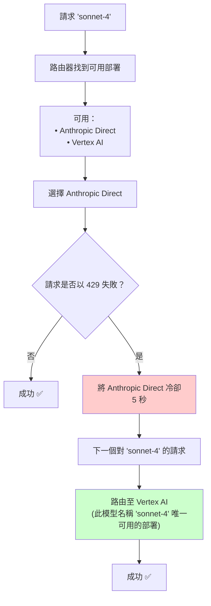

import Image from '@theme/IdealImage';
import Tabs from '@theme/Tabs';
import TabItem from '@theme/TabItem';


# 路由器 - 負載平衡 {#router---load-balancing}

LiteLLM 管理：
- 在多個部署之間進行負載平衡（例如 Azure/OpenAI）
- 優先處理重要請求，確保它們不會失敗（即排隊）
- 基本可靠性邏輯 - 在多個部署/提供者之間的冷卻時間、備援、逾時與重試（固定 + 指數退避）。

在正式環境中，litellm 支援使用 Redis 來追蹤冷卻伺服器與使用量（管理 tpm/rpm 限制）。

:::info

如果您想要一台伺服器在不同 LLM API 之間進行負載平衡，請使用我們的 [LiteLLM Proxy Server](./proxy/load_balancing.md)

:::

## 負載平衡 {#load-balancing}
（感謝 [@paulpierre](https://www.linkedin.com/in/paulpierre/) 與 [sweep proxy](https://docs.sweep.dev/blogs/openai-proxy) 對此實作的貢獻）
[**查看程式碼**](https://github.com/BerriAI/litellm/blob/main/litellm/router.py)

### 快速入門 {#quick-start}

在多個 [azure](./providers/azure)/[bedrock](./providers/bedrock.md)/[提供者](./providers/) 部署之間進行負載平衡。如果呼叫失敗，LiteLLM 會處理在不同區域的重試。

<Tabs>
<TabItem value="sdk" label="SDK">

```python
from litellm import Router

model_list = [{ # list of model deployments 
	"model_name": "{{openai_small}}", # model alias -> loadbalance between models with same `model_name`
	"litellm_params": { # params for litellm completion/embedding call 
		"model": "azure/chatgpt-v-2", # actual model name
		"api_key": os.getenv("AZURE_API_KEY"),
		"api_version": os.getenv("AZURE_API_VERSION"),
		"api_base": os.getenv("AZURE_API_BASE")
	}
}, {
    "model_name": "{{openai_small}}", 
	"litellm_params": { # params for litellm completion/embedding call 
		"model": "azure/chatgpt-functioncalling", 
		"api_key": os.getenv("AZURE_API_KEY"),
		"api_version": os.getenv("AZURE_API_VERSION"),
		"api_base": os.getenv("AZURE_API_BASE")
	}
}, {
    "model_name": "{{openai_small}}", 
	"litellm_params": { # params for litellm completion/embedding call 
		"model": "{{openai_small}}", 
		"api_key": os.getenv("OPENAI_API_KEY"),
	}
}, {
    "model_name": "{{openai_large}}", 
	"litellm_params": { # params for litellm completion/embedding call 
		"model": "azure/{{openai_large}}", 
		"api_key": os.getenv("AZURE_API_KEY"),
		"api_base": os.getenv("AZURE_API_BASE"),
		"api_version": os.getenv("AZURE_API_VERSION"),
	}
}, {
    "model_name": "{{openai_large}}", 
	"litellm_params": { # params for litellm completion/embedding call 
		"model": "{{openai_large}}", 
		"api_key": os.getenv("OPENAI_API_KEY"),
	}
},

]

router = Router(model_list=model_list)

# openai.ChatCompletion.create replacement
# requests with model="{{openai_small}}" will pick a deployment where model_name="{{openai_small}}"
response = await router.acompletion(model="{{openai_small}}", 
				messages=[{"role": "user", "content": "Hey, how's it going?"}])

print(response)

# openai.ChatCompletion.create replacement
# requests with model="{{openai_large}}" will pick a deployment where model_name="{{openai_large}}"
response = await router.acompletion(model="{{openai_large}}", 
				messages=[{"role": "user", "content": "Hey, how's it going?"}])

print(response)
```
</TabItem>
<TabItem value="proxy" label="PROXY">

:::info

請參閱詳細的 proxy 負載平衡/備援文件 [這裡](./proxy/reliability.md)

:::

1. 使用多個部署設定 model_list
```yaml
model_list:
  - model_name: {{openai_small}}
    litellm_params:
      model: azure/<your-deployment-name>
      api_base: <your-azure-endpoint>
      api_key: <your-azure-api-key>
  - model_name: {{openai_small}}
    litellm_params:
      model: azure/gpt-turbo-small-ca
      api_base: https://my-endpoint-canada-berri992.openai.azure.com/
      api_key: <your-azure-api-key>
  - model_name: {{openai_small}}
    litellm_params:
      model: azure/gpt-turbo-large
      api_base: https://openai-france-1234.openai.azure.com/
      api_key: <your-azure-api-key>
```

2. 啟動 proxy 

```bash
litellm --config /path/to/config.yaml 
```

3. 測試它！ 

```bash
curl -X POST 'http://0.0.0.0:4000/chat/completions' \
-H 'Content-Type: application/json' \
-H "Authorization: Bearer $LITELLM_API_KEY" \
-d '{
  "model": "{{openai_small}}",
  "messages": [
        {"role": "user", "content": "Hi there!"}
    ],
    "mock_testing_rate_limit_error": true
}'
```
</TabItem>
</Tabs>

### 可用端點 {#available-endpoints}
- `router.completion()` - 用於呼叫 100+ LLM 的 chat completions 端點
- `router.acompletion()` - 非同步 chat completion 呼叫
- `router.embedding()` - Azure、OpenAI、Huggingface 端點的 embedding 端點
- `router.aembedding()` - 非同步 embeddings 呼叫
- `router.text_completion()` - 舊版 OpenAI `/v1/completions` 端點格式的 completion 呼叫
- `router.atext_completion()` - 非同步文字 completion 呼叫
- `router.image_generation()` - OpenAI `/v1/images/generations` 端點格式的 completion 呼叫
- `router.aimage_generation()` - 非同步圖片生成呼叫

## 進階 - 路由策略 ⭐️ {#advanced---routing-strategies-️}
#### 路由策略 - 加權挑選、速率限制感知、最少忙碌、依延遲、依成本 {#routing-strategies---weighted-pick-rate-limit-aware-least-busy-latency-based-cost-based}

Router 提供多種策略，讓您在多個部署之間路由您的呼叫。**我們建議在正式環境中使用 `simple-shuffle`（預設）以獲得最佳效能。**

<Tabs>
<TabItem value="simple-shuffle" label="(預設) 加權選取 - 推薦">

**預設且推薦用於正式環境** - 以最小的延遲額外負擔提供最佳效能。

根據提供的**每分鐘請求數（rpm）或每分鐘 token 數（tpm）**選取一個部署

如果未提供 `rpm` 或 `tpm`，則會隨機選取一個部署

您也可以設定 `weight` 參數，以指定何時應選取哪個模型。

<Tabs>
<TabItem value="rpm" label="基於 RPM 的隨機排序">

##### **LiteLLM Proxy Config.yaml** {#litellm-proxy-configyaml}

```yaml
model_list:
    - model_name: {{openai_small}}
      litellm_params:
        model: azure/chatgpt-v-2
        api_key: os.environ/AZURE_API_KEY
        api_version: os.environ/AZURE_API_VERSION
        api_base: os.environ/AZURE_API_BASE
        rpm: 900 
    - model_name: {{openai_small}}
      litellm_params:
        model: azure/chatgpt-functioncalling
        api_key: os.environ/AZURE_API_KEY
        api_version: os.environ/AZURE_API_VERSION
        api_base: os.environ/AZURE_API_BASE
        rpm: 10 
```

##### **Python SDK** {#python-sdk}

```python
from litellm import Router 
import asyncio

model_list = [{ # list of model deployments 
	"model_name": "{{openai_small}}", # model alias 
	"litellm_params": { # params for litellm completion/embedding call 
		"model": "azure/chatgpt-v-2", # actual model name
		"api_key": os.getenv("AZURE_API_KEY"),
		"api_version": os.getenv("AZURE_API_VERSION"),
		"api_base": os.getenv("AZURE_API_BASE"),
		"rpm": 900,			# requests per minute for this API
	}
}, {
    "model_name": "{{openai_small}}", 
	"litellm_params": { # params for litellm completion/embedding call 
		"model": "azure/chatgpt-functioncalling", 
		"api_key": os.getenv("AZURE_API_KEY"),
		"api_version": os.getenv("AZURE_API_VERSION"),
		"api_base": os.getenv("AZURE_API_BASE"),
		"rpm": 10,
	}
},]

# init router
router = Router(model_list=model_list, routing_strategy="simple-shuffle")
async def router_acompletion():
	response = await router.acompletion(
		model="{{openai_small}}", 
		messages=[{"role": "user", "content": "Hey, how's it going?"}]
	)
	print(response)
	return response

asyncio.run(router_acompletion())
```

</TabItem>
<TabItem value="weight" label="基於權重的隨機排序">

##### **LiteLLM Proxy Config.yaml** {#litellm-proxy-configyaml-1}

```yaml
model_list:
    - model_name: {{openai_small}}
      litellm_params:
        model: azure/chatgpt-v-2
        api_key: os.environ/AZURE_API_KEY
        api_version: os.environ/AZURE_API_VERSION
        api_base: os.environ/AZURE_API_BASE
        weight: 9
    - model_name: {{openai_small}}
      litellm_params:
        model: azure/chatgpt-functioncalling
        api_key: os.environ/AZURE_API_KEY
        api_version: os.environ/AZURE_API_VERSION
        api_base: os.environ/AZURE_API_BASE
        weight: 1 
```

##### **Python SDK** {#python-sdk-1}

```python
from litellm import Router 
import asyncio

model_list = [{
	"model_name": "{{openai_small}}", # model alias 
	"litellm_params": { 
		"model": "azure/chatgpt-v-2", # actual model name
		"api_key": os.getenv("AZURE_API_KEY"),
		"api_version": os.getenv("AZURE_API_VERSION"),
		"api_base": os.getenv("AZURE_API_BASE"),
		"weight": 9, # pick this 90% of the time
	}
}, {
    "model_name": "{{openai_small}}", 
	"litellm_params": { 
		"model": "azure/chatgpt-functioncalling", 
		"api_key": os.getenv("AZURE_API_KEY"),
		"api_version": os.getenv("AZURE_API_VERSION"),
		"api_base": os.getenv("AZURE_API_BASE"),
		"weight": 1,
	}
}]

# init router
router = Router(model_list=model_list, routing_strategy="simple-shuffle")
async def router_acompletion():
	response = await router.acompletion(
		model="{{openai_small}}", 
		messages=[{"role": "user", "content": "Hey, how's it going?"}]
	)
	print(response)
	return response

asyncio.run(router_acompletion())
```

</TabItem>
</Tabs>

</TabItem>
<TabItem value="usage-based-v2" label="感知速率限制 v2（非同步）">

:::warning

**基於使用量的路由不建議用於正式環境，因為會影響效能。** 在高流量情境下，請使用 `simple-shuffle`（預設）以獲得最佳效能。由於需要透過 Redis 操作追蹤跨部署的使用量，基於使用量的路由會增加顯著延遲。

:::

**🎉 新功能** 這是基於使用量路由的非同步實作。

**若 tpm/rpm 限制超過，則會過濾掉部署** - 如果您傳入部署的 tpm/rpm 限制。

路由到該分鐘中 **TPM 使用量最低的部署**。 

在正式環境中，我們使用 Redis 追蹤多個部署之間的使用量（TPM/RPM）。此實作使用 **非同步 redis 呼叫**（redis.incr 和 redis.mget）。

對於 Azure，[您每 1000 TPM 可獲得 6 RPM](https://stackoverflow.com/questions/77368844/what-is-the-request-per-minute-rate-limit-for-azure-openai-models-for-gpt-3-5-tu)

<Tabs>
<TabItem value="sdk" label="sdk">

```python
from litellm import Router 


model_list = [{ # list of model deployments 
	"model_name": "{{openai_small}}", # model alias 
	"litellm_params": { # params for litellm completion/embedding call 
		"model": "azure/chatgpt-v-2", # actual model name
		"api_key": os.getenv("AZURE_API_KEY"),
		"api_version": os.getenv("AZURE_API_VERSION"),
		"api_base": os.getenv("AZURE_API_BASE"),
		"tpm": 100000,
		"rpm": 10000,
	}, 
}, {
    "model_name": "{{openai_small}}", 
	"litellm_params": { # params for litellm completion/embedding call 
		"model": "azure/chatgpt-functioncalling", 
		"api_key": os.getenv("AZURE_API_KEY"),
		"api_version": os.getenv("AZURE_API_VERSION"),
		"api_base": os.getenv("AZURE_API_BASE"),
		"tpm": 100000,
		"rpm": 1000,
	},
}, {
    "model_name": "{{openai_small}}", 
	"litellm_params": { # params for litellm completion/embedding call 
		"model": "{{openai_small}}", 
		"api_key": os.getenv("OPENAI_API_KEY"),
		"tpm": 100000,
		"rpm": 1000,
	},
}]
router = Router(model_list=model_list, 
                redis_host=os.environ["REDIS_HOST"], 
				redis_password=os.environ["REDIS_PASSWORD"], 
				redis_port=os.environ["REDIS_PORT"], 
                routing_strategy="simple-shuffle", # 👈 RECOMMENDED - best performance
				enable_pre_call_checks=True, # enables router rate limits for concurrent calls
				)

response = await router.acompletion(model="{{openai_small}}", 
				messages=[{"role": "user", "content": "Hey, how's it going?"}])

print(response)
```
</TabItem>
<TabItem value="proxy" label="proxy">

**1. 在設定中設定策略**

```yaml
model_list:
    - model_name: {{openai_small}} # model alias 
      litellm_params: # params for litellm completion/embedding call 
        model: azure/chatgpt-v-2 # actual model name
        api_key: os.environ/AZURE_API_KEY
        api_version: os.environ/AZURE_API_VERSION
        api_base: os.environ/AZURE_API_BASE
      tpm: 100000
      rpm: 10000
    - model_name: {{openai_small}} 
      litellm_params: # params for litellm completion/embedding call 
        model: {{openai_small}} 
        api_key: os.environ/OPENAI_API_KEY
      tpm: 100000
      rpm: 1000

router_settings:
  routing_strategy: simple-shuffle # 👈 RECOMMENDED - best performance
  redis_host: <your-redis-host>
  redis_password: <your-redis-password>
  redis_port: <your-redis-port>
  enable_pre_call_checks: true

general_settings:
  master_key: os.environ/LITELLM_MASTER_KEY
```

**2. 啟動 proxy**

```bash
litellm --config /path/to/config.yaml
```

**3. 測試它！**

```bash
curl --location 'http://localhost:4000/v1/chat/completions' \
--header 'Content-Type: application/json' \
--header "Authorization: Bearer $LITELLM_API_KEY" \
--data '{
    "model": "{{openai_small}}", 
    "messages": [{"role": "user", "content": "Hey, how's it going?"}]
}'
```

</TabItem>
</Tabs>

</TabItem>
<TabItem value="latency-based" label="延遲導向">

選取回應時間最低的部署。

它會根據請求送出與從部署接收的時間，快取並更新各部署的回應時間。

[**如何測試**](https://github.com/BerriAI/litellm/blob/main/tests/local_testing/test_lowest_latency_routing.py)

```python
from litellm import Router 
import asyncio

model_list = [{ ... }]

# init router
router = Router(model_list=model_list,
				routing_strategy="latency-based-routing",# 👈 set routing strategy
				enable_pre_call_checks=True, # enables router rate limits for concurrent calls
				)

## CALL 1+2
tasks = []
response = None
final_response = None
for _ in range(2):
	tasks.append(router.acompletion(model=model, messages=messages))
response = await asyncio.gather(*tasks)

if response is not None:
	## CALL 3 
	await asyncio.sleep(1)  # let the cache update happen
	picked_deployment = router.lowestlatency_logger.get_available_deployments(
		model_group=model, healthy_deployments=router.healthy_deployments
	)
	final_response = await router.acompletion(model=model, messages=messages)
	print(f"min deployment id: {picked_deployment}")
	print(f"model id: {final_response._hidden_params['model_id']}")
	assert (
		final_response._hidden_params["model_id"]
		== picked_deployment["model_info"]["id"]
	)
```

#### 設定時間窗口 {#set-time-window}

設定時間視窗，以決定在平均某個部署的延遲時要回溯多遠。 

**在 Router 中**
```python 
router = Router(..., routing_strategy_args={"ttl": 10})
```

**在 Proxy 中**

```yaml
router_settings:
  routing_strategy_args: {"ttl": 10}
```

#### 設定最低延遲緩衝 {#set-lowest-latency-buffer}

設定一個緩衝區，讓部署成為可用於請求的候選項。 

例如： 

如果您有 5 個部署

```
https://litellm-prod-1.openai.azure.com/: 0.07s
https://litellm-prod-2.openai.azure.com/: 0.1s
https://litellm-prod-3.openai.azure.com/: 0.1s
https://litellm-prod-4.openai.azure.com/: 0.1s
https://litellm-prod-5.openai.azure.com/: 4.66s
```

為了防止一開始就讓 `prod-1` 因所有請求而過載，我們可以將緩衝區設為 50%，以考慮 `prod-2, prod-3, prod-4` 的部署。 

**在 Router 中**
```python 
router = Router(..., routing_strategy_args={"lowest_latency_buffer": 0.5})
```

**在 Proxy 中**

```yaml
router_settings:
  routing_strategy_args: {"lowest_latency_buffer": 0.5}
```

</TabItem>

<TabItem value="usage-based" label="感知速率限制">

這會路由到該分鐘中 TPM 使用量最低的部署。 

在正式環境中，我們使用 Redis 追蹤多個部署之間的使用量（TPM/RPM）。 

如果您傳入部署的 tpm/rpm 限制，這也會進行檢查，並過濾掉任何限制將會被超過的項目。 

對於 Azure，您的 RPM = TPM/6。 

```python
from litellm import Router 


model_list = [{ # list of model deployments 
	"model_name": "{{openai_small}}", # model alias 
	"litellm_params": { # params for litellm completion/embedding call 
		"model": "azure/chatgpt-v-2", # actual model name
		"api_key": os.getenv("AZURE_API_KEY"),
		"api_version": os.getenv("AZURE_API_VERSION"),
		"api_base": os.getenv("AZURE_API_BASE")
	}, 
    "tpm": 100000,
	"rpm": 10000,
}, {
    "model_name": "{{openai_small}}", 
	"litellm_params": { # params for litellm completion/embedding call 
		"model": "azure/chatgpt-functioncalling", 
		"api_key": os.getenv("AZURE_API_KEY"),
		"api_version": os.getenv("AZURE_API_VERSION"),
		"api_base": os.getenv("AZURE_API_BASE")
	},
    "tpm": 100000,
	"rpm": 1000,
}, {
    "model_name": "{{openai_small}}", 
	"litellm_params": { # params for litellm completion/embedding call 
		"model": "{{openai_small}}", 
		"api_key": os.getenv("OPENAI_API_KEY"),
	},
    "tpm": 100000,
	"rpm": 1000,
}]
router = Router(model_list=model_list, 
                redis_host=os.environ["REDIS_HOST"], 
				redis_password=os.environ["REDIS_PASSWORD"], 
				redis_port=os.environ["REDIS_PORT"], 
                routing_strategy="usage-based-routing",
				enable_pre_call_checks=True, # enables router rate limits for concurrent calls
				)

response = await router.acompletion(model="{{openai_small}}", 
				messages=[{"role": "user", "content": "Hey, how's it going?"}])

print(response)
```


</TabItem>
<TabItem value="least-busy" label="最不忙碌">

選取目前處理中最少的請求的部署。

[**如何測試**](https://github.com/BerriAI/litellm/blob/main/tests/local_testing/test_least_busy_routing.py)

```python
from litellm import Router 
import asyncio

model_list = [{ # list of model deployments 
	"model_name": "{{openai_small}}", # model alias 
	"litellm_params": { # params for litellm completion/embedding call 
		"model": "azure/chatgpt-v-2", # actual model name
		"api_key": os.getenv("AZURE_API_KEY"),
		"api_version": os.getenv("AZURE_API_VERSION"),
		"api_base": os.getenv("AZURE_API_BASE"),
	}
}, {
    "model_name": "{{openai_small}}", 
	"litellm_params": { # params for litellm completion/embedding call 
		"model": "azure/chatgpt-functioncalling", 
		"api_key": os.getenv("AZURE_API_KEY"),
		"api_version": os.getenv("AZURE_API_VERSION"),
		"api_base": os.getenv("AZURE_API_BASE"),
	}
}, {
    "model_name": "{{openai_small}}", 
	"litellm_params": { # params for litellm completion/embedding call 
		"model": "{{openai_small}}", 
		"api_key": os.getenv("OPENAI_API_KEY"),
	}
}]

# init router
router = Router(model_list=model_list, routing_strategy="least-busy")
async def router_acompletion():
	response = await router.acompletion(
		model="{{openai_small}}", 
		messages=[{"role": "user", "content": "Hey, how's it going?"}]
	)
	print(response)
	return response

asyncio.run(router_acompletion())
```

</TabItem>

<TabItem value="custom" label="自訂路由策略">

**插入自訂路由策略來選取部署**

步驟 1. 定義您的自訂路由策略

```python

from litellm.router import CustomRoutingStrategyBase
class CustomRoutingStrategy(CustomRoutingStrategyBase):
    async def async_get_available_deployment(
        self,
        model: str,
        messages: Optional[List[Dict[str, str]]] = None,
        input: Optional[Union[str, List]] = None,
        specific_deployment: Optional[bool] = False,
        request_kwargs: Optional[Dict] = None,
    ):
        """
        Asynchronously retrieves the available deployment based on the given parameters.

        Args:
            model (str): The name of the model.
            messages (Optional[List[Dict[str, str]]], optional): The list of messages for a given request. Defaults to None.
            input (Optional[Union[str, List]], optional): The input for a given embedding request. Defaults to None.
            specific_deployment (Optional[bool], optional): Whether to retrieve a specific deployment. Defaults to False.
            request_kwargs (Optional[Dict], optional): Additional request keyword arguments. Defaults to None.

        Returns:
            Returns an element from litellm.router.model_list

        """
        print("In CUSTOM async get available deployment")
        model_list = router.model_list
        print("router model list=", model_list)
        for model in model_list:
            if isinstance(model, dict):
                if model["litellm_params"]["model"] == "openai/very-special-endpoint":
                    return model
        pass

    def get_available_deployment(
        self,
        model: str,
        messages: Optional[List[Dict[str, str]]] = None,
        input: Optional[Union[str, List]] = None,
        specific_deployment: Optional[bool] = False,
        request_kwargs: Optional[Dict] = None,
    ):
        """
        Synchronously retrieves the available deployment based on the given parameters.

        Args:
            model (str): The name of the model.
            messages (Optional[List[Dict[str, str]]], optional): The list of messages for a given request. Defaults to None.
            input (Optional[Union[str, List]], optional): The input for a given embedding request. Defaults to None.
            specific_deployment (Optional[bool], optional): Whether to retrieve a specific deployment. Defaults to False.
            request_kwargs (Optional[Dict], optional): Additional request keyword arguments. Defaults to None.

        Returns:
            Returns an element from litellm.router.model_list

        """
        pass
```

步驟 2. 使用自訂路由策略初始化 Router
```python
from litellm import Router

router = Router(
    model_list=[
        {
            "model_name": "azure-model",
            "litellm_params": {
                "model": "openai/very-special-endpoint",
                "api_base": "https://exampleopenaiendpoint-production.up.railway.app/",  # If you are Krrish, this is OpenAI Endpoint3 on our Railway endpoint :)
                "api_key": "fake-key",
            },
            "model_info": {"id": "very-special-endpoint"},
        },
        {
            "model_name": "azure-model",
            "litellm_params": {
                "model": "openai/fast-endpoint",
                "api_base": "https://exampleopenaiendpoint-production.up.railway.app/",
                "api_key": "fake-key",
            },
            "model_info": {"id": "fast-endpoint"},
        },
    ],
    set_verbose=True,
    debug_level="DEBUG",
    timeout=1,
)  # type: ignore

router.set_custom_routing_strategy(CustomRoutingStrategy()) # 👈 Set your routing strategy here
```

步驟 3. 測試您的路由策略。預期在執行 `router.acompletion` 請求時會呼叫您的自訂路由策略
```python
for _ in range(10):
	response = await router.acompletion(
		model="azure-model", messages=[{"role": "user", "content": "hello"}]
	)
	print(response)
	_picked_model_id = response._hidden_params["model_id"]
	print("picked model=", _picked_model_id)
```


</TabItem>

<TabItem value="lowest-cost" label="最低成本路由（非同步）">

根據最低成本選取一個部署

運作方式：
- 取得所有健康的部署
- 選取所有低於其所提供 `rpm/tpm` 限制的部署
- 對每個部署檢查 [`litellm_model_cost_map`](https://github.com/BerriAI/litellm/blob/main/model_prices_and_context_window.json) 中是否存在 `litellm_param["model"]` 
	- 如果部署不存在於 `litellm_model_cost_map` 中 -> 使用 deployment_cost= `$1`
- 選取成本最低的部署

```python
from litellm import Router 
import asyncio

model_list =  [
	{
		"model_name": "{{openai_small}}",
		"litellm_params": {"model": "{{openai_large}}"},
		"model_info": {"id": "openai-gpt-4o"},
	},
	{
		"model_name": "{{openai_small}}",
		"litellm_params": {"model": "groq/llama3-8b-8192"},
		"model_info": {"id": "groq-llama"},
	},
]

# init router
router = Router(model_list=model_list, routing_strategy="cost-based-routing")
async def router_acompletion():
	response = await router.acompletion(
		model="{{openai_small}}", 
		messages=[{"role": "user", "content": "Hey, how's it going?"}]
	)
	print(response)

	print(response._hidden_params["model_id"]) # expect groq-llama, since groq/llama has lowest cost
	return response

asyncio.run(router_acompletion())

```


#### 使用自訂輸入/輸出定價 {#using-custom-inputoutput-pricing}

設定 `litellm_params["input_cost_per_token"]` 與 `litellm_params["output_cost_per_token"]`，以在路由時使用自訂定價

```python
model_list = [
	{
		"model_name": "{{openai_small}}",
		"litellm_params": {
			"model": "azure/chatgpt-v-2",
			"input_cost_per_token": 0.00003,
			"output_cost_per_token": 0.00003,
		},
		"model_info": {"id": "chatgpt-v-experimental"},
	},
	{
		"model_name": "{{openai_small}}",
		"litellm_params": {
			"model": "azure/chatgpt-v-1",
			"input_cost_per_token": 0.000000001,
			"output_cost_per_token": 0.00000001,
		},
		"model_info": {"id": "chatgpt-v-1"},
	},
	{
		"model_name": "{{openai_small}}",
		"litellm_params": {
			"model": "azure/chatgpt-v-5",
			"input_cost_per_token": 10,
			"output_cost_per_token": 12,
		},
		"model_info": {"id": "chatgpt-v-5"},
	},
]
# init router
router = Router(model_list=model_list, routing_strategy="cost-based-routing")
async def router_acompletion():
	response = await router.acompletion(
		model="{{openai_small}}", 
		messages=[{"role": "user", "content": "Hey, how's it going?"}]
	)
	print(response)

	print(response._hidden_params["model_id"]) # expect chatgpt-v-1, since chatgpt-v-1 has lowest cost
	return response

asyncio.run(router_acompletion())
```

</TabItem>
</Tabs>

## 路由群組 - 每模型策略與可呼叫虛擬模型 {#routing-groups---per-model-strategies-and-callable-virtual-models}

在同一個 router 中，將不同的路由策略套用到不同模型。**路由群組**會將一個 `model_name` 清單繫結到某個策略，以及（可選）策略參數。未被任何群組指定的模型，會回退到 router 的頂層 `routing_strategy`。

群組也可**作為模型被呼叫**：請求 `model: <group_name>`，LiteLLM 會使用該群組的策略，從每個成員的部署聯集之間進行選取。群組名稱會出現在 `/v1/models` 中，因此從閘道（Claude Code 搭配 `CLAUDE_CODE_ENABLE_GATEWAY_MODEL_DISCOVERY=1`、Codex）探索模型的用戶端，會在其選取器中顯示這些名稱。

```bash
curl http://localhost:4000/v1/chat/completions \
  -H "Authorization: Bearer $LITELLM_KEY" \
  -d '{"model": "anthropic-latency", "messages": [{"role": "user", "content": "ping"}]}'
```

存取控制會將群組視為其自己的模型名稱：在金鑰或團隊上授予 `<group_name>`，即可讓其列出並呼叫該群組。成員關係不會向任一方向展開，因此僅被授予群組的金鑰無法直接呼叫成員，而被授予成員的金鑰無法呼叫群組。群組名稱不得與現有的 `model_name` 或 `model_group_alias` 衝突；設定載入會拒絕它。請求會在支出記錄中保留群組名稱作為 `model_group`，而每一列都會記錄實際提供該請求的成員部署。備援與 `model_group_retry_policy` 都以名稱為鍵，因此若您需要，請為群組提供自己的項目。Claude Code 和 Claude Desktop 只會自動探索名稱中包含 `claude` 或 `anthropic` 的閘道模型，因此若您希望它們在選擇器中顯示，請將群組命名為 `claude-quality` 之類的名稱，而不必手動設定 `ANTHROPIC_CUSTOM_MODEL_OPTION`。

:::tip
您也可以從儀表板建立、編輯和刪除路由群組。請參閱 [透過 UI 管理路由群組](./proxy/ui/routing_groups.md)。
:::

**何時使用此功能：** 您想要為 `{{openai_large}}` 使用基於延遲的路由，但為了較便宜的模型使用單純的加權選取，而不必再啟動第二個路由器。

#### 規則 {#rules}

- 每個 `model_name` 最多只能屬於**一個**群組。重疊會在初始化時引發 `ValueError`。
- 不屬於任何群組的模型會使用頂層的 `routing_strategy` / `routing_strategy_args`（一個隱含的 `"default"` 群組）。名稱 `"default"` 已保留。
- 每個群組都可以覆寫 `routing_strategy_args`（例如延遲視窗 TTL、TPM 上限）。
- 群組會根據 pre-routing hook 之後的 `model` 名稱逐一請求解析。

<Tabs>
<TabItem value="config-yaml" label="LiteLLM Proxy Config.yaml">

```yaml
model_list:
  - model_name: {{openai_large}}
    litellm_params:
      model: openai/{{openai_large}}
      api_key: os.environ/OPENAI_API_KEY
  - model_name: {{openai_large}}
    litellm_params:
      model: azure/{{openai_large}}
      api_base: os.environ/AZURE_API_BASE
      api_key: os.environ/AZURE_API_KEY
      api_version: "2024-08-01-preview"
  - model_name: cheap-model
    litellm_params:
      model: openai/{{openai_small}}
      api_key: os.environ/OPENAI_API_KEY

router_settings:
  # fallback strategy for models not in any explicit group
  routing_strategy: simple-shuffle

  routing_groups:
    - group_name: latency-sensitive
      models: [{{openai_large}}]
      routing_strategy: latency-based-routing
      routing_strategy_args:
        ttl: 3600
```

行為：
- `{{openai_large}}` → 針對 OpenAI + Azure 部署的基於延遲路由。
- `cheap-model` → 單純隨機洗牌（預設群組）。

</TabItem>
<TabItem value="sdk" label="Python SDK">

```python
from litellm import Router

router = Router(
    model_list=[
        {"model_name": "{{openai_large}}", "litellm_params": {"model": "openai/{{openai_large}}"}},
        {"model_name": "{{openai_large}}", "litellm_params": {"model": "azure/{{openai_large}}", "api_base": "...", "api_key": "..."}},
        {"model_name": "cheap-model", "litellm_params": {"model": "openai/{{openai_small}}"}},
    ],
    routing_strategy="simple-shuffle",  # fallback for ungrouped models
    routing_groups=[
        {
            "group_name": "latency-sensitive",
            "models": ["{{openai_large}}"],
            "routing_strategy": "latency-based-routing",
            "routing_strategy_args": {"ttl": 3600},
        },
    ],
)
```

</TabItem>
</Tabs>

#### 多個群組 {#multiple-groups}

兩個群組可以使用相同策略但不同引數；每個都會取得獨立的狀態執行個體。

```yaml
router_settings:
  routing_strategy: simple-shuffle
  routing_groups:
    - group_name: hot-path
      models: [{{openai_large}}, claude-sonnet]
      routing_strategy: latency-based-routing
      routing_strategy_args:
        ttl: 60          # short window — react quickly to latency changes
    - group_name: batch
      models: [{{openai_small}}, llama-70b]
      routing_strategy: usage-based-routing-v2
      routing_strategy_args:
        rpm: 10000
```

#### 執行時更新 {#updating-at-runtime}

路由群組可以透過 `Router.update_settings(routing_groups=[...])` 或 proxy 的 `/config/update` 端點更新。更新時會重建每個群組的狀態。

## 工作階段親和性（黏著式工作階段） {#session-affinity-sticky-sessions}

將對話的每個請求都固定到最初服務該對話的部署。工作階段親和性是路由器的 pre-call 檢查：它會在路由策略選擇部署之前執行，並將候選項縮小為已固定的那個，因此它可與本頁上的每一種策略（`simple-shuffle`、`least-busy`、`usage-based-routing-v2`、`latency-based-routing`、`cost-based-routing`）以及路由群組一起使用。

當模型群組後方的部署不共用狀態時請使用它，例如提供者端的提示快取，或當對話必須停留在同一個區域時。

<Tabs>
<TabItem value="proxy" label="Proxy">

```yaml showLineNumbers title="config.yaml"
model_list:
  - model_name: {{openai_large}}
    litellm_params:
      model: azure/{{openai_large}}
      api_key: os.environ/AZURE_API_KEY_EASTUS
      api_base: https://eastus.openai.azure.com
  - model_name: {{openai_large}}
    litellm_params:
      model: azure/{{openai_large}}
      api_key: os.environ/AZURE_API_KEY_WESTUS
      api_base: https://westus.openai.azure.com

router_settings:
  routing_strategy: simple-shuffle          # any strategy
  optional_pre_call_checks: ["session_affinity"]
  deployment_affinity_ttl_seconds: 3600     # optional, default 3600
```

對話的每個請求都送出同一個工作階段 ID。proxy 會從 `x-litellm-session-id` 標頭讀取它（`x-litellm-trace-id` 可互換使用），或從任何 `x-<vendor>-session-id` 標頭（例如 `x-claude-code-session-id`）讀取，或從請求本文中的 `metadata.session_id` 讀取。

```bash
curl http://0.0.0.0:4000/v1/chat/completions \
  -H "Authorization: Bearer $LITELLM_API_KEY" \
  -H "Content-Type: application/json" \
  -H "x-litellm-session-id: 7f1c2d1e-2b5a-4a5e-9c1f-0d5a9a3f8b21" \
  -d '{"model": "{{openai_large}}", "messages": [{"role": "user", "content": "hi"}]}'
```

`x-litellm-model-id` 回應標頭會顯示哪個部署服務了該請求。只要攜帶相同的工作階段 ID，每個請求都會保持一致。

</TabItem>
<TabItem value="sdk" label="SDK">

```python showLineNumbers
from litellm import Router

router = Router(
    model_list=[
        {
            "model_name": "{{openai_large}}",
            "litellm_params": {"model": "azure/{{openai_large}}", "api_key": "...", "api_base": "https://eastus.openai.azure.com"},
        },
        {
            "model_name": "{{openai_large}}",
            "litellm_params": {"model": "azure/{{openai_large}}", "api_key": "...", "api_base": "https://westus.openai.azure.com"},
        },
    ],
    routing_strategy="simple-shuffle",                 # any strategy
    optional_pre_call_checks=["session_affinity"],
    deployment_affinity_ttl_seconds=3600,              # optional, default 3600
)

response = await router.acompletion(
    model="{{openai_large}}",
    messages=[{"role": "user", "content": "hi"}],
    metadata={"session_id": "7f1c2d1e-2b5a-4a5e-9c1f-0d5a9a3f8b21"},
)
print(response._hidden_params["model_id"])  # same deployment for every call with this session_id
```

</TabItem>
</Tabs>

#### 運作方式 {#how-it-works}

- 帶有新工作階段 ID 的第一個請求會一如往常由策略路由。其落到的部署會成為該模型群組與工作階段 ID 的固定目標（在 proxy 上，這個固定目標也以呼叫端為範圍：虛擬金鑰，或在 JWT 驗證下的已驗證使用者 ID）。
- 之後所有帶有相同工作階段 ID 的請求，在策略執行前都會縮小為已固定的部署。
- 每個請求都會重新整理固定，因此 `deployment_affinity_ttl_seconds` 限制的是回合之間的閒置時間，而不是對話長度。
- 固定目標保存在路由器快取中。若已設定 Redis，會在各 proxy 執行個體之間共用；若未設定 Redis，每個執行個體都會保有自己的固定目標。
- 如果固定的部署處於冷卻期或已不再屬於模型群組，請求會在其餘健康部署之間回退到路由策略。固定目標會保留，因此一旦該部署再次健康，工作階段就會回到它。於 v1.97.0 之前的版本中，工作階段會重新固定到策略所選擇的部署。
- 負載平衡是跨工作階段而非跨請求進行：每個工作階段在 सक्रिय 狀態期間都會使用同一個部署。

#### 設定 {#settings}

| 設定 | 說明 |
|---|---|
| `optional_pre_call_checks` | 加入 `session_affinity` 以依工作階段 ID 固定。加入 `deployment_affinity` 以依呼叫端固定，取代或同時作為工作階段 ID 固定（工作階段固定具有優先權）。在 proxy 上，呼叫端是虛擬金鑰；若請求未攜帶金鑰（JWT 驗證），則是已驗證的使用者 ID。`responses_api_deployment_check` 和 `encrypted_content_affinity` 已在 [Responses API 工作階段延續性](./response_api.md#load-balancing-with-session-continuity) 中涵蓋。 |
| `deployment_affinity_ttl_seconds` | 固定的閒置 TTL，以秒為單位。預設 `3600`。 |
| `model_group_affinity_config` | 只對部分模型群組啟用親和性，例如 `{"gpt-4.1": ["session_affinity"]}`。未列出的群組會使用全域 `optional_pre_call_checks`。 |

`deployment_affinity_ttl_seconds` 和 `model_group_affinity_config` 會在啟動時讀取：請將它們設定在 `config.yaml`（或 `Router()`）中，然後重新啟動 proxy。只要不在 `config.yaml` 中設定該鍵（那裡的值會生效，而傳送不同的值會回傳 400），`optional_pre_call_checks` 也可以在執行中的 proxy 上透過 `POST /config/update`，以及內容為 `{"router_settings": {"optional_pre_call_checks": [...]}}` 的請求主體進行變更。此呼叫需要管理員金鑰、資料庫，以及 `STORE_MODEL_IN_DB=True`。該清單會取代前一個清單並儲存在資料庫中，因此輪詢資料庫的每個執行個體都會套用它。新清單中的名稱會立即啟用。被省略的名稱會立即對 `prompt_caching`、`enforce_model_rate_limits` 和 `encrypted_content_affinity` 停用（最後一項自 v1.104.0 起），而 `session_affinity`、`deployment_affinity`、`responses_api_deployment_check` 和 `router_budget_limiting` 則會保持啟用直到重新啟動。`GET /router/settings` 會顯示儲存的清單，以及與資料庫合併後的設定檔

:::info
[Auto Router](./proxy/auto_routing.md) 頁面上 `complexity_router_config` 中的 `session_affinity` 選項是不同的設定。它會為某個工作階段固定 auto router 的模型選擇；本頁上的 pre-call 檢查則會在模型群組內固定一個部署。
:::

## 流量鏡像 / 靜默實驗 {#traffic-mirroring--silent-experiments}

流量鏡像可讓您將正式流量「模擬」到次要（靜默）模型，以進行評估。靜默模型的回應會在背景中擷取，且不會影響主要請求的延遲或結果。

[**請在此參閱 A/B Testing - Traffic Mirroring 詳細指南**](./traffic_mirroring.md)

## 基本可靠性 {#basic-reliability}

### 部署順序（優先順序） {#deployment-ordering-priority}

在 `litellm_params` 中設定 `order` 以優先排序部署。數值越低 = 優先順序越高。當多個部署共用相同的 `order` 時，路由策略會在它們之間進行選擇。

當對 `order=1` 部署的請求失敗（連線錯誤、404、429 等）時，路由器會自動先嘗試 `order=2` 部署，接著嘗試 `order=3`，依此類推。每個順序層級在升級到下一層之前都有自己的一組重試。如果所有順序層級都耗盡，路由器就會回退到任何已設定的備援。

<Tabs>
<TabItem value="sdk" label="SDK">

```python
from litellm import Router

model_list = [
    {
        "model_name": "{{openai_large}}",
        "litellm_params": {
            "model": "azure/gpt-4-primary",
            "api_key": os.getenv("AZURE_API_KEY"),
            "order": 1,  # 👈 Highest priority
        },
    },
    {
        "model_name": "{{openai_large}}",
        "litellm_params": {
            "model": "azure/gpt-4-fallback",
            "api_key": os.getenv("AZURE_API_KEY_2"),
            "order": 2,  # 👈 Tried when order=1 fails
        },
    },
]

router = Router(model_list=model_list)
```

</TabItem>
<TabItem value="proxy" label="PROXY">

```yaml
model_list:
  - model_name: {{openai_large}}
    litellm_params:
      model: azure/gpt-4-primary
      api_key: os.environ/AZURE_API_KEY
      order: 1  # 👈 Highest priority

  - model_name: {{openai_large}}
    litellm_params:
      model: azure/gpt-4-fallback
      api_key: os.environ/AZURE_API_KEY_2
      order: 2  # 👈 Tried when order=1 fails
```

</TabItem>
</Tabs>

### 加權部署 {#weighted-deployments}

在部署上設定 `weight`，即可比其他部署更常選到某個部署。 

這可跨 **simple-shuffle** 路由策略運作（這是預設值，若未選取任何路由策略）。 

<Tabs>
<TabItem value="sdk" label="SDK">

```python
from litellm import Router 

model_list = [
	{
		"model_name": "{{openai_small}}",
		"litellm_params": {
			"model": "{{openai_small}}", 
			"api_key": os.getenv("OPENAI_API_KEY"), 
			"weight": 1
		},
	},
	{
		"model_name": "{{openai_small}}",
		"litellm_params": {
			"model": "{{openai_small}}", 
			"api_key": os.getenv("OPENAI_API_KEY"), 
			"weight": 2 # 👈 PICK THIS DEPLOYMENT 2x MORE OFTEN THAN THE ONE ABOVE
		},
	},
]

router = Router(model_list=model_list, routing_strategy="cost-based-routing")

response = await router.acompletion(
	model="{{openai_small}}", 
	messages=[{"role": "user", "content": "Hey, how's it going?"}]
)
print(response)
```
</TabItem>
<TabItem value="proxy" label="PROXY">

```yaml
model_list:
  - model_name: {{openai_small}}
    litellm_params:
      model: {{openai_small}}
      api_key: os.environ/OPENAI_API_KEY
      weight: 1
  - model_name: {{openai_small}}
    litellm_params:
      model: {{openai_small}}
      api_key: os.environ/OPENAI_API_KEY
      weight: 2 # 👈 PICK THIS DEPLOYMENT 2x MORE OFTEN THAN THE ONE ABOVE
```

</TabItem>
</Tabs>

### 加權備援 {#weighted-failover}

預設情況下，當模型群組中的某個部署失敗時，路由器會移到 `fallbacks` 中的下一個項目（不同的模型群組）。使用 `enable_weighted_failover` 時，路由器會先在**同一個模型群組內**重試，使用既有權重重新挑選不同的部署，只有在該群組中的每個部署都嘗試過之後，才會升級到跨群組備援。

當您有同一個模型的多個區域副本（例如 Azure `eastus2` + `swedencentral`）時，這很有用；可讓故障區域切換到具有相同 `model_name` 的健康同儕，而不是立即切換到不同模型。

**行為**

- 只有在 `routing_strategy="simple-shuffle"`（預設值）時才會啟用。
- 在可重試失敗時，會排除失敗的部署 ID，並從同一模型群組中剩餘的同儕重新挑選新的部署，遵循 `weight` / `rpm` / `tpm`。
- 排除會在多次跳轉間累積：每次重試都會將前一次失敗加入排除集合，因此剛失敗的部署在同一請求鏈中不會再被選到。
- 上限為 `max_fallbacks`（預設 `5`）。
- 不會對 `ContextWindowExceededError` 或 `ContentPolicyViolationError` 觸發，這些仍保有各自專用的備援路徑。
- 僅限非同步：由 `router.acompletion()` 和其他非同步進入點遵循。同步的 `router.completion()` 路徑會直接落入一般備援。
- 冷卻仍然適用：跨過 `allowed_fails` 的部署會與加權故障轉移分開冷卻。

**順序與權重**

如果同一群組也使用 `order`，順序篩選會在加權挑選**之前**執行。因此，加權故障轉移只會在目前最低順序層級中的部署之間重新挑選。晉升到下一個順序層級會透過既有的基於順序的備援路徑發生。

**設定**

<Tabs>
<TabItem value="sdk" label="SDK">

```python
from litellm import Router

model_list = [
    {
        "model_name": "{{openai_small}}",
        "litellm_params": {
            "model": "azure/{{openai_small}}",
            "api_base": "https://eastus2.example.azure.com",
            "api_key": os.getenv("AZURE_EASTUS2_KEY"),
            "weight": 1,
        },
    },
    {
        "model_name": "{{openai_small}}",
        "litellm_params": {
            "model": "azure/{{openai_small}}",
            "api_base": "https://swedencentral.example.azure.com",
            "api_key": os.getenv("AZURE_SWEDEN_KEY"),
            "weight": 1,
        },
    },
]

router = Router(
    model_list=model_list,
    routing_strategy="simple-shuffle",
    enable_weighted_failover=True,  # 👈 retry within the same model group on failure
)

response = await router.acompletion(
    model="{{openai_small}}",
    messages=[{"role": "user", "content": "Hey"}],
)
```

</TabItem>
<TabItem value="proxy" label="PROXY">

```yaml
model_list:
  - model_name: {{openai_small}}
    litellm_params:
      model: azure/{{openai_small}}
      api_base: https://eastus2.example.azure.com
      api_key: os.environ/AZURE_EASTUS2_KEY
      weight: 1
  - model_name: {{openai_small}}
    litellm_params:
      model: azure/{{openai_small}}
      api_base: https://swedencentral.example.azure.com
      api_key: os.environ/AZURE_SWEDEN_KEY
      weight: 1

router_settings:
  routing_strategy: simple-shuffle
  enable_weighted_failover: true  # 👈 retry within the same model group on failure
```

</TabItem>
</Tabs>

**操作流程**

使用上方設定並對 `{{openai_small}}` 發出請求時：

1. `simple-shuffle` 會使用 `weight` 從兩個部署中選出一個。
2. 如果選中的部署拋出提供者錯誤（例如 `RateLimitError`、`InternalServerError`），其部署 ID 會加入 `metadata._failover_excluded_ids`。
3. 路由器會以排除失敗部署的方式重新進入 `simple-shuffle`，並對剩餘項目重新正規化權重。
4. 以上步驟 2–3 會重複，直到某個部署成功、每個同儕都已被排除，或達到 `max_fallbacks` 為止。
5. 只有在所有同儕都耗盡後，路由器才會落入為該群組設定的任何 `fallbacks`。

請參閱路由器設定參考中的 [`enable_weighted_failover`](./proxy/config_settings#router_settings---reference) 以了解此旗標。

### 最大平行請求（ASYNC） {#max-parallel-requests-async}

限制對某個部署同時進行的最大呼叫數。適合高流量情境。 

如果已設定 tpm/rpm，且未提供最大平行請求限制，我們會使用 RPM 或計算出的 RPM 作為最大平行請求限制。優先順序為 `max_parallel_requests`，接著是 `rpm`，再來是 `int(tpm / 1000 * 6)`（每 1000 TPM 六個並行請求，最少 1 個），最後才是路由器的 `default_max_parallel_requests`。這表示只設定 `rpm: 2` 的部署，無論其提供者為何，都會有每程序 2 個請求的並行上限。此上限以程序為計算單位，因此是每個 proxy worker 各自計算，且不會在 workers 或 pods 之間共享。

當有請求在該部署的所有槽位都已被使用時到達，會立即以 429 失敗，回應主體會指出該部署及其 `max_parallel_requests`。沒有等待佇列，也沒有任何可以設定的等待佇列：請求不會在 proxy 中等待槽位，它們不是執行就是得到 429。429 會在任何提供者呼叫之前拋出，因此不會計入該部署的冷卻。路由器自己的重試與備援會將它視為其他 429 一樣處理，因此具有第二個部署的模型群組會切換備援到它，而單一部署會重試 `num_retries` 次，之後呼叫端才會看到錯誤。若呼叫端應立即看到拒絕，請設定 `num_retries: 0`。

早期版本是排隊而不是拒絕：超過上限的請求會等待，直到有槽位釋出，因此設定了 `rpm` 或 `tpm` 的部署可能會以 200 和很長的延遲悄悄將流量序列化，而不是返回 429。如果您依賴這種行為，請提高 `max_parallel_requests`（或其衍生自的 `rpm`/`tpm`），或在呼叫端處理 429。

```python
from litellm import Router 

model_list = [{
	"model_name": "{{openai_large}}",
	"litellm_params": {
		"model": "azure/{{openai_large}}",
		# ...
		"max_parallel_requests": 10 # 👈 SET PER DEPLOYMENT
	}
}]

### OR ### 

router = Router(model_list=model_list, default_max_parallel_requests=20) # 👈 SET DEFAULT MAX PARALLEL REQUESTS 


# deployment max parallel requests > default max parallel requests
```

在 proxy 上，於 `litellm_params` 下為每個部署設定 `max_parallel_requests`，並在 `router_settings` 下設定預設值：

```yaml
model_list:
  - model_name: {{openai_large}}
    litellm_params:
      model: openai/{{openai_large}}
      api_key: os.environ/OPENAI_API_KEY
      rpm: 2 # derives max_parallel_requests=2

router_settings:
  num_retries: 0 # optional, surfaces the 429 to the caller instead of retrying it
  default_max_parallel_requests: 20 # applies to deployments with no max_parallel_requests, rpm or tpm of their own
```

使用上方設定，同時送出四個請求到 `{{openai_large}}` 時，會得到兩個 200 和兩個立即的 429：

```json
{"error":{"message":"litellm.RateLimitError: Deployment has all max_parallel_requests slots in use. Deployment model_group={{openai_large}}, id=... already has max_parallel_requests=2 requests in flight. Raise max_parallel_requests (or the rpm/tpm it is derived from) for this deployment. Received Model Group={{openai_large}}\nAvailable Model Group Fallbacks=None","type":"throttling_error","param":null,"code":"429"}}
```

[**查看程式碼**](https://github.com/BerriAI/litellm/blob/a978f2d8813c04dad34802cb95e0a0e35a3324bc/litellm/utils.py#L5605)

### 冷卻期 {#cooldowns}

設定模型在一分鐘內允許失敗的呼叫次數上限，之後會被冷卻一分鐘。 

<Tabs>
<TabItem value="sdk" label="SDK">

```python
from litellm import Router

model_list = [{...}]

router = Router(model_list=model_list, 
                allowed_fails=1,      # cooldown model if it fails > 1 call in a minute. 
				cooldown_time=100    # cooldown the deployment for 100 seconds if it num_fails > allowed_fails
		)

user_message = "Hello, whats the weather in San Francisco??"
messages = [{"content": user_message, "role": "user"}]

# normal call 
response = router.completion(model="{{openai_small}}", messages=messages)

print(f"response: {response}")
```

</TabItem>
<TabItem value="proxy" label="PROXY">

**設定全域值**

```yaml
router_settings:
  allowed_fails: 3 # cooldown model if it fails > 1 call in a minute. 
  cooldown_time: 30 # (in seconds) how long to cooldown model if fails/min > allowed_fails
```

預設值：
- allowed_fails: 3
- cooldown_time: 5s（constants.py 中的 `DEFAULT_COOLDOWN_TIME_SECONDS`）

**設定單一模型**

`allowed_fails` 和 `cooldown_time` 也可以設定在單一部署上，而不是整個路由器上。部署層級的值只會覆寫該部署的路由器層級值，因此不穩定的第三方端點可以比您其餘的叢集有更短的保險絲，而不影響其他部署。

```yaml
model_list:
- model_name: fake-openai-endpoint
  litellm_params:
    model: predibase/llama-3-8b-instruct
    api_key: os.environ/PREDIBASE_API_KEY
    tenant_id: os.environ/PREDIBASE_TENANT_ID
    max_new_tokens: 256
  model_info:
    allowed_fails: 1 # cool this deployment down after 1 fail, instead of the router default
    cooldown_time: 0 # disable cooldowns for this deployment
```

`allowed_fails` 必須設定在 `model_info` 下，而不是 `litellm_params`：與 `model_info` 不同，`litellm_params` 會被複製到實際送給 LLM 提供者的請求中，因此放在那裡的僅限路由器設定會外洩到該請求中。`cooldown_time` 可以設定在任一位置下（若兩者都設定，`model_info` 具有優先權），這與其在路由器主要失敗路徑上的既有行為一致。

</TabItem>
</Tabs>

**預期回應**

```
No deployments available for selected model, Try again in 60 seconds. Passed model={{anthropic}}. pre-call-checks=False, allowed_model_region=n/a.
```

#### **停用冷卻期** {#disable-cooldowns}

<Tabs>
<TabItem value="sdk" label="SDK">

```python
from litellm import Router 


router = Router(..., disable_cooldowns=True)
```
</TabItem>
<TabItem value="proxy" label="PROXY">

```yaml
router_settings:
  disable_cooldowns: True
```

</TabItem>
</Tabs>

### 冷卻期如何運作 {#how-cooldowns-work}

冷卻適用於個別部署，而非整個模型群組。路由器會將失敗隔離到特定部署，同時保留可用的健康替代方案。

#### 什麼是 deployment？ {#what-is-a-deployment}

部署是您 `config.yaml` 模型清單中的單一項目。每個部署代表一個具有自身 `litellm_params` 的唯一設定。 

LiteLLM 會透過對所有 `litellm_params` 建立決定性雜湊，為每個部署產生唯一的 `model_id`。這讓路由器能夠獨立追蹤與管理每個部署。

**範例：相同模型的多個部署**

```yaml showLineNumbers title="Load Balancing config.yaml"
model_list:
  - model_name: sonnet-4              # Deployment 1
    litellm_params:
      model: anthropic/{{anthropic}}
      api_key: <our-real-key>
      
  - model_name: byok-sonnet-4         # Deployment 2  
    litellm_params:
      model: anthropic/{{anthropic}}
      api_key: <customer-managed-key>
      api_base: https://proxy.litellm.ai/api.anthropic.com
      
  - model_name: sonnet-4              # Deployment 3
    litellm_params:
      model: vertex_ai/{{anthropic}}
      vertex_project: my-project
```

每個部署都會取得唯一的 `model_id`（例如 `1234567890`、`9129922`、`4982929292`），路由器會使用它來追蹤健康狀態與冷卻狀態。

#### 部署何時進入冷卻期？ {#when-are-deployments-cooled-down}

路由器會根據下列條件自動將部署冷卻：

| 條件 | 觸發 | 冷卻持續時間 |
|-----------|---------|-------------------|
| **速率限制（429）** | 收到 429 回應時立即觸發 | 5 秒（預設） |
| **高失敗率** | 目前這一分鐘內失敗率 >50% | 5 秒（預設） |
| **不可重試錯誤** | 401（驗證）、404（找不到）、408（逾時） | 5 秒（預設） |

在冷卻期間，特定部署會暫時從可用池中移除，而其他健康的部署會繼續提供請求服務。

#### 冷卻期復原 {#cooldown-recovery}

部署會在冷卻期間結束後自動從冷卻中恢復。路由器會：

1. **監控每個部署的冷卻計時器**
2. 冷卻結束時**自動重新啟用**部署  
3. **逐步重新導入**已冷卻的部署到輪替中
4. 一旦部署再次健康，便**重設失敗計數器**

#### 實際範例 {#real-world-example}

考慮這個包含多個提供者的高可用性設定：

```yaml showLineNumbers title="Load Balancing config.yaml"
model_list:
  - model_name: sonnet-4              # Primary: Anthropic Direct
    litellm_params:
      model: anthropic/{{anthropic}}
      api_key: <anthropic-key>
      
  - model_name: byok-sonnet-4         # BYOK: Customer-managed keys
    litellm_params:
      model: anthropic/{{anthropic}}
      api_key: <customer-managed-key>
      api_base: https://proxy.litellm.ai/api.anthropic.com
      
  - model_name: sonnet-4              # Fallback: Vertex AI
    litellm_params:
      model: vertex_ai/{{anthropic}}
      vertex_project: my-project
```

**失敗情境：**

```mermaid
flowchart TD
    A["請求 'sonnet-4'"] --> B["路由器找到可用部署"]
    B --> C["可用：<br/>• Anthropic Direct<br/>• Vertex AI"]
    C --> D["選擇 Anthropic Direct"]
    D --> E{"請求是否以 429 失敗？"}
    E -->|否| F["成功 ✅"]
    E -->|是| G["將 Anthropic Direct 冷卻<br/>5 秒"]
    G --> H["下一個對 'sonnet-4' 的請求"]
    H --> I["路由至 Vertex AI<br/>(此模型名稱 'sonnet-4' 唯一可用的部署)"]
    I --> J["成功 ✅"]
    
    style G fill:#ffcccc
    style I fill:#ccffcc
```

### 重試 {#retries}

對於 async + sync 函式，我們都支援重試失敗的請求。 

對於 RateLimitError，我們會實作指數退避

對於一般錯誤，我們會立即重試

以下快速看看我們如何設定 `num_retries = 3`： 

```python 
from litellm import Router

model_list = [{...}]

router = Router(model_list=model_list,  
                num_retries=3)

user_message = "Hello, whats the weather in San Francisco??"
messages = [{"content": user_message, "role": "user"}]

# normal call 
response = router.completion(model="{{openai_small}}", messages=messages)

print(f"response: {response}")
```

我們也支援在重試失敗請求前設定最短等待時間。這是透過 `retry_after` 參數來完成。 

```python 
from litellm import Router

model_list = [{...}]

router = Router(model_list=model_list,  
                num_retries=3, retry_after=5) # waits min 5s before retrying request

user_message = "Hello, whats the weather in San Francisco??"
messages = [{"content": user_message, "role": "user"}]

# normal call 
response = router.completion(model="{{openai_small}}", messages=messages)

print(f"response: {response}")
```

#### `num_retries` 可以在哪裡設定，以及哪一個會生效 {#where-num_retries-can-be-set-and-which-one-wins}

`num_retries` 可能來自四個地方。它們的優先順序如下，最高者優先：

1. `x-litellm-num-retries` 請求標頭（僅限 proxy）
2. 請求本文中的 `num_retries`
3. 部署的 `litellm_params` 中的 `num_retries`，位於 `model_list`
4. `litellm_settings` 中的 `num_retries`（全路由器預設值）

因此，呼叫端始終可以針對單一請求提高或降低重試次數，包含將其設為 `0` 以
停用重試，無論部署或全域設定如何。只要請求未帶入值，部署值就會生效，
且其優先於全域預設值。

`num_retries` 與 `max_retries` 並不是同一個設定。`num_retries` 是 LiteLLM 自己的重試迴圈，而
`max_retries` 是提供者 SDK 的內部重試次數。對於經過路由器的呼叫，
LiteLLM 負責重試，並將提供者用戶端固定為 `max_retries: 0`，因此請求本文或 `litellm_params` 中的 `max_retries`
對 proxy 請求沒有影響。這是刻意如此：如此才能避免部署 `num_retries: N` 被套用兩次，並把一次請求變成
`(1 + N) ** 2` 次上游呼叫。使用 `num_retries` 來控制一個請求可獲得多少次嘗試。

### [進階]：自訂重試、依錯誤類型設定的冷卻期 {#advanced-custom-retries-cooldowns-based-on-error-type}

- 如果您想根據所收到的 Exception 設定 `num_retries`，請使用 `RetryPolicy`
- 使用 `AllowedFailsPolicy` 來在冷卻部署前設定自訂的每分鐘 `allowed_fails` 數量

`RetryPolicy` 每種錯誤類型都有一個欄位（`AuthenticationErrorRetries`、`TimeoutErrorRetries`、`RateLimitErrorRetries`、`ContentPolicyViolationErrorRetries`、`BadRequestErrorRetries`、`NotFoundErrorRetries`、`InternalServerErrorRetries`、`ServiceUnavailableErrorRetries`），另外還有 `DefaultRetries`，適用於上述都未涵蓋的每種錯誤。最具體的欄位優先生效：`NotFoundErrorRetries` 會管理任何 404 回應，不論提供者錯誤內容對應到哪個 exception 類別，`BadRequestErrorRetries` 接著涵蓋提供者回報為無效請求的 4xx，而 `DefaultRetries` 最後套用。未設定的欄位會交由下一個欄位處理，因此只設定 `DefaultRetries` 的政策也會重試 404；請設定 `NotFoundErrorRetries: 0` 以略過它們。

[**查看所有 Exception 類型**](https://github.com/BerriAI/litellm/blob/ccda616f2f881375d4e8586c76fe4662909a7d22/litellm/types/router.py#L436)

<Tabs>
<TabItem value="sdk" label="SDK">

範例：

```python
retry_policy = RetryPolicy(
    ContentPolicyViolationErrorRetries=3, 		  # run 3 retries for ContentPolicyViolationErrors
    AuthenticationErrorRetries=0,         		  # run 0 retries for AuthenticationErrorRetries
    NotFoundErrorRetries=0,               		  # never retry a 404 (a deleted response id, an unknown deployment name)
    DefaultRetries=2,                     		  # run 2 retries for every error with no field of its own
)

allowed_fails_policy = AllowedFailsPolicy(
	ContentPolicyViolationErrorAllowedFails=1000, # Allow 1000 ContentPolicyViolationError before cooling down a deployment
	RateLimitErrorAllowedFails=100,               # Allow 100 RateLimitErrors before cooling down a deployment
)
```

使用範例

```python
from litellm.router import RetryPolicy, AllowedFailsPolicy

retry_policy = RetryPolicy(
	ContentPolicyViolationErrorRetries=3,         # run 3 retries for ContentPolicyViolationErrors
	AuthenticationErrorRetries=0,		          # run 0 retries for AuthenticationErrorRetries
	BadRequestErrorRetries=1,
	TimeoutErrorRetries=2,
	RateLimitErrorRetries=3,
	NotFoundErrorRetries=0,
	ServiceUnavailableErrorRetries=2,
	DefaultRetries=1,
)

allowed_fails_policy = AllowedFailsPolicy(
	ContentPolicyViolationErrorAllowedFails=1000, # Allow 1000 ContentPolicyViolationError before cooling down a deployment
	RateLimitErrorAllowedFails=100,               # Allow 100 RateLimitErrors before cooling down a deployment
)

router = litellm.Router(
	model_list=[
		{
			"model_name": "{{openai_small}}",  # openai model name
			"litellm_params": {  # params for litellm completion/embedding call
				"model": "azure/chatgpt-v-2",
				"api_key": os.getenv("AZURE_API_KEY"),
				"api_version": os.getenv("AZURE_API_VERSION"),
				"api_base": os.getenv("AZURE_API_BASE"),
			},
		},
		{
			"model_name": "bad-model",  # openai model name
			"litellm_params": {  # params for litellm completion/embedding call
				"model": "azure/chatgpt-v-2",
				"api_key": "bad-key",
				"api_version": os.getenv("AZURE_API_VERSION"),
				"api_base": os.getenv("AZURE_API_BASE"),
			},
		},
	],
	retry_policy=retry_policy,
	allowed_fails_policy=allowed_fails_policy,
)

response = await router.acompletion(
	model=model,
	messages=messages,
)
```

</TabItem>
<TabItem value="proxy" label="PROXY">

```yaml
router_settings: 
  retry_policy: {
    "BadRequestErrorRetries": 3,
    "ContentPolicyViolationErrorRetries": 4,
    "NotFoundErrorRetries": 0, # never retry a 404
    "DefaultRetries": 2 # retries for every error with no field of its own
  }
  allowed_fails_policy: {
    "ContentPolicyViolationErrorAllowedFails": 1000, # Allow 1000 ContentPolicyViolationError before cooling down a deployment
    "RateLimitErrorAllowedFails": 100 # Allow 100 RateLimitErrors before cooling down a deployment
  }
```

</TabItem>
</Tabs>

`AllowedFailsPolicy` 也支援 `ServiceUnavailableErrorAllowedFails`、`BadGatewayErrorAllowedFails` 和 `NotFoundErrorAllowedFails`。

#### 每個 deployment 的 allowed_fails_policy {#per-deployment-allowed_fails_policy}

`allowed_fails_policy` 可透過將其設定在該部署的 `model_info` 下，而不是 `router_settings` 下，來限定於單一部署。部署層級的政策會對該部署完全優先於路由器層級的政策，因此受到速率限制的第三方端點可以在第一次 `RateLimitError` 後進入冷卻，而您的其餘叢集則繼續使用路由器層級的容忍度。

```yaml
model_list:
- model_name: {{openai_large}}
  litellm_params:
    model: openai/{{openai_large}}
    api_key: os.environ/OPENAI_API_KEY
  model_info:
    allowed_fails_policy:
      RateLimitErrorAllowedFails: 0 # cool down after the first RateLimitError
      InternalServerErrorAllowedFails: 5
```

### 快取 {#caching}

在正式環境中，我們建議使用 Redis 快取。若要快速在本機測試，我們也支援簡單的記憶體快取。 

**記憶體快取**

```python
router = Router(model_list=model_list, 
                cache_responses=True)

print(response)
```

**Redis 快取**
```python
router = Router(model_list=model_list, 
                redis_host=os.getenv("REDIS_HOST"), 
                redis_password=os.getenv("REDIS_PASSWORD"), 
                redis_port=os.getenv("REDIS_PORT"),
                cache_responses=True)

print(response)
```

**傳入 Redis URL、額外 kwargs** 
```python 
router = Router(model_list=model_list,
                 ## CACHING ## 
                 redis_url=os.getenv("REDIS_URL"),
				 cache_kwargs= {}, # additional kwargs to pass to RedisCache (see caching.py)
				 cache_responses=True)
```

:::info
在路由器設定中設定 Redis 快取時，請使用 `cache_kwargs` 來傳入額外的 Redis 參數，特別是對於透過 `REDIS_*` 環境變數設定時可能失敗的非字串值。
:::

## 請求前檢查（Context Window、EU-Regions） {#pre-call-checks-context-window-eu-regions}

啟用請求前檢查以過濾掉：
1. context window 限制小於該請求 messages 數量的部署。
2. 位於 eu-region 之外的部署

<Tabs>
<TabItem value="sdk" label="SDK">

**1. 啟用請求前檢查**
```python 
from litellm import Router 
# ...
router = Router(model_list=model_list, enable_pre_call_checks=True) # 👈 Set to True
```


**2. 設定 Model List**

若要對 azure 部署進行 context window 檢查，請設定 base model。請從[這份清單](https://github.com/BerriAI/litellm/blob/main/model_prices_and_context_window.json)中選取 base model，所有 azure model 都以 `azure/` 開頭。 

對於 'eu-region' 篩選，請設定部署的 'region_name'。 

**注意：** 我們會根據您的 litellm 參數，自動推斷 Vertex AI、Bedrock 和 IBM WatsonxAI 的 region_name。對於 Azure，請設定 `litellm.enable_preview = True`。

[**查看程式碼**](https://github.com/BerriAI/litellm/blob/d33e49411d6503cb634f9652873160cd534dec96/litellm/router.py#L2958)

```python
model_list = [
            {
                "model_name": "{{openai_small}}", # model group name
                "litellm_params": {  # params for litellm completion/embedding call
                    "model": "azure/chatgpt-v-2",
                    "api_key": os.getenv("AZURE_API_KEY"),
                    "api_version": os.getenv("AZURE_API_VERSION"),
                    "api_base": os.getenv("AZURE_API_BASE"),
					"region_name": "eu", # 👈 SET 'EU' REGION NAME
					"base_model": "azure/{{openai_small}}", # 👈 (Azure-only) SET BASE MODEL
                },
            },
            {
                "model_name": "{{openai_small}}", # model group name
                "litellm_params": {  # params for litellm completion/embedding call
                    "model": "{{openai_small}}",
                    "api_key": os.getenv("OPENAI_API_KEY"),
                },
            },
			{
				"model_name": "{{gemini_pro}}",
				"litellm_params": {
					"model": "vertex_ai/{{gemini_pro}}", 
					"vertex_project": "adroit-crow-1234",
					"vertex_location": "us-east1" # 👈 AUTOMATICALLY INFERS 'region_name'
				}
			}
        ]

router = Router(model_list=model_list, enable_pre_call_checks=True) 
```


**3. 測試它！**

<Tabs>
<TabItem value="context-window-check" label="Context Window Check">

此範例中的 model ids 僅供說明，並保留用於其 context window 大小。

```python keep-model-ids
"""
- Give a gpt-3.5-turbo model group with different context windows (4k vs. 16k)
- Send a 5k prompt
- Assert it works
"""
from litellm import Router
import os

model_list = [
	{
		"model_name": "gpt-3.5-turbo",  # model group name
		"litellm_params": {  # params for litellm completion/embedding call
			"model": "azure/chatgpt-v-2",
			"api_key": os.getenv("AZURE_API_KEY"),
			"api_version": os.getenv("AZURE_API_VERSION"),
			"api_base": os.getenv("AZURE_API_BASE"),
			"base_model": "azure/gpt-35-turbo",
		},
		"model_info": {
			"base_model": "azure/gpt-35-turbo", 
		}
	},
	{
		"model_name": "gpt-3.5-turbo",  # model group name
		"litellm_params": {  # params for litellm completion/embedding call
			"model": "gpt-3.5-turbo-1106",
			"api_key": os.getenv("OPENAI_API_KEY"),
		},
	},
]

router = Router(model_list=model_list, enable_pre_call_checks=True) 

text = "What is the meaning of 42?" * 5000

response = router.completion(
	model="gpt-3.5-turbo",
	messages=[
		{"role": "system", "content": text},
		{"role": "user", "content": "Who was Alexander?"},
	],
)

print(f"response: {response}")
```
</TabItem>
<TabItem value="eu-region-check" label="EU Region Check">

```python
"""
- Give 2 {{openai_small}} deployments, in eu + non-eu regions
- Make a call
- Assert it picks the eu-region model
"""

from litellm import Router
import os

model_list = [
	{
		"model_name": "{{openai_small}}",  # model group name
		"litellm_params": {  # params for litellm completion/embedding call
			"model": "azure/chatgpt-v-2",
			"api_key": os.getenv("AZURE_API_KEY"),
			"api_version": os.getenv("AZURE_API_VERSION"),
			"api_base": os.getenv("AZURE_API_BASE"),
			"region_name": "eu"
		},
		"model_info": {
			"id": "1"
		}
	},
	{
		"model_name": "{{openai_small}}",  # model group name
		"litellm_params": {  # params for litellm completion/embedding call
			"model": "{{openai_small}}",
			"api_key": os.getenv("OPENAI_API_KEY"),
		},
		"model_info": {
			"id": "2"
		}
	},
]

router = Router(model_list=model_list, enable_pre_call_checks=True) 

response = router.completion(
	model="{{openai_small}}",
	messages=[{"role": "user", "content": "Who was Alexander?"}],
)

print(f"response: {response}")

print(f"response id: {response._hidden_params['model_id']}")
```

</TabItem>
</Tabs>
</TabItem>
<TabItem value="proxy" label="Proxy">

:::info
請到[這裡](./proxy/reliability.md#context-window-fallbacks)查看如何在 proxy 上執行此操作
:::
</TabItem>
</Tabs>

## 跨模型群組的快取 {#caching-across-model-groups}

如果您想在 2 個不同的 model group 之間快取（例如 azure deployments 和 openai），請使用快取群組。 

```python
import litellm, asyncio, time
from litellm import Router 

# set os env
os.environ["OPENAI_API_KEY"] = ""
os.environ["AZURE_API_KEY"] = ""
os.environ["AZURE_API_BASE"] = ""
os.environ["AZURE_API_VERSION"] = ""

async def test_acompletion_caching_on_router_caching_groups(): 
	# tests acompletion + caching on router 
	try:
		litellm.set_verbose = True
		model_list = [
			{
				"model_name": "openai-gpt-4o-mini",
				"litellm_params": {
					"model": "{{openai_small}}",
					"api_key": os.getenv("OPENAI_API_KEY"),
				},
			},
			{
				"model_name": "azure-gpt-4o-mini",
				"litellm_params": {
					"model": "azure/chatgpt-v-2",
					"api_key": os.getenv("AZURE_API_KEY"),
					"api_base": os.getenv("AZURE_API_BASE"),
					"api_version": os.getenv("AZURE_API_VERSION")
				},
			}
		]

		messages = [
			{"role": "user", "content": f"write a one sentence poem {time.time()}?"}
		]
		start_time = time.time()
		router = Router(model_list=model_list, 
				cache_responses=True, 
				caching_groups=[("openai-gpt-4o-mini", "azure-gpt-4o-mini")])
		response1 = await router.acompletion(model="openai-gpt-4o-mini", messages=messages, temperature=1)
		print(f"response1: {response1}")
		await asyncio.sleep(1) # add cache is async, async sleep for cache to get set
		response2 = await router.acompletion(model="azure-gpt-4o-mini", messages=messages, temperature=1)
		assert response1.id == response2.id
		assert len(response1.choices[0].message.content) > 0
		assert response1.choices[0].message.content == response2.choices[0].message.content
	except Exception as e:
		traceback.print_exc()

asyncio.run(test_acompletion_caching_on_router_caching_groups())
```

## 警示 🚨 {#alerting-}

將以下事件的警示傳送到 slack / 您的 webhook URL
- LLM API Exception
- LLM 回應過慢

從 https://api.slack.com/messaging/webhooks 取得 slack webhook URL

#### 用量 {#usage}
初始化 `AlertingConfig` 並將其傳遞給 `litellm.Router`。下列程式碼會觸發警示，因為 `api_key=bad-key`，這是無效的

```python
import litellm
from litellm.router import Router
from litellm.types.router import AlertingConfig
import os
import asyncio

router = Router(
	model_list=[
		{
			"model_name": "{{openai_small}}",
			"litellm_params": {
				"model": "{{openai_small}}",
				"api_key": "bad_key",
			},
		}
	],
	alerting_config= AlertingConfig(
		alerting_threshold=10,
		webhook_url= "https:/..."
	),
)

async def main():
	print(f"\n=== Configuration ===")
	print(f"Slack logger exists: {router.slack_alerting_logger is not None}")
	
	try:
		await router.acompletion(
			model="{{openai_small}}",
			messages=[{"role": "user", "content": "Hey, how's it going?"}],
		)
	except Exception as e:
		print(f"\n=== Exception caught ===")
		print(f"Waiting 10 seconds for alerts to be sent via periodic flush...")
		await asyncio.sleep(10)
		print(f"\n=== After waiting ===")
		print(f"Alert should have been sent to Slack!")

asyncio.run(main())
```

## 追蹤 Azure Deployments 的成本 {#track-cost-for-azure-deployments}

**問題**：當使用 `azure/gpt-4-1106-preview` 時，Azure 會在回應中回傳 `gpt-4`。這會導致成本追蹤不準確

**解決方案** ✅：在您的 router init 上設定 `model_info["base_model"]`，讓 litellm 使用正確的 model 來計算 azure 成本

步驟 1. 路由器設定

```python
from litellm import Router

model_list = [
	{ # list of model deployments 
		"model_name": "{{openai_small}}", # model alias 
		"litellm_params": { # params for litellm completion/embedding call 
			"model": "azure/chatgpt-v-2", # actual model name
			"api_key": os.getenv("AZURE_API_KEY"),
			"api_version": os.getenv("AZURE_API_VERSION"),
			"api_base": os.getenv("AZURE_API_BASE")
		},
		"model_info": {
			"base_model": "azure/{{openai_small}}" # azure/{{openai_small}} will be used for cost tracking, ensure this exists in litellm model_prices_and_context_window.json
		}
	}, 
	{
		"model_name": "{{openai_large}}", 
		"litellm_params": { # params for litellm completion/embedding call 
			"model": "azure/chatgpt-functioncalling", 
			"api_key": os.getenv("AZURE_API_KEY"),
			"api_version": os.getenv("AZURE_API_VERSION"),
			"api_base": os.getenv("AZURE_API_BASE")
		},
		"model_info": {
			"base_model": "azure/{{openai_large}}" # azure/{{openai_large}} will be used for cost tracking, ensure this exists in litellm model_prices_and_context_window.json
		}
	}
]

router = Router(model_list=model_list)

```

步驟 2. 在 custom callback 中存取 `response_cost`，**litellm 會替您計算回應成本**

```python
import litellm
from litellm.integrations.custom_logger import CustomLogger

class MyCustomHandler(CustomLogger):        
	def log_success_event(self, kwargs, response_obj, start_time, end_time): 
		print(f"On Success")
		response_cost = kwargs.get("response_cost")
		print("response_cost=", response_cost)

customHandler = MyCustomHandler()
litellm.callbacks = [customHandler]

# router completion call
response = router.completion(
	model="{{openai_large}}", 
	messages=[{ "role": "user", "content": "Hi who are you"}]
)
```


#### 預設 litellm.completion/embedding 參數 {#default-litellmcompletionembedding-params}

您也可以為 litellm completion/embedding 呼叫設定預設參數。以下是設定方式： 

此範例中的 model ids 僅供說明，並保留用於其 context window 大小。

```python keep-model-ids
from litellm import Router

fallback_dict = {"gpt-4o-mini": "gpt-4.1"}

router = Router(model_list=model_list, 
                default_litellm_params={"context_window_fallback_dict": fallback_dict})

user_message = "Hello, whats the weather in San Francisco??"
messages = [{"content": user_message, "role": "user"}]

# normal call 
response = router.completion(model="gpt-4o-mini", messages=messages)

print(f"response: {response}")
```

## 自訂回呼 - 追蹤 API 金鑰、API 端點、使用的模型 {#custom-callbacks---track-api-key-api-endpoint-model-used}

如果您需要追蹤每次 completion 呼叫所使用的 api_key、api endpoint、model、custom_llm_provider，您可以設定 [custom callback](https://docs.litellm.ai/docs/observability/custom_callback) 

### 用量 {#usage-1}

```python
import litellm
from litellm.integrations.custom_logger import CustomLogger

class MyCustomHandler(CustomLogger):        
	def log_success_event(self, kwargs, response_obj, start_time, end_time): 
		print(f"On Success")
		print("kwargs=", kwargs)
		litellm_params= kwargs.get("litellm_params")
		api_key = litellm_params.get("api_key")
		api_base = litellm_params.get("api_base")
		custom_llm_provider= litellm_params.get("custom_llm_provider")
		response_cost = kwargs.get("response_cost")

		# print the values
		print("api_key=", api_key)
		print("api_base=", api_base)
		print("custom_llm_provider=", custom_llm_provider)
		print("response_cost=", response_cost)

	def log_failure_event(self, kwargs, response_obj, start_time, end_time): 
		print(f"On Failure")
		print("kwargs=")

customHandler = MyCustomHandler()

litellm.callbacks = [customHandler]

# Init Router
router = Router(model_list=model_list, routing_strategy="simple-shuffle")

# router completion call
response = router.completion(
	model="{{openai_small}}", 
	messages=[{ "role": "user", "content": "Hi who are you"}]
)
```

## 部署路由器 {#deploy-router}

如果您希望伺服器在不同的 LLM API 之間進行負載平衡，請使用我們的 [LiteLLM Proxy Server](/docs/simple_proxy)

## 路由器除錯 {#debugging-router}
### 基本除錯 {#basic-debugging}
設定 `Router(set_verbose=True)`

```python
from litellm import Router

router = Router(
    model_list=model_list,
    set_verbose=True
)
```

### 詳細除錯 {#detailed-debugging}
設定 `Router(set_verbose=True,debug_level="DEBUG")`

```python
from litellm import Router

router = Router(
    model_list=model_list,
    set_verbose=True,
    debug_level="DEBUG"  # defaults to INFO
)
```

### 非常詳細除錯 {#very-detailed-debugging}
設定 `litellm.set_verbose=True` 和 `Router(set_verbose=True,debug_level="DEBUG")`

```python
from litellm import Router
import litellm

litellm.set_verbose = True

router = Router(
    model_list=model_list,
    set_verbose=True,
    debug_level="DEBUG"  # defaults to INFO
)
```

## 路由器一般設定 {#router-general-settings}

### 用量 {#usage-2}

```python
router = Router(model_list=..., router_general_settings=RouterGeneralSettings(async_only_mode=True))
```

### 規格 {#spec}
```python
class RouterGeneralSettings(BaseModel):
    async_only_mode: bool = Field(
        default=False
    )  # this will only initialize async clients. Good for memory utils
    pass_through_all_models: bool = Field(
        default=False
    )  # if passed a model not llm_router model list, pass through the request to litellm.acompletion/embedding
```
