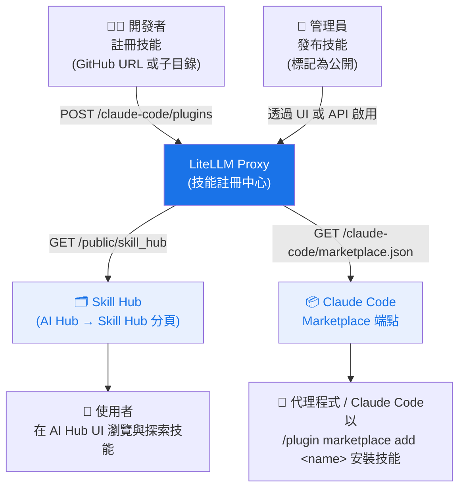

# 技能閘道 {#skills-gateway}

<iframe width="840" height="500" src="https://www.loom.com/embed/cb74eb79df3e4c2b83a6efae54a589f9" frameborder="0" webkitallowfullscreen mozallowfullscreen allowfullscreen></iframe>

LiteLLM 可作為 **技能註冊中心** — 一個集中註冊、管理與探索整個組織內 Claude Code 技能的地方。團隊可以一次發布技能，讓代理程式與開發者透過單一入口找到它們。

## 運作方式 {#how-it-works}



## 快速開始 {#quick-start}

### 1. 註冊技能 {#1-register-a-skill}

將任何 GitHub URL 貼到 Skills UI 中 — LiteLLM 會自動偵測來源類型與技能名稱。

```bash
curl -X POST https://your-proxy/claude-code/plugins \
  -H "Authorization: Bearer $LITELLM_KEY" \
  -H "Content-Type: application/json" \
  -d '{
    "name": "grill-me",
    "source": {
      "source": "git-subdir",
      "url": "https://github.com/mattpocock/skills",
      "path": "grill-me"
    },
    "description": "Interview skill for relentless questioning",
    "domain": "Productivity",
    "namespace": "interviews"
  }'
```

巢狀於子目錄中的技能（例如 `github.com/org/repo/tree/main/skill-name`）也受到支援 — LiteLLM 會在 UI 中自動剖析 URL。

### 2. 發布到 hub {#2-publish-to-hub}

在 Admin UI 中：**AI Hub → Skill Hub → Select Skills to Make Public**。

或透過 API：

```bash
curl -X POST https://your-proxy/claude-code/plugins/grill-me/enable \
  -H "Authorization: Bearer $LITELLM_KEY"
```

### 3. 瀏覽 hub {#3-browse-the-hub}

公開技能會出現在：
- **Admin UI**：AI Hub → Skill Hub 分頁
- **公開頁面**：`/ui/model_hub` → Skill Hub 分頁（不需要登入）
- **API**：`GET /public/skill_hub`

### 4. 在 Claude Code 中安裝 {#4-install-in-claude-code}

先將 Claude Code 指向您的 proxy marketplace 一次：

```json title="~/.claude/settings.json"
{
  "extraKnownMarketplaces": {
    "my-org": {
      "source": "url",
      "url": "https://your-proxy/claude-code/marketplace.json"
    }
  }
}
```

接著安裝任何技能：

```
/plugin marketplace add grill-me
```

## 技能欄位 {#skill-fields}

| 欄位 | 說明 |
|-------|-------------|
| `name` | 唯一技能識別碼（用於 `/plugin marketplace add`） |
| `source` | Git 來源 — `github`、`url` 或 `git-subdir` |
| `description` | 顯示於 hub 的簡短說明 |
| `domain` | 用於分組的類別（例如 `Engineering`、`Productivity`） |
| `namespace` | 領域內的子類別（例如 `quality`、`meetings`） |
| `keywords` | 用於搜尋與篩選的標籤 |
| `version` | Semver 字串 |

## API 參考 {#api-reference}

| 端點 | 驗證 | 說明 |
|----------|------|-------------|
| `POST /claude-code/plugins` | 必要 | 註冊技能 |
| `GET /claude-code/plugins` | 必要 | 列出所有技能（管理員） |
| `POST /claude-code/plugins/{name}/enable` | 必要 | 發布技能 |
| `POST /claude-code/plugins/{name}/disable` | 必要 | 取消發布技能 |
| `GET /public/skill_hub` | 無 | 列出公開技能 |
| `GET /claude-code/marketplace.json` | 無 | Claude Code marketplace 資訊清單 |
